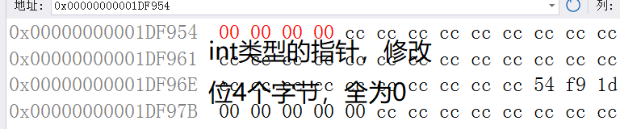

# C语言指针

## 二进制与十六进制互相转换的方法

```c
16进制：1，2，3，4，5，6，7，8，9，a，b，c，d，e，f
2进制：0，1
f = 1111c
2进制的权重:2^3 = 8,2^2 = 4,2^1 = 2,2^0 = 1
8+4+2+1=15=f
所以说二进制的4位=16进制的一位
```


## 初级指针

### 什么是指针?

指针就是一个变量，用来存放地址的变量，一个最小的单元是一个字节，每个地址标识一个字节，这里就有2的32次方个地址，那么我们就可以给（`2^32Byte == 2^32/1024KB == 2^32/1024/1024MB == 2^32/1024/1024/1024GB =- 4GB`）4GB的空闲进行编址

1. 在32位的机器上，地址就是32个0或者1组成的二进制序列，那地址要用4个字节的空间来存储，所以一个指针变量的大小就应该是4个字节
2. 在64位的机器上，就是64个0或1，即64个地址线，那一个指针变量就是8个字节

### 指针和指针类型

#### 指针类型

```c
#include <stdio.h>
int main(void) {
	int number = 0x11223344;
	// int* p_number_int = &number;
	char* p_number_char = &number;
	*p_number = 0;
	return 0;
}
```

##### 代码运行与解析

**第一步：开辟内存空间**

```c
int number = 0x11223344;
```


**第二步：将`number`的地址赋值给`p_number_int`指针**

```c
int* p_number_int = &number;
```


**第三步：根据指针类型去修改对应指针解引用后的值**

**int类型指针**

```c
int* p_number_int = &number;
*p_number = 0;
```


**char类型指针**

如果是char类型的指针，解引用时只会修改对应char类型一个字节的的值。

```C
int* p_number_int = &number;C
*p_number = 0;
```


#### 指针的步长

```c
#include <stdio.h>
int main(void) {
	// 指针类型的意义
	// 指针类型决定了,指针解引用的权限有多大
	//  指针类型决定了指针走一步能走多远（步长）
	int array[] = { 0 };
	int* p_array_int = array;
	char* p_array_char = array; // 地址是4个字节，所以也可以放进去char*
	printf("%p\n",p_array_int);
	printf("%p\n",p_array_char);
	printf("%p\n",p_array_int+1);
	printf("%p\n",p_array_char+1);
	return 0;
}
```


```c
#include <stdio.h>
int main(void) {
	int array[10] = {0};
	for (int i = 0; i < sizeof(array) / sizeof(array[0]); i++) {
		*(array + i) = 1;
	}
	for (int i = 0; i < sizeof(array) / sizeof(array[0]);i++) {
		printf("%d ",array[i]);
	}
	return 0;
}
```

#### 指针类型的意义

1. 指针类型决定了，指针解引用的权限有多大，即解引用之后可以操作多少字节的内存空间。
2. 指针类型决定了指针走一步能走多远（步长）即指针加+1+2的操作。

### 野指针

#### 不初始化的指针

```c
int main(void)
{
    // 这里的point就是一个野指针
	int* point; // point是一个局部的指针变量,局部变量不初始化的话,默认是随机值
	*point = 20; // 非法访问内存
	return 0;
}
```

#### 越界访问

越界访问其实本质也就是未初始化的指针，C语言本身是不会检查越界行为的

```c
int main(void)
{
	int array[10] = {0};
	int* p_array = array;
	for(int i=0;i<=10;i++) // 数组下标为10的元素没有初始化,数组越界了,
	{
		*p_array = i;
		p_array++;
	}
	return 0;
}
```

#### 指针指向的空间释放了

这个地址你已经使用过了，操作系统就给回收了，就不能在使用了，就置为NULL，这样也会造成野指针。

#### 如何避免野指针

1. 指针初始化，（一般任何数据在使用时都要初始化，eg：`int a = 0`）

   当指针不知道要初始化为什么的时候，就直接初始化为`NULL`

   ```c
   int* point = NULL;
   ```

   如果知道初始化为什么就初始化为什么：

   ```c
   int number = 10;
   int* p_number = &number;
   ```

2. 小心指针越界

   C语言本身是不会检查越界行为的

3. 指针指向空间的释放，即将使用过的指针置为`NULL`

   ```c
   int* Point_Test();
   int main()
   {
       // 这里得到的是一个被销毁的地址,所以为NULL,使用的话为野指针
       int* p_Point_Number = Point_Test();
       *p_Point_Number = 20;
   	return 0;	
   }
   // 返回一个地址，但是这个number，在Point_Test()函数执行结束之后number的地址就被销毁了
   int* Point_Test()
   {
   	int number = 10;
       return &number;
   }
   ```

4. 使用指针之前要检查指针的有效性，使用`if`进行判断

   ```c
   int* p_number = NULL;
   if(p_number != NULL)
   {
   	*p_number = 20;
   }
   ```

### 指针运算

#### 指针+-整数

```c
float arrays[5];
float *vp;
for(vp = &arrays[0];vp < &arrays[5];) // 指针的关系运算
{
	*vp++ = 0; // 指针+整数
}
```

#### 指针-指针

指针-指针 = 两指针之间的元素个数

```c
int main(void)
{
	int arr[10] = {1,2,3,4,5,6,7,8,9,10};
	printf("%d\b",&arr[9]-arr[0]); // 9
	return 0;
}
```

##### 实现strlen函数

```c
int my_strlen(char*);
int main(void)
{
    printf("%d\n",my_strlen("abc")); // 3
	return 0;
}
```

###### 计数器版本

```c
int my_strlen(char* str)
{
	int count = 0;
    while(*str != '\0')
    {
        count++;
        str++;
    }
    return count;
}
```

###### 递归版本

###### 指针-指针版本

```c
int my_strlen(char* str)
{
	char* start = str;
	while(*str != '\0')
	{
		str++;
	}
	return str - start;
}
```

#### 指针的关系运算

### 指针和数组

规定：允许指向数组元素的指针与指向数组最后一个元素后面的那个内存位置的指针比较，但是不允许与指向第一个元素之前的那个位置指针进行比较。


### 指针数组

```c
int int_arr[5] = {1,2,3,4,5}; // 整型数组
char char_arr[3] = {'a','b','c'}; // 字符数组
int* int_point)arr[5]; // 指针数组
```
