# C语言指针

1. 指针是一个变量，用来存放地址，地址唯一标识一块内存空间。（也可以说地址就是指针）
2. 指针的大小是固定的4/8个字节（32位平台/64位平台）
3. 指针是有类型的，指针的类型决定了指针的`+-`整数的步长，也决定了指针解引用操作的时候的权限。
4. 数组名的意义
   1. sizeof(数组名)，这里的数组名表示整个数组，计算的是整个数组的大小。
   2. &数组名，这里的数组名表示整个数组，取出的是整个数组的地址，与数组首元素的地址是相等的，但是是不同的。
   3. 除此之外所有的数组名都表示首元素的地址。
   4. sizeof里面放入一个函数也是不会去调用这个函数的。


## void指针

void指针是无具体类型的指针，即不知道解引用需要读取多少个字节。

## 字符指针

指针类型为字符指针`char*`

### 代码分析

```c
#include <stdio.h>
int main() {
	// 本质上是把"Hello Word!!!"这个字符串的首地址存储在了p_chs中
	char* p_chs = "Hello Word!!!"; // 这种方式类似于常量,不可以被修改,所以前面可以加上const
	char array[] = "Hello Word!!!";
	// *p_chs = 'W'; error
	array[0] = 'W';
	printf("%s\n", p_chs); // Hello Word!!!
	printf("%s\n", array); // Hello Word!!!
	printf("%c\n",*p_chs); // H
	printf("%c\n",*array); // H
	return 0;
}
```

#### 不同方式创建字符串的区别

```c
#include <stdio.h>
int main() {
	char str1[] = "Hello Word"; // 数组，但是这两个数组是不一样的，这个不是常量
	char str2[] = "Hello Word";
	char* str3 = "Hello Word"; // 常量，不可以被修改
	char* str4 = "Hello Word"; // 常量，不可以被修改
	if (str1 == str2) {
		printf("str1==str2\n");
	}
	else {
		printf("str1!=str2\n"); // str1 != str2,因为str1和str2是两个数组,所以不相等
	}
	if (str3 == str4) {
		printf("str3==str4\n"); // str3 == str4,因为是常量不可以被修改，所以内存中只需要存储一份即可，共享一份内存空间
	}
	else {
		printf("str3!=str4\n");
	}
}
```

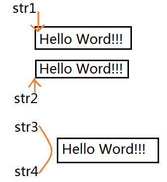

## 指针数组

指针数组是一个存放指针的数组

```c
int * array1[10]; // 整形指针数组
char * array2[10]; // 一级字符指针数组
char ** array3[10]; // 二级字符指针数组
```

### 代码分析

```c
#include <stdio.h>
int main(void) {
	int nums1[5] = { 1,2,3,4,5 };
	int nums2[] = { 2,3,4,5,6 };
	int nums3[] = { 3,4,5,6,7 };
	int* array[3] = {nums1,nums2,nums3};
	for (int i = 0; i < 3; i++) {
		for (int j = 0; j < 5;j++) {
			printf("%d ",array[i][j]);
            // printf("%d ",*(*(array + i) + j));
			// printf("%d ",*(array[i]+j)); 这三条语句的结果是一样的
		}
		printf("\n");
	}
	return 0;
}
```

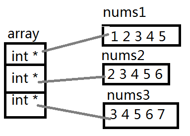

## 数组指针

### 数组指针的定义

数组指针是指针

整形指针：`int * p_int`能够指向整形数据的指针，浮点型指针：`float * p_float`能够指向浮点型数据的指针。

那数组指针应该是：能够指向数组的指针。

分析：

```c
int * p1[10]; // 指针数组
int (*p2)[10]; // 数组指针
```

解释：

```c
int (*p)[10];
// 解释：p先和*结合，说明p是一个指针变量，然后指着指向的是一个大小为10个整形的数组，所以p是一个指针，指向一个数组，叫数组指针。
// 这里注意：[]的优先级要高于*号的，所以必须加上()来保证p先和*结合。
```

### &数组名VS数组名

数组名是数组首元素的地址，但是有两个例外：

1. `sizeof(数组名)`数组名表示整个数组，计算的是整个数组的大小，单位是字节。
2. &数组名，数组名表示整个数组，取出的是整个数组的地址。

对于下面的数组

```c
int arr[10];
```

arr和&arr分别是什么?

arr是数组名，数组名表示数组首元素的地址，是一个元素的地址。

&arr是：数组首元素的地址，但是是整个数组的地址。

### 代码分析

#### &数组名VS数组名的区别

`&数组名 != 数组名`

```c
#include <stdio.h>
int main(void) {
	int array[10] = { 0 };
	printf("%p\n", array); // 003EFB18
	printf("%p\n", &array); // 003EFB18
	// 他们都表示数组的首地址，下面是他们的不同
	// array表示的是数组的首地址，但是是一个元素的地址
	// &array表示的是数组的首地址，是整个数组的地址
	int* p1 = array;
	int(*p2)[10] = &array;
	printf("%p\n", p1); // 003EFB18
	printf("%p\n", p1+1); // 003EFB1C
	printf("%p\n", p2); // 003EFB18
	printf("%p\n", p2 + 1); // 003EFB40
	return 0;
}
```

#### 数组指针书写

```c
#include <stdio.h>
int main(void) {
	int a = 10;
	int* pa = &a;
	char ch = 'w';
	char* pch = &ch;
	int array[10] = { 1,2,3,4,5 };
	// printf("%p\n", array);  printf("%p\n", &array); 结果是相同的
	int * parray = array; // 数组名是首元素的地址 - array[0]的地址
	int(*parr)[10] = &array; // 取出的是数组的地址
	// parr就是一个数组指针 - 其中存放的是数组的地址
	double* dnum[5]; // 指针数组
	double* (*pdnum)[5] = &dnum; // pdnum就是一个数组指针
	return 0;
}
```

#### 数组指针的用法

###### 用法1

```c
#include <stdio.h>
int main(void) {
	int array[10] = { 1,2,3,4,5,6,7,8,9,10 };
	int (*p_array)[10] = &array;
	for (int i = 0; i < 10;i++) {
		printf("%d ",*(*(p_array) + i));
	}
	return 0;
}
```

###### 用法2

```c
#include <stdio.h>
void print1(int[3][5] ,int, int);
void print2(int (*)[5], int, int);
int main(void) {
	int arrays[3][5] = { {1,2,3,4,5},{2,3,4,5,6},{3,4,5,6,7} };
	// 二维数组的数组名表示首元素的地址,首元素是第一行
	print1(arrays, 3, 5);
	print2(arrays, 3, 5);
	return 0;
}
void print1(int array[3][5],int r,int c) {
	for (int i = 0; i < r ; i++) {
		for (int j = 0; j < c; j++) {
			printf("%d ",array[i][j]);
		}
		printf("\n");
	}
}
void print2(int (*p_array)[5], int r, int c) {
    // (*p_array)个人理解这个东西应该就是数组名
	for (int i = 0; i < r; i++) {
		for (int j = 0; j < c; j++) {
			printf("%d ", (*((*p_array + i) + j)));
		}
		printf("\n");
	}
}
```

分析下面代码的意思

```c
int arr[5]; // int类型的数组,里面存储5个整形数据
int* parr1[10]; // 指针数组(int类型的)
int (*parr2)[10]; // 数组指针,该指针能够指向一个数组,数组10个元素,每个元素是int
int (*parr3[10])[5]; // parr3是一个存储数组指针的数组,该数组能够存放10个数组指针,每个数组指针能够指向一个数组,数组5个元素,每个元素是int类型
```

## 数组传参和指针传参

### 一维数组传参

```c
#include <stdio.h>
// 没有写函数的声明,这些方法传参数都是可以的
void test1(int array[]) {} // yes
void test2(int array[10]) {} // yes
void test3(int * array) {} // yes
void test4(int *array[20]) {} // yes
void test5(int **array) {} // yes
int main(void) {
	int array1[10] = { 0 };
	int* array2[20] = { 0 };
	test1(array1);
	test2(array1);
	test3(array1);
	test4(array2);
	test5(array2);
	return 0;
}
```

### 二维数组传参

```c
#include <stdio.h>
void test1(int arr[3][5]) {} // Yes
// void test2(int arr[][]) {} // No 二维数组不能g够省略列
void test3(int arr[][5]) {} // Yes
/** 总结
* 二维数组传参,函数形参的设计只能省略第一个[]的数字
* 因为对于一个二维数组，可以不知道有多少行，但必须知道一行有多少元素
*/
// void test4(int * arr) {} // Error 二维数组解一层引用只能访问到首个元素（第一行）
// void test5(int * arr[5]) {} // Error 指针数组,每个元素是一个指针,不是二位数组
void test6(int (*arr)[5]) {} // Yes 数组指针(*arr)是
// void test7(int** arr) {} // Error 这是二级指针,虽然二维数组能够通过二级指针进行访问,但是也只能够访问第一个元素,
int main(void) {
	int array[3][5] = { 0 };
	test1(array);
	// test2(array);
	test3(array);
	// test4(array);
	// test5(array);
	test6(array);
	// test7(array);
	return 0;
}
```

### 一级指针传参

当一个函数的参数部分为一级指针的时候，函数可以接受一个地址，eg：

```c
void my_print(int*);
int main(void){
    int num = 123;
    int* p_num = &num;
    my_print(&num);
    my_print(p_num); // 这两种方式都是可以的
    return 0;
}
```

### 二级指针传参

参考一级指针传参，也是地址。

```c
#include <stdio.h>
void test(int** p2) {
	**p2 = 20;
}
int main() {
	int a = 10;
	int* p_a = &a; // pa是一级指针
	int** p_p_a = &p_a; // p_p_a是二级指针
	test(p_p_a); // test(&p_a); 等价的，这个是传入一级指针变量的地址
	printf("%d\n",a);
	
	int* arr[10] = { 0 }; // 指针数组,里面存放的是指针
	test(arr); // 这样传参

	return 0;
}
```

## 函数指针

指针数组：存放指针的数组

函数指针：指向函数的指针

`函数名 == &函数名`

函数名就是地址

```c
#include <stdio.h>
void test() {
	printf("Hello Word!!!\n");
}
int main(void) {
	printf("%p\n",test);
	printf("%p\n", &test); // 这两个值是相同的
	return 0;
}
```

### 如何存放函数的地址

```c
#include <stdio.h>
void test() {
	printf("test function\n");
}
int main(void) { 
	// 下面pfun1和pfun2那个有能力存放test函数的地址
	void (*pfun1)();
	void* pfun2();
	return 0;
}
```

首先，能给存储地址，就要求pfun1或者pfun2是指针，那个是指针？答案是：

pfun1可以存放。pfun1先和`*`结合，说明pfun1是指针，指针指向的是一个函数，指向的函数无参数，返回值类型为void。

#### 代码示例

```c
#include <stdio.h>

int Add(int x,int y) {
	return x + y;
}

int main(void) {
	int array[10] = { 0 };
	int(*p_array)[10] = &array; // 取出数组的地址
	// p_array 是指向数组的指针 - 存放的是数组的地址
	
	// 函数指针 - 存放函数地址的指针
	// &函数名 - 取到的就是函数的地址
	// p_Add就是一个指针变量
	int (*p_Add)(int,int) = &Add;
	int (*p_Add_2)(int,int) = Add; // Add = p_Add_2
	printf("%d\n",((*p_Add_2)(3,5)));
	printf("%d\n", (*p_Add)(3, 5));
	printf("%d\n", p_Add(3, 5));
	printf("%d\n",Add(3,5));
	// printf("%p\n",Add);
	return 0;
}
```

#### 分析下面的代码

```c
(*(void (*)())0)();
void (*signal(int, void(*)(int)))(int);
```

分析结果

```c
#include <stdio.h>
int main(void) {
	// 代码1
	(*(void (*)())0)();
	// 1. 调用0地址处的函数，函数无参数，返回值类型是void
	// 2. void (*)() - 函数指针类型
	// 3. (void(*)())0 - 对0进行强制类型转换，被解释为一个函数地址
	// 4. *(void(*)())0 - 对0地址进行解引用操作
	// 5. *(*(void(*)())0)(); - 调用0地址处的函数
	// 代码2
	void (*signal(int, void(*)(int)))(int);
	// 1. signal和()先结合，说明signal是函数名
	// 2. signal函数的第一个参数的类型是int，第二个参数类型是函数指针，该函数指针指向一个参数为int，返回类型是void的函数
	// 3. signal函数的返回类型也是一个函数指针，该函数指针，指向一个参数为int，返回类型是void的函数
	// 4. signal是一个函数声明
	return 0;
}
```

##### 对代码2的简化

```c
// 为了更加通俗易懂可以这样写
// void(*)(int) signal(int, void(*)int); 当然这样写是错误的
// 但是可以这样
// 使用typedef对类型进行重定义
typedef void(*pfun_t)(int); // 对void(*)(int)函数指针类型重命名
typedef unsigned int uint; // 这是typedef的用法
// 为什么不这样写呢？
typedef void(*)(int) pfun_t; // 这样编译器是不允许的，是错误的
pfun_t signal(int,pfun_t); // 这就是对这个代码的简化，方便理解
```

## 函数指针数组

数组是一个存放相同数据类型存储空间，把函数的地址存放到一个数组中，那么这个数组就叫函数指针数组。函数指针数组的用途：**转移表**

函数指针数组的定义？

```c
int (*parr1[10])(); // 函数指针数组的定义
int (*pfArr[2])(int,int) = {函数名,&函数名}; // 函数指针数组的使用
```

### 使用函数指针数组实现计算器

```c
#define _CRT_SECURE_NO_WARNINGS

#include <stdio.h>
int Add(int num1, int num2) {
	return num1 + num2;
}
int Sub(int num1, int num2) {
	return num1 - num2;
}
int Mul(int num1, int num2) {
	return num1 * num2;
}
int Div(int num1, int num2) {
	return num1 / num2;
}
int main(void) {
	int input = 0;
	do
	{
        // 这个函数指针数组实际上叫做转移表
		int (*pfArr[5])(int, int) = { NULL,Add,Sub,Mul,Div };
		int num1 = 0, num2 = 0, result = 0;
		printf("请输入一个数\n");
		scanf("%d",&input);
		if (input>=1 && input<=4) {
			printf("请输入两个数\n");
			scanf("%d %d", &num1, &num2);
			// result = (pfArr[input])(num1, num2);
			// result = (*pfArr[input])(num1, num2);
			result = pfArr[input](num1, num2); // 这三种方式是相同的
			printf("result = %d\n", result);
		}
		else if (input == 0) {
			printf("Exit\n");
		}
		else{
			printf("Input Error\n");
		}
	} while (input);
	return 0;
}
```

## 指向函数指针数组的指针

指向函数指针数组的指针是一个**指针**，指针指向一个**数组**，数组的元素都是**函数指针**；

函数指针数组的指针如何定义？

```c
#define _CRT_SECURE_NO_WARNINGS
#include <stdio.h>
void test(const char* str) {
	printf("%s\n",str);
}
int main(void) {
	// 函数指针pfun
	void (*pfun)(const char*) = test;
	// 函数指针的数组pfunArr
	void (*pfunArr[5])(const char* str);
	pfunArr[0] = test;
	// 指向函数指针数组pfunArr的指针ppfunArr;
	void (*(*ppfunArr)[5])(const char*) = &pfunArr;
	return 0;
}
```

函数指针的数组 - 数组

函数指针数组的指针是**取出函数指针数组的地址**

```c
// 整形数组
int arr[5];
int (*parr1)[5] = &arr; // 数组指针
// 整形指针的数组
int* arr[5];
int* (*parr2)[5] = &arr; // parr2是指向【整形指针数组】的指针
// 函数指针数组
int (*parr3)(int,int); // 函数指针
int (*parr4[4])(int,int); // 函数指针的数组
parr5 = &parr4; // 取出的是函数指针数组的地址
int (* (*parr5)[4])(int,int) = &parr4; // 取出的是函数指针数组的地址
// parr5就是一个指向【函数指针的数组】的指针
int arr[10];
// 数组元素类型是int
// arr数组的类型是int[10]
```

## 回调函数

回调函数就是一个通过函数指针调用的函数。把函数的指针（地址）作为参数传递给另一个函数，当这个指针被用来调用其所指向的函数时，这就是**回调函数**

回调函数不是由该函数的实现方直接调用，而是在特定的事件或条件发生时由另外的一方进行调用，用于对该事件或条件进行响应。

###### 使用回调函数实现计算器

```c
#define _CRT_SECURE_NO_WARNINGS
#include <stdio.h>
int Add(int x, int y) { return x + y; }
int Sub(int x, int y) { return x - y; }
int Mul(int x, int y) { return x * y; }
int Div(int x, int y) { return x / y; }
int Calc(int (*pfun)(int,int)) {
	int num1 = 0, num2 = 0;
	printf("Please input two number\n");
	scanf("%d%d",&num1,&num2);
	// return pfun(num1, num2);
	return (*pfun)(num1, num2); // 这两种方法是相同的
}
int main(void) {
	int input = 0;
	do
	{
		printf("Please switch number\n");
		scanf("%d",&input);
		int result = 0;
		switch (input)
		{
		case 1:
			result = Calc(Add);
			printf("result = %d\n",result);
			break;
		case 2:
			result = Calc(Sub);
			printf("result = %d\n", result);
			break;
		case 3:
			result = Calc(Mul);
			printf("result = %d\n", result);
			break;
		case 4:
			result = Calc(Div);
			printf("result = %d\n", result);
			break;
		case 0:
			printf("Exit\n");
			break;
		default:
			printf("Input Error\n");
			break;
		}
	} while (input);
}
```

### 使用回调函数实现qsort函数

在实现qsort函数之前先实现一下冒泡排序

```c
#define _CRT_SECURE_NO_WARNINGS
#include <stdio.h>
int main(void) {
	int array[10] = { 1,2,3,4,5,6,7,8,9,10 };
    // 冒泡排序的次数
	for (int i = 0; i < sizeof(array) / sizeof(array[0])-1;i++) {
		// 冒泡排序的比较趟数
        for (int j = 0; j < sizeof(array) / sizeof(array[0])-i-1 ; j++) {
			if (array[j]<array[j+1]) {
				int temp = array[j + 1];
				array[j + 1] = array[j];
				array[j] = temp;
			}
		}
	}
	for (int i = 0; i < sizeof(array) / sizeof(array[0]);i++) {
		printf("%d ",array[i]);
	}
	return 0;
}
```

qsort是使用快速排序来实现的，他可以对任何数据进行排序，例如：整形，字符串，结构体数据，等等。

```c
/** qsort包含4个参数
* base:待排序数据中第一个对象的地址
* num:排序数据元素的个数
* size:排序数据一个元素的大小
* compar:比较两个元素大小的函数，比较器
*/
void qsort(void* base, size_t num, size_t size,int (*compar)(const void*, const void*));
```

### qsort示例

```c
#define _CRT_SECURE_NO_WARNINGS
#include <stdio.h>
#include <string.h> // strcmp函数
#include <stdlib.h> // qsort函数
struct Student
{
	// 这个结构体一共是24个字节
	char name[20]; // 20个字节
	int age; // 4个字节
};
int compar_num(const void* parg1, const void* parg2) { // 对数字进行排序
	return (*(int*)parg1 - *(int*)parg2);
}
int compar_age(const void* parg1,const void* parg2) { // 对结构体年龄进行排序
	// return (*(int*)parg1 - *(int*)parg2); 这种是强制转换为int类型，自己类型转换错误了
	return ( ((struct Student*)parg1)->age - ((struct Student*)parg2)->age );
}
int compar_name(const void* parg1, const void* parg2) { // 对结构体名字进行排序
	return ( strcmp( (*((struct Student*)parg1)).name, (*((struct Student*)parg2)).name) );
	// return strcmp(((struct Student*)parg1)->name, ((struct Student*)parg2)->name);
}
void test1() {
	int array[10] = { 1,2,3,4,5,6,7,8,9,0 };
	qsort(array, sizeof(array) / sizeof(array[0]), sizeof(array[0]), compar_num);
	for (int i = 0; i < sizeof(array) / sizeof(array[0]); i++) {
		printf("%d ", array[i]);
	}
}
void test2() {
	struct Student Stu[3] = { {"zhangsan",18},{"lisi",21},{"wangwu",16} };
	qsort(Stu, sizeof(Stu)/sizeof(Stu[0]), sizeof(Stu[0]), compar_age); // 按照年龄进行排序
	qsort(Stu, sizeof(Stu) / sizeof(Stu[0]), sizeof(Stu[0]), compar_name); // 按照名字进行排序
	for (int i = 0; i < sizeof(Stu) / sizeof(Stu[0]);i++) {
		printf("%d,%s ",Stu[i].age, (Stu + i)->name);
	}
}
int main(void) {
	test1();
	printf("\n");
	test2();
	return 0;
}
```

### 自己实现一个qsort函数

自己使用冒泡排序实现一个qsort函数

```c
#define _CRT_SECURE_NO_WARNINGS
#include <stdio.h>
void Swap(char* buf1,char* buf2,int size) {
	for (int i = 0; i < size;i++) {
		char temp = *buf1;
		*buf1 = *buf2;
		*buf2 = temp;
		buf1++;
		buf2++;
	}
}
void double_sort(void* base,int num,int size, int (*compar)(const void*,const void*)) {
	// 趟数
	for (int i = 0; i < num-1;i++) {
		// 一趟排序
		for (int j = 0; j < num-1-i;j++) {
			// 比较
			if (compar((char*)base+j*size,(char*)base+(j + 1)*size) > 0) {
				// 交换
				Swap((char*)base + j * size, (char*)base + (j + 1) * size,size);
			}
		}
	}
}
void compar_int(const void* parg1,const void* parg2) {
	return (*((int*)parg2)- *((int*)parg1));
}
int main(void) {
	int array[10] = { 1,2,3,4,5,6,7,8,9,0 };
	double_sort(array, sizeof(array)/sizeof(array[0]), sizeof(array[0]), compar_int);
	for (int i = 0; i < sizeof(array) / sizeof(array[0]); i++) {
		printf("%d ",array[i]);
	}
	return 0;
}
```

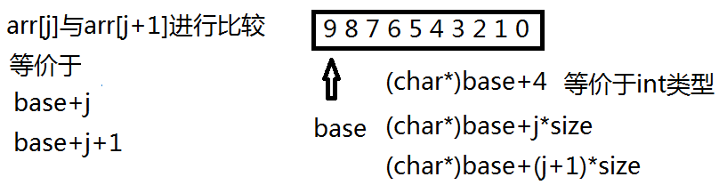

## 题目

### 声明

* sizeof(数组名) - 数组名表示整个数组 - 计算的是整个数组的大小
* &数组名 - 数组名表示整个数组，取出的是整个数组的地址
* 除此之外，所有的数组名都是数组首元素的地址

### 分析1

```c
#define _CRT_SECURE_NO_WARNINGS
#include <stdio.h>
int main(void) {
	int arr[] = { 1,2,3,4 }; // 4*4 = 16
	printf("%d\n", sizeof(arr)); // 16
	printf("%d\n", sizeof(arr + 0)); // 4/8,arr+0是第一个元素的地址,sizeof(arr+0)计算的是地址的大小
	printf("%d\n", sizeof(*arr)); // 4,*arr是数组的第一个元素,sizeof(*arr)计算的是第一个元素的大小
	printf("%d\n", sizeof(arr + 1)); // 4/8,arr+1是第二个元素的地址,sizeof(arr+1)计算地址的大小
	printf("%d\n", sizeof(arr[1])); // 4,计算的是第二个元素的大小
	printf("%d\n", sizeof(&arr)); // 4/8 - &arr虽然是数组的地址，但也是地址，sizeof(&arr)计算的是一个地址的大小
	printf("%d\n", sizeof(*&arr)); // 16 - 计算数组的大小
	// int (*)[4] = &arr; 这是&arr的类型
	printf("%d\n", sizeof(&arr + 1)); // 4/8 - &arr+1是数组后面的空间的地址,跨度是一个数组
	printf("%d\n", sizeof(&arr[0])); // 4/8
	printf("%d\n", sizeof(&arr[0] + 1)); // 4/8
	return 0;
}
```

### 分析2

```c
char arr[] = { 'a','b','c','d','e','f' };
printf("%d\n", sizeof(arr)); // 6
printf("%d\n", sizeof(arr + 0)); // 4/8
printf("%d\n", sizeof(*arr)); // 1
printf("%d\n", sizeof(arr[1])); // 1
printf("%d\n", sizeof(&arr)); // 4/8
printf("%d\n", sizeof(&arr + 1)); // 4/8
printf("%d\n", sizeof(&arr[0] + 1)); // 4/8
```

### 分析3

```c
#include <stdio.h>
#include <string.h>
int main(void) {
	char arr[] = { 'a','b','c','d','e','f' };
	printf("%d\n", strlen(arr)); // 随机值,数组首元素的地址,因为没有\0，所以是随机值
	printf("%d\n", strlen(arr + 0)); // 随机值,同上
	printf("%d\n", strlen(*arr)); // Error,因为arr是数组首元素的地址,解引用之后就是数组的首元素,就是a,而strlen函数的参数是char*类型的,a的ascii码为97,将97作为参数传入就会报错
	printf("%d\n", strlen(arr[1])); // Error,与上同理
	printf("%d\n", strlen(&arr)); // 随机值,&arr取出的是整个数组的地址,把地址传进去,还是那个问题不知道\0在哪里,所以是随机值
	printf("%d\n", strlen(&arr + 1)); // 随机值,但是比上个随机值少6。因为&arr取出的整个数组的地址,+1则是整个数组的地址+1，而这个数组是6个元素,所以+1就是+6，而随机值在一次程序编译中是固定的，所以说比上个随机值少6
	printf("%d\n", strlen(&arr[0] + 1)); // 随机值,但是比上上个随机值少1
	return 0;
}
```

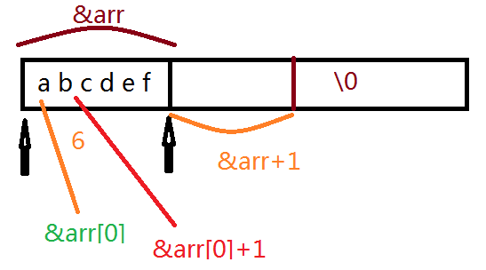

strlen函数的声明

```c
size_t strlen ( const char * str );
```

### 分析4

```c
#define _CRT_SECURE_NO_WARNINGS
#include <stdio.h>
#include <string.h>
int main(void) {
	char arr[] = "abcdef"; // [a b c d e f \0]
	printf("%d\n", sizeof(arr)); // 7 包含\0
	printf("%d\n", sizeof(arr + 0)); // 4/8，arr是数组的地址,arr+0表示数组首元素的地址
	printf("%d\n", sizeof(*arr)); // 1:arr是首元素的地址,解引用是一个a,既是1
	printf("%d\n", sizeof(arr[1])); // 1:数组第二个元素b，所以是1
	printf("%d\n", sizeof(&arr)); // 4/8类型是char(*)[7]数组指针是指针
	printf("%d\n", sizeof(&arr + 1)); // 4/8:数组的地址;arr+1是数组地址的跨度+1
	printf("%d\n", sizeof(&arr[0] + 1)); // 4/8:数组的第一个元素的地址+1,数组的第二个元素的地址
	return 0;
}
```

### 分析5

```c
char arr[] = "abcdef"; // [a b c d e f \0]
printf("%d\n", strlen(arr)); // 6
printf("%d\n", strlen(arr + 0)); // 6 
printf("%d\n", strlen(*arr)); // Error，参考strlen的实现，*arr是一个字符a
printf("%d\n", strlen(arr[1])); // Error
printf("%d\n", strlen(&arr)); // 6，为什么是6不是随机值呢?因为&arr = arr,这两个是相等的
printf("%d\n", strlen(&arr + 1)); // 随机值，不确定后面那个字符位置是\0
printf("%d\n", strlen(&arr[0] + 1)); // 5
```

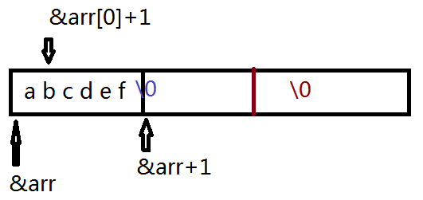

### 分析6

```c
char* p = "abcdef";
printf("%d\n", sizeof(p)); // 4/8这是个指针
printf("%d\n", sizeof(p + 1)); // 4/8:地址
printf("%d\n", sizeof(*p)); // 1
printf("%d\n", sizeof(p[0])); // 1
printf("%d\n", sizeof(&p)); // 4/8地址
printf("%d\n", sizeof(&p + 1)); // 4/8地址  
printf("%d\n", sizeof(&p[0] + 1));// 4/8
```

### 分析7

```c
char* p = "abcdef";
printf("%d\n", strlen(p)); // 6,就是a的地址
printf("%d\n", strlen(p + 1)); // 5 
printf("%d\n", strlen(*p)); // Error,参考strlen的参数
printf("%d\n", strlen(p[0])); // Error
printf("%d\n", strlen(&p)); // 随机值，因为后面不知道那个位置是\0,且&p!=p
printf("%d\n", strlen(&p + 1)); // 随机值,与上面的同理
printf("%d\n", strlen(&p[0] + 1)); // 5，b的地址+1
```

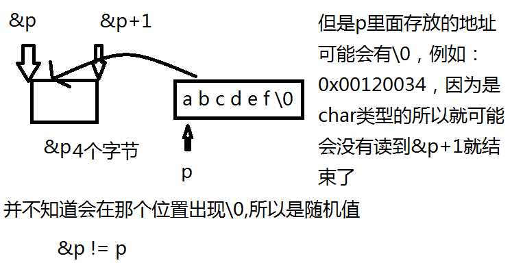

### 分析8

```c
int arr[3][4] = { 0 };
printf("%d\n", sizeof(arr)); // 48 - 3*4*sizeof(int)
printf("%d\n", sizeof(arr[0][0])); // 4 arr[0][0] 是第一行第一个元素的地址
printf("%d\n", sizeof(arr[0])); // 16，第一行的大小
printf("%d\n", sizeof(arr[0] + 1));
/** 4/8,解释
* arr[0]作为数组名并没有单独放在sizeof内部,也没有取地址,
* 所以arr[0]就是第一行第一个元素的地址
* arr[0]+1，就是第一行第二个元素的地址
*/
printf("%d\n", sizeof(*(arr[0] + 1))); // 4，解释:*(arr[0]+1)是第一行第二个元素
printf("%d\n", sizeof(arr + 1));
/** 4/8,解释
* arr是二维数组的数组名,并没有取地址,也没有单独放在sizeof()内部
* 所以arr就表示二维数组首元素的地址,即第一行的地址
* arr+1就是二维数组第二行的地址
*/
printf("%d\n", sizeof(*(arr + 1)));
/** 16 解释
* *(arr+1) <==> arr[1]
* arr+1是第二行的地址,所以*(arr+1)表示第二行
* 所以计算的就是第二行的大小
*/
printf("%d\n", sizeof(&arr[0] + 1));
/** 4/8，解释
* arr[0]是第一行的数组名,
* &arr[0]取出的是第一行的地址,&arr[0]+1就是第二行的地址
*/
printf("%d\n", sizeof(*(&arr[0] + 1)));
/** 16 解释
* &arr[0]+1就是第二行的地址
* *(&arr[0]+1)就是第二行,所以计算的第二行的大小
*/
printf("%d\n", sizeof(*arr));
/** 16 解释
* arr作为二维数组的数组名,没有&，没有单独放在sizeof内部
* arr就是首元素的地址，即第一行的地址，所以*arr就是第一行,计算的是第一行的大小
*/
printf("%d\n", sizeof(arr[3]));
/** 16,解释
* arr[3]其实第四行的数组名（现在是没有，如果有的话）
* 所以arr[3]其实是不存在的，也能通过类型计算大小
*/
printf("%d\n", sizeof(arr[-1]));
/** 16 解释
* 与上面是一个道理，sizeof内部的表达式是不进行计算的。
*/
```

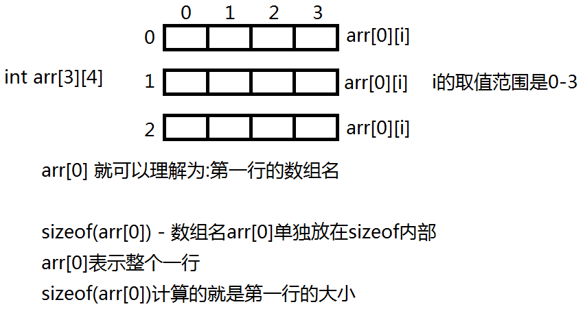

##### 补充

sizeof内部的表达式是不计算的。换而言之，在数组中sizeof永远也不会出现越界的情况

表达式有两个属性分别是：

1. 值属性
2. 类型属性

eg：3+5

值属性：8，类型属性 ：int

```c
sizeof(3+5); // 这个表达式的结果是4
short s = 5;
int a = 4;
printf("%d\n", sizeof(s = a + 6)); // 2
printf("%d\n", sizeof(s)); // 5
```

## 练习

### 练习1

```c
#define _CRT_SECURE_NO_WARNINGS
#include <stdio.h>
int main(void) {
	int arr[5] = { 1,2,3,4,5 };
	int* ptr = (int*)(&arr + 1);
    // &arr取出的是数组首元素的地址，但是跨度是整个数组,arr是数组首元素的地址
	printf("%d,%d\n", *(arr + 1), *(ptr - 1)); // 2,5
	return 0;
}
```

### 练习2

这个题主要考察了，指针类型决定指针运算。

```c
#include <stdio.h>
struct MyStruct // 这个结构体是20个字节
{
	int Num; // 4
	char* pcName; // 4
	short Date; // 2
	char cha[2]; // 2
	short sba[4]; // 8
}*p;
int main(void) {
    // 地址+1是跨越一个单位地址的长度
	printf("%p\n", p); // 0x00000000
	printf("%p\n", p + 0x1); // 0x00000014,虽然这个结构体是20个字节,但是20的16进制是14,所以说跨度一个单位地址长度的时候是0x00000014
	printf("%p\n", (unsigned long)p + 0x1); // 0x00000001，先将地址转化为long类型,+1的时候只是数字+1，没有跨度，只是数组+1
	printf("%p\n", (unsigned int*)p + 0x1); // 0x00000004,这个是先转化为int*类型，然后再+1，那么指针跨度就是4，所以说就是+4了。
}
```

### 练习3

```c
#define _CRT_SECURE_NO_WARNINGS
#include <stdio.h>
int main(void) {
	int arr[4] = { 1,2,3,4 };
	int* ptr1 = (int*)(&arr + 1);
	int* ptr2 = (int*)((int)arr + 1);
	printf("%x,%x\n", ptr1[-1], *ptr2); // 4,0x02 00 00 00 = 2 00 00 00
    printf("%d\n",*ptr2); // 33554432
	/** 解释
	* ptr1[-1] = *(ptr-1)
	*/
	return 0;
}
```

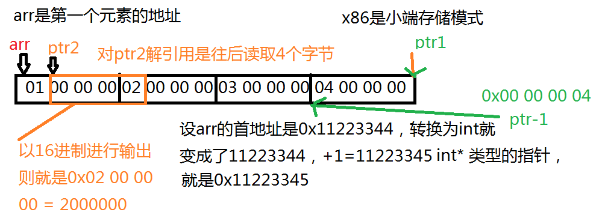

### 练习4

```c
int arr[3][2] = { (0,1),(2,3),(4,5) }; // 里面是逗号表达式,表达式的值是最后一个表达式的值
// int arr[3][2] = {1,3,5,0,0,0};
int* parr;
parr = arr[0]; // 第一行第一个元素的地址
printf("%d\n", parr[0]); // 1
```

### 练习5

```c
int arr[5][5]; // 这个可以这样去理解:int[5] arr[5]
int(*parr)[4]; // 这个可以这样去理解:int(*)[4] parr
parr = arr;
printf("%p,%d\n", &parr[4][2] - &arr[4][2], &parr[4][2] - &arr[4][2]); // FF FF FF FC ,-4 
```

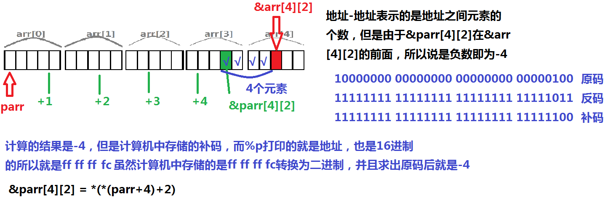

### 练习6

```c
int arr[2][5] = { 1,2,3,4,5,6,7,8,9,10 };
int* ptr1 = (int*)(&arr + 1);
int* ptr2 = (int*)(*(arr + 1));
printf("%d,%d\n", *(ptr1 - 1), *(ptr2 - 1)); // 10,5
/** 分析
* (int*)(*(arr + 1)) == (int*)(arr[1]),其实这个(int*)是多余的，因为(arr[1])已经是int类型的指针了
* 就不需要强制类型转换
*/
```

### 练习7

```c
char* arr[] = { "work","at","alibaba" };
char** parr = arr;
parr++;
printf("%s\n",*parr); // at
```

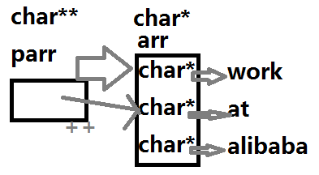

### 练习8

```c
char* arr[] = { "ENTER","NEW","POINT","FIRST" };
char** parr[] = { arr + 3,arr + 2,arr + 1,arr };
char*** pparr = parr;
printf("%s\n", (**++pparr)); // POINT
printf("%s\n", (*-- * ++pparr + 3)); // ER
printf("%s\n", (*pparr[-2] + 3)); // ST
printf("%s\n", (pparr[-1][-1] + 1)); // EW
/** 分析
* (*pparr[-2] + 3)) == **(pparr-2)+3
* pparr[-1][-1] + 1 == *(*(pparr-1)-1)+1
*/
```

注：一个`printf`一个图

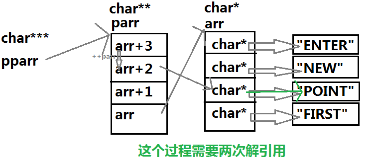

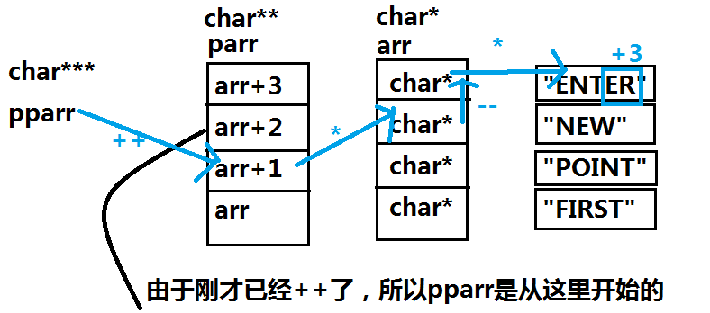

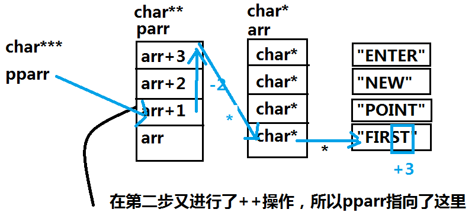

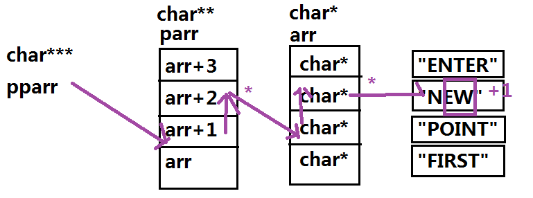
