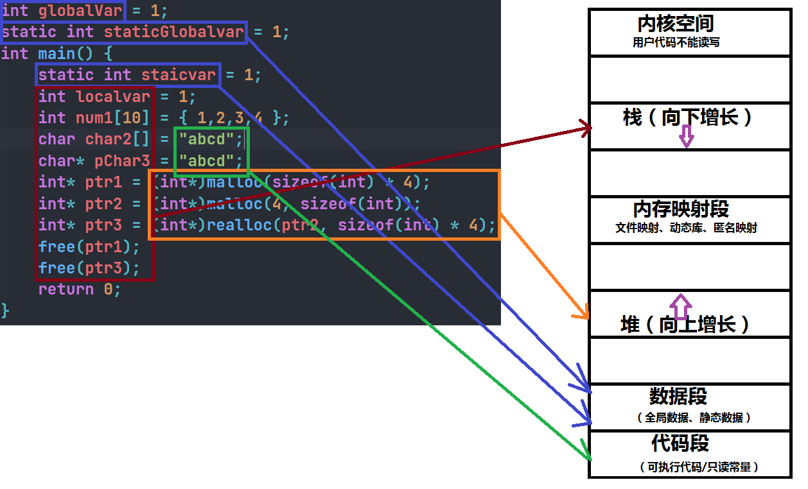

# 内存结构

```c
int globalVar = 1;
static int staticGlobalvar = 1;
int main() {
	static int staicvar = 1;
	int localvar = 1;
	int num1[10] = { 1,2,3,4 };
	char char2[] = "abcd";
	char* pChar3 = "abcd";
	int* ptr1 = (int*)malloc(sizeof(int) * 4);
	int* ptr2 = (int*)malloc(4, sizeof(int));
	int* ptr3 = (int*)realloc(ptr2, sizeof(int) * 4);
	free(ptr1);
	free(ptr3);
	return 0;
}
```



## C/C++程序内存分配时的几个区域：

1. 栈区（stack）：在执行函数时，函数内局部变量的存储单元都可以在栈上创建，函数执行结束时这些存储单元自动被释放，栈内存分配运算内置于处理器的指令集中，效率很高，但是分配内存容量有限。**栈区主要存放运行函数而分配的局部变量，函数参数，返回数据，返回地址**等。
2. 堆区（heap）：一般由我们自己手动释放，如果我们不释放，程序结束时由OS回收，分配方式类似于链表。
3. 数据段（静态区）（static）存放局部变量、静态数据、程序结束后由OS释放。
4. 代码段：存放函数体（类成员函数和全局函数）的二进制代码。

### 理解static

实际上普通的局部变量是在栈区分配空间的，栈区的特点是在上面创建的变量出了作用域就销毁了。

但是static修饰的变量存放在数据段（静态区），数据段的特点是在上面创建的变量，知道程序结束后才销毁，所以声明周期变长。


