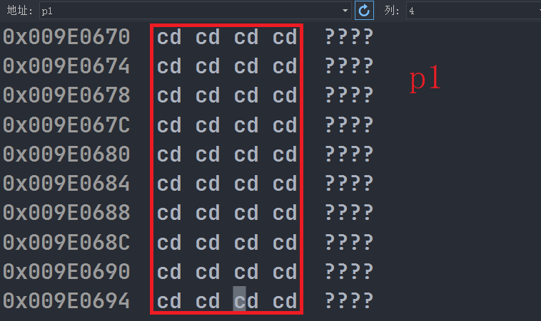
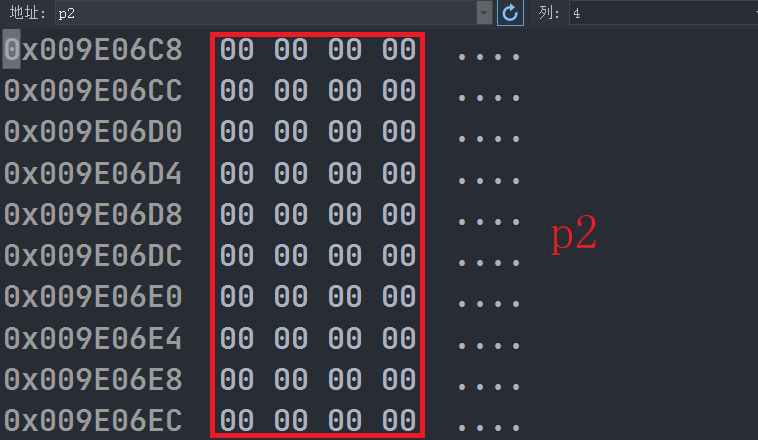
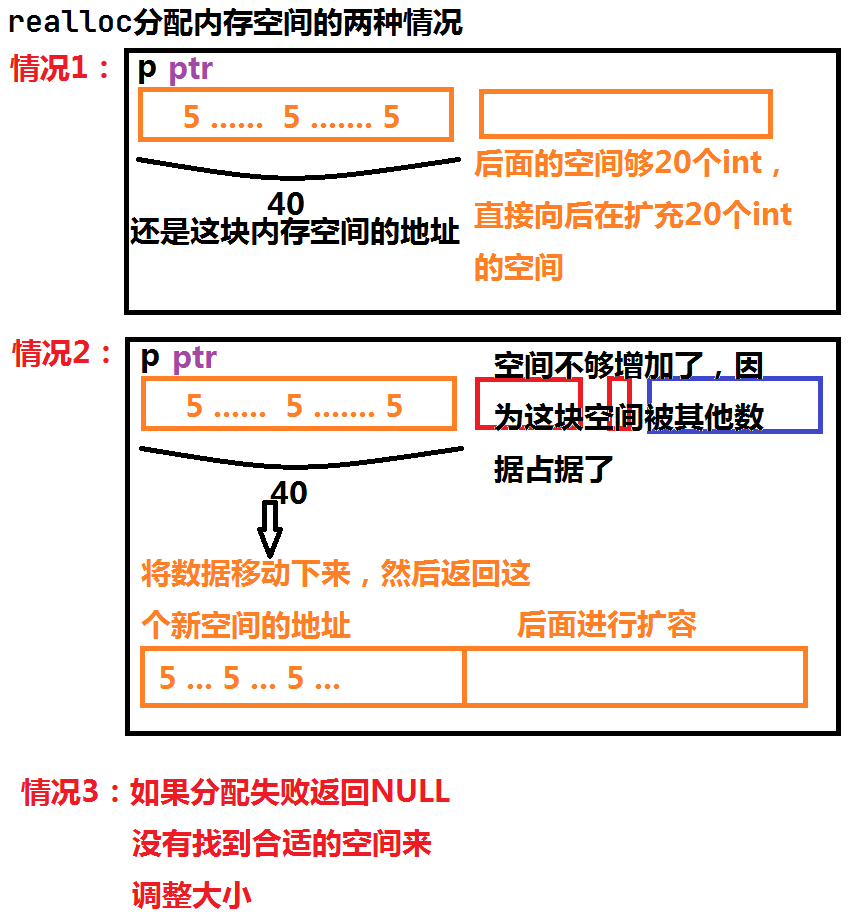
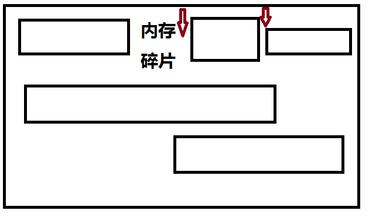
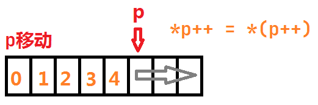
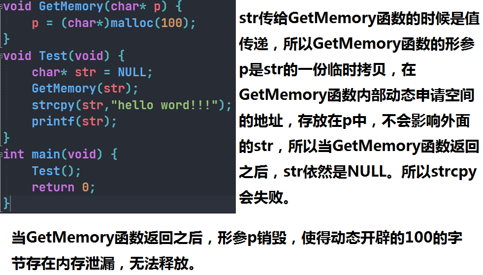
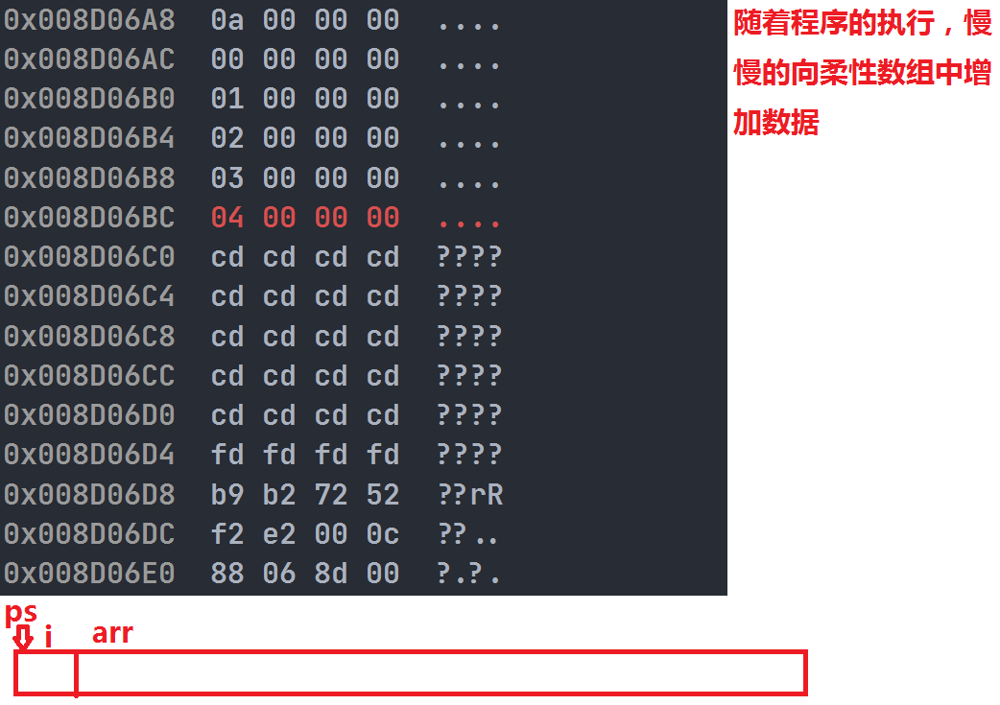
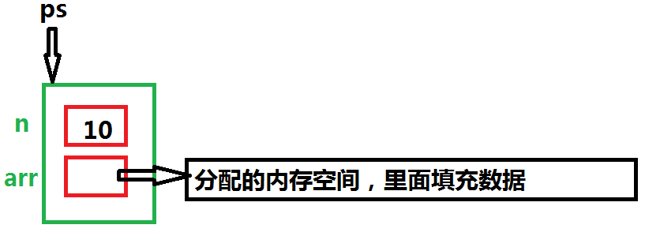

# 动态内存管理

常见的内存开辟方式有：

```c
int num = 20; // 在栈空间上开辟四个字节
int arr[10] = {0}; // 在栈空间上开辟10个字节的连续空间
```

上述开辟内存空间有两个特点：

1. 空间开辟大小数固定的
2. 数组在声明时，必须指定数组的长度，他需要的内存在编译时分配。

这些都是开辟在栈上的内存空间。

## 动态内存函数

这些内存函数都是在`stdlib.h`头文件中

### malloc

```c
void* malloc (size_t size);
```

这个函数向内存申请一块连续可用的空间，并返回指向这块空间的指针。

* 如果开辟成功，则返回一个指向开辟好空间的指针。
* 如果开辟失败，则返回一个NULL指针，因此malloc的返回值一定要做检查。
* 返回值的类型是`void*`，所以malloc函数并不知道开辟空间的类型，具体在使用时由自己决定。
* 如果参数size为0，则malloc的1行为是标准为定义的，取决于编译器。

#### 测试1

```c
#include <stdio.h>
#include <stdlib.h>
int main(void) {
	// 在栈区开辟10个内存空间 int arr[10];
	// 动态内存开辟10个int类型
	int* p = (int*)malloc(10 * sizeof(int));
    // int* p = (int*)malloc(1000000000000 * sizeof(int)); 这样的话就是失败的
	if (p == NULL) { // 开辟失败返回NULL
		perror("malloc"); // 显示错误
        // malloc: Not enough space
		return 0;
	}
	// 使用
	for (int i = 0; i < 10; i++) {
		*(p + i) = i;
	}
	for (int i = 0; i < 10; i++) {
		printf("%d ", p[i]);
	}
    // 回收
	free((void*)p);
	p = NULL;
	return 0;
}
```


### free

free函数用来释放动态开辟的内存的。

由于堆内存并不是有操作系统管理，而是有我们管理，那么当你申请了动态内存时，是需要回收的，所以就产生了free函数，他是用来进行堆内存的释放的。

```c
void free (void* ptr);
```

* 如果参数ptr指向的空间不是动态的，那么free函数的行为是未定义。

  ```c
  int a = 10;
  int* p = &a;
  free(p); // error
  ```

* 如果参数ptr是NULL指针，则函数什么都不做。

### calloc

```c
void* calloc (size_t num, size_t size);
```

calloc函数也是用来动态内存分配的。

* 函数的功能是为num个大小为size的元素开辟一块空间，并且把空间的每一个字节初始化为0。
* 与函数malloc的区别在于calloc会在返回地址之前把申请的空间的每一个字节初始化为0。

```c
#include <stdio.h>
#include <stdlib.h>
int main(void) {
	int* p1 = (int*)malloc(40);
	int* p2 = (int*)calloc(10, sizeof(int));
	if (p1 == NULL && p2 == NULL) {
		return 1;
	}
	for (int i = 0; i < 10; i++) {
		printf("%d ", p1[i]); // 这是随机值
	}
	for (int i = 0; i < 10; i++) {
		printf("%d ", *(p2 + i)); // 全是0
	}
	free(p1);
	p1 = NULL;
	free(p2);
	p2 = NULL;
	return 0;
}
```





如果要对所申请的内存空间进行初始化，那么就使用calloc函数。

### realloc

```c
void* realloc (void* ptr, size_t size);
// ptr是调整内存空间的地址
// size是调整之后新大小
// 返回值为调整之后的内存起始位置
// 这个函数调整原内存空间大小的基础上，还会将原来内存中的数据移动到新的空间中。
```

* realloc函数的出现让动态内存的管理更加灵活。
* 有时候申请的内存空间过大，有时候申请的内存空间过小，为了合理使用内存空间，这时候我们就需要对动态申请的内存空间进行调整，那么realloc函数就可以对内存空间进行灵活的调整。

realloc在调整内存空间存在两种情况：

1. 原空间之后有足够大的空间

   扩展内存直接在原有内存之后直接追加空间，原来空间的数据不发生变化。

2. 原空间之后没有足够大的空间

   原有空间之后没有足够多的空间时，扩展方法是：

   在堆空间上另找一个合适大小的连续空间来使用，这样函数返回的是一个新的内存地址空间。

3. 由于realloc函数有以上两种情况，所以在使用realloc函数需要注意一些。看看地址是否被覆盖了。

4. 当realloc的函数地址参数为NULL时：

   ```c
   void* realloc (void* ptr, size_t size);
   void* realloc (NULL, size_t size); // 他的作用就相当于malloc，直接在堆内存中开辟空间
   ```



```c
int* p = (int*)calloc(10, sizeof(int));
if (p == NULL) {
    perror("p");
    return 1;
}
printf("old p = %p\n", p);
for (int i = 0; i < 10; i++) {
    *(p + i) = 5;
}
// 这里的p更大需要20个int的空间
int* ptr = (int*)realloc(p, 1*sizeof(int));
if (ptr != NULL) { // != NULL 说明内存分配成功
    // 判断内存是否开辟成功也可以使用assert断言
    p = ptr;
}
printf("new p = %p\n", p);
printf("ptr = %p\n", ptr);
free((void*)p);
p = NULL;
```

注意：也不要经常性的进行内存的扩容，因为这样的话，可能会导致出现许多的内存碎片，为防止出现过多的内存碎片，就出现了内存池这个技术，分配好内存，需要了直接去拿。



### 常见的动态内存错误

#### 对NULL指针的解引用操作

```c
int* p = (int*)malloc(INT_MAX/4);
*p = 20; // 如果p是NULL，那么就会有问题
free((void*)p);
p = NULL;
```

```c
int* p = (int*)malloc(10000000000000);
for (int i = 0; i < 10; i++) {
	*(p + i) = i;
}
```

#### 对动态开辟空间的越界访问

```c
int* p = (int*)malloc(10 * sizeof(int));
if (NULL == p) {
    exit(EXIT_FAILURE);
    return 1;
}
// 越界访问
for (int i = 0; i < 40; i++) {
    *(p + i) = i; // 当i是10的时候越界访问
}
free((void*)p);
p = NULL;
```

#### 对非动态开辟内存使用free释放

```c
// 1
int a = 10;
int* p = &a;
free(p); // error
// 2
int arr[10] = {0}; // 栈区
int *p = arr;
free(p); // 使用free释放非动态开辟的空间
p = NULL;
```

#### 使用free释放一块动态开辟内存的一部分

```c
int* p = malloc(10 * sizeof(int));
if (NULL == p) {
	return 1;
}
for (int i = 0; i < 5; i++) { // 0-4
	*p++ = i;
}
free((void*)p);
p = NULL;
```



```c
int *p = (int*)malloc(100);
p++;
free(p); // p不在指向动态内存的初始位置
```

#### 对同一块内存空间多次释放

```c
int* p = (int*)malloc(100);
// 使用
// 释放
free((void*)p);
p = NULL;
// 释放
free((void*)p);
p = NULL;
```

#### 动态内存开辟忘记释放（内存泄漏）

```c
void test() {
	int* p = (int*)malloc(100);
	if (NULL == p) {
		return 1;
	}
	// 使用
}
int main(void) {
	test();
	return 0;
}
```

动态内存的开辟，有2中技术回收方式

1. 主动free
2. 程序结束自动释放

**忘记释放不在使用的动态开辟的空间会造成内存泄漏。**

切记：

动态内存使用过后一定要释放

## 经典的题目

### 题目1

```c
void GetMemory(char* p) {
	p = (char*)malloc(100);
}
void Test(void) {
	char* str = NULL;
	GetMemory(str);
	strcpy(str,"hello word!!!");
	printf(str);
}
int main(void) {
	Test();
	return 0;
}
```



#### 对上面的代码修改1

```c
char* GetMemory(char* p) {
	p = (char*)malloc(100);
	return p;
}
void Test() {
	char* str = NULL;
	str = GetMemory(str);
	strcpy(str, "Hello Word!!!");
	printf(str); // 下面是对为什么可以传字符串进行解释
	printf("Hello Word!!!"); // char *p = "Hello Word!!!"
	free((void*)str);
	str = NULL;
}
int main(void) {
	Test();
	return 0;
}
```

#### 对上面的代码修改2

```c
void* GetMemory(char** p) {
	*p = (char*)malloc(100);
}
void Test() {
	char* str = NULL;
	GetMemory(&str);
	strcpy(str, "Hello Word!!!");
	printf(str); // 下面是对为什么可以传字符串进行解释
	free((void*)str);
	str = NULL;
}
int main(void) {
	Test();
	return 0;
}
```

### 题目2

返回栈空间地址的问题

```c
char* GetMemory(void) {
	char p[] = "hello word";
	return p; // 这个函数执行完之后返回了p的地址，但是p地址对应的数据已经在函数调用完成之后被栈给回收了。
}
/**
* GetMemory函数内部创建的数组是在栈区上创建的
* 出了函数内部，p数组就还给了操作系统
* 返回的地址是没有实际意义的，如果通过返回的地址，去访问内存就是非法访问内存。
*/
void Test(void) {
	char* str = NULL;
	str = GetMemory();
	printf(str);
}
int main(void) {
	Test();
	return 0;
}
```

注意：

栈的数据在在出了函数之后销毁，堆的数据在函数销毁之后不销毁，需要我们自己销毁。

### 题目3

```c
int *f2(){
	int *ptr; // 野指针，指针没有初始化
    *ptr = 10;
    return ptr;
}
```

### 题目4

```c
/**这个代码的问题是：
* 内存空间是在堆中申请的，
* 用完之后没有释放，造成内存的泄漏
*/
void GetMemoey(char** p, int num) {
	*p = (char*)malloc(num);
}
void Test(void) {
	char* str = NULL;
	GetMemoey(&str,100);
	strcpy(str,"Hello");
	printf(str);
}
int main(void) {
	Test();
	return 0;
}
```

#### 修改

```c
void GetMemoey(char** p, int num) {
	*p = (char*)malloc(num);
}
void Test(void) {
	char* str = NULL;
	GetMemoey(&str,100);
	strcpy(str,"Hello");
	printf(str);
	free((void*)str); // 用完之后释放
	str = NULL;
}
int main(void) {
	Test();
	return 0;
}
```

### 题目5

```c
void Test(void) {
	char* str = (char*)malloc(100);
	strcpy(str, "Hello");
	free((void*)str); // 内存释放过后，没有将str置为NULL，继续使用str
    // 非法访问内存空间，free没有修改str的指向
	if (str != NULL) {
		strcpy(str, "word");
		printf(str);
	}
}
int main(void) {
	Test();
	return 0;
}
```

## 柔性数组

在C99中，结构中的最后一个元素允许是未知大小的数组，这就叫做**柔性数组**成员。

例如：

```c
typedef struct st_type {
    int i;
    int arr[0]; // 柔性数组成员,大小未知
} type_a;
printf("%d\n", sizeof(type_a)); // 4
```

### 柔性数组的特点

1. 结构中的柔性数组成员前面必须至少有一个其他成员。
2. sizeof返回的这种结构大小不包括柔性数组的内存。
3. 包含柔性数组成员的结构用malloc()函数进行动态内存分配，并且分配的内存应该大于结构的大小，以适应柔性数组的预期大小。

### 柔性数组的使用

#### 向数组中添加数据的方式1

```c
struct MyStruct
{
	int i; // 4
	int arr[]; // 未知大小
};
int main() {
	struct MyStruct mystruct1 = { 0 };
	printf("%d\n", sizeof(mystruct1)); // 4

	// 期望arr的大小是10个整形
	struct MyStruct* ps = (struct MyStruct*)malloc(sizeof(struct MyStruct) + 10 * sizeof(int));
	if (ps == NULL) {
		return 1;
	}
	ps->i = 10;
	for (int i = 0; i < 10; i++) {
		ps->arr[i] = i;
	}
	// 增加
	struct MyStruct* ptr = (struct MyStruct*)realloc(ps, sizeof(struct MyStruct) + 20 * sizeof(int));
	if (ptr != NULL) {
		ps = ptr;
	}
	// 使用
	// 释放
	free(ps);
	ps = NULL;
	return 0;
}
```



#### 向数组中添加数据的方式2

```c
struct MyStruct
{
	int i; // 4
	int* arr; // 未知大小,不能是arr[],
};
int main() {
	struct MyStruct* ps = (struct MyStruct*)malloc(sizeof(struct MyStruct));
	if (ps == NULL) {
		return 1;
	}
	ps->i = 10;
	ps->arr = (int*)malloc(10 * sizeof(int));
	if (ps->arr == NULL) {
		return 1;
	}
	for (int i = 0; i < 10; i++) {
		ps->arr[i] = i;
	}
	// 增加
	int* ptr = realloc(ps->arr, 20 * sizeof(int));
	if (ptr != NULL) {
		ps->arr = ptr;
	}
	// 使用
	// 释放
	free(ps->arr);
	ps->arr = NULL;
	free(ps);
	ps = NULL;
	return 0;
}
```



上述代码1和代码2完成了同样的功能，但是方法1实现有两个好处：

第一个好处是：方便内存释放

如果我们的代码是在一个给别人用的函数中，你在里面做来两次内存分配，并把整个结构体返回给用户。用户调用free可以释放结构体，但是用户并不知道这个结构体内的成员也是需要free的，所以我们把结构体的内存以及其成员的内存一次性分配完毕，并返回一个结构体指针，用户做一次free就可以把所有的内存也都释放掉。

第二个好处是：这样有利于访问速度

连续的内存有益于提高访问速度，也有益于减少内存碎片。

## 补充

```c
#define INT_PTR int*
typedef int* int_ptr;
INT_PTR a,b; // int* a,b;
int_ptr c,d; // int *c,*d;
// 只有b不是指针类型
```

