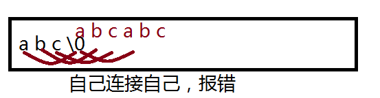
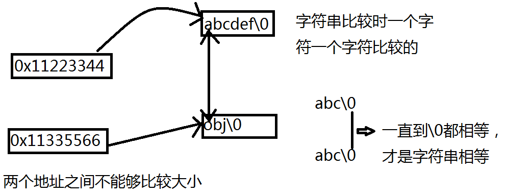
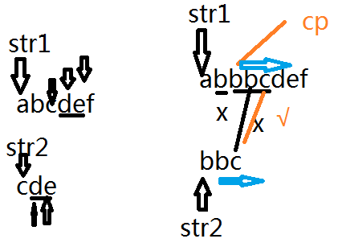
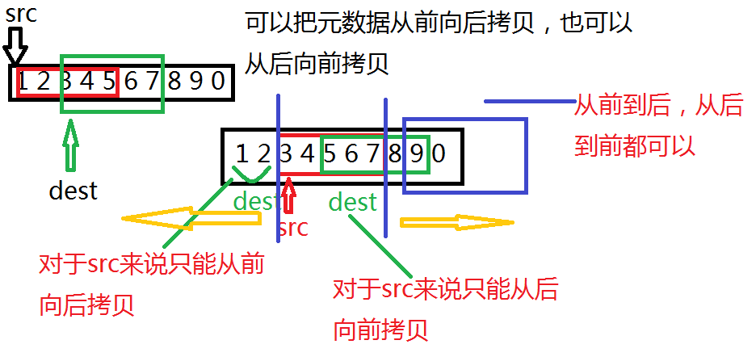
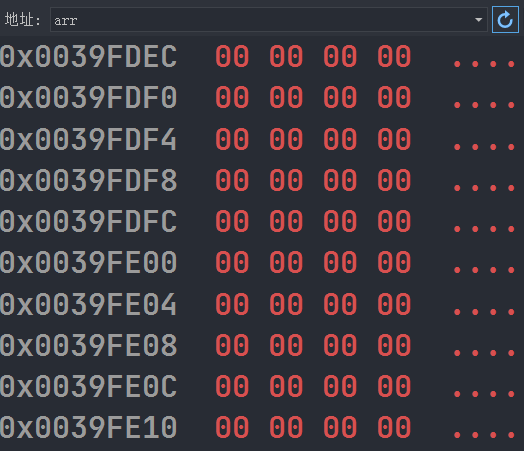
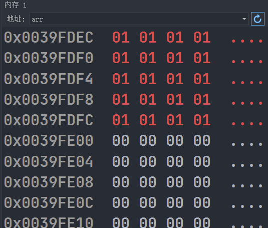

# 字符函数与字符串函数

## 求字符串长度

C语言没有字符串类型，字符串通常放在**常量字符串**中或者**字符数组**中，**常量字符串**适用于那些对他不做修改的字符串函数。

### 相关函数

#### strlen

```c
size_t strlen ( const char * str );
```

注意：

1. 字符串已经'\0'作为结束标志，strlen函数返回的是在字符串中'\0'前面出现的字符个数（不包含'\0'）。
2. 参数指向的字符串必须要以'\0'结束。
3. 注意函数的返回值是size_t，是无符号的。

##### 自己实现strlen函数

```c
#define _CRT_SECURE_NO_WARNINGS

// 1.计数器版本
// 2.递归版本
// 3.指针-指针版本
#include <stdio.h>
#include <string.h>
#include <assert.h>
unsigned int my_strlen(char* str) {
	int count = 0; // 计数器版本
	assert(str);
	while (*(str++)) {
		count++;
	}
	return count;
}
int main(void) {
	char* str1 = "abcdef";
	char str2[] = "def";
	char str3[] = { 'a','b','c' };
	printf("str1=%d,str2=%d,str3=%d\n", strlen(str1), strlen(str2), strlen(str3)); // str3是错误的因为没有\0
	printf("str1=%d,str2=%d,str3=%d\n", my_strlen(str1), my_strlen(str2), my_strlen(str3)); // str3是错误的因为没有\0
	return 0;
}
```

##### 判断下面代码的输出结果

```c
#define _CRT_SECURE_NO_WARNINGS

#include <stdio.h>
#include <string.h>
int main(void) {
    // 因为strlen返回是unsigned int类型
	if (strlen("abc") - strlen("abcdef") > 0) {
		printf(">\n"); // √
	}
	else {
		printf("<=\n");
	}
	return 0;
}
```

## 长度不受限制字符串函数

### 相关函数

#### strcpy

字符串拷贝函数

```c
char * strcpy ( char * destination, const char * source );
```

注意：

1. 源字符串必须以'\0'结束。
2. 会将源字符串中的'\0'拷贝到目标空间。
3. 目标空间必须足够大，以确保能存放源字符串。
4. 目标空间必须可变（可修改）。

##### 模拟实现

```c
#define _CRT_SECURE_NO_WARNINGS

#include <stdio.h>
#include <string.h>
int main(void) {
	char arr[20] = "##########";

	/** Right
	* char* p = "hello";
	* strcpy(arr, p);
	*/
	
	// strcpy(arr, "Hello"); Right

	/** Error 没有'\0'结束
	* char arr2[] = { 'a','b','c' };
	* strcpy(arr,arr2); 
	*/

	/** Error 目标空间不够大
	* char arr3[5] = "#####";
	* char* p = "Hello Word!!!";
	* strcpy(arr3,p);
	* printf("%s\n",arr3);
	*/

	printf("%s\n",arr);
	
	return 0;
}
```

#### strcat

```c
char * strcat ( char * destination, const char * source );
```

注意：

1. 源字符串必须以'\0'结束。
2. 目标空间必须足够大，以确保能存放源字符串。
3. 目标空间必须可变（可修改）。
4. 字符串不能自己追加自己。

##### 测试1

```c
#define _CRT_SECURE_NO_WARNINGS

#include <stdio.h>
#include <string.h>
int main(void) {
	// char arr1[] = "Hello"; Error
	char arr1[20] = "Hello"; // Right
	char arr2[] = "Word";
	strcat(arr1, arr2); // 字符串追加
	char arr3[20] = "Hello\0######";
	strcat(arr3, arr2);
	// strcat(arr1,arr1); Error
	printf("%s\n", arr1);
	return 0;
}
```



##### 模拟实现

```c
#define _CRT_SECURE_NO_WARNINGS

#include <stdio.h>
#include <string.h>
#include <assert.h>
char* my_strcat(char* dest, const char* src) {
	// 断言
	assert(dest && src);
	char* ret = dest;
	// 1. 找目标字符串中的\0
	while (*dest) {
		dest++;
	}
	// 2. 追加源字符串，包含\0  
	while (*(dest++) = *(src++));
	return ret;
}
int main(void) {
	char arr1[20] = "Hello\0#####";
	char arr2[] = "Word";
	my_strcat(arr1, arr2);
	printf("%s\n",arr1);
}
```

#### strcmp

```c
int strcmp ( const char * str1, const char * str2 );
```

字符串是存放地址中的，地址是不能比较大小的，所以说字符串不可以比较大小。

地址是不能比较大小的其实个人认为也是不太合理的，因为可以使用指针比较大小进行相应的判断`++`之类的操作符。

注意：

1. 第一个字符串>第二个字符串，返回大于0
2. 第一个字符串=第二个字符串，返回=0
3. 第一个字符串<第二个字符串，返回<0



##### 测试1

```c
int ret = strcmp("abc","abd");
printf("%d\n",ret); // <0
```

##### 模拟实现

```c
#define _CRT_SECURE_NO_WARNINGS
#include <stdio.h>
#include <string.h>
#include <assert.h>
int my_strcmp(const char* str1, const char* str2) {
	assert(str1 && str2);
	while (*str1 == *str2) {
		if (*str1 == '\0') { // 因为*str1==*str2所以说，*str1/*str2为0则，都是0
			return 0;
		}
		str1++;
		str2++;
	}
	return *str1 - *str2;
	/*if (*str1 > *str2) {
		return 1;
	}
	else {
		return -1;
	}*/
}
int main(void) {
	int ret = my_strcmp("abcdef", "aaaaa");
	printf("%d\n", ret); // <0
	return 0;
}
```

## 长度受限制的字符串函数

### 相关函数

#### strncpy

```c
char array1[40] = "abcdef";
strncpy(array1,array1,3);
```

strncpy实现了可以自己拷贝自己的模式。

#### strncat

```c
char array1[40] = "Hello ";
char array2[] = "Word!!!";
strncat(array1,array2,4);
printf("%s\n",array1);
```

##### 模拟实现

#### strncmp

##### 模拟实现

## 字符串查找

### 相关函数

#### strstr

在字符串中查找另一个字符串，当然字符串查找的话也可以使用KMP字符串查找算法。

```c
const char * strstr ( const char * str1, const char * str2 );
```

##### 测试1

```c
char array1[] = "abcdef";
char array2[] = "def";
printf("%s\n", strstr(array1, array2));
```

##### 模拟实现

```c
#define _CRT_SECURE_NO_WARNINGS
#include <stdio.h>
#include <string.h>
#include <assert.h>
char* my_strstr(const char* str1, const char* str2) {
	assert(str1 && str2);
	const char* s1 = NULL;
	const char* s2 = NULL;
	const char* cp = str1;
	if (*str2 == '\0') {
		return (char*)str1; // 因为str1是const char*类型,所以要转换为char*类型
	}
	while (*cp) {
		s1 = cp;
		s2 = str2;
		while (*s1 && *s2 && (*s1 == *s2)) {
			s1++;
			s2++;
		}
		if (*s2 == '\0') {
			return (char*)cp;
		}
		cp++;
	}
	return NULL;
}
int main(void) {
	char array1[] = "abcdefghi";
	char array2[] = "def";
	printf("%s\n", my_strstr(array1, array2));
	return 0;
}
```



#### strtok

```c
char * strtok ( char * str, const char * delimiters );
```

* delimiters参数是一个字符串，定义了用作分割符的字符串集合
* 第一个参数指定一个字符串，它包含了0个或者多个由delimiters字符串组成的的字符串。
* strtok函数找到str中的下一个标记，并将其用`\0`结尾，返回一个指向这个标记的指针。（注：strtok函数会改变被操作的字符串，所以在使用strtok函数切分字符串一般都是临时拷贝的内容并且可以被修改）
* strtok函数的第一个参数不为NULL，函数将找到str中的第一个标记，strtok函数将保存它在字符串中的位置。
* strtok函数第一个参数为NULL，函数将在同一个字符串中被保存的位置开始，查找下一个标记。
* 如果字符串中不存在更多的标记，则返回NULL指针。

##### 测试1

```c
char array1[] = "god@love.com";
char array2[] = "@.";
char temp[30] = { 0 };
strcpy(temp, array1);
printf("%s\n", temp); // god@love.com
strtok(temp, array2);
// god\0love.com
printf("%s\n", temp); // god
printf("%s\n", strtok(NULL, array2)); // love
// god\0love\0com
printf("%s\n", strtok(NULL, array2)); // com
printf("%s\n", strtok(NULL, array2)); // (null)
```

##### 测试2

```c
#include <stdio.h>
#include <string.h>
int main(void) {
	char array1[] = "god@love.com";
	char array2[] = "@.";
	char temp[30] = { 0 };
	strcpy(temp, array1);
	char* ret = NULL;
	for (ret = strtok(temp, array2); ret != NULL; ret = strtok(NULL, array2)) {
		printf("%s\n", ret);
	}
	return 0;
}
```

思考：strtok是如何记录分割的位置的？如何通过NULL参数找到上一次切割的位置的？

个人认为是因为有static关键字，将一个变量存放了起来。

## 错误信息报告

### strerror

将错误码，转换为错误信息。

```c
char * strerror ( int errnum );
```

返回错误码对应的错误信息。在使用的时候必须包含头文件`errno.h`

#### 测试1

```c
printf("%s\n", strerror(0));
printf("%s\n", strerror(1));
printf("%s\n", strerror(2));
```

#### 测试2

```c
#include <stdio.h>
#include <errno.h>
// 文件打开失败会返回NULL
FILE* pf = fopen("test.txt","r");
if (pf==NULL) {
    printf("%s\n",strerror(errno)); // errno是一个全局变量
}
fclose(pf);
pf = NULL;
```

### perror

```c
void perror ( const char * str );
```

#### 测试

```c
#include <stdio.h>
int main(void) {
	FILE* pf = fopen("test.txt","r");
	if (pf==NULL) {
		perror("错误信息"); // 这个函数会自动调用errno这个全局变量，然后将错误信息输出
		return 1;
	}
	fclose(pf);
	pf = NULL;
	return 0;
}
```

## 字符操作

|   函数   |                      参数符合条件返回真                      |
| :------: | :----------------------------------------------------------: |
| iscntrl  |                         任何控制字符                         |
| isspace  | 空白字符：'空格'，'换页\f'，'换行\n'，'回车\r'，'制表符\t或者垂直制表符\v' |
| isdigit  |                        10进制数字0-9                         |
| isxdigit |     16进制数字，包含所有10进制，小写字母a-f，大写字母A-F     |
| islower  |                         小写字母a-z                          |
| isupper  |                         大写字母A-Z                          |
| isalpha  |                         字母a-z或A-Z                         |
| isalnum  |                 字母或者数字，a-z，A-Z，0-9                  |
| ispunct  |     标点符号，任何不属于数字或者字母的图形字符（可打印）     |
| isgraph  |                         任何图形字符                         |
| isprint  |            任何可打印字符，包括图形字符和空白字符            |

### 测试

```c
char ch = 'a';
printf("%d\n", isdigit(ch));
// 判断大写字母可以使用函数，也可以使用下面的方法
if (ch > 'A' && ch < 'Z') {}
return 0;
```

### 字符转换

```c
int tolower(int c); // 转换为小写
int toupper(int c); // 转换为大写
// 注：大小写字母转换的话，可以使用+-32的方法。
```

## 内存操作函数

### 相关函数

#### memcpy

前提：我们知道strcpy是字符串拷贝的函数，可以实现字符串的拷贝，但是如果遇到了整形数组如何进行拷贝呢？显然strcpy就已经不在适合我们的需求了，这就需要我们的memcpy函数来实现了。

memcpy拷贝的是不重叠的内存。不重叠拷贝。

```c
void * memcpy ( void * destination, const void * source, size_t num );
```

##### 测试1

```c
int array1[10] = { 1,2,3,4,5,6,7,8,9,0 };
int array2[10] = { 0 };
memcpy(array2,array1,20); // 将array1的前20个字节拷贝到array2中
```

##### 模拟实现

```c
#define _CRT_SECURE_NO_WARNINGS
#include <stdio.h>
#include <string.h>
#include <assert.h>
void* my_memcpy(void* dest, void* src, size_t num) {
	void* ret = dest;
	assert(dest && src);
	// 因为不确定dest和src的类型，所以没有办法进行++和解引用的操作，所以进行强制类型转换
	// 强制类型转换是一种临时的
	// 为什么要转换为char*的指针?
	// 因为char类型的跨度是一个字节
	while (num--) {
		*(char*)dest = *(char*)src;
		dest = (char*)dest + 1;
		src = (char*)src + 1;
	}
	return ret;
}
int main(void) {
	int array1[10] = { 1,2,3,4,5,6,7,8,9,0 };
	int array2[10] = { 0 };
	my_memcpy(array2, array1, 20);
	return 0;
}
```

#### memmove

```c
void * memmove ( void * destination, const void * source, size_t num );
```

memmove拷贝的是重叠的内存。重叠拷贝。

为什么要产生memmove函数呢?

我们知道memcpy的实现原理，是一个字节一个字节进行拷贝的，对于一个内存重叠的数组来说`int arr[10] = {1,2,3,4,5,6,7,8,9,0};`将arr拷入arr+2中1,2进入到3,4的位置，但是这时候的3,4已经被1,2代替了，所以说，就没有3,4了，拷入后的结果就是`{1,2,1,2,1,2,1,8,9,0}`

使用memmove就没有这个问题

##### 测试1

```c
int array1[10] = { 1,2,3,4,5,6,7,8,9,0 };
memmove(array1+2, array1, 20);
```

##### 模拟实现



``` c
#include <stdio.h>
#include <string.h>
#include <assert.h>
void* my_memmove(void* destination, const void* source, size_t num) {
	assert(destination && source);
	void* ret = destination;
	if (source > destination) {
		// 前->后
		while (num--) {
			*(char*)destination = *(char*)source;
			destination = (char*)destination + 1;
			source = (char*)source + 1;
		}
	}
	else
	{
		// 后->前
		while (num--) {
			*((char*)destination + num) = *((char*)source + num);
		}
	}
	return ret;
}
int main(void) {
	int array1[10] = { 1,2,3,4,5,6,7,8,9,0 };
	my_memmove(array1 + 2, array1, 20);
	return 0;
}
```

#### memset

```c
void * memset ( void * ptr, int value, size_t num );
```

##### 测试

```c
int arr[10] = { 0 }; // 40个字节
memset(arr, 1, 20); // 以字节为单位设置内存
```





#### memcmp

```c
int memcmp ( const void * ptr1, const void * ptr2, size_t num );
```

memcmp与strcmp的返回值是一样的

##### 测试1

```c
float arr1[] = { 1.0,2.0,3.0,4.0 };
float arr2[] = { 1.0,3.0 };
int ret = memcmp(arr1, arr2, 4);
printf("%d\n", ret);
ret = memcmp(arr1, arr2, 8);
printf("%d\n", ret);
```