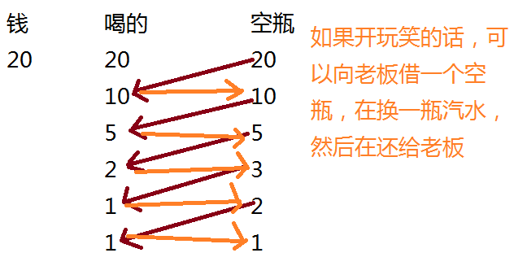
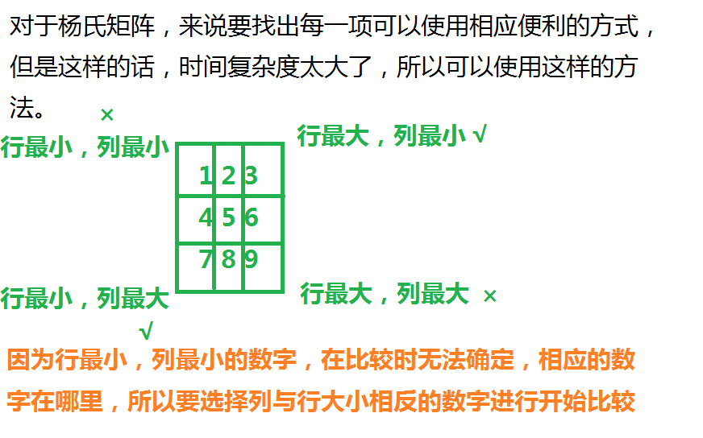
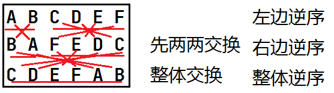
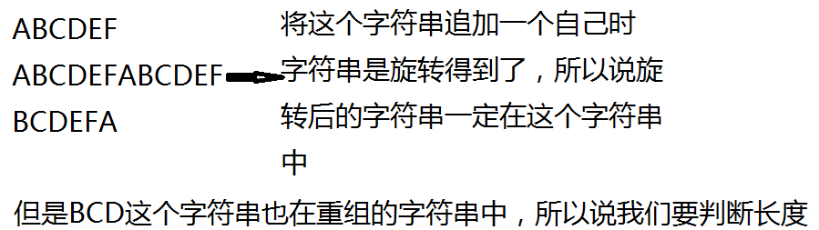

# C语言指针实现算法

## 打印菱形

```c
#define _CRT_SECURE_NO_WARNINGS

#include <stdio.h>
int main(void) {
	int line = 0;
	scanf("%d",&line);
	// 上
	for (int i = 0; i < line; i++) {
		// 打印一行
		for (int j = 0; j < line-1-i; j++) {
			printf(" ");
		}
		for (int j = 0; j < 2*i+1 ;j++) {
			printf("*");
		}
		printf("\n");
	}
	// 下
	for (int i = 0; i < line-1; i++) {
		// 打印一行
		// for (int j = 0; j < i+1 ; j++) {
		for (int j = 0; j <= i; j++) {
			printf(" ");
		}
		for (int j = 0; j < 2*(line - i - 1)-1; j++) {
			printf("*");
		}
		printf("\n");
	}
	return 0;
}
```

## 喝汽水

```c
#define _CRT_SECURE_NO_WARNINGS

#include <stdio.h>
int main(void) {
	// 喝汽水,1平汽水1元,2个空瓶换一瓶,给20元,能够喝多少汽水
	int money = 0;
	scanf("%d", &money);
	int total_2 = 0; // 方法2
	if (money>0) {
		total_2 = 2 * money - 1;
	}
	int total = money;
	int empty = money;
	// 开始置换 方法1
	while (empty >= 2) {
		total += empty / 2;
		empty = empty / 2 + empty % 2;
	}
	printf("%d\n",total);
	printf("%d\n",total_2);
	return 0;
}
```




## 使数组奇数全部位于偶数前面

```c
#define _CRT_SECURE_NO_WARNINGS

#include <stdio.h>
move(int arr[],int size) {
	int left = 0;
	int right = size-1;
	while (left < right) {
		// 判断奇数，如果第一个是奇数则不需要交换，而如果第一个数是偶数，则left就不会++，就交换了。
		// 从前往后找奇数
		while (arr[left] % 2 == 1 && (left < right)) {
			left++;
		}
		// 从后往前找偶数
		while (arr[right] % 2 == 0 && (left < right)) {
			right--;
		}
		if (left < right) {
			int temp = arr[left];
			arr[left] = arr[right];
			arr[right] = temp;
		}
	}
}
print(int arr[], int size) {
	for (int i = 0; i < size;i++) {
		printf("%d ",arr[i]);
	}
}
int main() {
	// 使数组奇数全部位于偶数前面
	int array[] = { 1,2,3,4,5,6,7,8,9,10 };
	int arraysize = sizeof(array) / sizeof(array[0]);
	move(array,arraysize);
	print(array, arraysize);
	return 0;
}
```

## 杨氏矩阵

* 有一个数字矩阵，矩阵的每行从右到左是递增的，矩阵的从上到下是递增的，请编写程序，在这样的矩阵中查找某个数字是否存在
* 要求:时间复杂度小于O(N)

```c
#define _CRT_SECURE_NO_WARNINGS
#include <stdio.h>
int main(void) {
	int array[3][3] = { 1,2,3,4,5,6,7,8,9 };
	int input;
	scanf("%d", &input);
	for (int i = 0; i < sizeof(array) / sizeof(array[0]); i++) {
		for (int j = 0; j < sizeof(array[0]) / sizeof(array[0][0]); j++) {
			if (array[i][j] == input) {
				printf("%d\n", array[i][j]);
				printf("%d,%d\n", i, j);
			}
		}
	}
	return 0;
}
```

但是这样的方法显然不符合题目的时间复杂度小于O(N)的概念。

补充：什么是时间复杂度？

用通俗的话来说就是程序执行的次数不能超过，数组元素的大小。

### 优化版本

```c
#define _CRT_SECURE_NO_WARNINGS
#include <stdio.h>
/** 杨氏矩阵
* 有一个数字矩阵，矩阵的每行从右到左是递增的，矩阵的从上到下是递增的，请编写程序
* 在这样的矩阵中查找某个数字是否存在
* 要求:时间复杂度小于O(N)
*/
// int find_num(int arr[3][3], int row, int line, int num) {
int find_num(int arr[3][3], int* p_row, int* p_line, int num) {
	int x = 0;
	int y = *p_line - 1;
	while (x < *p_row && y >= 0) {
		if (arr[x][y] < num) {
			x++;
		}
		else if (arr[x][y] > num) {
			y--;
		}
		else {
			*p_row = x;
			*p_line = y;
			printf("%d,%d,%d\n", arr[x][y], x, y);
			return 1; // 找到返回1
		}
	}
	return 0; // 没有找到返回0
}
int main(void) {
	int array[3][3] = { 1,2,3,4,5,6,7,8,9 };
	int input;
	int x = 3, y = 3;
	scanf("%d", &input);
	// int ret = find_num(array, 3, 3, input);
	int ret = find_num(array, &x, &y, input); // 1. 传入参数，2.带回值
	if (ret == 1) {
		printf("找到了\n");
		printf("下标是%d,%d\n", x, y);
	}
	else {
		printf("Not Found\n");
	}
	return 0;
}
```



## 字符串左旋

* 实现一个函数，可以左旋转字符串中的k个字符
* 例如:
* `ABCD`左旋转一个字符得到`BCDA`
* `ABCD`左旋转两个字符得到`CDAB`

### 方法1

这个方法的核心是一次只旋转一个字符，然后达到相应的旋转字符串的效果。

```c
#include <stdio.h>
#include <string.h>
int main(void) {
	char array[] = "ABCDEF";
	int num = 2; // 要旋转多少个字符
	for (int i = 0; i < num;i++) {
		char temp = *array; // 每次左旋转一个字符
		for (int j = 0; j < strlen(array) - 1; j++) {
			*(array + j) = *(array + j + 1);
		}
		*(array + strlen(array) - 1) = temp; // 将要旋转的字符放在最后
	}
	printf("%s\n",array);
	return 0;
}
```

### 方法2



```c
#define _CRT_SECURE_NO_WARNINGS
#include <stdio.h>
#include <string.h>
#include <assert.h>
void reverse(char* left, char* right) {
	assert(left && right);
	while (left < right) {
		char* temp = *left;
		*left = *right;
		*right = temp;
		left++;
		right--;
	}
}
void string_left_totate(char* str, int num) {
	reverse(str, str + num - 1); // 左
	reverse(str + num, str + strlen(str) - 1); // 右
	reverse(str, str + strlen(str) - 1); // 整体
}
int main(void) {
	char array[] = "ABCDEF";
	int num = 2; // 要旋转多少个字符
	string_left_totate(array, num);
	printf("%s\n", array);
	return 0;
}
```

## 字符串旋转结果

* 写一个函数，判断一个字符串是否为另外一个字符串旋转之后的字符串
* 例如：
* 给定s1 = AABCD和s2 = BCDAA，返回1
* 给定s1 = abcd和s2 = ABCD，返回0
* 注：这个旋转包含左(右)旋转

### 方法1

```c
#include <stdio.h>
#include <string.h>
#include <assert.h>
int is_string_rotate(char* str1, const char* str2) {
	assert(str1 && str2);
	for (int i = 0; i < strlen(str1); i++) {
		// 每次左旋转一个字符
		char temp = *str1;
		// 后面n-1个字符往前挪动
		for (int j = 0; j < strlen(str1) - 1; j++) {
			*(str1 + j) = *(str1 + j + 1);
		}
		// temp放在最后
		*(str1 + strlen(str1) - 1) = temp;
		// 比较
		if (strcmp(str1, str2) == 0) {
			return 1;
		}
	}
	return 0;
}
int main(void) {
	char array1[] = "ABCDEF";
	char array2[] = "BCDEFA";
	int ret = is_string_rotate(array1, array2);
	if (ret == 1) {
		printf("Same\n");
	}
	else {
		printf("Not Same\n");
	}
	return 0;
}
```

### 方法2

这个方式使用函数库来实现的。

```c
#define _CRT_SECURE_NO_WARNINGS
#include <stdio.h>
#include <string.h>
#include <assert.h>
int is_string_rotate(char* str1, const char* str2) {
	assert(str1 && str2);
	// 一种特殊情况就是长度不相等
	// 长度不相等，一定不是旋转得到的
	if (strlen(str1)!=strlen(str2)) {
		return 0;
	}
	// 在str1的后面追加一个str1
	strncat(str1, str1, strlen(str1)); // 注:这个strncat在使用的时候数组必需是一定的，必须要分配足够的内存空间
	// 判断str2是否为str1的子串
	/*if (strstr(str1, str2) == NULL) {
		return 0;
	}
	else {
		return 1;
	}*/
	return strstr(str1, str2) != NULL;
	// return 0;
}
int main(void) {
	char array1[20] = "ABCDEF";
	char array2[] = "BCDEFA";
	int ret = is_string_rotate(array1, array2);
	if (ret == 1) {
		printf("Same\n");
	}
	else {
		printf("Not Same\n");
	}
	return 0;
}
```



