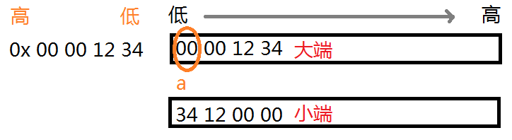

# C语言数据存储作业

大小端

```c
#include <stdio.h>
int main(void) {
	// 判断b变量在32位大端模式处理器上的值
	unsigned int a = 0x1234;
	unsigned char b = *(unsigned char*)&a;
	printf("%x\n", b); // 小端存储是0x34,大端存储是0x00
	return 0;
}
```



杨辉三角

```c
#define _CRT_SECURE_NO_WARNINGS

#include <stdio.h>
void print(int arr[10][10]) {
	for (int i = 0; i < 10; i++) {
		for (int j = 0; j < 10; j++) {
			printf("%d ", arr[i][j]);
		}
		printf("\n");
	}
}
int main(void) {
	int array[10][10] = { 0 };
	for (int i = 0; i < 10; i++) {
		for (int j = 0; j <= i; j++) {
			if (j == 0) {
				array[i][j] = 1;
			}
			if (i == j) {
				array[i][j] = 1;
			}
			if (i >= 2 && j >= 1) {
				array[i][j] = array[i - 1][j] + array[i - 1][j - 1];
			}
		}
	}
	print(array);
	return 0;
}
```

猜凶手

```c
#define _CRT_SECURE_NO_WARNINGS
/** 猜凶手
* 某地发生了一件谋杀案，确定凶手为4人中的一个
* A:不是我
* B:是C
* C:是D
* D:C在胡说
* 已知三人说了真话，1人说了假话
*/
#include <stdio.h>
int main(void) {
	char killer = 0;
	for (killer = 'A'; killer <= 'D';killer++) {
		if ((killer != 'A')+(killer == 'C')+(killer == 'D')+(killer != 'D') == 3) {
			printf("%c",killer);
		}
	}
	return 0;
}
```

猜名次

```c
#include <stdio.h>
/** 猜名次
* 根据预测结果写出排名
* A:B第二,我第三
* B:我第二,E第四
* C:我第一,D第二
* D:C最后,我第三
* E:我第四,A第一
* 综上每一位选手都说对了一半,请确定排名
*/
int main(void) {
	for (int a = 1; a <= 5;a++) {
		for (int b = 1; b <= 5;b++) {
			for (int c = 1; c <= 5; c++) {
				for (int d = 1; d <= 5; d++) {
					for (int e = 1; e <= 5; e++) {
						if (((b == 2) + (a == 3)) == 1
							&& ((b == 2) + (e == 4) == 1)
							&& ((c == 1) + (d == 2) == 1)
							&& ((c == 5) + (d == 3) == 1)
							&& ((e == 4) + (a == 1) == 1)
							) {
							if (a*b*c*d*e==120) {
								printf("a=%d,b=%d,c=%d,d=%d,e=%d\n", a, b, c, d, e);
							}
						}
					}
				}
			}
		}
	}
	return 0;
}
```
