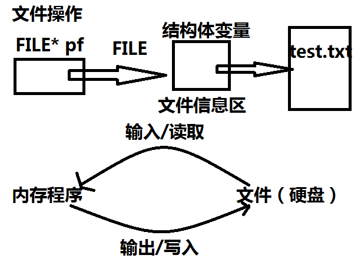
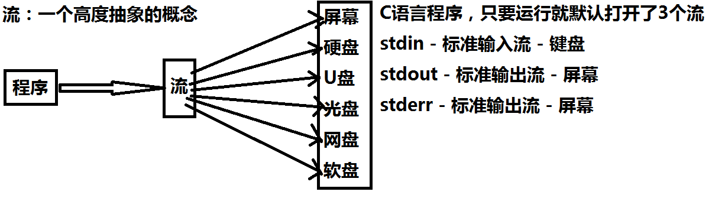
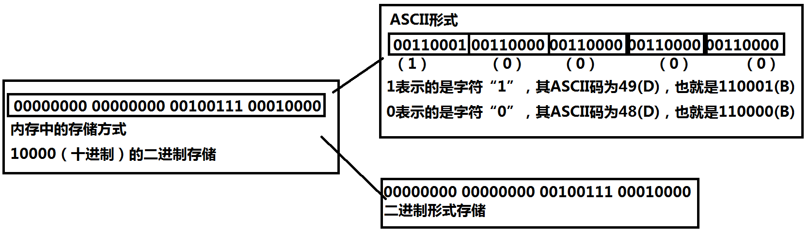
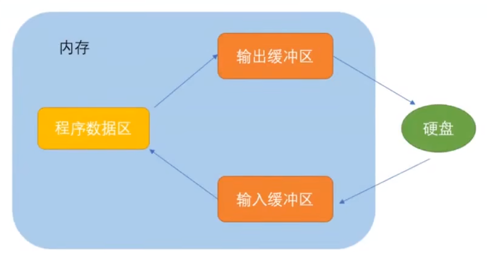

# C语言文件IO

注：`EOF`是`-1`

## 文件的打开与关闭

### 文件指针

缓冲文件系统中，关键的概念是**文件类型指针**，简称**文件指针**

每一个被使用的文件都在内存中开辟了一个相应的文件信息区，用来存放文件的相关信息（如文件的名字，文件的状态以及文件当前的位置等）。这些信息是保存在一个结构体变量中的。该结构体类型是由系统声明的，取名为**FILE**。

不同的C编译器的FILE类型包含的内存不完全相同，但是大同小异。

每当打开一个文件的时候，系统会根据文件的情况自动创建一个FILE结构体变量，并填充其中的信息，使用者不必关心细节。

一般都是通过一个FILE的指针来维护这个FILE结构体变量，这样使用起来更加方便。

创建一个FILE*的指针变量：

```c
FILE* pf; // 文件指针变量
```

定义pf是一个指向FILE类型数据的指针变量。可以使pf指向某个文件的文件信息区（是一个结构体变量）。通过该文件信息区中的信息就能够访问该文件，也就是说，通过文件指针变量就能够找到与他关联的文件。



### 文件的打开与关闭

文件在读写之前应该先打开文件，在使用结束之后关闭该文件。

在写程序的时候，在打开文件的同时，都会返回一个FILE*的指针变量指向该文件，也就相当于建立了指针和文件的关系。

ANSIC规定使用fopen函数来打开文件，fclose来关闭文件。

```c
// 打开文件
FILE* fopen(const char* filename,const char* mode);
// 关闭文件
int fclose(FILE* stream);
```

打开方式如下：

```c
FILE* pf = fopen("Test.txt","w");
if (pf==NULL) {
    perror("fopen");
    return 1;
}
// 写文件
// 关闭文件
fclose(pf);
pf = NULL;
```

### 文件使用的方式

|  文件使用方式   |                   含义                   | 如果指定文件不存在 |
| :-------------: | :--------------------------------------: | :----------------: |
| **"R"（只读）** | 为了输入数据，打开一个已经存在的文本文件 |        出错        |
| **"w"（只写）** |      为了输出数据，打开一个文本文件      |   建立一个新文件   |
| **"a"（追加）** |           向文本文件尾添加数据           |   建立一个新文件   |

还有很多，用的时候在查吧

## 文件的顺序读写

|      功能      | 函数名  |   适用于   |
| :------------: | :-----: | :--------: |
|  字符输入函数  |  fgetc  | 所有输入流 |
|  字符输出函数  |  fputc  | 所有输出流 |
| 文本行输入函数 |  fgets  | 所有输入流 |
| 文本行输出函数 |  fputs  | 所有输出流 |
| 格式化输入函数 | fscanf  | 所有输入流 |
| 格式化输出函数 | fprintf | 所有输出流 |
|   二进制输入   |  fread  |    文件    |
|   二进制输出   | fwrite  |    文件    |

字符输出函数函数使用示例：

```c
int main(void) {
	FILE* pf = fopen("Test.txt", "w");
	if (pf == NULL) {
		perror("fopen");
		return 1;
	}
	// 写文件
	fputc('d', pf);
	fputc('e', pf);
	fputc('f', pf);
	// 关闭文件
	fclose(pf);
	pf = NULL;
	return 0;
}
```

### 对比一组函数

scanf/fscanf/sscanf

printf/fprintf/sprintf

## 流的概念



### 一个字符的读写

#### fputc

```c
int fputc ( int character, FILE * stream );
```

##### 示例代码1

```c
fputc('d', stdout);
fputc('e', stdout);
fputc('f', stdout);
```

#### fgetc

```c
int fgetc ( FILE * stream );
```

##### 示例代码1

```c
int main(void) {
	FILE* pf = fopen("Test.txt", "r");
	if (pf == NULL) {
		perror("fopen");
		return 1;
	}
	// 读文件
	int ret = fgetc(pf);
	printf("%c\n", ret);
	ret = fgetc(pf);
	printf("%c\n", ret);
	ret = fgetc(pf);
	printf("%c\n", ret);
	ret = fgetc(pf);
	printf("%d\n", ret); // 遇到问题变成-1 
	// 关闭文件
	fclose(pf);
	pf = NULL;
	return 0;
}
```

注：fgetc使用一次，就向后移动一次，类似于指针+1，遇到问题结果返回为-1

##### 示例代码2

```c
int ret = fgetc(stdin);
printf("%c\n", ret);
ret = fgetc(stdin);
printf("%c\n", ret);
ret = fgetc(stdin);
printf("%c\n", ret);
```

### 一行字符的读写

#### fpus

```c
int fputs ( const char * str, FILE * stream );
```

##### 示例代码1

```c
int main(void) {
	FILE* pf = fopen("Test.txt", "w");
	if (pf == NULL) {
		perror("fopen");
		return 1;
	}
	// 写文件 - 按照行来写
	fputs("abc", pf);
	fputs("def\n", pf); // 这样写入文件的话，不会换行
	// 如果需要换行的话需要加上\n
	fputs("Love", pf);
	// 关闭文件
	fclose(pf);
	pf = NULL;
	return 0;
}
```

#### fgets

```c
char* fgets(char* string,int n,FILE* stream);
// fgets函数每次读取n-1个字符，因为其中第n个字符为\0
// 用法参考printf
```

##### 示例代码1

```c
int main(void) {
	char arr[10] = { 0 };
	FILE* pf = fopen("Test.txt", "r");
	if (pf == NULL) {
		perror("fopen");
		return 1;
	}
	// 读文件
	fgets(arr, 4, pf);
	printf("%s\n", arr); // 读取了3个字符，因为要留下一个位置为\0
	fgets(arr, 4, pf);
	printf("%s\n", arr);
	// 关闭文件
	fclose(pf);
	pf = NULL;
	return 0;
}
```

#### fprintf

##### 示例代码1

```c
int fprintf ( FILE * stream, const char * format, ... ); // 可变参数,向流中写入数据,用法参考scanf
```

```c
struct MyStruct
{
	char* arr;
	int num;
	float sc;
};
int main(void) {
	struct MyStruct mystruct = { "def",123,123.4 };
	// 对格式话的数据进行读写
	FILE* pf = fopen("Test.txt", "w");
	if (NULL == pf) {
		perror("fopen");
		return 1;
	}
	// 写文件
	fprintf(pf, "%s %d %f", mystruct.arr, mystruct.num, mystruct.sc);
	// 关闭文件
	fclose(pf);
	pf = NULL;
	return 0;
}
```

#### fscanf

```c
int fscanf ( FILE * stream, const char * format, ... ); // 读取数据
```

##### 示例代码1

```c
struct MyStruct
{
	char arr[20];
	int num;
	float sc;
};
int main(void) {
	struct MyStruct mystruct = { 0 };
	// 对格式话的数据进行读写
	FILE* pf = fopen("Test.txt", "r");
	if (NULL == pf) {
		perror("fopen");
		return 1;
	}
	// 读文件
	fscanf(pf, "%s %d %f", mystruct.arr, &(mystruct.num), &(mystruct.sc));
	fprintf(stdout, "%s %d %f\n", mystruct.arr, mystruct.num, mystruct.sc);
	// 关闭文件
	fclose(pf);
	pf = NULL;
	return 0;
}
```

### 以二进制的形式读写

#### fwrite

```c
size_t fwrite ( const void * ptr, size_t size, size_t count, FILE * stream ); // fwrite函数
// ptr -- 这是指向要被写入的元素数组的指针。
// size -- 这是要被写入的每个元素的大小，以字节为单位。
// count -- 这是元素的个数，每个元素的大小为 size 字节。
// stream -- 这是指向 FILE 对象的指针，该 FILE 对象指定了一个输出流。
```

##### 示例代码1

```c
struct MyStruct
{
	char arr[10];
	int num;
	float sc;
};
int main(void) {
	struct MyStruct s = { "abcdef",10,5.5f };
	// 字符串以二进制写入与普通文本写入是一样的
	FILE* pf = fopen("Test.txt", "w");
	if (NULL == pf) {
		perror("fopen");
		return 1;
	}
	// 写文件
	fwrite(&s, sizeof(struct MyStruct), 1, pf);
	// 关闭文件
	fclose(pf);
	pf = NULL;
	return 0;
}
```

#### fread

```c
size_t fread ( void * ptr, size_t size, size_t count, FILE * stream ); // 以二进制的方式读
```

##### 示例代码2

```c
struct MyStruct
{
	char arr[20];
	int num;
	float sc;
};
int main(void) {
	struct MyStruct s = { "abcdef",10,5.5f };
	FILE* pf = fopen("Test.txt", "r");
	if (NULL == pf) {
		perror("fopen");
		return 1;
	}
	// 写文件
	fread(&s, sizeof(struct MyStruct), 1, pf);
	printf("%s %d %f\n", s.arr, s.num, s.sc);
	// 关闭文件
	fclose(pf);
	pf = NULL;
	return 0;
}
```

### 缓冲区的读写

#### sprintf函数与sscanf函数

```c
int sprintf ( char * str, const char * format, ... ); // 格式化输出发送到buffer(缓冲区)中.返回值是写入的字符数量.
int sscanf ( const char * s, const char * format, ...); // 从字符串中还原结构体数据
```

##### 代码示例1

```c
struct MyStruct
{
	char arr[10];
	int age;
	float f;
};
int main(void) {
	struct MyStruct mystruct = { "def",10,5.5f };
	struct MyStruct tempstruct = { 0 };
	char buf[100] = { 0 };
	// sprintf 把一个格式化的数据转化为字符串
	sprintf(buf, "%s %d %f", mystruct.arr, mystruct.age, mystruct.f);
	printf("%s\n", buf);
	// 从buf字符串中还原一个结构体数据
	sscanf(buf, "%s %d %f", tempstruct.arr, &(tempstruct.age), &(tempstruct.f));
	printf("%s %d %f\n", tempstruct.arr, tempstruct.age, tempstruct.f);
	return 0;
}
```

### 总结

#### 函数的区别

```c
// 输入语句
scanf() - 针对标准输入的格式的输入语句 - stdin
fscanf() - 针对所有输入流的格式化的输入语句 - stdin、文件
sscanf() - 从一个字符串中读取一个格式化的数据
// 输出语句
printf() - 针对标准输出的格式化输出语句 - stdout
fprintf() - 针对所有输出流的格式化输出语句 - stdout/文件
sprintf() - 把一个格式化的数据，转化成字符串
```

## 文件的随机读写

### fseek

根据文件指针的位置和偏移量来定位文件指针

```c
int fseek ( FILE * stream, long int offset, int origin );
// 第二个参数是相对于相对位置的偏移量
// origin文件指针起始的三种位置
// SEEK_SET	文件的开始
// SEEK_CUR	当前位置
// SEEK_END	文件的末尾
```

#### 例子

```c
int main(void) {
	// abcdefhigk
	FILE* pf = fopen("Test.txt", "r");
	if (NULL == pf) {
		perror("fopen");
		return 1;
	}
	// 读取文件
	int ch = fgetc(pf);
	printf("%c\n", ch); // a
	// 调整文件指针
	// fseek(pf, -1, SEEK_CUR);
	// fseek(pf, -1, SEEK_END);
	fseek(pf, 10, SEEK_END);
	ch = fgetc(pf);
	printf("%c\n", ch); // a
	ch = fgetc(pf);
	printf("%d\n", ch);
	printf("%c\n", ch); // b
	printf("%d\n", EOF); // -1
	// 关闭文件
	fclose(pf);
	pf = NULL;
	return 0;
}
```

注：如果起点是`SEET_END`，再次往后面走两个偏移量，返回的是`-1`

### ftell

```c
long int ftell ( FILE * stream ); // 返回文件指针相对于起始位置的偏移量
```

### rewind

```c
void rewind ( FILE * stream ); // 让文件指针的位置回到文件的起始位置
```

#### 例子

```c
int main(void) {
	FILE* pf = fopen("Test.txt", "r");
	if (NULL == pf) {
		perror("fopen");
		return 1;
	}
	// 读取文件
	int ch = fgetc(pf);
	printf("%c\n", ch);
	// 调整文件指针
	fseek(pf, -2, SEEK_END);
	ch = fgetc(pf);
	printf("%c\n", ch);
	ch = fgetc(pf);
	printf("%c\n", ch);

	int ret = ftell(pf);
	printf("%d\n", ret);
	// 让文件指针回到起始位置
	rewind(pf);
	ch = fgetc(pf);
	printf("%c\n", ch); // a
	// 关闭文件
	fclose(pf);
	pf = NULL;
	return 0;
}
```

## 文本文件与二进制文件

数据文件有两种：文本文件、二进制文件

数据在内存中以二进制的形式存储，如果不加转换输出到外存，就是二进制文件。

如果要求外存上以ASCII码的形式存储，则需要在存储前转换，以ASCII码形式存储的就是文本文件。

一个数据在文件中如何存储？

字符一律使用ASCII形式存储，数值型数据既可以用ASCII形式存储，也可以使用二进制形式存储。

例如：整数10000，以ASCII形式存储到硬盘，占用5个字节（每一个字符一个字节），以二进制形式存储，则在硬盘上只占用4个字节。



```c
int main(void) {
	int num = 10000;
	FILE* pf = fopen("Test.txt","wb");
	if (NULL == pf) {
		perror("fopen");
		return 1;
	}
	// 写文件
	fwrite(&num,sizeof(int),1,pf); // 以二进制写入是10 27 00 00 
	fclose(pf);
	pf = NULL;
	return 0;
}
```

## 文件读取结果的判定

### 被错误的使用feof

在文件读取过程中，不能使用feof函数的返回值直接用来判断文件是否结束

feof应用于当文件读取结束后，**判断是读取失败结束，还是遇到文件结尾结束**

1. 文本文件读取是否结束，判断返回值是否为EOF（fgetc），或者NULL（fgets）例如：

   * fgetc判断是否为EOF
   * fets判断返回值是否为NULL

2. 二进制文件的读取结束判断，判断返回值是否小于实际要读的个数。

   例如：

   * fread判断返回值是否小于实际要读的个数。

### 文件读取函数结束

* fgetc函数在读取结束的时候，会返回EOF，正常读取的时候，返回的是读取到的字符的ASCII码值
* fgets函数在读取结束的时候，会返回NULL，正常读取的时候，返回存放字符串的空间起始地址
* fread函数在读取的时候，返回的是实际读取到的完整元素的个数，如果发现读取到的完整的元素的个数小于指定的元素个数，这就是最后一次读取了。
* 判断是因为什么原因结束的要是用feof函数

### 代码示例

```c
int main(void) {
	// 把Test.txt文件拷贝一份，生成Test2.txt
	FILE* pfread = fopen("Test.txt", "r");
	if (NULL == pfread) {
		perror("pfread");
		return 1;
	}
	FILE* pfwrite = fopen("Test2.txt", "w");
	if (pfwrite == NULL) {
		fclose(pfread);
		pfread = NULL;
		perror("pfwrite");
		return 1;
	}
	// 文件打开成功
	// 读写文件
	int ch; // 注意：int，非char，要求处理EOF
	// fgetc当读取失败的时候或者遇到文件结束的时候，都会返回EOF
	while ((ch = fgetc(pfread)) != EOF) { // 标准C I/O读取文件循环
		// 写文件
		fputc(ch, pfwrite);
	}
	// 关闭文件
	fclose(pfread);
	pfread = NULL;
	fclose(pfwrite);
	pfwrite = NULL;
	return 0;
}
```

## 文件缓冲区

系统自动的在内存中为程序中每一个正在使用开辟一块"**文件缓冲区**"。从内存向磁盘输出数据会先送到内存中的缓冲区中，装满整个缓冲区后才一起送向磁盘。

读数据的话，从磁盘文件中读取数据输入到内存缓冲区（充满缓冲区），然后再从缓冲区逐个的将数据送到程序数据区（程序变量等）

缓冲区大小由编译器决定。



```c
int main(void) {
	FILE* pf = fopen("Text.txt", "w");
	fputs("abcdef", pf);
	printf("睡眠10秒-已经开始写数据了，打开Test.txt文件发现文件没有内容\n");
	Sleep(10000);
	printf("刷新缓冲区");
	fflush(pf); // 刷新缓冲区时，才将输出缓冲区的数据写到文件（磁盘）
	// 注：fflush在高版本的VS上不能使用
	printf("在睡眠10秒-此时，再次打开Test.txt文件，文件有内容了\n");
	Sleep(10000);
	fclose(pf);
	// 注：fclose在关闭文件的时候，也会刷新缓冲区
	pf = NULL;
	return 0;
}
```


