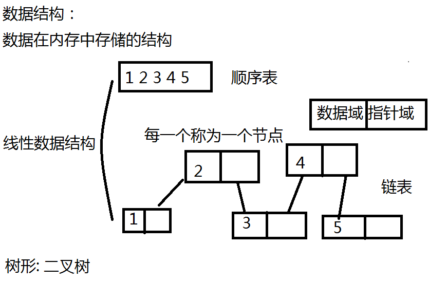
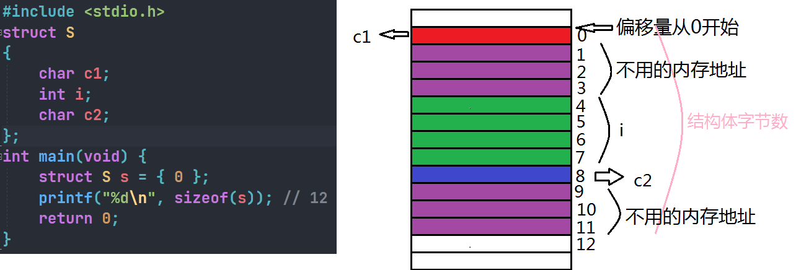
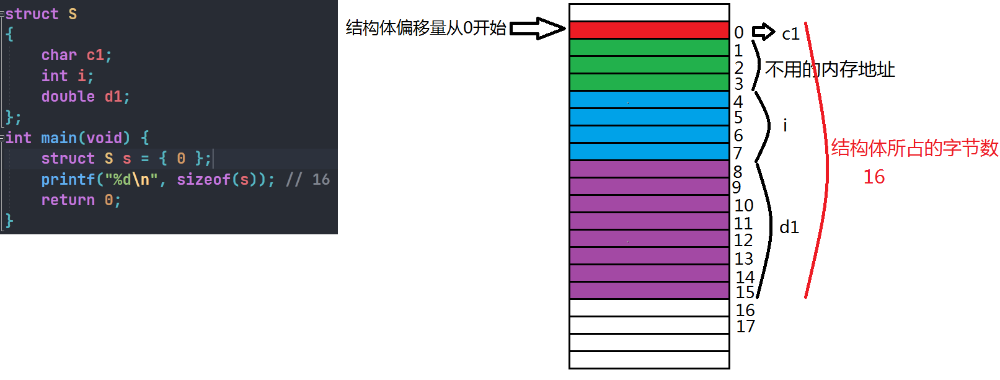
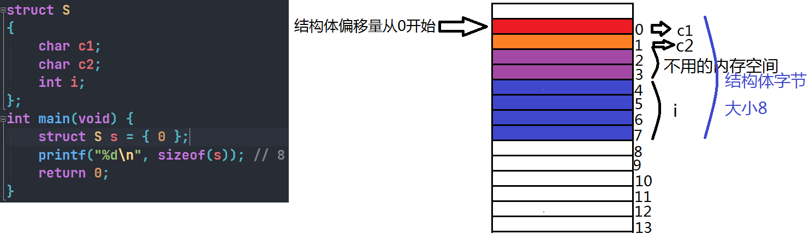
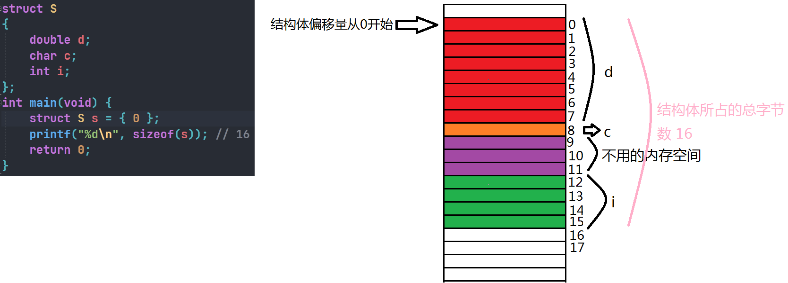
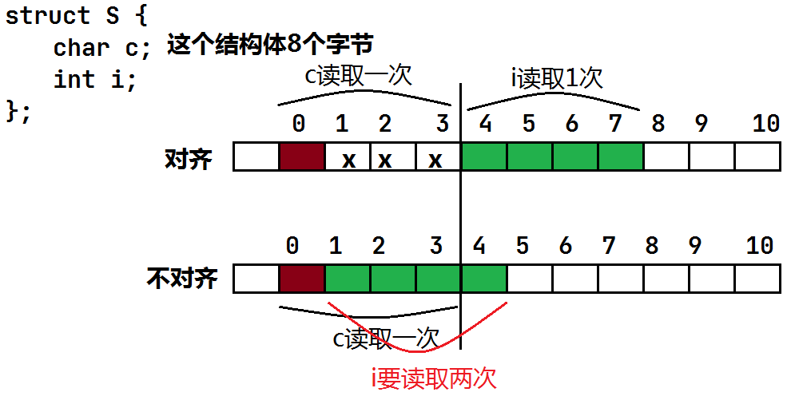
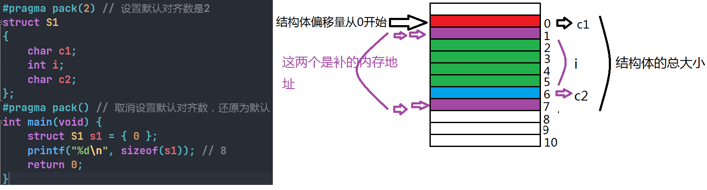
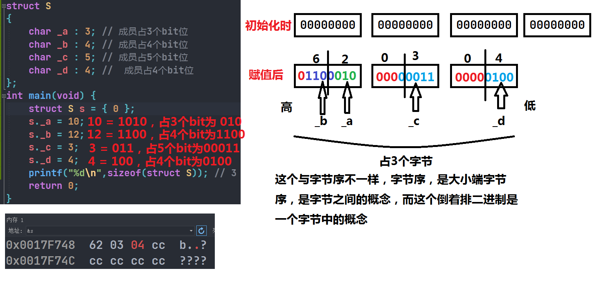
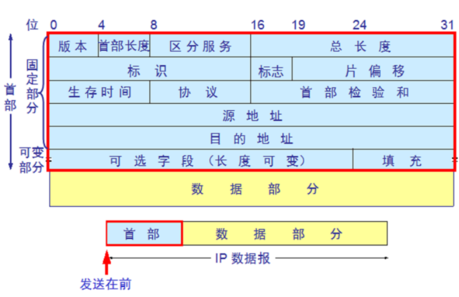

# 自定义类型：结构体，枚举，联合

## 结构体

结构体是一些类型不同数据的集合，数组是相同元素的集合。

### 结构体的声明

```c
struct tag {
    member-list; // 结构体的成员列表
}variable-list; // 在此处定义的结构体是全局变量，如果说是main函数声明的则是局部变量
```

#### 匿名结构体

结构体在声明的时候可以不指定标签的名字，从而声明一个匿名结构体

```c
struct {
	member-list;
} s;
```

但是匿名结构体只能使用一次，因为没有名字无法创建多个结构体变量。

### 结构体的自引用

结构体中包含一个类型为该结构体本身的成员是否可以呢？

```c
struct mystruct{
	int data;
	struct mystruct ms;
}; // 这样做是不可以的，因为不确定mystruct是多少个字节无法这样使用
```

但是可以进行不同类型的结构体嵌套

```c
struct A{
	char ch;
};
struct B{
	int num;
	struct A a;
}
```

为了研究结构体的自引用，特地引入中数据结构<==>线性表

什么是数据结构：数据在内存中的存储结构。



有了数据结构的知识我们就可以知道了，如何实现结构体的自引用。

```c
struct Node { // 这个结构体是8个字节
    int data;
    struct Node* next; // 指针都是4个字节,这个指针指向了下一个节点
};
```

### 结构体变量的定义和初始化

直接使用一个例子来说明：

```c
#include <stdio.h>
struct A
{
	int x;
	int y;
};
struct B
{
	char ch;
	struct A a;
};
int main(void) {
	// 结构体的声明
	struct B b = { 'c',{2,3} };
	printf("%c %d %d\n", b.ch, b.a.x, b.a.y);
	return 0;
}
```

### 结构体内存对齐

结构体的大小：参考结构体的内存对齐

#### 内存对齐的规则

1. 第一个成员在结构体变量偏移量为0的地址处
2. 其他成员变量要对齐到某个数字（对齐数）的整数倍的地址处。

**对齐数**：编译器默认的一个对齐数与该成员的较小值。

3. MSVC中的默认值是8
4. 结构体总大小为最大对齐数（每一个成员变量都有一个对齐数）的整数倍
5. 如果嵌套了结构体的情况，嵌套的结构体对齐到嵌套的结构体的最大对齐数的整数倍处，结构体的整体大小就是所有最大对齐数（含嵌套结构体的对齐数）的整数倍。

##### 例子1

```c
#include <stdio.h>
struct S
{
	char c1;
	int i;
	char c2;
};
int main(void) {
	struct S s = { 0 };
	printf("%d\n", sizeof(s)); // 12 
	return 0;
}
```



##### 例子2

```c
struct S
{
	char c1;
	int i;
	double d1;
};
int main(void) {
	struct S s = { 0 };
	printf("%d\n", sizeof(s)); // 16
	return 0;
}
```



##### 例子3

```c
struct S
{
	char c1;
	char c2;
	int i;
};
int main(void) {
	struct S s = { 0 };
	printf("%d\n", sizeof(s)); // 8
	return 0;
}
```



##### 例子4

```c
struct S
{
	double d;
	char c;
	int i;
};
int main(void) {
	struct S s = { 0 };
	printf("%d\n", sizeof(s)); // 16
	return 0;
}
```



##### 例子5

```c
struct S
{
	double d; // 最大对齐数是8
	char c;
	int i;
};
struct S1
{
	char c;
	struct S s; // 16
	double d;
};
int main(void) {
	struct S1 s1 = { 0 };
	printf("%d\n", sizeof(s1)); // 32
	return 0;
}
```


#### 为什么存在内存对齐？

1. **平台原因（移植原因）**：不是所有的硬件平台都能访问任意地址上的数据的；某些硬件平台只能在某些地址处取某些特定类型的数据，否则抛出异常。
2. **性能原因**：数据结构（尤其是栈）应该尽可能的在自然边界上对齐。原因在于，为了访问对齐的内存，处理器需要作两次内存访问；而对齐的内存只需要访问一次。



总体来说：

结构体的内存对齐是拿空间换区时间的做法。

进而在设计结构体的时候，既要满足对齐，又要节省空间，该如何去做：**让占用空间小的成员尽量集中在一起。**

```c
struct S1
{
	char c1;
	int i;
	char c2;
};
struct S2
{
	char c1;
	char c2;
	int i;
};
int main(void) {
	struct S1 s1 = { 0 };
	struct S2 s2 = { 0 };
	printf("%d\n", sizeof(s1)); // 12
	printf("%d\n", sizeof(s2)); // 8
	return 0;
}
```

S1，S2的成员一样，但是S1和S2所占用的空间大小有了区别。

#### 修改默认对齐数

使用`#pragma`这个预处理指令，可以修改默认对齐数。

```c
#pragma pack(2) // 设置默认对齐数是2
struct S1
{
	char c1;
	int i;
	char c2;
};
#pragma pack() // 取消设置默认对齐数，还原为默认
int main(void) {
	struct S1 s1 = { 0 };
	printf("%d\n", sizeof(s1)); // 8
	return 0;
}
```



结构体在对齐方式不合适的时候，可以自己修改默认对齐方式。

##### 题目

编写一个宏，计算某变量相对于首地址的偏移，并给出说明。

考察：offsetof宏的实现

###### offsetof的使用

```c
offsetof (type,member) // 这个宏在stddef.h这个头文件中
```

使用

```c
#include <stdio.h>
#include <stddef.h>
struct S
{
	char c1;
	int i;
	char c2;
};
int main(void) {
	printf("%d\n", offsetof(struct S, c1)); // 0
	printf("%d\n", offsetof(struct S, i)); // 4 
	printf("%d\n", offsetof(struct S, c2)); // 8
	return 0;
}
```

### 结构体传参

就是和普通的类型传参是一样的，但是一点记住，传递指针会好一点。不要传结构体，因为传结构体，函数参数会压栈，结构体太大，对内存的开销就大。

结构体传参的时候，要穿结构体的地址。

### 结构体实现位段（位段的填充&可移植性）

位段的声明和结构体是类似的，有两个不同：

1. 位段成员必须是`int`，`unsigned int`或者`signed int`
2. 位段的成员后边有一个冒号和一个数字。

例如：

```c
struct S
{
	int _a : 2;
	int _b : 3;
};
int main(void) {
	printf("%d\n",sizeof(struct S)); // 4，因为一个int没有占满
	return 0;
}
```

##### 位段的内存分配

1. 位段的成员可以使`int`，`unsigned int`，`signed int`或者是`char`（属于整形家族）类型。
2. 位段的空间上是按照需要以4个字节（`int`）或者一个字节（`char`）的方式来开辟的。
3. 位段涉及很多不确定因素，位段是不夸平台的，注重可移植的程序应该避免使用位段。

```c
struct S
{
	char _a : 3; // 成员占3个bit位
	char _b : 4; // 成员占4个bit位
	char _c : 5; // 成员占5个bit位
	char _d : 4; //  成员占4个bit位
};
int main(void) {
	struct S s = { 0 };
	s._a = 10;
	s._b = 12;
	s._c = 3;
	s._d = 4;
	printf("%d\n",sizeof(struct S)); // 3
	return 0;
}
```



##### 位段的跨平台问题

1. int位段被当成有符号还是无符号是不确定的。
2. 位段中最大位的数目不确定。（16位机器最大16,32位机器最大32，如果写成`int _a : 27`在16位机器上会出问题）
3. 16位 - int - 2byte - 16bit
4. 32位 - int - 4byte - 32bit
5. 位段中的成员在内存中从左向右分配，还是从右向左分配这也是不确定的。
6. 当一个结构中包含两个位段，第二个位段成员比较大，无法容纳于第一个位段剩余的位时，是舍弃还是利用这也是不确定的。

##### 总结

根结构相比，位段可以达到相同的效果。但是可以更好的节省空间，但是有跨平台的问题。

##### 位段的应用



## 枚举

枚举就是一一列举，把可能出现的值，进行一一的列举出来。

比如：性别，星期，月份等等。

枚举类型就是一种类型。

### 枚举类型的定义

```c
enum tag {
	enumeration-list, // 这个枚举列表是用,隔开的 
};
```

枚举的值是常量，结构体的是变量。

### 枚举类型的优点

为什么使用枚举？

可以使用`#define`定义常量为什么要是用枚举呢？枚举的优点

1. 增加代码的可维护性
2. 和`#define`定义的标识符相比，枚举有类型检查，更加严谨。
3. `#define`是在预编译期间替换的，是全局的，是调试不出来的。
4. 枚举类型是可以调试出来的。
5. 防止命名污染。
6. 便于调试。
7. 方便实用，一次可以定义多个常量。

### 枚举的使用

#### 测试1

```c
enum Color // 枚举的声明
{
	BLUE, // 里面常量的下表默认是从0开始，可以修改
	GREEN = 7, // 每次都是递增1
	RED
};
int main(void) {
	enum Color color = BLUE;
	printf("%d\n", BLUE); // 0
	printf("%d\n", GREEN); // 7
	printf("%d\n", RED); // 8
	return 0;
}
```

#### 测试2

```c
#define _CRT_SECURE_NO_WARNINGS
#include <stdio.h>
void menu() {
	printf("0.EXIT\n");
	printf("1.ADD\n");
}
enum MyEnum // 枚举的声明
{
	EXIT,
	ADD,
};
int main(void) {
	int input = 0;
	do
	{
		menu();
		scanf("%d",&input);
		switch (input)
		{
		case MyEnum::ADD: // 这个是CPP的语法，CPP语法检查更复杂。
			printf("ADD\n");
			break;
		case EXIT: // 这个是C语言的语法
			printf("EXIT\n");
			break;
		default:
			break;
		}
	} while (input);
	return 0;
}
```

## 联合

### 联合类型的定义

联合体也是一种特殊的自定义类型。

这种类型定义的变量也包含一系列的成员，特征是这些成员公用同一块内存空间（所以联合体也叫共用体）

```c
union Un {
	char c;
	int i;
};
int main(void) {
	union Un un = { 0 };
	printf("%d\n", sizeof(un)); // 4
	printf("%p\n", &un); // 这三个地址是相同的
	printf("%p\n", &(un.c));
	printf("%p\n", &(un.i));
	un.i = 0x11223344;
	un.c = 0x55; // 修改值的话，只能改一个，内存块只保留一个。
	printf("%x\n",un.i); // 0x11223355 
	return 0;
}
```

### 联合的特点

联合体的成员是公用同一块内存空间，这样一个联合体的大小，至少是最大成员的大小（因为联合体至少也要有保存最大的那个成员的能力）

#### 计算大小端

##### 使用普通的方法

```c
int check_sys() {
	int num = 1;
	if (*((char*)(&num)) == 1) {
		return 1;
	}
	else {
		return 0;
	}
}
int main(void) {
	int ret = check_sys();
	if (ret==1) {
		printf("小端\n");
	}
	else{
		printf("大端\n");
	}
	return 0;
}
```

##### 使用联合体

```c
int check_sys() {
	union Un
	{ // 因为联合体只能使用一块的内存空间
		char c;
		int i;
	} u;
	u.i = 1; // 改变了内存的结构，如果是小端存储，就把char类型的c给改变了，所以可以通过这种方法进行大小端字节序的判断。
	return u.c;
}
int main(void) {
	int ret = check_sys();
	if (ret==1) {
		printf("小端\n");
	}
	else{
		printf("大端\n");
	}
	return 0;
}
```

### 联合大小的计算

* 联合的大小至少是最大成员的大小。

* 当最大成员大小不是最大对齐数的整数倍的时候，就要对齐到最大对齐数的整数倍。

```c
#define _CRT_SECURE_NO_WARNINGS
#include <stdio.h>
union Un1 {
	char c[5]; // 1 5 8
	int i; // 4 8
};
union Un2 {
	char c[7]; // 1 7 8
	int i; // 4 8
};
int main(void) {
	printf("%d\n", sizeof(union Un1)); // 8
	printf("%d\n", sizeof(union Un2)); // 8
	return 0;
}
```

