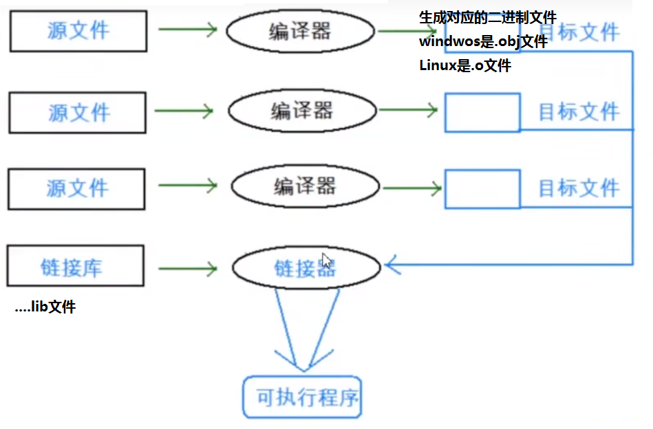
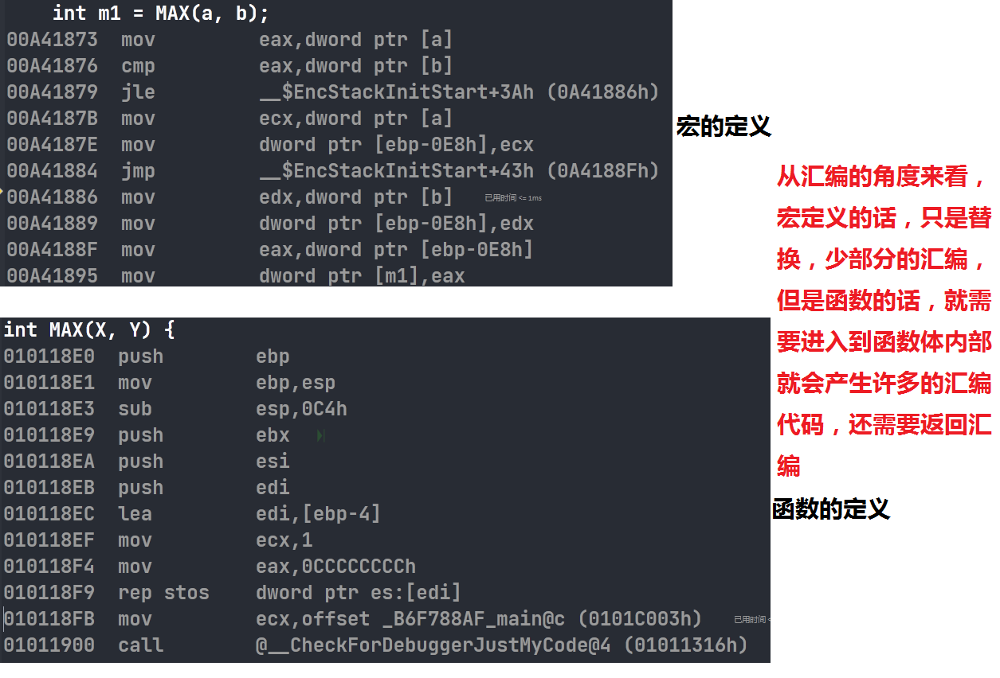

# 预处理

## 程序的编译环境和执行环境

在ANSI C的任何一种实现中，存在两个不同的环境。

第一种是编译环境：将源代码转换为可执行的机器指令。

第二种是运行环境：实际的执行代码

## 编译环境+连接

### 编译环境




### 运行环境

程序的执行过程：

1. 程序必须载入内存中，在有操作系统的环境中：一般这个由操作系统完成。在独立的环境中，程序必须由手工安排，也可能是通过可执行代码置入只读内存来完成的。
2. 程序的执行便开始，接着便调用main函数。
3. 开始执行程序代码，这个时候程序将使用一个运行时堆栈（stack），存储函数的局部变量和返回地址，程序同时也可以使用静态（static）内存，存储于静态内存中的变量在程序的整个执行过程一直保留他们的值。
4. 终止程序。正常终止main函数；也可能是意外终止。

## 预处理

### 预定义符号

```c
_FILE_ // 进行编译的源文件
_LINE_ // 文件当前的行号
_DATE_ // 文件被编译的日期
_TIME_ // 文件被编译的时间
_STDC_ // 如果编译器遵循ANSI C，其值为1，否则未定义
_FUNCTION_ // 当前函数
```

这些预定义符号都是语言内置的。

#### 示例1

```c
int main(void) {
	printf("file:%s line:%d\n", __FILE__, __LINE__);
	printf("date:%s\n", __DATE__);
	printf("time:%s\n", __TIME__);
	printf("function:%s\n", __FUNCTION__);
	return 0;
}
```

#### 示例2

打印日志

```c
int main(void) {
	FILE* pf = fopen("log.txt", "a+");
	if (NULL == pf) {
		perror("fopen");
		return 1;
	}
	for (int i = 0; i < 10; i++) {
		fprintf(pf, "%s %d %s %s %d\n", __FILE__, __LINE__, __DATE__, __TIME__, i);
	}
	fclose(pf);
	pf = NULL;
	return 0;
}
```

### #define

#### #define定义标识符

```c
#define name stuff // 语法，在使用的时候最好不要加上;号，因为这个是替换，会把;也替换进去
// 举例：
#define MAX 1000
#define reg register // 为register这个关键字，创建一个简短的名字
#define do_forever for(;;) // 用更形象的符号来替换一种实现
#define CASE break;case // 在写case语句的时候自动把break写上
// 如果定义的stuff过长，可以分成几行写，出了最后一行外，每行的后面都加上一个反斜杠(续航符)
#define DEBUG_PRINT printf("file:%s\tline:%d\t \
							date:%s\ttime:%s\t \
							__FILE__,__LINE__, \
							__DATE__,__TIME__")
```

在define定义标识符的时候，最好不要加；

#### #define定义宏

**因为#define是替换，所以在替换的过程中括号非常的重要**

#define机制包括了一个规定，允许把参数替换到文本中，这种实现通常称为宏（macro）或定义宏（define macro）。

下面是宏的申明方式：

```c
#define name(parament-list) stuff
```

其中的`parament-list`是一个由逗号隔开的符号表，他们可能出现在stuff中。

注意：

参数列表的左括号必须与name紧邻。

如果两者之间由任何空白存在，参数列表就会被解释为stuff的一部分。

如：

```
#define SQUARE(X) X*X
```

这个宏接收一个参数X，如果在上述声明后，把`SQUARE(5)`置于程序中，预处理器就会用下面这个表达式替换上面的表达式：`5*5`

**警告：**

这个宏存在一个问题：看下面的代码

```c
// #define 定义宏，括号很重要
// #define SQUARE(X) X*X
#define SQUARE(X) (X)*(X)
#define DOUBLE1(X) (X)+(X)
#define DOUBLE2(X) ((X)+(X))
int main(void) {
	printf("%d\n", SQUARE(3)); // 3 * 3 = 9
	printf("%d\n", 3 * 3); // 3 * 3 = 9
	printf("%d\n", SQUARE(3 + 1)); // 3+1 * 3+1 = 7
	printf("%d\n", 10 * DOUBLE1(4)); // 44 = 10*(4)+(4)
	printf("%d\n", 10 * DOUBLE2(4)); // 80
	return 0;
}
```

提示：用于对数值表达式进行求值的宏定义都应该用这种方式加上括号，避免在使用宏时由于参数中操作符或邻近操作符之间不可预料的相互作用。

#### #define替换规则

在程序中扩展#define定义符号和宏时，需要涉及几个步骤：

1. 在调用宏时，首先对参数进行检查，看看是否含任何由#define定义的符号，如果有他们首先被替换。
2. 替换文本随后被插入到程序中原本的位置。对于宏，参数名被他们的值替换。
3. 最后，再次对结果文件进行扫描，看看他是否包含任何由#define定义的符号，如果是，就重复上述处理过程。

注意：

1. 宏参数和#define定义中可以出现其他#define定义的变量。但是对于宏不能出现递归。
2. 当预处理器搜索#define定义的符号的时候，字符串常量的内容并不被搜索。

```c
#define M 100
#define MAX(X,Y) ((X)>(Y)?(X):(Y))
int main(void) {
	int max = MAX(M, 101);
	printf("%d\n", max);
	return 0;
}
```

#### #和##

如何把参数插入到字符串中？

先看下面的代码

```c
void print(int x) {
	printf("The Value is a %d\n", x);
}
int main(void) {
	char* p = "Hello"" Word\n";
	printf("Hello Word\n"); // 这三个输出是一样的
	printf("Hello"" Word\n"); // 都是Hello Word
	printf("%s\n", p);
	// 如果要实现这个的功能：The Value is a 10/20/30 and so on
	// 是没有办法实现的，除非定义一个函数
	print(10);
	return 0;
}
```

为了实现上面的多功能输出，我们需要定义一个宏来实现。

###### 示例1

```c
#define PRINT1(X) printf("the value of "#X" is %d\n",X)
#define PRINT2(X, FORMAT) printf("the value of " #X " is" #FORMAT "\n",X)
int main(void) {
	int a = 10;
	PRINT1(a); // 一下三行代码效果是相同的
	printf("the value of ""a"" is %d\n", a);
	PRINT2(a, % d);
	float f = 5.5f;
	PRINT2(f, % f); // 下面两行代码是相同的
	printf("the value of ""f"" is ""%f""\n", f);
	return 0;
}
```

###### 示例2

```c
#define CAT1(X,Y) X##Y
#define CAT2(X,Y,Z) X##Y##Z
int main(void) {
	int num1314 = 100;
	printf("%d\n", num1314); // 下面代码效果是一样的
	printf("%d\n", CAT1(num, 1314));
	printf("%d\n", CAT2(num, 13, 14));
	return 0;
}
```

##### ##的作用

##可以把位于他两边的符号合成一个符号，它允许宏定义从分离的文本片段创建标识符。

```c
#define ADD_TO_SUM(num,value) \
	sum##sum += value;
ADD_TO_SUM(5,10); // 作用是：给num5增加10.
```

注：这样的连接必须产生一个合法的标识符，否则其结果就是未定义的。

#### 带副作用的宏参数

当宏参数在宏的定义中出现超过一次的时候，如果参数带有副作用，那么你在使用这个宏的时候就可能出现危险，导致不可预测的后果。副作用就是表达式求值的时候出现的永久性效果。

例如：

```c
x+1; // 不带副作用
x++; // 带有副作用
// 举个例子
int a = 1;
int b = a+1; // b=2,a=1
int b = ++a; // b=2,a=2
++a是有副作用的
```

```c
#define MAX(X,Y) ((X)>(Y)?(X):(Y))
int main(void) {
	int a = 5;
	int b = 8;
	int m1 = MAX(a, b);
	printf("a=%d,b=%d\n", a, b); // 5,8
	printf("m1=%d\n", m1); // 8
	int m2 = MAX(a++, b++);
	printf("a=%d,b=%d\n", a, b); // 6,10
	// int m = ((a++) > (b++) ? (a++) : (b++));
	printf("m2=%d\n", m2); // 9,为什么是9呢，因为这个是先使用b的值然后再进行累加
	// 所以：后面返回到m就是9
	return 0;
}
```

#### 宏和函数对比



为什么不用函数来完成这个任务？

原因：

1. 用于调用的函数和从函数返回的代码可能比实际执行这个小型计算工作所需要的时间更多，所以宏比函数在程序的规模和速度方面更胜一筹。
2. 函数参数必须有声明为特定的类型，所以函数只能在类型合适的表达式上使用，而宏可以适用于整形，长整形，浮点型来比较，**宏是类型无关的**

宏也有劣势的地方

1. 每次使用宏的时候，一份宏的代码将插入到程序中，除非宏比较短，否则可能大幅度增加程序的长度。
2. **宏是没办法调试的。**可执行程序是可以调试的
3. 宏没有类型，也就没有那么严谨。
4. 宏可能会带来运算符优先级的问题，容易导致出现错误。
5. 宏是在预处理阶段完成的。

宏有时候可以做到函数做不到的事情。比如：宏的参数可以出现任意类型，但是函数做不到。宏的核心是替换

```c
#define MALLOC(num,type) (type*)malloc(num*sizeof(type))
int main(){
    MALLOC(10,int); // 等价
    (int*)malloc(10 * sizeof(int));
    return 0;
}
```

由于宏和函数都有优势：在C++就出现了内联函数`inline`这个概念，这个是结合了函数的优点和函数的优点。

在程序中一般少使用宏，尽量多使用函数

##### 命名约定

函数和宏的语法很相似，没有办法进行区分所以：

宏名全部大写，函数名不全部大写。

```c
#define MALLOC(num,type) (type*)malloc(num*sizeof(type))
int main(void) {
	// malloc(10 * sizeof(int)); 
	// malloc(10, int);
	int* p = MALLOC(10, int); // 命名约定
	// (int*)malloc(10 * sizeof(int));
	return 0;
}
```

### #undef

这条指令用于移除一个宏定义。

```c
#undef NAME
// 如果现存的一个名字需要被定义，那么他的就名字首先要被移除
```

```c
#include <stdio.h>
#define M 100
int main(void) {
	int a = M;
#undef M
	printf("%d\n", M); //error
	return 0;
}
```

### 命令行定义

许多的编译器都允许在命令行中定义符号，用于启动编译过程。

eg：当我们根据同一个源文件要编译出不同的一个程序的不同的版本的时候，这个特性有点用处。（假设某个程序中声明了一个某个长度的数组，如果机器内存有限，我们需要一个很小的数组，但是另外一个机器内存很大，我们需要一个很大的数组）

在Linux中可以使用`gcc index.c -o index -D M=10`这个命令进行编译。这个M就是所谓的命令行定义。 输出结果由M的变化而变化。

```c
#include <stdio.h>
int main(void){
	int arr[M] = {0};
	for(int i=0;i<M;i++){
		arr[i] = i;
	}
	for(int i=0;i<M;i++){
		printf("%d ",arr[i]);
	}
	return 0;
}
```

### 条件编译

条件编译的基本原理也是判断`true`和`flase`，`flase`的话不编译

在编译程序的时候，我们如果将一条语句（一组语句）编译或者放弃是很方便的。因为我们有条件编译指令。

比如说：

调试性的代码，我们可以选择性的编译。

**条件编译都是在预处理阶段进行的**

#### 常见的条件编译指令：

##### 第一种

判断是否定义

```c
#ifdef __DEBUG__ <==> #if defined() // 只负责定义，不管真假
	// ...
#endif // __DEBUG__
// 与上面等价
#if defined(symbol) // 只查看定义没有
#ifdef symbol

#ifndef __DEBUG__
	// ...
#endif // !__DEBUG__
// 与上面等价
#if !defined(symol)
#ifdef symbol
```

```c
// #define __DEBUG__
int main(void) {
	int arr[10] = { 0 };
	for (int i = 0; i < 10; i++) {
		arr[i] = i;
#ifdef __DEBUG__
		printf("%d\n", arr[i]); // 为了观察数组是否赋值成功
#endif // __DEBUG__
	}
	return 0;
}
```

```c
#define TEST 0
// #define HEHE 0
int main(void) {
	// 1
	// 如果TEST定义了，下面参与编译，是定义与true/flase没有关系
#ifdef TEST
	printf("test\n");
#endif // TEST
	// 2
#if defined(TEST)
	printf("test2\n"); // 与上面的写法是等价的
#endif

	// 如果HEHE没有定义，下面参与编译，是定义与true/flase没有关系
	// 3
#ifndef HEHE
	printf("hehe\n");
#endif // !HEHE
	// 4，与3是等价的
#if !defined(HEHE)
	printf("hehe\n");
#endif // !defined(HEHE)

	return 0;
}
```

##### 第二种

```c
#if 常量表达式
	// ...
#endif
// 常量表达式有预处理器求值
如:
#define __DEBUG__ 1
#if __DEBUG__
	// ...
#endif
```

```c
#include <stdio.h>
#if 1
#define PRINT 1
int main(void) {
#ifdef PRINT
	printf("Hello\n");
#endif // PRINT
#if PRINT
	printf("Word\n");
#endif // PRINT
	return 0;
}
#endif
```

##### 第三种

多个分支的条件编译

```c
#if 常量表达式
	// ...
#elif 常量表达式
	// ...
#else
	// ...
#endif
```

```c
#include <stdio.h>
int main(void) {
#if 1==2 // 不能是变量,只能是常量表达式
	printf("1==2\n");
#elif 2==3
	printf("2==3\n");
#else
	printf("Hello\n");
#endif
	return 0;
}
```

##### 第四种

嵌套指令

```c
#if defined(OS_UNIX)
	#ifdef OPTION1
		unix_version_option1();
	#endif //  OPTION1
	#ifdef OPTION2
		unix_version_option2();
	#endif // OPTION2
#elif defined(OS_MSDOS)
	#ifdef OPERTION2
		msdos_version_opertion2();
	#endif // OPERTION2
#endif // defined(OS_UNIX)
```

### 文件包含

`#include` 指令可以使另外一个文件被编译，就像他实际出现于#include指令的地方一样。

这种替换方式很简单：

预处理器先删除这条指令，并用包含文件的内容替换。

这样一个源文件被包含10次，就实际被编译10次。

#### 头文件被包含的方式

* 本地文件包含

  ```c
  #include "filename"
  ```

  查找策略：先在源文件所在目录下查找，如果该头文件未找到，编译器就像查找库函数头文件一样在标准位置查找头文件

  找不到就提示编译错误

  Linux环境的标准头文件的路径

  ```c
  /usr/include
  ```

* 库文件包含

  直接在库函数头文件目录下查找

```c
// 库文件包含，C语言中提供的函数的头文件使用<>
#include <stdio.h>
// 本地文件包含，自定义的函数的头文件使用""
#include "add.h"
// <>和""包含头文件的本质区别是：查找的策略的区别
// "" 1. 自己代码所在的目录下查找 2. 如果第1找不到，则在库函数的头文件目录下查找
// <> 直接去库函数头文件所在的目录下查找
int main(void) {
	int a = 10;
	int b = 20;
	int ret = add(a, b);
	printf("%d\n", ret);
	return 0;
}
```

#### 嵌套文件包含

在文件编译时会出现，将一份头文件预处理多次的情况，这种情况会造成多次编译，从而编译错误。

如何解决这个问题？

使用条件编译。

每一个头文件的开头写：

```c
#ifndef __TEST_H__
#define __TEST_H__
// 头文件的内容
#endif // __TEST_H__
```

或者

`#pragma once`这个宏的作用是：即使多次包含，也只使用1份

这两种方法就可以避免头文件的重复引入。

## 其他预处理指令

对预处理指令进行总结

```c
#include 
#define 
#if
#ifdef
#endif
#ifndef
#else
#elif
#undef
#pragma // #pragma pack() 这结构体部分学习了
// ...
// 还有许多，如果用到的话，自行百度
```

对没有见过的预处理指令进行处理

| 预处理命令 |                             作用                             |
| :--------: | :----------------------------------------------------------: |
|   #error   | 程序编译时，只要遇到了#error就会生成一个编译错误提示消息，并停止编译 |
|   #line    | 改变当前行数和文件名称，他们是在编译程序中预先定义的标识符、命令的基本格式如下:#line number["filename"] |
|  #pragma   | 为实现时定义命令，他允许向编译程序传送各种指令，例如：编译程序可能有一种选择，他支持对程序执行的跟踪。可用#pragma语句指定一个跟踪选择 |


