# Git 学习

## Git全局配置

```bash
git config --global init.defaultBranch main # 将master分支修改为main分支
git config --global user.name 名称
git config --global user.email 邮箱地址
```

## Git 的基本配置

```bash
git clone git仓库地址 
git clone git仓库地址 别的名称
git config user.name 名称
git config user.email 邮箱地址
git cat-file -p 版本号 # 查看对应的版本文件内容
```

## 创建项目

```bash
git init # 初始化仓库
git status # 查看暂存区状态
git add 文件名 # 向暂存区中添加文件，不论是修改/删除/创建/都需要先执行add，将其加入暂存区中
git commit -m "提交描述"
git log # 查看提交日志
git log --oneline # 仅查看提交日志的两行内容
```

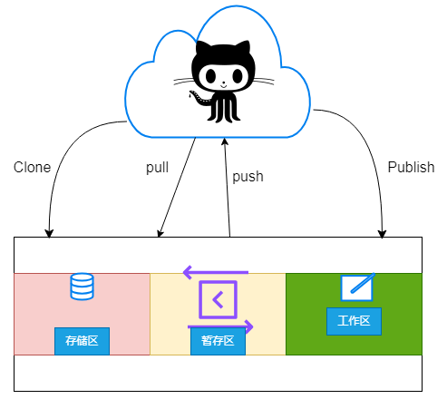

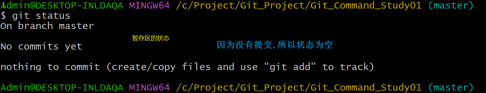

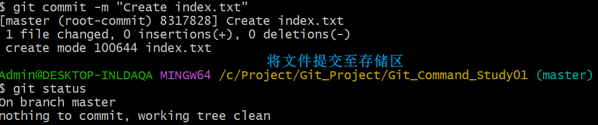

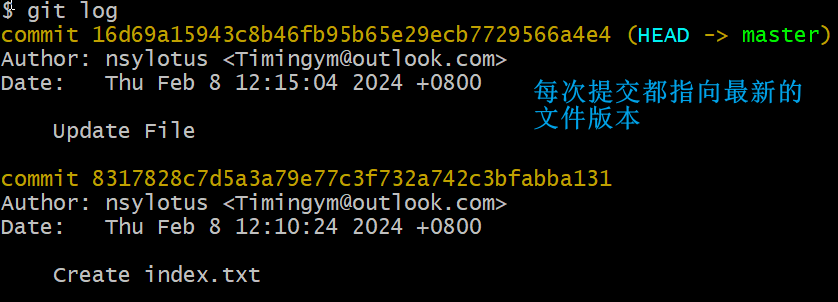

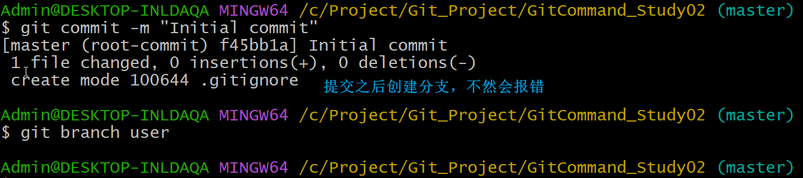

## 分支管理

```bash
git branch 分支名称 # 创建分支
git branch -v # 查看不同的分支
git branch -m 旧分支名称 新分支名称 # 修改分支名称
git checkout 分支名 # 切换分支
git checkout -b 分支名 # 创建并切换分支
git merge 分支名 # 合并分支
```

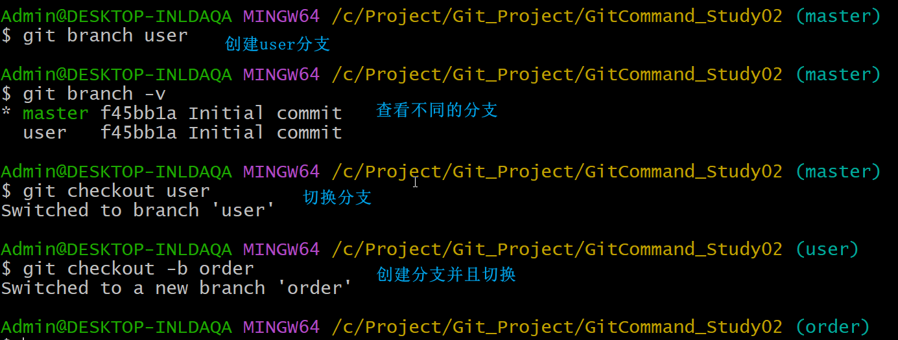

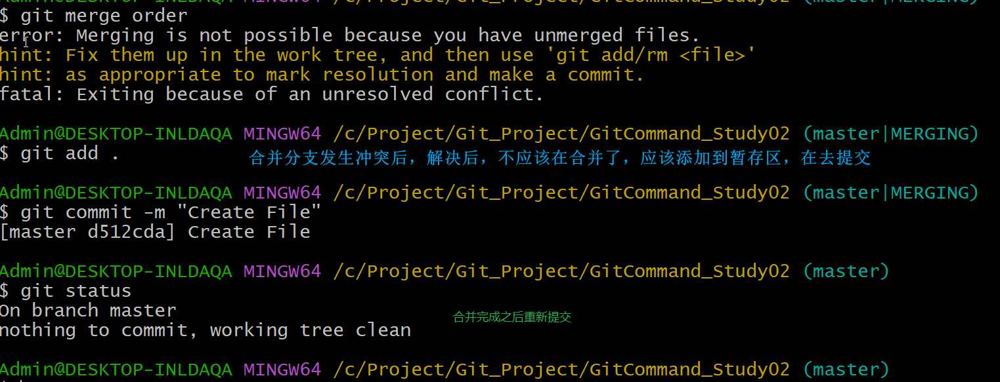

## 代码提交

```bash
ssh-keygen -t rsa -C 标记符(一般用邮箱代替) # 生成ssh_key
ssh-keygen -t rsa -C 标记符(一般用邮箱代替) -f 文件保存路径 # 生成ssh_key
git remote -v # 查看当前所有远程地址别名
git remote add 别名[一般是origin] 远程地址 # 给远程地址取别名
git push -u 别名[一般是origin] github对应的分支 # 推送
git pull 远程仓库地址别名 远程分支别名 # 将远程仓库对于分支最新内容拉下来后与当前本地分支直接合并
```

## 恢复误删除文件

```bash
git restore 文件名 # 恢复文件，这种只限于没有将删除操作提交至存储区时使用
```

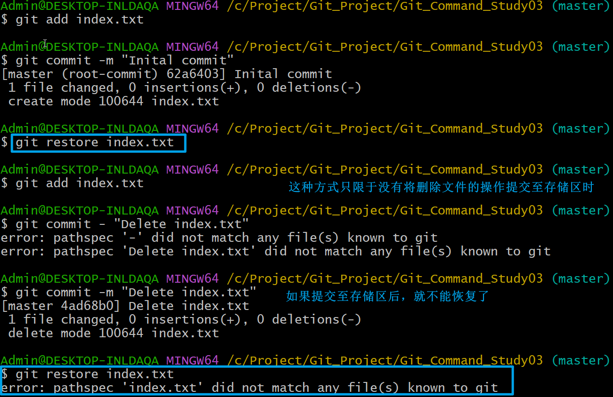

```bash
git reset --hard 删除前一次提交的版本号 # 这种恢复方式会导致丢失后面的版本
```

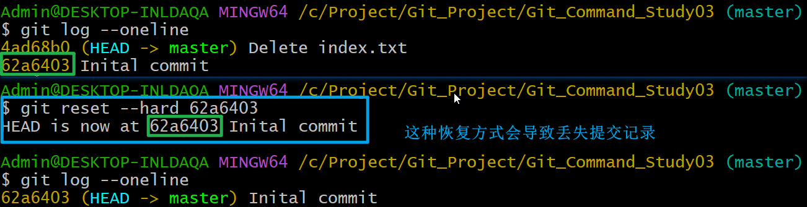

```bash
git revert 删除提交最新的版本号 # 这种方式会创建一个新的版本
```

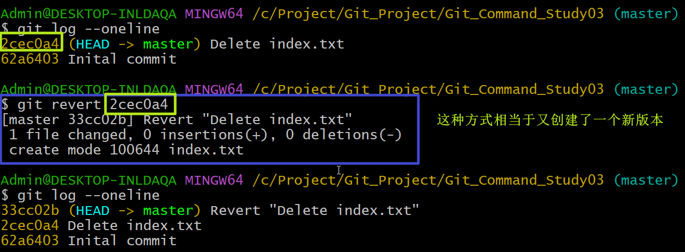

## 创建标签

```bash
git tag # 查看标签
git tag 标签名 版本号 # 创建标签
git tag -d 标签名 # 删除标签
git checkout -b 标签名 # 根据标签名创建分支
```

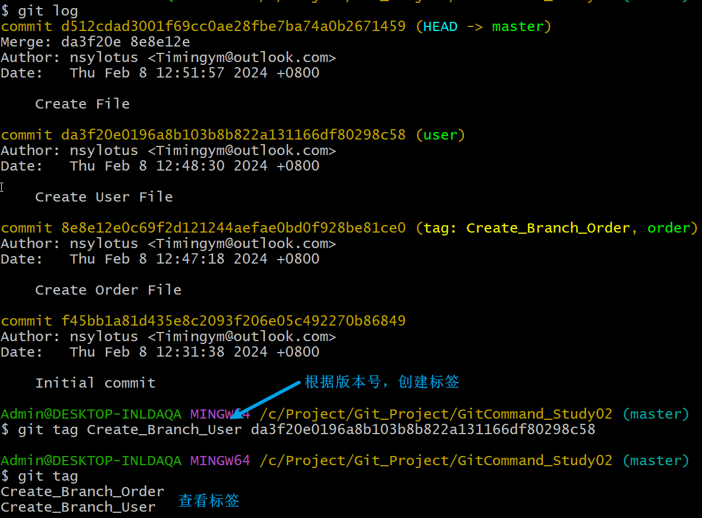

