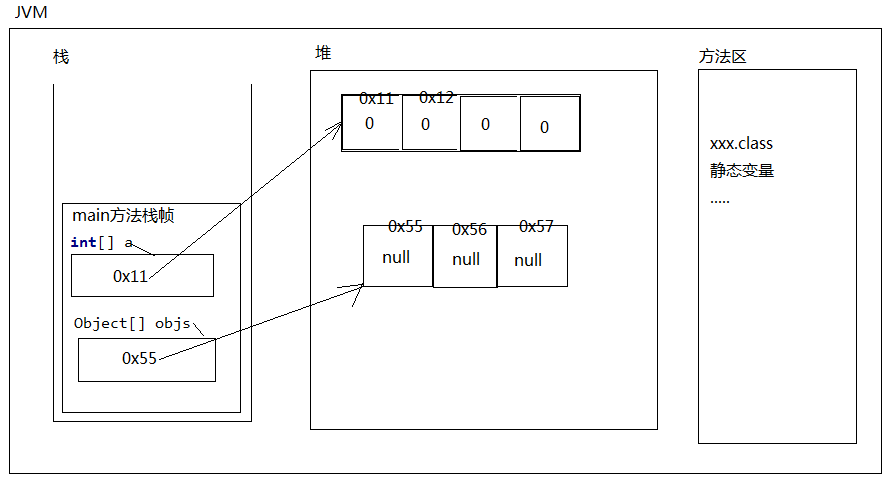
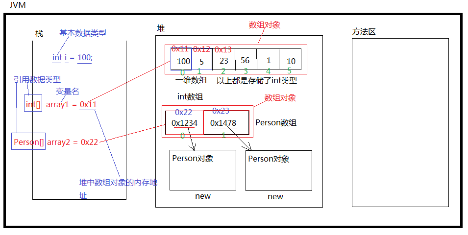

### 数组

1. Java语言中的数组是一种引用数据类型。不属于基本数据类型。数组的父类是Object。

2. 数组实际上是一个容器，可以同时容纳多个元素。（数组是一个数据的集合。）

3. 数组：字面意思是“一组数据”

4. 数组当中可以存储“基本数据类型”的数据，也可以存储“引用数据类型”的数据。

5. 数组因为是引用类型，所以数组对象是堆内存当中。（数组是存储在堆当中的）

6. 数组当中如果存储的是“java对象”的话，实际上存储的是对象的“引用（内存地址）”，数组中不能直接存储java对象。

7. 数组一旦创建，在java中规定，长度不可变。（数组长度不可变）

8. 数组的分类：一维数组、二维数组、三维数组、多维数组...（一维数组较多，二维数组偶尔使用！）

9. 所有的数组对象都有length属性(java自带的)，用来获取数组中元素的个数。

10. java中的数组要求数组中元素的类型统一。比如int类型数组只能存储int类型，引用类型数组只能存储引用类型。

11. 数组在内存方面存储的时候，数组中的元素内存地址(存储的每一个元素都是有规则的挨着排列的)是连续的。内存地址连续。这是数组存储元素的特点（特色）。数组实际上是一种简单的数据结构。

12. 所有的数组都是拿数组的第一个元素作为整个数组对象的内存地址。（数组中首元素的内存地址作为整个数组对象的内存地址。）

13. 数组中每一个元素都是有下标的，下标从0开始，以1递增。最后一个元素的下标是：length-1，下标非常重要，因为我们对数组中元素进行“存取”的时候，都需要通过下标来进行。

14. 数组这种数据结构的优点和缺点是什么？
    	优点：查询/查找/检索某个下标上的元素时效率极高。可以说是查询效率最高的一个数据结构。
    	为什么检索效率高？
    		第一：每一个元素的内存地址在空间存储上是连续的。
    		第二：每一个元素类型相同，所以占用空间大小一样。
    		第三：知道第一个元素内存地址，知道每一个元素占用空间的大小，又知道下标，所以通过一个数学表达式就可以计算出某个下标上元素的内存地址。直接通过内存地址定位元素，所以数组的检索效率是最高的。数组中存储100个元素，或者存储100万个元素，在元素查询/检索方面，效率是相同的，因为数组中元素查找的时候不会一个一个找，是通过数学表达式计算出来的。（算出一个内存地址，直接定位的。）
    	缺点：
    		第一：由于为了保证数组中每个元素的内存地址连续，所以在数组上随机删除或者增加元素的时候，效率较低，因为随机增删元素会涉及到后面元素统一向前或者向后位移的操作。
    		第二：数组不能存储大数据量，为什么？
    			因为很难在内存空间上找到一块特别大的连续的内存空间。
    	注意：对于数组中最后一个元素的增删，是没有效率影响的。

15. 怎么声明/定义一个一维数组？
    	语法格式：

    ```java
    int[] array1;//数据类型[] 数组名字;
    ```

16. 怎么初始化一个一维数组呢？
    	包括两种方式：静态初始化一维数组，动态初始化一维数组。
    		静态初始化语法格式：		

    ```java
    int[] array = {100, 2100, 300, 55};
    ```

    ​		动态初始化语法格式：		

    ```java
    int[] array = new int[5]; // 这里的5表示数组的元素个数。初始化一个5个长度的int类型数组，每个元素默认值0
    String[] names = new String[6]; // 初始化6个长度的String类型数组，每个元素默认值null。
    ```

17. 什么时候采用静态初始化方式，什么时候使用动态初始化方式呢？
        当你创建数组的时候，确定数组中存储哪些具体的元素时，采用静态初始化方式。
        当你创建数组的时候，不确定将来数组中存储哪些数据，你可以采用动态初始化的方式，预先分配内存空间。





.png)

#### 代码实例

```java
public class SuperStudy {
    // main方法的编写方式，还可以采用C++的语法格式哦！
    public static void main(String[] args) {
        // 声明一个int类型的数组，使用静态初始化的方式
        int[] array1 = {521,520,1314,999};
        // 这是C++风格，不建议java中使用。
        int array2[] = {1314,9999};
        // 所有的数组对象都有length属性
        System.out.println("数组中元素的个数" + array1.length);// 数组中元素的个数4
        // System.out.println(array1[6]); //ArrayIndexOutOfBoundsException（比较著名的异常。数组越界异常）
        Object[] objs = new Object[3];
        int[] array3 = new int[3];
        // 给动态初始化的数组赋值
        for (int i = 0; i < array3.length; i++) {
            array3[i]=i;
        }
        // 循环遍历数组的每一个元素
        for (int i = 0; i < array3.length; i++) {
            System.out.println(array3[i]);
        }
        System.out.println("Object[] objs中有"+objs.length+"个元素");// Object[] objs中有3个元素
        // 由于动态初始化没有赋初值,所以为null
        for (int i = 0; i < objs.length; i++) {
            System.out.println(objs[i]);
        }
        printArray(array2);
        // 与匿名内部类的语法相同,这种适用于动态初始化但是没有赋初值的数组。没有名字
        printArray(new int[]{1,2,3,4});
        // printArray({1,2,3});这种事不正确的
    }
    public static void printArray(int[] array){
        for (int i = 0; i < array.length; i++) {
            System.out.println("数组每一个元素分别是"+array[i]);
        }
    }
}
```

#### main方法中的String[] args

是用来接受用户输入的数据的数组。

##### 代码实例

```java
/*
1、main方法上面的“String[] args”有什么用？
    分析一下：谁负责调用main方法（JVM）
    JVM调用main方法的时候，会自动传一个String数组过来。
 */
public class SuperStudy {
    // 这个方法程序员负责写出来，JVM负责调用。JVM调用的时候一定会传一个String数组过来。
    // 例如:java SuperStudy abc def xyz
    // 那么这个时候JVM会自动将“abc def xyz”通过空格的方式进行分离，分离完成之后，自动放到“String[] args”数组当中。
    // 所以main方法上面的String[] args数组主要是用来接收用户输入参数的。
    // 把abc def xyz 转换成字符串数组：{"abc","def","xyz"}。
    public static void main(String[] args) {
        // JVM默认传递过来的这个数组对象的长度？默认0
        // 通过测试得出：args不是null。
        System.out.println(args);// [Ljava.lang.String;@119d7047数组对象
        System.out.println(args.length);// 0
        // 以下这2行代码表示的含义：数组对象创建了，但是数组中没有任何数据。
        String[] str1 = {};// 静态初始化数组，里面没东西。
        String[] str2 = new String[0];
        System.out.println(str2.length);// 0
        System.out.println(str1.length);// 0
        for (int i = 0; i < args.length; i++) {
            System.out.println("用户输入的数据是:"+args[i]);
        }
        // 判断两个字符串是否相等，需要使用equals方法。
        // if(username.equals("admin") && password.equals("123")){
        // 这样编写是不是可以避免空指针异常。
        // 采用以下编码风格，及时args[0]和args[1]都是null，也不会出现空指针异常。
        if("admin".equals(args[0]) && "123456".equals(args[1])){
            System.out.println("登录成功，欢迎[" + args[0] + "]回来");
        }
    }
}
```

#### 一维数组的深入

数组中存储的类型为：引用数据类型

对于数组来说，实际上只能存储java对象的“内存地址”。数组中存储的每个元素是“引用”。

```java
public class SuperStudy {
    public static void main(String[] args) {
        // 创建一个Animal类型的数组
        Animal animal1 = new Animal();
        Animal animal2 = new Animal();
        Animal[] animals = {animal1, animal2};
        for (int i = 0; i < animals.length; i++) {
            /*
            Animal animal = animals[i];
            animal.move();
             */
            // 代码合并
            animals[i].move();
        }
        // 创建一个Animal类型的数组，数组当中存储Cat和Bird
        Animal[] animals3 = {new Cat(), new Bird()};
        for (int i = 0; i < animals3.length; i++) {
            // 这个取出来的可能是Cat，也可能是Bird，不过肯定是一个Animal
            // 如果调用的方法是父类中存在的方法不需要向下转型。直接使用父类型引用调用即可。
            animals3[i].move();
            // 调用子对象特有方法的话，需要向下转型！！！
            if(animals3[i] instanceof Cat){
                Cat cat = (Cat)animals3[i];
                cat.catchMouse();
            }else if(animals3[i] instanceof Bird){
                Bird bird = (Bird) animals3[i];
                bird.sing();
            }
        }
    }
}
class Animal{
    public void move(){
        System.out.println("Animal move...");
    }
}
class Cat extends Animal{
    public void move(){
        System.out.println("Cat在走");
    }
    public void  catchMouse(){
        System.out.println("Cat catch Mouse");
    }
}
class Bird extends Animal{
    public void move(){
        System.out.println("Bird Fly!!!");
    }
    public void sing(){
        System.out.println("鸟儿在唱歌");
    }
}
```

