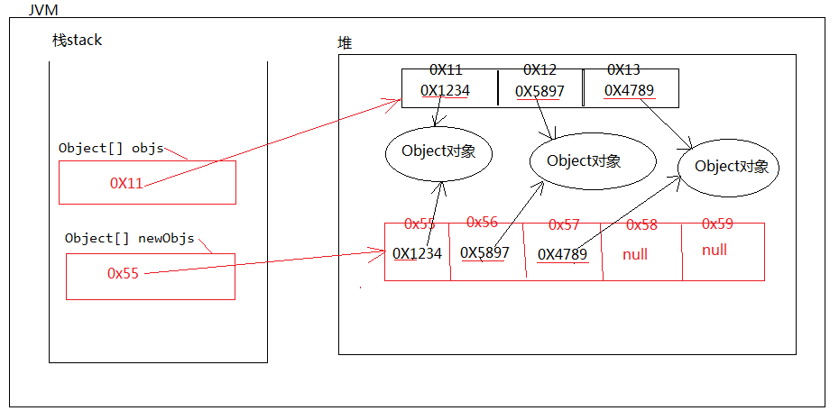

### Java数组的拷贝

1. 在java开发中，数组长度一旦确定不可变，那么数组满了怎么办？
   	数组满了，需要扩容。
2. java中对数组的扩容是：
   	先新建一个大容量的数组，然后将小容量数组中的数据一个一个拷贝到大数组当中。
3. 结论：
   	数组扩容效率较低。因为涉及到拷贝的问题。所以在以后的开发中请注意：尽可能少的进行数组的拷贝。
   	可以在创建数组对象的时候预估计以下多长合适，最好预估准确，这样可以减少数组的扩容次数。提高效率。
4. 拷贝引用的时候拷贝的是内存的地址。


#### 代码示例

```java
public class Test {
    public static void main(String[] args) {
        // 拷贝源（从这个数组中拷贝）
        int[] src = {1314,100};
        // 拷贝目标（拷贝到这个目标数组上）
        int[] newSrc = new int[3];
        //System.arraycopy(拷贝源,拷贝源下标,目标数组,目标数组拷贝的下标,拷贝的长度);
        System.arraycopy(src,0,newSrc,1,src.length-1);
        copyPrint(newSrc);
    }
    public static void copyPrint(int[] newSrc){
        for (int i = 0; i < newSrc.length; i++) {
            System.out.println(newSrc[i]);
        }
    }
}
```


