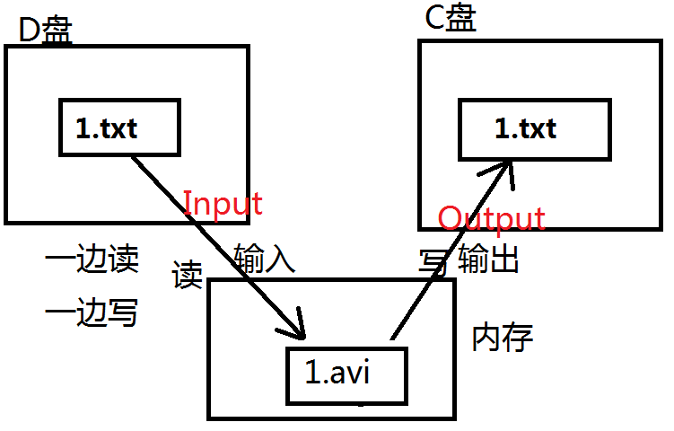

### FileOutputStream

文件字节输出流，负责写。从内存到硬盘。

```java
import java.io.*;

public class Test {
    public static void main(String[] args) {
        FileOutputStream fos = null;
        try {
            // myfile文件不存在的时候会自动新建！
            // 这种方式谨慎使用，这种方式会先将原文件清空，然后重新写入。
            // fos = new FileOutputStream("D:/myfile.txt");
            // 以追加的方式在文件末尾写入。不会清空原文件内容。
            fos = new FileOutputStream("D:/myfile.txt",true);
            // 开始写。
            byte[] bytes = {97, 98, 99};
            // 将byte数组全部写出！
            fos.write(bytes);
            // 将byte数组的一部分写出！
            fos.write(bytes, 0, 2);
            // 字符串
            String s = "我是中国人";
            // 将字符串转换成byte数组。
            byte[] bs = s.getBytes();
            // 写
            fos.write(bs);
            // 写完之后，最后一定要刷新
            fos.flush();
        } catch (FileNotFoundException e) {
            e.printStackTrace();
        } catch (IOException e) {
            e.printStackTrace();
        } finally {

        }
    }
}
```

#### 文件的的拷贝

使用FileInputStream + FileOutputStream完成文件的拷贝。拷贝的过程应该是一边读，一边写。使用以上的字节流拷贝文件的时候，文件类型随意，万能的。什么样的文件都能拷贝。



```java
import java.io.*;

public class Test {
    public static void main(String[] args) {
        FileInputStream fis = null;
        FileOutputStream fos = null;
        try {
            // 创建一个输入流对象
            fis = new FileInputStream("D:/myfile.txt");
            // 创建一个输出流对象
            fos = new FileOutputStream("D:/Test.txt");
            // 最核心的：一边读，一边写
            byte[] bytes = new byte[1*1024]; // 1KB（一次最多拷贝1KB。）
            int readCount = 0;
            while ((readCount = fis.read(bytes)) != -1){
                fos.write(bytes,0,readCount);
            }
            // 刷新，输出流最后要刷新
            fos.flush();
        } catch (FileNotFoundException e) {
            e.printStackTrace();
        } catch (IOException e) {
            e.printStackTrace();
        } finally {
            if (fis != null) {
                try {
                    fis.close();
                } catch (IOException e) {
                    e.printStackTrace();
                }
            }
            if (fos != null) {
                try {
                    fos.close();
                } catch (IOException e) {
                    e.printStackTrace();
                }
            }
        }
    }
}
```

