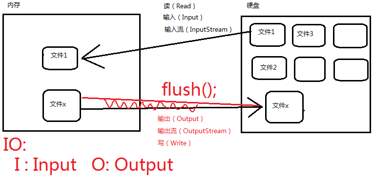

### IO流概述



1. IO流，什么是IO？

   1. I : Input，O : Output。通过IO可以完成硬盘文件的读和写。

2. IO流的分类？

   1. 一种方式是按照流的方向进行分类：

      以内存作为参照物，往内存中去，叫做输入(Input)。或者叫做读(Read)。从内存中出来，叫做输出(Output)。或者叫做写(Write)。

   2. 另一种方式是按照读取数据方式不同进行分类：

      1. 有的流是按照字节的方式读取数据，一次读取1个字节byte，等同于一次读取8个二进制位。这种流是万能的，什么类型的文件都可以读取。包括：文本文件，图片，声音文件，视频文件等....
      2. 有的流是按照字符的方式读取数据的，一次读取一个字符，这种流是为了方便读取普通文本文件而存在的，这种流不能读取：图片、声音、视频等文件。只能读取纯文本文件，连word文件都无法读取。

3. 字母在windows系统中占用1个字节。汉字在Windows系统中占用2个字节。Java中char在2个字节。java采用unicode，2个字节（16位）来表示一个字符。

4. 流的分类：输入流、输出流，字节流、字符流

   1. 注意：在java中只要“类名”以Stream结尾的都是字节流。以“Reader/Writer”结尾的都是字符流。

5. java中所有的流都是在：java.io.*;下。

6. java IO流的四大家族：

   1. 四大家族的首领：四大家族的首领都是抽象类。(abstract class)

      ```java
      java.io.InputStream // 字节输入流
      java.io.OutputStream // 字节输出流
          
      java.io.Reader // 字符输入流
      java.io.Writer // 字符输出流
      ```

   2. 所有的流都实现了：

      1. java.io.Closeable接口，都是可关闭的，都有close()方法。流毕竟是一个管道，这个是内存和硬盘之间的通道，用完之后一定要关闭，不然会耗费(占用)很多资源。养成好习惯，**用完流一定要关闭**。

   3. 所有的输出流都实现了：

      1. java.io.Flushable接口，都是可刷新的，都有flush()方法。养成一个好习惯，输出流在最终输出之后，一定要记得flush()，刷新一下。这个刷新表示将通道/管道当中剩余未输出的数据强行输出完（清空管道！）刷新的作用就是清空管道。注意：**如果没有flush()可能会导致丢失数据。**

7. java.io包下主要的流有16个，6大类：

   1. 文件专属：

      ```java
      java.io.FileInputStream(*)
      java.io.FileOutputStream(*)
      java.io.FileReader
      java.io.FileWriter
      ```

   2. 转换流：（将字节流转换成字符流）

      ```java
      java.io.InputStreamReader
      java.io.OutputStreamWriter
      ```

   3. 缓冲流专属：

      ```java
      java.io.BufferedReader
      java.io.BufferedWriter
      java.io.BufferedInputStream
      java.io.BufferedOutputStream
      ```

   4. 数据流专属：

      ```java
      java.io.DataInputStream
      java.io.DataOutputStream
      ```

   5. 标准输出流：

      ```java
      java.io.PrintWriter
      java.io.PrintStream(*)
      ```

   6. 对象专属流：

      ```java
      java.io.ObjectInputStream(*)
      java.io.ObjectOutputStream(*)
      ```

8. 参与序列化的类型必须实现java.io.Serializable接口。并且建议将序列化版本号手动的写出来。

   ```java
   private static final long serialVersionUID = 100L;
   ```

9. IO + Properties联合使用。

   1. O流：文件的读和写。
   2. Properties:是一个Map集合，key和value都是String类型。
