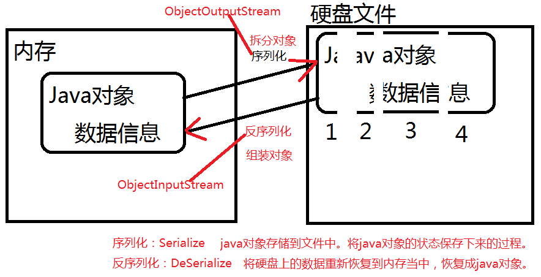

### 序列化与反序列化



1. Java的接口分为标志接口和普通接口。Serializable接口就是一个标志接口。

2. 把对象转换为字节序列的过程称为对象的序列化。

3. 把字节序列恢复为对象的过程称为对象的反序列化。

4. 对象序列化的作用：

   1. 把对象的字节序列永久地保存到硬盘上，通常存放在一个文件中；
   2. 在网络上传送对象的字节序列。

5. 序列化过程中出现java.io.NotSerializableException;异常，则说明，该类不支持序列化，该类需要实现Serializable接口，这样该类的对象才支持序列化！！！

6. 参与序列化和反序列化的对象，必须实现Serializable接口。

7. 注意：通过源代码发现，Serializable接口只是一个标志接口：

   1. ```java
      public interface Serializable {} // 这个接口当中什么代码都没有。
      ```

   2. 那么它起到一个什么作用呢？

      1. 起到标识的作用，标志的作用，java虚拟机看到这个类实现了这个接口，可能会对这个类进行特殊待遇。Serializable这个标志接口是给java虚拟机参考的，java虚拟机看到这个接口之后，会为该类自动生成一个序列化版本号。

8. 序列化版本号的作用？用来区分类的。

9. java语言中是采用什么机制来区分类的？

   1. 第一：首先通过类名进行比对，如果类名不一样，肯定不是同一个类。
   2. 第二：如果类名一样，再怎么进行类的区别？靠序列化版本号进行区分。
   3. 不同的人编写了同一个类，但“这两个类确实不是同一个类”。这个时候序列化版本就起上作用了。对于java虚拟机来说，java虚拟机是可以区分开这两个类的，因为这两个类都实现了Serializable接口，都有默认的序列化版本号，他们的序列化版本号不一样。所以区分开了。（这是自动生成序列化版本号的好处）

10. 自动生成序列化版本号的缺陷？

   1. 这种自动生成的序列化版本号缺点是：

      一旦代码确定之后，不能进行后续的修改，因为只要修改，必然会重新编译，此时会生成全新的序列化版本号，这个时候java虚拟机会认为这是一个全新的类。（这样就不好了！）所以我们要自己指定序列化版本号。

11. 凡是一个类实现了Serializable接口，建议给该类提供一个固定不变的序列化版本号。这样，以后这个类即使代码修改了，但是版本号不变，java虚拟机会认为是同一个类。

12. 一次序列化多个对象呢？可以，可以将对象放到集合当中，序列化集合。

13. 提示：参与序列化的ArrayList集合以及集合中的元素User都需要实现 java.io.Serializable接口。

14. 序列化必须在同一个包下，切必须有序列化版本号。

15. 在变量前面加上transient关键字表示游离的，不参与序列化。该变量不参与序列化操作！

##### 代码示例

###### 序列化代码

```java
import java.io.*;
import java.util.*;

public class Test {
    public static void main(String[] args) throws Exception {
        List<Student> list = new ArrayList<>();
        // 序列化流
        ObjectOutputStream oos = new ObjectOutputStream(new FileOutputStream("D:/Test"));
        // 创建java对象
        Student student1 = new Student(18,"张三");
        Student student2 = new Student(21,"李四");
        // 使用list集合序列化多个对象
        list.add(new Student(20,"王五"));
        list.add(new Student(16,"赵六"));
        // 序列化单一对象
        // oos.writeObject(student1);
        // oos.writeObject(student2);
        // 序列化一个集合，这个集合对象中放了很多其他对象。
        oos.writeObject(list);
        // 刷新
        oos.flush();
        // 关闭
        oos.close();
    }
}
// 不实现这个接口抛出java.io.NotSerializableException异常
class Student implements Serializable{
    // Java虚拟机看到Serializable接口之后，会自动生成一个序列化版本号。
    // 这里没有手动写出来，java虚拟机会默认提供这个序列化版本号。
    // 建议将序列化版本号手动的写出来。不建议自动生成
    private int age;
    private String name;
    public Student(int age, String name) {
        this.age = age;
        this.name = name;
    }
    @Override
    public String toString() {
        return "Student{" +"age=" + age + ", name='" + name + '\'' + '}';
    }
}
```

###### 反序列化

```java
import java.io.*;
import java.util.*;

public class Study {
    public static void main(String[] args) throws Exception{
        ObjectInputStream ois = new ObjectInputStream(new FileInputStream("D:\\Test"));
        // 反序列化集合
        // Object obj = ois.readObject();
        // System.out.println(obj instanceof Student); // true
        List<Student> lists = (List<Student>) ois.readObject();
        for (Student student : lists){
            System.out.println(student);
        }
        // 反序列化单一对象。
        /*for (int i = 0; i <= 2 ; i++){
            Object obj = ois.readObject();
            System.out.println(obj);
        }*/
        ois.close();
    }
}

```

#### 序列化版本号

1. 修改类的代码，在代码执行的时候不需要修改调用者的代码。
2. serialVersionUID的作用
   1. serialVersionUID: 字面意思上是序列化的版本号，凡是实现Serializable接口的类都有一个表示序列化版本标识符的静态变量
   2. 增强类的兼容性

```java
private static final long serialVersionUID
```

###### 序列化

```java
import java.io.*;
import java.util.*;

public class Test {
    public static void main(String[] args) throws Exception {
        List<Student> list = new ArrayList<>();
        // 序列化流
        ObjectOutputStream oos = new ObjectOutputStream(new FileOutputStream("D:/Test"));
        // 创建java对象
        Student student1 = new Student(18,"张三");
        Student student2 = new Student(21,"李四");
        // 使用list集合序列化多个对象
        list.add(new Student(20,"王五"));
        list.add(new Student(16,"赵六"));
        // 序列化单一对象
        // oos.writeObject(student1);
        // oos.writeObject(student2);
        // 序列化一个集合，这个集合对象中放了很多其他对象。
        oos.writeObject(list);
        // 刷新
        oos.flush();
        // 关闭
        oos.close();
    }
}
// 不实现这个接口抛出java.io.NotSerializableException异常
class Student implements Serializable{
    // Java虚拟机看到Serializable接口之后，会自动生成一个序列化版本号。
    // 这里没有手动写出来，java虚拟机会默认提供这个序列化版本号。
    // 建议将序列化版本号手动的写出来。不建议自动生成
    private static final long serialVersionUID = 100L; // java虚拟机识别一个类的时候先通过类名，如果类名一致，再通过序列化版本号。
    private transient int age;
    // private transient String name; // transient关键字表示游离的，不参与序列化。name不参与序列化操作！

    // 过了很久，Student这个类源代码改动了。
    // 源代码改动之后，需要重新编译，编译之后生成了全新的字节码文件。
    // 并且class文件再次运行的时候，java虚拟机生成的序列化版本号也会发生相应的改变。
    public Student(int age, String name) {
        this.age = age;
        //this.name = name;
    }
    /*@Override
    public String toString() {
        return "Student{" +"age=" + age + ", name='" + name + '\'' + '}';
    }*/

    @Override
    public String toString() {
        return "Student{" + "age=" + age + '}';
    }
}
```

###### 反序列化

```java
import java.io.*;
import java.util.*;

public class Study {
    public static void main(String[] args) throws Exception{
        ObjectInputStream ois = new ObjectInputStream(new FileInputStream("D:\\Test"));
        // 反序列化集合
        // Object obj = ois.readObject();
        // System.out.println(obj instanceof Student); // true
        List<Student> lists = (List<Student>) ois.readObject();
        for (Student student : lists){
            System.out.println(student);
        }
        // 反序列化单一对象。
        /*for (int i = 0; i <= 2 ; i++){
            Object obj = ois.readObject();
            System.out.println(obj);
        }*/
        ois.close();
    }
}
```
