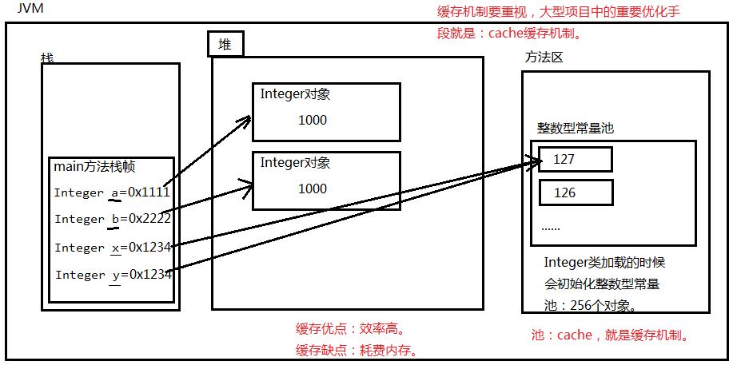
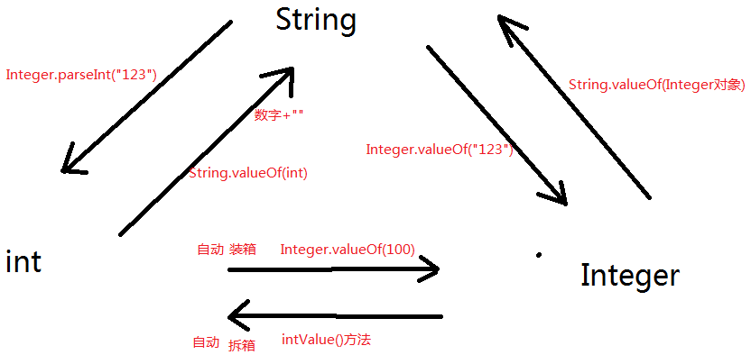

### Integer包装类

java中为8种基本数据类型又对应准备了8种包装类型。8种包装类属于引用数据类型，父类是Object。

为什么要再提供8种包装类呢？因为8种基本数据类型不够用。

##### 代码示例

```java
public class Test {
    public static void main(String[] args) {
        // 调用doSome()方法的时候需要传一个数字进去。
        // 但是数字属于基本数据类型，而doSome()方法参数的类型是Object。
        // 可见doSome()方法无法接收基本数据类型的数字。那怎么办呢?可以传一个数字对应的包装类进去。

        // 把100这个数字经过构造方法包装成对象。
        MyInt myInt = new MyInt(100);
        // doSome()方法虽然不能直接传100，但是可以传一个100对应的包装类型。
        Test.doSome(myInt);
    }
    public static void doSome(Object obj){
        System.out.println(obj.toString());
    }
}
// 自己写的包装类
class MyInt{
    int value;
    public MyInt(){}
    public MyInt(int value){
        this.value = value;
    }
    public String toString() {
        return String.valueOf(value);
    }
}
```

8种基本数据类型对应的包装类型名是什么？

| 基本数据类型 |             包装类型              |
| :----------: | :-------------------------------: |
|     byte     |   java.lang.Byte（父类Number）    |
|    short     |   java.lang.Short（父类Number）   |
|     int      |  java.lang.Integer（父类Number）  |
|     long     |   java.lang.Long（父类Number）    |
|    float     |   java.lang.Float（父类Number）   |
|    double    |  java.lang.Double（父类Number）   |
|   boolean    |  java.lang.Boolean（父类Object）  |
|     char     | java.lang.Character（父类Object） |

八种包装类中其中6个都是数字对应的包装类，他们的父类都是Number。

1. Number是一个抽象类，无法实例化对象。

2. Number类中有这样的方法：

   ```java
   byte byteValue() // 以 byte 形式返回指定的数值。
   abstract  double doubleValue()// 以 double 形式返回指定的数值。
   abstract  float floatValue()// 以 float 形式返回指定的数值。
   abstract  int intValue()// 以 int 形式返回指定的数值。
   abstract  long longValue()// 以 long 形式返回指定的数值。
   short shortValue()// 以 short 形式返回指定的数值。
   ```

3. 这些方法其实所有的数字包装类的子类都有，这些方法是负责拆箱的。


##### 装箱与拆箱

基本数据类型 -(转换为)->引用数据类型（装箱）

将引用数据类型--(转换为)-> 基本数据类型（拆箱）

```java
public class Test {
    public static void main(String[] args) {
        // 100这个基本数据类型，进行构造方法的包装达到了：基本数据类型向引用数据类型的转换。
        // 基本数据类型 -(转换为)->引用数据类型（装箱）
        Integer integer = new Integer(100);
        // 将引用数据类型--(转换为)-> 基本数据类型（拆箱）
        float floatNum = integer.floatValue();
        System.out.println(floatNum);// 100.0
    }
}
```

##### 关于Integer类的构造方法

有两个：

```java
Integer(int)
Integer(String)
```

###### 代码示例

```java
public class Test {
    public static void main(String[] args) {
        // 将数字100转换成Integer包装类型（int --> Integer）
        Integer x = new Integer(100);
        System.out.println(x);

        // 将String类型的数字，转换成Integer包装类型。（String --> Integer）
        Integer y = new Integer("123");
        System.out.println(y);
    }
}
```

##### 自动装箱和自动拆箱

自动装箱：基本数据类型自动转换成包装类。

自动拆箱：包装类自动转换成基本数据类型。

有了自动拆箱之后，Number类中的方法就用不着了！

自动装箱和自动拆箱的好处？方便编程。

```java
public class Test {
    public static void main(String[] args) {
        // 999是基本数据类型
        // x是包装类型
        // 基本数据类型 --(自动转换)--> 包装类型：自动装箱
        Integer x = 999;
        System.out.println(x);// 999
        // x是包装类型
        // y是基本数据类型
        // 包装类型 --(自动转换)--> 基本数据类型：自动拆箱
        int y = x;
        System.out.println(y);// 999

        // z是一个引用，z是一个变量，z还是保存了一个对象的内存地址。
        Integer z = 1000; // 等同于：Integer z = new Integer(1000);
        // 分析为什么这个没有报错呢？
        // +两边要求是基本数据类型的数字，z是包装类，不属于基本数据类型，这里会进行自动拆箱。将z转换成基本数据类型
        System.out.println(z + 1);// 1001
        Integer d = 1000;
        System.out.println(z == d);// false

        Integer a = 1000; // Integer a = new Integer(1000); a是个引用，保存内存地址指向对象。
        Integer b = 1000; // Integer b = new Integer(1000); b是个引用，保存内存地址指向对象。
        // == 比较的是对象的内存地址，a和b两个引用中保存的对象内存地址不同。
        // == 这个运算符不会触发自动拆箱机制。（只有+ - * /等运算的时候才会。）
        System.out.println(a == b); //false
    }
}
```

##### 通过访问包装类的常量，来获取最大值和最小值

```java
public class Test {
    public static void main(String[] args) {
        System.out.println("int的最大值：" + Integer.MAX_VALUE);// int的最大值：2147483647
        System.out.println("int的最小值：" + Integer.MIN_VALUE);// int的最小值：-2147483648
        System.out.println("byte的最大值：" + Byte.MAX_VALUE);// byte的最大值：127
        System.out.println("byte的最小值：" + Byte.MIN_VALUE);// byte的最小值：-128
    }
}
```

##### 整数型常量池

java中为了提高程序的执行效率，将[-128到127]之间所有的包装对象提前创建好，放到了一个方法区的“整数型常量池”当中了，目的是只要用这个区间的数据不需要再new了，直接从整数型常量池当中取出来。

整数型常量池：就是缓存机制。

```java
public class Test {
    public static void main(String[] args) {
        Integer a = 128;
        Integer b = 128;
        System.out.println(a == b); //false
        // 原理：x变量中保存的对象的内存地址和y变量中保存的对象的内存地址是一样的。
        Integer x = 127;
        Integer y = 127;
        // == 永远判断的都是两个对象的内存地址是否相同。
        System.out.println(x == y); //true
    }
}
```



##### Integer类当中有哪些常用的方法

```java
public class Test {
    public static void main(String[] args) {
        // static int parseInt(String s)
        // 静态方法，传参String，返回int
        int retValue = Integer.parseInt("123"); // String -转换-> int
        //int retValue = Integer.parseInt("中文"); // NumberFormatException
        System.out.println(retValue + 100);// 223

        // static String toBinaryString(int i)
        // 静态的：将十进制转换成二进制字符串。
        String binaryString = Integer.toBinaryString(3);
        System.out.println(binaryString); //"11" 二进制字符串

        // static String toHexString(int i)
        // 静态的：将十进制转换成十六进制字符串。
        String hexString = Integer.toHexString(16);
        System.out.println(hexString); // "10"

        // static String toOctalString(int i)
        // 静态的：将十进制转换成八进制字符串。
        String octalString = Integer.toOctalString(8);
        System.out.println(octalString); // "10"

        //static Integer valueOf(int i)
        // 静态的：int-->Integer
        Integer i1 = Integer.valueOf(100);
        System.out.println(i1);

        // static Integer valueOf(String s)
        // 静态的：String-->Integer
        Integer i2 = Integer.valueOf("100");
        System.out.println(i2);
    }
}
```

##### Integer类的异常

```java
空指针异常：NullPointerException
类型转换异常：ClassCastException
数组下标越界异常：ArrayIndexOutOfBoundsException
数字格式化异常：NumberFormatException
```

```java
public class Test {
    public static void main(String[] args) {
        // 手动装箱
        Integer x = new Integer(1000);
        // 手动拆箱。
        int y = x.intValue();
        System.out.println(y);
        Integer a = new Integer("123");

        // 不是一个“数字”可以包装成Integer吗？不能。运行时出现异常。
        // 编译的时候没问题，一切符合java语法，运行时会不会出问题呢？
        // java.lang.NumberFormatException异常
        // Integer a = new Integer("中文");
    }
}
```

##### String int Integer之间互相转换

```java
public class Test {
    public static void main(String[] args) {
        // String --> int
        int i1 = Integer.parseInt("100"); // i1是100数字
        System.out.println(i1 + 1); // 101

        // int --> String
        String s2 = i1 + ""; // "100"字符串
        System.out.println(s2 + 1); // "1001"

        // int --> Integer
        // 自动装箱
        Integer x = 1000;

        // Integer --> int
        // 自动拆箱
        int y = x;

        // String --> Integer
        Integer k = Integer.valueOf("123");

        // Integer --> String
        String e = String.valueOf(k);
    }
}
```



