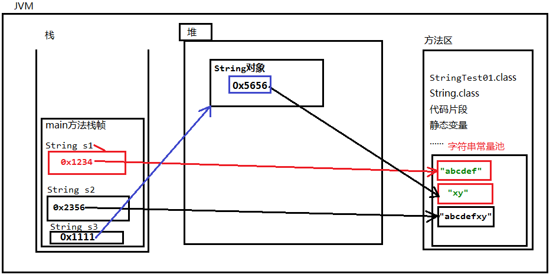
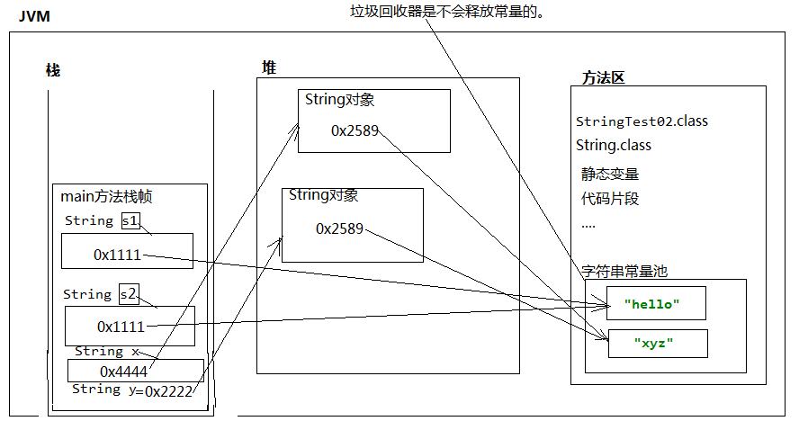
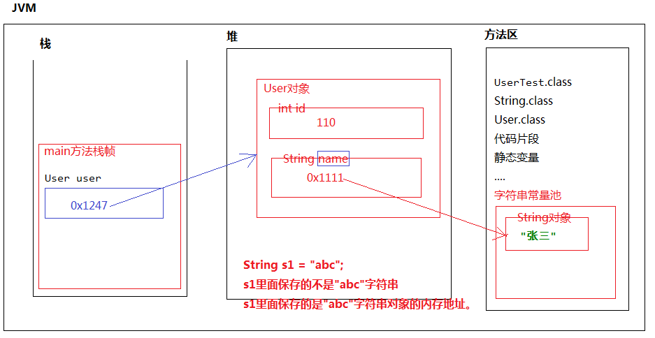

### String类的学习

1. String表示字符串类型，属于引用数据类型，不属于基本数据类型。

2. 在java中随便使用双引号括起来的都是String对象。例如："abc"，"def"，"hello world!"，这是3个String对象。

3. java中规定，双引号括起来的字符串，是不可变的，也就是说"abc"自出生到最终死亡，不可变，不能变成"abcd"，也不能变成"ab"

4. 在Java当中双引号括起来的字符串，例如："abc" "def"都是直接存储在“方法区”的“字符串常量池”当中的。

5. 使用new的方式创建的字符串对象：凡是双引号括起来的都在字符串常量池中有一份。new对象的时候一定在堆内存当中开辟空间。堆中保存着字符串常量池中的内存地址。

6. String类型的数据保存的是常量池中的内存地址。不是值，因为String类型是引用数据类型。

   ###### 代码示例

   ```java
   public class Test {
       public static void main(String[] args) {
           // 这两行代码表示底层创建了3个字符串对象，都在字符串常量池当中。
           String s1 = "abcdef";
           String s2 = "abcdef" + "xy";
           // 分析：这是使用new的方式创建的字符串对象。这个代码中的"xy"是从哪里来的？
           // 凡是双引号括起来的都在字符串常量池中有一份。
           // new对象的时候一定在堆内存当中开辟空间。
           String s3 = new String("xy");
           // i变量中保存的是100这个值。
           int i = 100;
           // s变量中保存的是字符串对象的内存地址。
           // s引用中保存的不是"abc"，是0x1111
           // 而0x1111是"abc"字符串对象在“字符串常量池”当中的内存地址。
           String s = "abc";
       }
   }
   ```

   
   
   7. 如果字符串常量池中有一个hello字符串，又创建了一个新的hello，则这个hello对象不会被创建，而是使用之前的创建的hello。因为这个hello对象已经存在了！
   
      ###### 代码示例
   
      ```java
      public class Test {
          public static void main(String[] args) {
              String s1 = "hello";
              // "hello"是存储在方法区的字符串常量池当中
              // 所以这个"hello"不会新建。（因为这个对象已经存在了！）
              String s2 = "hello";
              // 分析结果是true还是false?
              // == 双等号比较的是不是变量中保存的内存地址?是的。
              System.out.println(s1 == s2); // true
      
              String x = new String("xyz");
              String y = new String("xyz");
              // 分析结果是true还是false?
              // == 双等号比较的是不是变量中保存的内存地址?是的。
              System.out.println(x == y); //false
      
              // 通过这个案例的学习，我们知道了，字符串对象之间的比较不能使用“==”
              // "=="不保险。应该调用String类的equals方法。
              // String类已经重写了equals方法，以下的equals方法调用的是String重写之后的equals方法。
              System.out.println(x.equals(y)); // true
      
              String k = new String("testString");
              // String k = null;
              // "testString"这个字符串可以后面加"."呢?
              // 因为"testString"是一个String字符串对象。只要是对象都能调用方法。
              System.out.println("testString".equals(k)); // 建议使用这种方式，因为这个可以避免空指针异常。
              System.out.println(k.equals("testString")); // 存在空指针异常的风险。不建议这样写。
          }
      }
      ```
   
      
   

#### 类构造方法中的String

##### 代码示例

```java
public class Test {
    public static void main(String[] args) {
        User user = new User(110, "张三");
    }
}
class User{
    private int id;
    private String name;
    public User(){}
    public User(int id, String name){
        this.id = id;
        this.name = name;
    }
}
```



#### String创建对象的问题

##### 代码示例

```java
// 分析以下程序，一共创建了几个对象?
public class Test {
    public static void main(String[] args) {
        /*一共3个对象：
            方法区字符串常量池中有1个,
            "hello"堆内存当中有两个String对象。
            一共3个。
        */
        String s1 = new String("hello");
        String s2 = new String("hello");
    }
}
```

#### 关于String类中的构造方法。

关于String类中的构造方法。
 *  第一个：String s = new String("");
 *  第二个：String s = ""; 最常用
 *  第三个：String s = new String(char数组);
 *  第四个：String s = new String(char数组,起始下标,长度);
 *  第五个：String s = new String(byte数组);
 *  第六个：String s = new String(byte数组,起始下标,长度)

##### 代码示例

```java
public class Test {
    public static void main(String[] args) {
        // 创建字符串对象最常用的一种方式
        String s1 =  "hello world!";
        // s1这个变量中保存的是一个内存地址。
        // 按说以下应该输出一个地址。
        // 但是输出一个字符串，说明String类已经重写了toString()方法。
        System.out.println(s1);// hello world!
        System.out.println(s1.toString()); //hello world!

        // 这里只掌握常用的构造方法。
        byte[] bytes = {97, 98, 99}; // 97是a，98是b，99是c
        String s2 = new String(bytes);

        // 前面说过：输出一个引用的时候，会自动调用toString()方法，默认Object的话，会自动输出对象的内存地址。
        // 通过输出结果我们得出一个结论：String类已经重写了toString()方法。
        // 输出字符串对象的话，输出的不是对象的内存地址，而是字符串本身。
        System.out.println(s2.toString()); //abc
        System.out.println(s2); //abc

        // String(字节数组,数组元素下标的起始位置,长度)
        // 将byte数组中的一部分转换成字符串。
        String s3 = new String(bytes, 1, 2);
        System.out.println(s3); // bc

        // 将char数组全部转换成字符串
        char[] chars = {'我','是','中','国','人'};
        String s4 = new String(chars);
        System.out.println(s4);// 我是中国人
        // 将char数组的一部分转换成字符串
        String s5 = new String(chars, 2, 3);
        System.out.println(s5);// 中国人

        String s6 = new String("helloworld!");
        System.out.println(s6); // helloworld!
    }
}
```

#### String类当中常用方法。

```java
public class Test {
    public static void main(String[] args) {
        // char charAt(int index)
        char c = "中国人".charAt(1); // "中国人"是一个字符串String对象。只要是对象就能“点.”
        System.out.println(c); // 国

        // int compareTo(String anotherString)
        // 字符串之间比较大小不能直接使用 > < ，需要使用compareTo方法。
        int result = "abc".compareTo("abc");
        System.out.println(result); // 0（等于0） 前后一致
        int result2 = "abcd".compareTo("abce");
        System.out.println(result2); // -1（小于0） 前小后大
        int result3 = "abce".compareTo("abcd");
        System.out.println(result3); // 1（大于0） 前大后小
        // 拿着字符串第一个字母和后面字符串的第一个字母比较。能分胜负就不再比较了。
        System.out.println("xyz".compareTo("yxz")); // -1

        // boolean contains(CharSequence s)
        // 判断前面的字符串中是否包含后面的子字符串。
        System.out.println("HelloWorld.java".contains(".java")); // true
        System.out.println("http://www.baidu.com".contains("https://")); // false

        // boolean endsWith(String suffix)
        // 判断当前字符串是否以某个子字符串结尾。
        System.out.println("test.txt".endsWith(".java")); // false
        System.out.println("test.txt".endsWith(".txt")); // true

        // boolean equals(Object anObject)
        // 比较两个字符串必须使用equals方法，不能使用“==”
        // equals只能看出相等不相等。
        // compareTo方法可以看出是否相等，并且同时还可以看出谁大谁小。
        System.out.println("abc".equals("abc")); // true

        // boolean equalsIgnoreCase(String anotherString)
        // 判断两个字符串是否相等，并且同时忽略大小写。
        System.out.println("ABc".equalsIgnoreCase("abC")); // true

        // byte[] getBytes()
        // 将字符串对象转换成字节数组
        byte[] bytes = "abcdef".getBytes();
        for(int i = 0; i < bytes.length; i++){
            System.out.print(bytes[i]+",");// 97,98,99,100,101,102,
        }

        // int indexOf(String str)
        // 判断某个子字符串在当前字符串中第一次出现处的索引（下标）。
        System.out.println("oraclejavac++.netc#phppythonjavaoraclec++".indexOf("java")); // 6

        // boolean isEmpty()
        // 判断某个字符串是否为“空字符串”。底层源代码调用的应该是字符串的length()方法。
        String s1 = "";
        String s2 = "a";
        System.out.println(s1.isEmpty());// true
        System.out.println(s2.isEmpty());// false

        // int length()
        // 判断数组长度和判断字符串长度不一样
        // 判断数组长度是length属性，判断字符串长度是length()方法。
        System.out.println("abc".length()); // 3
        System.out.println("".length()); // 0

        // int lastIndexOf(String str)
        // 判断某个子字符串在当前字符串中最后一次出现的索引（下标）
        System.out.println("oraclejavac++javac#phpjavapython".lastIndexOf("java")); //22

        // String replace(CharSequence target, CharSequence replacement)替换。
        // String的父接口就是：CharSequence
        String newString = "http://www.baidu.com".replace("http://", "https://");
        System.out.println(newString); //https://www.baidu.com

        // String[] split(String regex)拆分字符串
        String[] ymd = "1980-10-11".split("-"); //"1980-10-11"以"-"分隔符进行拆分。
        for(int i = 0; i < ymd.length; i++){
            System.out.print(ymd[i]+",");// 1980,10,11,
        }

        // boolean startsWith(String prefix)
        // 判断某个字符串是否以某个子字符串开始。
        System.out.println("http://www.baidu.com".startsWith("http")); // true
        System.out.println("http://www.baidu.com".startsWith("https")); // false

        // String substring(int beginIndex) 参数是起始下标。
        // 截取字符串
        System.out.println("http://www.baidu.com".substring(7)); //www.baidu.com

        // String substring(int beginIndex, int endIndex)
        // beginIndex起始位置（包括）
        // endIndex结束位置（不包括）左闭右开
        System.out.println("http://www.baidu.com".substring(7, 10)); //www

        // char[] toCharArray()
        // 将字符串转换成char数组
        char[] chars = "我是中国人".toCharArray();
        for(int i = 0; i < chars.length; i++){
            System.out.print(chars[i]+",");// 我,是,中,国,人,
        }

        // String toLowerCase()
        // 转换为小写。
        System.out.println("ABCDefKXyz".toLowerCase());// abcdefkxyz

        // String toUpperCase();
        // 转换为大写。
        System.out.println("ABCDefKXyz".toUpperCase());// ABCDEFKXYZ

        // String trim();
        // 去除字符串前后空白
        System.out.println("      hello  world      ".trim());// hello  world

        // String中只有一个方法是静态的,不需要new对象
        // 这个方法叫做valueOf
        // 作用：将“非字符串”转换成“字符串”
        System.out.println(String.valueOf(true));
        // 这个静态的valueOf()方法，参数是一个对象的时候，会自动调用该对象的toString()方法吗？
        // System.out.println(String.valueOf(new Customer()));// Customer@568db2f2,// 没有重写toString()方法之前是对象内存地址
        System.out.println(String.valueOf(new Customer()));// 这是重新写的toString()方法
        Object obj = new Object();
        // 通过源代码可以看出：为什么输出一个引用的时候，会调用toString()方法!!!!
        // 本质上System.out.println()这个方法在输出任何数据的时候都是先转换成字符串，再输出。
        System.out.println(obj);// java.lang.Object@568db2f2
    }
}
class Customer {
    @Override
    public String toString() {
        return "这是重新写的toString()方法";
    }
}
```

