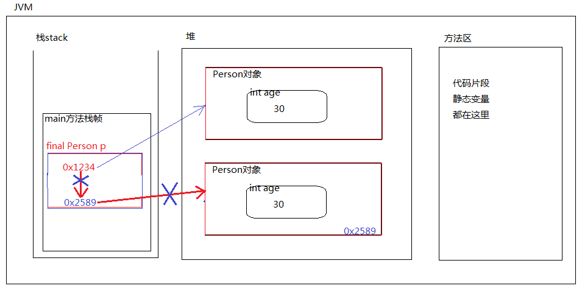

### final关键字

1. final表示：最终的，不可变的。

2. final修饰的类无法继承。

3. final修饰的方法无法覆盖。

4. final修饰的变量只能赋一次值。

5. final修饰的引用一旦指向某个对象，则不能再重新指向其它对象，但该引用指向的对象内部的数据是可以修改的。

6. final修饰的实例变量必须手动初始化，不能采用系统默认值。

7. final修饰的实例变量一般和static联合使用，称为常量。

   ```java
   public static final double PI = 3.1415926;
   ```


#### final修饰的引用

```java
/*
	final修饰的变量，如果这个变量是一个“引用”会怎样？？？？
	《重点》final修饰的变量只能付一次值(万变不离其宗)
	“引用”也是一个变量
	final修饰的作用：
		该引用只能指向一个对象，并且它只能永远指向该对象，无法在指向其他对象。
		并且在该方法执行过程中，该引用指向该对象之后，该对象不会被垃圾回收器回收。
		直到当前方法结束，才会释放空间。、

		虽然final的引用指向对象A后，不能在重新指向对象B。
		但是对象A内部的数据可以被修改。
*/
public class finalTest{
	public static void main(String[] args){
		Person person1 = new Person(20);
		System.out.println(person1.age);//20
		// 代码不管怎么变化，person2也是一个变量，（不过这里它有一个特殊的名字：引用）
		final Person person2 = new Person(521);
		//person2 = new Person(520); 错误: 无法为最终变量person2分配值
		//可以给person2一个null吗？？？
		//person2 = null; 错误: 无法为最终变量person2分配值
		person2.age = 30;
		System.out.println(person2.age);//30
		/*
		final int i = 10;
		// 不允许的
		i = 20;
		*/
	}
}
class Person{
	int age;
	public Person(){}
	public Person(int age){
		this.age = age;
	}
}
```



#### final修饰的实例变量

```java
/*
	final修饰的实例变量？
		《重点：万变不离其宗》：final修饰的变量只能赋值一次。（这句话是真理）
		实例变量如果没有手动赋值的话，系统会赋一个默认值。
		实例变量在什么时候赋值（初始化）？
			构造方法执行的过程中赋值(new的时候赋值)
		终极结论：
			final修饰的实例变量，系统不负责赋默认值，要求程序员必须手动赋值。
			这个手动赋值，在变量后面赋值也可以，在构造方法中赋值也可以。
*/
public class finalTest{
	public static void main(String[] args){
		User user = new User();
		User user = new User(1.0);
	}
}
class User{
	// 实例变量
	// 编译器报错
	// final int age;

	// 实例变量
	// 可以，因为我们手动赋值了
	final double height = 1.8;
	// 实例变量
	final double weight;
	// 构造方法
	public User(){
		this.weight = 1.0;// 只要我赶在系统赋默认值之前赋值就行
		this.weight = 8.0;// 这个不可以，因为已经赋值了
	}
	public User(double weight){
		// 这个也赋值了，没有采用系统默认值。
		this.weight = weight;
	}
}
```

#### 常量

```java
/*
	final修饰的实例变量一般添加static修饰
	终极结论：
		static final联合修饰的变量称为"常量"
		常量名全部大写，每个单词之间采用下划线衔接
	常量：
		实际上常量和静态变量一样，区别在于：
		常量的值不能变。
		常量和静态变量，都是储存在方法区，并且都是在类加载时初始化。
*/
public class finalTest{
	public static void main(String[] args){
		
	}
}
class Chinese{
	//实例变量在堆中，一个对象一份，100个对象100份
	String idCard;
	String name;
	//实例变量既然是用final修饰了，说明该实例变量值不会随着对象的变化而变化。
	//该实例变量前面应该添加：static关键字，变为静态的，存储在方法区。这样节省内存。
	static final String COUNTRY = "中国";
}
```

