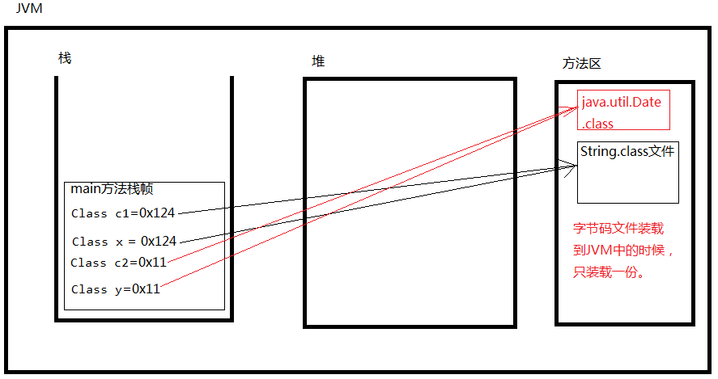

### 反射机制

1. 反射机制有什么用？

   通过java语言中的反射机制可以操作字节码文件。（可以读和修改字节码文件。）通过反射机制可以操作代码片段。（class文件。）可以让程序更加灵活。

2. 反射机制的相关类在哪个包下？

   ```java
   java.lang.reflect.*;
   ```

3. 反射机制相关的重要的类有哪些？

   1. java.lang.Class：代表整个字节码，代表一个类型，代表整个类。
   2. java.lang.reflect.Method：代表字节码中的方法字节码。代表类中的方法。
   3. java.lang.reflect.Constructor：代表字节码中的构造方法字节码。代表类中的构造方法
   4. java.lang.reflect.Field：代表字节码中的属性字节码。代表类中的成员变量（静态变量+实例变量）。

   例如：

   ```java
   class User{
       // Field
       int no;
       // Constructor
       public User(){}
       // Method
       public void setNo(int no){
           this.no = no;
       }
   } // 整个类属于java.lang.Class
   ```

4. 在java中获取Class的三种方式？

   要操作一个类的字节码，需要首先获取到这个类的字节码

   1. 第一种：

      ```java
      Class myClass = Class.forName("完整类名带包名");
      /**
      * Class.forName()
      * 1、静态方法
      * 2、方法的参数是一个字符串。
      * 3、字符串需要的是一个完整类名。
      * 4、完整类名必须带有包名。java.lang包也不能省略。
      */
      ```

   2. 第二种：

      ```java
      Class myClass = 对象.getClass();
      ```

   3. 第三种：

      ```java
      Class myClass1 = int.class;
      Class myClass2 = String.class;
      Class myClass3 = 任何类型.class;
      ```

###### 代码示例

```java
public class Test {
    public static void main(String[] args) throws Exception {
        // 获取Class字节码的第一种方式。
        Class myClass1 = Class.forName("java.lang.String");// myClass1代表String.class文件，或者说myClasss1代表String类型。
        Class myCLass2 = Class.forName("java.lang.System");// // myClass2代表System类型
        // 获取Class字节码的第二种方式。
        // java中任何一个对象都有一个方法：getClass()
        String str = "abc";
        Class classStr = str.getClass();// classStr代表String.class字节码文件，classStr代表String类型。
        System.out.println(classStr == myClass1);// true (==判断的是对象的内存地址。两个变量中保存的内存地址都是一样的，都指向方法区中的字节码文件。)
        // 获取Class字节码的第三种方式。java语言中任何一种类型，包括基本数据类型，它都有.class属性。
        Class myStr = String.class;// myStr代表String类型
        System.out.println(myStr == classStr);// true
    }
}
```



5. 获取了Class之后，可以调用无参数构造方法来实例化对象

   ```java
   // myClass代表的就是日期Date类型
   Class myClass = Class.forName("java.util.Date");
   //实例化一个Date日期类型的对象
   Object obj = myClass.newInstance();
   ```

   一定要注意：

   newInstance()底层调用的是该类型的无参数构造方法。如果没有这个无参数构造方法会出现"实例化"异常。

###### 代码示例

```java
/*
获取到Class，能干什么?
    通过Class的newInstance()方法来实例化对象。
    注意：newInstance()方法内部实际上调用了无参数构造方法，必须保证无参构造存在才可以。
 */
public class Test {
    public static void main(String[] args) throws Exception {
        // 这是不使用反射机制，创建对象
        User user = new User();
        System.out.println(user); // User@776ec8df
        // 下面这段代码是以反射机制的方式创建对象。
        // 通过反射机制，获取Class，通过Class来实例化对象
        Class userClass = Class.forName("User");// userClass代表User类型。
        // newInstance() 这个方法会调用User这个类的无参数构造方法，完成对象的创建。
        // 重点是：newInstance()调用的是无参构造，必须保证无参构造是存在的！
        Object obj = userClass.newInstance();
        System.out.println(obj); // User@4eec7777
    }
}
class User{}
```

6. 反射机制的优点：反射机制十分的灵活

   java代码写一遍，再不改变java源代码的基础之上，可以做到不同对象的实例化。非常之灵活。

   ```java
   import java.io.*;
   import java.util.Properties;
   
   public class Test {
       public static void main(String[] args) throws Exception{
           // 这种方式代码就写死了。只能创建一个User类型的对象
           // User user = new User();
           // 以下代码是灵活的，代码不需要改动，可以修改配置文件，配置文件修改之后，可以创建出不同的实例对象。
           // 通过IO流读取userinfo.properties文件
           FileReader fileReader = new FileReader("src/userinfo.properties");
           // 创建属性类对象Map
           Properties properties = new Properties(); // key value都是String
           // 加载
           properties.load(fileReader);
           // 关闭流
           fileReader.close();
           // 通过key获取value
           String className = properties.getProperty("classname");
           System.out.println(className);
           // 通过反射机制实例化对象
           Class myClass = Class.forName(className);
           Object obj = myClass.newInstance();
           System.out.println(obj);
       }
   }
   class User{}
   ```

7. 如果你只想让一个类的“静态代码块”执行的话，你可以怎么做？Class.forName()发生了什么？

   记住，重点：如果你只是希望一个类的静态代码块执行，其它代码一律不执行，你可以使用：

   ```java
   Class.forName("完整类名");
   ```

   这个方法的执行会导致类加载，类加载时，静态代码块执行。

   这样类就加载，类加载的时候，静态代码块执行！在这里，对该方法的返回值不感兴趣，主要是为了使用“类加载”这个动作。

   ```java
   public class Test {
       public static void main(String[] args) throws Exception{
           // Class.forName()这个方法的执行会导致：类加载。
           Class.forName("MyClass");
       }
   }
   // 静态代码块在类加载时执行，并且只执行一次。
   class MyClass{
       static {
           System.out.println("静态代码块执行了");
       }
   }
   ```

8. 反射机制的重点内容

   1. 通过反射机制访问对象的某个属性。java.lang.reflect.Field
   2. 通过反射机制调用对象的某个方法。
   3. 通过反射机制调用某个构造方法实例化对象。
   4. 通过反射机制获取父类以及父类型接口。