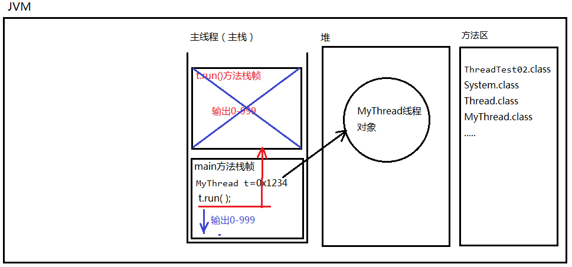
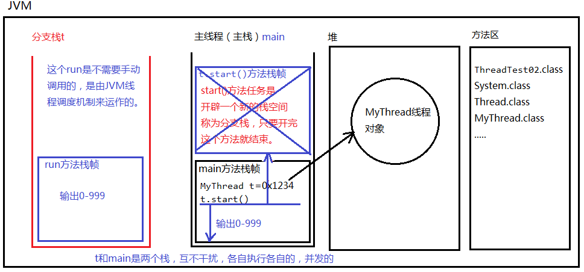

### 创建线程的三种方式

### 创建线程的主要两种方式

1. 实现线程的第一种方式：编写一个类，直接继承java.lang.Thread，重写run方法。
2. 实现线程的第二种方式：编写一个类实现java.lang.Runnable接口。实现run方法。
3. 怎么创建线程对象？ new就行了。怎么启动线程呢？ 调用线程对象的start()方法。
4. 注意：第二种方式创建的类不是一个线程类，是一个可运行的类。需要使用Thread类将其转换为一个线程类。
5. 注意：亘古不变的道理：方法体当中的代码永远都是自上而下的顺序依次逐行执行的。
6. 以下程序的输出结果有这样的特点：有先有后。有多有少。
   1. 因为这是程序中的线程对CPU的占先权来决定的。（时间片与最先执行的权利）
7. 一个程序最先运行至少有两个线程，一个是主线程即main方法，另一个则是JVM的垃圾回收器的线程GC。
8. 1个线程。（因为程序只有1个栈。）一个栈中，自上而下的顺序依次逐行执行！
9. 第二种方式实现接口比较常用，因为一个类实现了接口，它还可以去继承其它的类，更灵活。

##### 第一种方式：java.lang.Thread，重写run方法

```java
public class Test {
    public static void main(String[] args) {
        // 这里是main方法，这里的代码属于主线程，在主栈中运行。
        // 新建一个分支线程对象
        MyThread myThread = new MyThread();
        // 启动线程
        // myThread.run(); // 不会启动线程，不会分配新的分支栈。（这种方式就是单线程。）
        // start()方法的作用是：启动一个分支线程，在JVM中开辟一个新的栈空间，这段代码任务完成之后，瞬间就结束了。
        // 这段代码的任务只是为了开启一个新的栈空间，只要新的栈空间开出来，start()方法就结束了。线程就启动成功了。
        // 启动成功的线程会自动调用run方法，并且run方法在分支栈的栈底部（压栈）。
        // run方法在分支栈的栈底部，main方法在主栈的栈底部。run和main是平级的。
        myThread.start();
        // 这里的代码还是运行在主线程中。
        for (int i = 0; i < 10; i++) {
            System.out.println("主线程--->" + i);
        }
    }
}
class MyThread extends Thread{
    @Override
    public void run() {
        // 编写程序，这段程序运行在分支线程中（分支栈）。
        for (int i = 0; i < 10; i++) {
            System.out.println("分支线程--->" + i);
        }
    }
}
```

###### 调用类的run方法

不会启动线程，不会分配新的分支栈。（这种方式就是单线程。）



###### 调用线程的start方法启动线程

启动一个分支线程，在JVM中开辟一个新的栈空间，这段代码任务完成之后，瞬间就结束了。这段代码的任务只是为了开启一个新的栈空间，只要新的栈空间开出来，start()方法就结束了。线程就启动成功了。启动成功的线程会自动调用run方法，并且run方法在分支栈的栈底部（压栈）。run方法在分支栈的栈底部，main方法在主栈的栈底部。run和main是平级的。



##### 实现线程的第二种方式：编写一个类实现java.lang.Runnable接口。实现run方法

```java
public class Test {
    public static void main(String[] args) {
        // 创建一个可运行的对象
        // MyRunnable myRunnable = new MyRunnable();
        // 将可运行的对象封装成一个线程对象
        // Thread thread = new Thread(myRunnable);
        Thread thread = new Thread(new MyRunnable()); // 合并代码
        // 启动线程
        thread.start();
        for (int i = 0; i < 1000; i++) {
            System.out.println("主线程--->" + i);
        }
    }
}
// 这并不是一个线程类，是一个可运行的类。它还不是一个线程。
class MyRunnable implements Runnable{
    @Override
    public void run() {
        for (int i = 0; i < 1000; i++) {
            System.out.println("分支线程--->" + i);
        }
    }
}
```

##### 采用匿名内部类的方式

```java
public class Test {
    public static void main(String[] args) {
        // 创建线程对象，采用匿名内部类方式。
        // 这是通过一个没有名字的类，new出来的对象。
        Thread thread = new Thread(new Runnable() {
            @Override
            public void run() {
                for (int i = 0; i < 1000; i++) {
                    System.out.println("分支线程--->" + i);
                }
            }
        });
        // 启动线程
        thread.start();
        for (int i = 0; i < 1000; i++) {
            System.out.println("主线程--->" + i);
        }
    }
}
```

### 实现线程的第三种方式

实现线程的第三种方式：FutureTask方式，实现Callable接口。这种方式实现的线程可以获取线程的返回值。之前的那两种方式是无法获取线程返回值的，因为run方法返回void。

思考：

系统委派一个线程去执行一个任务，该线程执行完任务之后，可能会有一个执行结果，我们怎么能拿到这个执行结果呢？
使用第三种方式：FutureTask方式，实现Callable接口方式。

这种方式的优点：可以获取到线程的执行结果。

这种方式的缺点：效率比较低，在获取t线程执行结果的时候，当前线程受阻塞，效率较低。

```java
import java.util.concurrent.Callable;
import java.util.concurrent.ExecutionException;
import java.util.concurrent.FutureTask;

public class Test {
    public static void main(String[] args) throws Exception {
        // 第一步：创建一个“未来任务类”对象。
        // 参数非常重要，需要给一个Callable接口实现类对象。\
        FutureTask futureTask = new FutureTask(new Callable() {
            @Override
            public Object call() throws Exception { // call()方法就相当于run方法。只不过这个有返回值
                // 线程执行一个任务，执行之后可能会有一个执行结果
                // 模拟执行
                System.out.println("call method begin");
                Thread.sleep(1000 * 10);
                System.out.println("call method end!");
                int a = 100;
                int b = 200;
                return a + b; //自动装箱(300结果变成Integer)
            }
        });
        // 创建线程对象
        Thread thread = new Thread(futureTask);

        // 启动线程
        thread.start();

        // 这里是main方法，这是在主线程中。
        // 在主线程中，怎么获取thread线程的返回结果？
        // get()方法的执行会导致“当前线程阻塞”
        Object obj = futureTask.get();
        System.out.println("线程执行结果:" + obj);

        // main方法这里的程序要想执行必须等待get()方法的结束
        // 而get()方法可能需要很久。因为get()方法是为了拿另一个线程的执行结果
        // 另一个线程执行是需要时间的。
        System.out.println("hello world!");
    }
}

```

