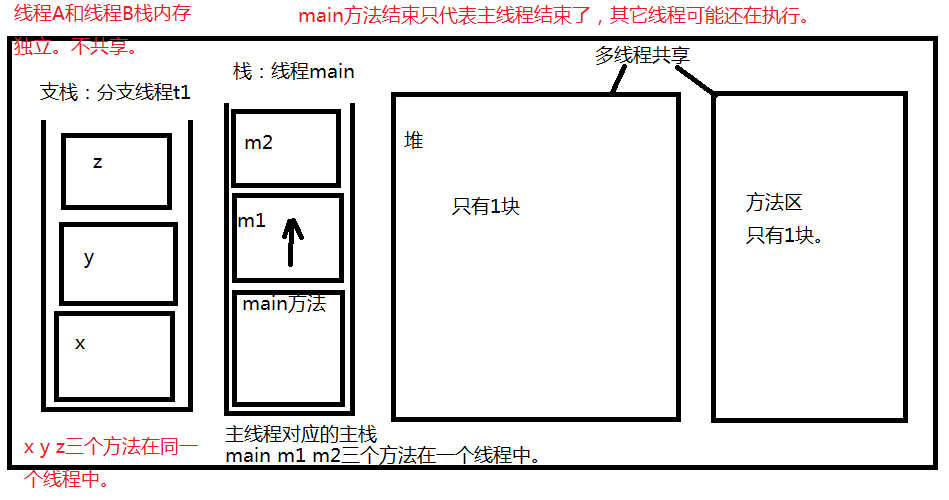
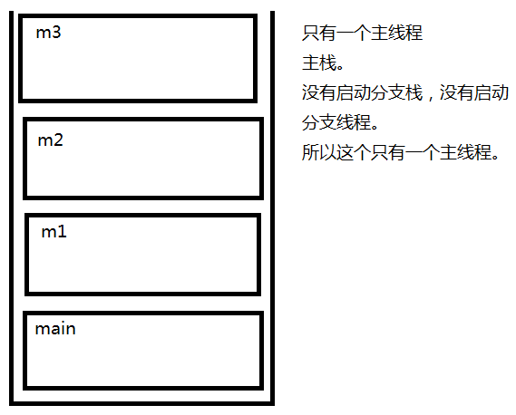

### 多线程概述

1. 什么是进程？什么是线程？

   1. 进程是一个应用程序（1个进程是一个软件）。线程是一个进程中的执行场景/执行单元。一个进程可以启动多个线程。

2. 对于java程序来说，当在DOS命令窗口中输入：java HelloWorld 回车之后。会先启动JVM，而JVM就是一个进程。JVM再启动一个主线程调用main方法。同时再启动一个垃圾回收线程负责看护，回收垃圾。最起码，现在的java程序中至少有两个线程并发，一个是垃圾回收线程，一个是执行main方法的主线程。

3. 进程和线程是什么关系？举个例子

   1. 进程可以看做是现实生活当中的公司。线程可以看做是公司当中的某个员工。
   2. 火车站，可以看做是一个进程。火车站中的每一个售票窗口可以看做是一个线程。我在窗口1购票，你可以在窗口2购票，你不需要等我，我也不需要等你。所以多线程并发可以提高效率。

4. 注意：进程A和进程B的内存独立不共享。

   英雄联盟是一个进程，微信是一个进程。这两个进程是独立的，不共享资源。

5. 线程A和线程B呢？

   1. 在java语言中：线程A和线程B，堆内存和方法区内存共享。但是栈内存独立，一个线程一个栈。假设启动10个线程，会有10个栈空间，每个栈和每个栈之间，互不干扰，各自执行各自的，这就是多线程并发。多线程并发可以提高效率。

6. java中之所以有多线程机制，目的就是为了提高程序的处理效率。

7. main方法结束后程序可能也不会结束：

   1. 使用了多线程机制之后，main方法结束，是不是有可能程序也不会结束。main方法结束只是主线程结束了，主栈空了，其它的栈(线程)可能还在压栈弹栈。

8. 对于单核的CPU来说，真的可以做到真正的多线程并发吗？

   1. 对于多核的CPU电脑来说，真正的多线程并发是没问题的。4核CPU表示同一个时间点上，可以真正的有4个进程并发执行。
   2. 单核的CPU表示只有一个大脑：
      1. 不能够做到真正的多线程并发，但是可以做到给人一种“多线程并发”的感觉。
      2. 对于单核的CPU来说，在某一个时间点上实际上只能处理一件事情，但是由于CPU的处理速度极快，多个线程之间频繁切换执行，跟人来的感觉是：多个事情同时在做！！！线程A：播放音乐，线程B：运行游戏，线程A和线程B频繁切换执行，人类会感觉音乐一直在播放，游戏一直在运行，给我们的感觉是同时并发的。
   
9. 什么是真正的多线程并发？

   1. t1线程执行t1的。t2线程执行t2的。t1不会影响t2，t2也不会影响t1。这叫做真正的多线程并发。
   
10. 一个线程一个栈。



##### 判断一下代码有多少个线程？1个线程

```java
/*
分析以下程序，有几个线程，除垃圾回收线程之外。有几个线程？
    1个线程。（因为程序只有1个栈。）
    一个栈中，自上而下的顺序依次逐行执行！
 */
public class Test {
    public static void main(String[] args) {
        System.out.println("main begin");
        m1();
        System.out.println("main over");
    }

    private static void m1() {
        System.out.println("m1 begin");
        m2();
        System.out.println("m1 over");
    }

    private static void m2() {
        System.out.println("m2 begin");
        m3();
        System.out.println("m2 over");
    }

    private static void m3() {
        System.out.println("m3 execute!");
    }
}
```



