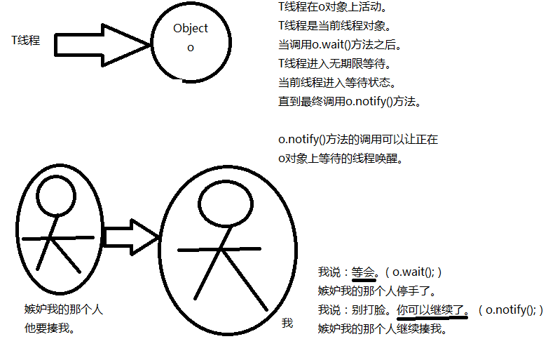
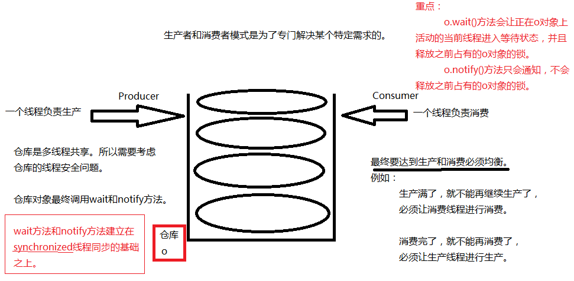

### Object类中的wait和notify方法。

关于Object类中的wait和notify方法。（生产者和消费者模式！）

1. 第一：wait和notify方法不是线程对象的方法，是java中任何一个java对象都有的方法，因为这两个方式是Object类中自带的。wait方法和notify方法不是通过线程对象调用，不是这样的：thread.wait()，也不是这样的：thread.notify()..不对。

2. 第二：wait()方法作用？

   ```java
   Object obj = new Object();
   obj.wait();
   ```

   表示：

   让正在o对象上活动的线程进入等待状态，无期限等待，直到被唤醒为止。obj.wait();方法的调用，会让“当前线程（正在obj对象上活动的线程）”进入等待状态。

3. 第三：notify()方法作用？

   ```java
   Object obj = new Object();
   obj.notify();
   ```

   表示：

   唤醒正在obj对象上等待的线程。

4. 还有一个notifyAll()方法：这个方法是唤醒obj对象上处于等待的所有线程。



### 生产者和消费者模式

使用wait方法和notify方法实现“生产者和消费者模式”

1. 什么是“生产者和消费者模式”？

   生产线程负责生产，消费线程负责消费。生产线程和消费线程要达到均衡。这是一种特殊的业务需求，在这种特殊的情况下需要使用wait方法和notify方法。

2. wait和notify方法不是线程对象的方法，是普通java对象都有的方法。

3. wait方法和notify方法建立在线程同步的基础之上。因为多线程要同时操作一个仓库。有线程安全问题。

4. wait方法作用：obj.wait()让正在obj对象上活动的线程thread进入等待状态，并且释放掉thread线程之前占有的obj对象的锁。

5. notify方法作用：obj.notify()让正在obj对象上等待的线程唤醒，只是通知，不会释放obj对象上之前占有的锁。

6. 主要方法：

   ```java
   void wait() // 在其他线程调用此对象的 notify() 方法或 notifyAll() 方法前，导致当前线程等待。
   void notify() // 唤醒在此对象监视器上等待的单个线程。
   void notifyAll() // 唤醒在此对象监视器上等待的所有线程。
   ```



模拟这样一个需求：

仓库我们采用List集合。List集合中假设只能存储1个元素。1个元素就表示仓库满了。如果List集合中元素个数是0，就表示仓库空了。保证List集合中永远都是最多存储1个元素。必须做到这种效果：生产1个消费1个。

###### 代码示例

```java
import java.util.*;

public class Test {
    public static void main(String[] args) {
        // 创建1个仓库对象，共享的。
        List list = new ArrayList();
        // 创建两个线程对象
        // 生产者线程
        Thread thread1 = new Thread(new Producer(list));
        // 消费者线程
        Thread thread2 = new Thread(new Consumer(list));
        thread1.setName("生产者线程");
        thread2.setName("消费者线程");
        thread1.start();
        thread2.start();
    }
}
// 生产线程
class Producer implements Runnable{
    // 仓库
    private List list;
    public Producer(List list) {
        this.list = list;
    }
    @Override
    public void run() {
        // 一直生产（使用死循环来模拟一直生产）
        while (true){
            // 给仓库对象list加锁。
            synchronized (list){
                if(list.size() > 0){ // 大于0，说明仓库中已经有1个元素了。
                    try {
                        // 当前线程进入等待状态，并且释放Producer之前占有的list集合的锁。
                        list.wait();
                    } catch (InterruptedException e) {
                        e.printStackTrace();
                    }
                }
                // 程序能够执行到这里说明仓库是空的，可以生产
                Object obj = new Object();
                list.add(obj);
                System.out.println(Thread.currentThread().getName() + "--->" + obj);
                // 唤醒消费者进行消费
                list.notifyAll(); // 唤醒在此对象监视器上等待的所有线程。
            }
        }
    }
}
// 消费线程
class Consumer implements Runnable{
    // 仓库
    private List list;
    public Consumer(List list) {
        this.list = list;
    }
    @Override
    public void run() {
        // 一直消费
        while (true){
            synchronized (list) {
                if (list.size() == 0) {
                    // 仓库已经空了。
                    // 消费者线程等待，释放掉list集合的锁
                    try {
                        list.wait();
                    } catch (InterruptedException e) {
                        e.printStackTrace();
                    }
                }
                // 程序能够执行到此处说明仓库中有数据，进行消费。
                Object obj = list.remove(0);
                System.out.println(Thread.currentThread().getName() + "------>" + obj);
                // 唤醒生产者生产。
                list.notifyAll(); // 唤醒在此对象监视器上等待的所有线程。
            }
        }
    }
}
```

