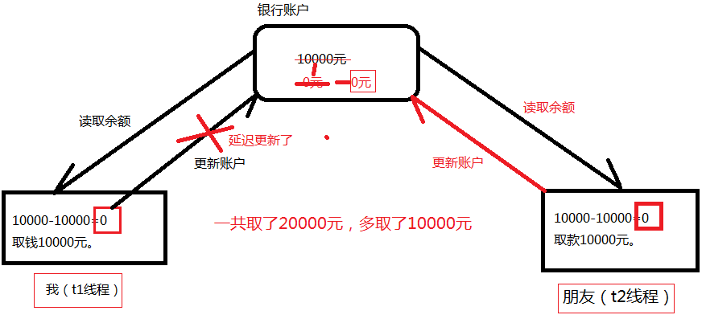
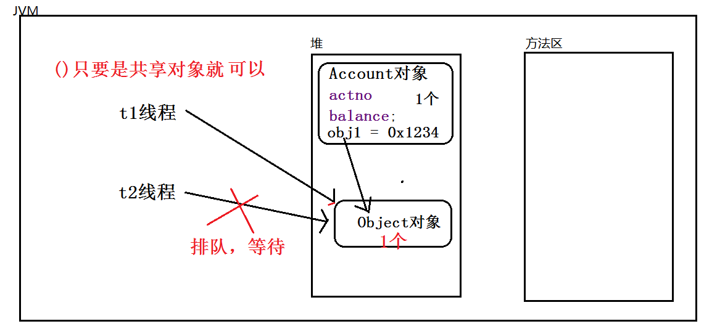

### 线程同步机制synchronized

1. 如果有一部分代码必须是线程排队的，不能并发。一个线程把这里的代码全部执行结束之后，另一个线程才能进来。需要使用线程同步机制

2. 线程同步机制的语法是：

   1. 使用同步代码块的方式，这种方式比较灵活。修饰一个代码块，被修饰的代码块称为同步语句块，其作用的范围是大括号{}括起来的代码，作用的对象是调用这个代码块的对象；

      ```java
      synchronized(线程共享对象){
      	// 线程同步代码块。
      }
      ```

   2. 在实例方法上使用synchronized，例如：

      1. synchronized出现在实例方法上，一定锁的是this。 没得挑。只能是this。不能是其他的对象了。所以这种方式不灵活。
      2. 缺点：synchronized出现在实例方法上，表示整个方法体都需要同步，可能会无故扩大同步的范围，导致程序的执行效率降低。所以这种方式不常用。
      3. synchronized使用在实例方法上有什么优点？代码写的少了。节俭了。
      4. 如果共享的对象就是this，并且需要同步的代码块是整个方法体，建议使用这种方式。
      5. 这种方式表示共享对象一定是this，并且同步代码块是整个方法体。但是扩大了线程同步机制的范围。
      6. 修饰一个方法，被修饰的方法称为同步方法，其作用的范围是整个方法，作用的对象是调用这个方法的对象； 
   
      ```java
      public synchronized int length() {
      	return count;
      }
      ```
   
   3. 在静态方法上使用synchronized
   
      修改一个静态的方法，其作用的范围是整个静态方法，作用的对象是这个类的所有对象； 
   
      静态方法是类方法，表示找类锁。类锁永远只有1把。就算创建了100个对象，那类锁也只有一把。
   
   4. 修饰一个类，其作用的范围是synchronized后面括号括起来的部分，作用主的对象是这个类的所有对象。
   
3. **多个线程共享同一个对象。**

4. 对象锁：1个对象1把锁，100个对象100把锁。

   类锁：100个对象，也可能只是1把类锁。

5. synchronized的重点：synchronized后面小括号中传的这个“数据”是相当关键的。这个数据必须是多线程共享的数据。才能达到多线程排队。

6. ()中数据写什么？那要看你想让哪些线程同步。假设t1、t2、t3、t4、t5，有5个线程，你只希望t1 t2 t3排队，t4 t5不需要排队。怎么办？你一定要在()中写一个t1 t2 t3共享的对象（传入同一个对象）。而这个对象对于t4 t5来说不是共享的。多线程共享的那个对象就行（字符串常量池中的字符串所有对象都共享）所有的线程对象都使用一个字符串对象锁。

7. 共享的数据：每一个对象都有的数据，唯一的数据。一个对象一个的数据。多线程共享的那个对象就行

8. 在java语言中，任何一个对象都有“一把锁”，其实这把锁就是标记。（只是把它叫做锁。）100个对象，100把锁。1个对象1把锁。

#### 不使用线程同步机制所引发的安全问题



并发造成的安全问题代码，以下代码出现了对数据更新错误的问题。这是由于对数据更新不及时所造成的的。

```java
public class Test {
    public static void main(String[] args) {
        // 创建账户对象（只创建1个）
        Account account = new Account("account-001",100);
        // 创建两个线程
        AccountThread accountThread1 = new AccountThread(account);
        AccountThread accountThread2 = new AccountThread(account);
        // 设置name
        accountThread1.setName("accountThread1");
        accountThread2.setName("accountThread2");
        // 启动线程取款
        accountThread1.start();
        accountThread2.start();
    }
}
// 不使用线程同步机制，多线程对同一个账户进行取款，出现线程安全问题。
class Account{
    // 账号
    public String actno;
    // 余额
    public double balance; // 实例变量。

    public Account(String actno, double balance) {
        this.actno = actno;
        this.balance = balance;
    }
    //取款的方法
    public void withdraw(double money){
        // accountThread1和accountThread2并发这个方法。（accountThread1和accountThread2是两个栈。两个栈操作堆中同一个对象。）
        // 取款之前的余额
        double before = this.balance;
        // 取款之后的余额
        double after = before - money;
        // 在这里模拟一下网络延迟，100%会出现问题
        try {
            Thread.sleep(1000);
        } catch (InterruptedException e) {
            e.printStackTrace();
        }
        // 更新余额
        // 思考：accountThread1执行到这里了，但还没有来得及执行这行代码，accountThread2线程进来withdraw方法了。此时一定出问题。
        this.balance = after;
    }
}
class AccountThread extends Thread{
    // 两个线程必须共享同一个账户对象。
    private Account account;
    // 通过构造方法传递过来账户对象
    public AccountThread(Account account) {
        this.account = account;
    }
    @Override
    public void run() {// run方法的执行表示取款操作。
        // 假设取款50
        double money = 50;
        // 取款
        // 多线程并发执行这个方法。
        account.withdraw(50);
        System.out.println(Thread.currentThread().getName() + "对" + account.actno + "取款" + money + "成功，余额" + account.balance);
    }
}
```

#### 锁的执行原理：

1. ​	假设t1和t2线程并发，开始执行同步代码块代码的时候，肯定有一个先一个后。假设t1先执行了，遇到了synchronized，这个时候自动找“后面共享对象”的对象锁，找到之后，并占有这把锁，然后执行同步代码块中的程序，在程序执行过程中一直都是占有这把锁的。直到同步代码块代码结束，这把锁才会释放。
2. ​	假设t1已经占有这把锁，此时t2也遇到synchronized关键字，也会去占有后面共享对象的这把锁，结果这把锁被t1占有，t2只能在同步代码块外面等待t1的结束，直到t1把同步代码块执行结束了，t1会归还这把锁，此时t2终于等到这把锁，然后t2占有这把锁之后，进入同步代码块执行程序。
3. ​	这样就达到了线程排队执行。
4. ​	这里需要注意的是：这个共享对象一定要选好了。这个共享对象一定是你需要排队，执行的这些线程对象所共享的。

#### 使用线程同步机制，解决线程安全问题。

synchronized使用了三种方式去实现线程安全问题。

```java
public class Test {
    public static void main(String[] args) {
        // 创建账户对象（只创建1个）
        Account account1 = new Account("account-001",100);
        Account account2 = new Account("account-002",100);
        // 创建两个线程，多个线程共享同一个对象，一个对象一把锁。
        AccountThread accountThread1 = new AccountThread(account1);
        AccountThread accountThread2 = new AccountThread(account1);
        // 另一个对象另一把锁，不需要等待。
        AccountThread accountThread3 = new AccountThread(account2);
        // 设置name
        accountThread1.setName("accountThread1");
        accountThread2.setName("accountThread2");
        accountThread3.setName("accountThread3");
        // 启动线程取款
        accountThread1.start();
        accountThread2.start();
        accountThread3.start();
    }
}
// 不使用线程同步机制，多线程对同一个账户进行取款，出现线程安全问题。
class Account{
    // 账号
    public String actno;
    // 余额
    public double balance; // 实例变量。
    //对象
    Object obj1 = new Object();// 实例变量。（Account对象是多线程共享的，Account对象中的实例变量obj也是共享的。）

    public Account(String actno, double balance) {
        this.actno = actno;
        this.balance = balance;
    }
    //取款的方法
/*    public void withdraw(double money){
        // 这个对象不是共享的，obj2是局部变量，不是共享对象。两个线程不共享这个对象。
        Object obj2 = new Object();// 第二个线程过来还会new一个新的对象，所以线程1和线程2，new的obj2不是同一个对象，两个线程都拿到锁了
        // synchronized (obj1) {
        // synchronized (obj2) {
        // synchronized ("def") { // 对象只有一个在字符串常量池中,如果这样写的话所有的线程都会同步。
        // synchronized (null) { // 报错：空指针异常。
        // synchronized (this) {
            // accountThread1和accountThread2并发这个方法。（accountThread1和accountThread2是两个栈。两个栈操作堆中同一个对象。）
            // 取款之前的余额
            double before = this.balance;
            // 取款之后的余额
            double after = before - money;
            // 在这里模拟一下网络延迟，100%会出现问题
            try {
                Thread.sleep(1000);
            } catch (InterruptedException e) {
                e.printStackTrace();
            }
            // 更新余额
            // 思考：accountThread1执行到这里了，但还没有来得及执行这行代码，accountThread2线程进来withdraw方法了。此时一定出问题。
            this.balance = after;
        // }
    }*/
    public synchronized void withdraw(double money){
        double before = this.balance;
        double after = before - money;
        try {
            Thread.sleep(1000);
        } catch (InterruptedException e) {
            e.printStackTrace();
        }
        this.balance = after;
    }
}
class AccountThread extends Thread{
    // 两个线程必须共享同一个账户对象。
    private Account account;
    // 通过构造方法传递过来账户对象
    public AccountThread(Account account) {
        this.account = account;
    }
    @Override
    public void run() {// run方法的执行表示取款操作。
        // 假设取款50
        double money = 50;
        // 取款
        // 多线程并发执行这个方法。
        // synchronized (this) { // 这里的this是AccountThread对象，这个对象不共享！
        // synchronized (account) { // 这种方式也可以，只不过扩大了同步的范围，效率更低了。
        account.withdraw(50);
        // }
        System.out.println(Thread.currentThread().getName() + "对" + account.actno + "取款" + money + "成功，余额" + account.balance);
    }
}
```



### synchronized面试题

```java
public class Test {
    public static void main(String[] args) throws Exception {
        /**
         * 如果使用两个对象使用两个不同的线程的话
         * doOther方法执行的时候需要等待doSome方法的结束吗？
         * 不需要，因为MyClass对象是两个，两把锁。
         */
        MyClass myClass1 = new MyClass();
        MyClass myClass2 = new MyClass();
        Thread thread1 = new MyThread(myClass1);
        Thread thread2 = new MyThread(myClass2);
        thread1.setName("myThread1");
        thread2.setName("myThread2");
        thread1.start();
        Thread.sleep(1000); // 这个睡眠的作用是：为了保证t1线程先执行。
        thread2.start();
    }
}
class MyThread extends Thread{
    private MyClass myClass;

    public MyThread(MyClass myClass) {
        this.myClass = myClass;
    }

    @Override
    public void run(){
        if(Thread.currentThread().getName().equals("myThread1")){
            myClass.doSome();
        }
        if(Thread.currentThread().getName().equals("myThread2")){
            myClass.doOther();
        }
    }
}
class MyClass{
    public synchronized static void doSome(){
        System.out.println("doSome begin");
        try {
            Thread.sleep(1000*5);
        } catch (InterruptedException e) {
            e.printStackTrace();
        }
        System.out.println("doSome over");
    }

    /**
     * 1.如果doOther方法不使用synchronized修饰的话
     *   doOther方法执行的时候需要等待doSome方法的结束吗？
     *   不需要，因为doOther()方法没有synchronized
     * 2.如果doOther方法使用synchronized修饰的话
     *   doOther方法执行的时候需要等待doSome方法的结束吗？需要
     * 3.如果在两个方法上都加上static关键字
     *   doOther方法执行的时候需要等待doSome方法的结束吗？
     *   需要，因为静态方法是类锁，不管创建了几个对象，类锁只有1把。
     */
    public synchronized static void doOther(){
        System.out.println("doOther begin");
        System.out.println("doOther over");
    }
}
```

