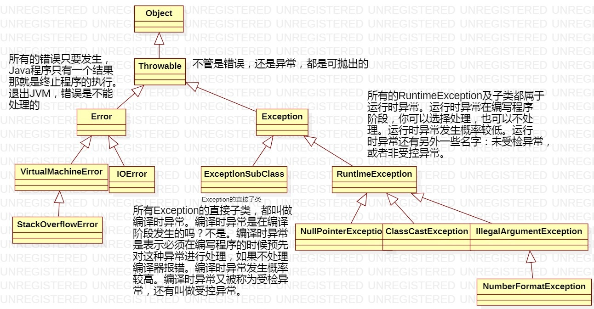

### Java的异常

##### 异常处理机制

1. java中异常的作用是：增强程序健壮性。
2. 什么是异常：程序执行过程中的不正常情况。
3. java中异常以类和对象的形式存在。**每当出现异常的时候都需要new异常对象。**每一个异常类都可以创建异常对象。
  4. Object类：Object下有Throwable（可抛出的）
  5. Throwable下有两个分支：Error（不可处理，直接退出JVM）和Exception（可处理的）
  6. Exception下有两个分支：
         1. Exception的直接子类：编译时异常（要求程序员在编写程序阶段必须预先对这些异常进行处理，如果不处理编译器报错，因此得名编译时异常。）。
         2. RuntimeException：运行时异常。（在编写程序阶段程序员可以预先处理，也可以不管，都行。）
7. 编译时异常和运行时异常，都是发生在运行阶段。编译阶段异常是不会发生的。
   1. 编译时异常因为什么而得名？
      		因为编译时异常必须在编译(编写)阶段预先处理，如果不处理编译器报错，因此得名。所有异常都是在运行阶段发生的。因为只有程序运行阶段才可以new对象。因为异常的发生就是new异常对象。



4. 编译时异常和运行时异常的区别？

   1. 编译时异常一般发生的概率比较高。对于一些发生概率较高的异常，需要在运行之前对其进行预处理。
   2. 运行时异常一般发生的概率比较低。

5. 编译时异常还有其他名字：

   1. 受检异常：CheckedException
   2. 受控异常

6. 运行时异常还有其它名字：

   1. 未受检异常：UnCheckedException
   2. 非受控异常、

7. **所有异常都是发生在运行阶段的。**

8. Java语言中对异常的处理包括两种方式：

   1. 第一种方式：在方法声明的位置上，使用throws关键字，抛给上一级。谁调用我，我就抛给谁。抛给上一级。
   2. 第二种方式：使用try..catch语句进行异常的捕捉。这件事发生了，谁也不知道，因为我给抓住了。

   异常发生之后，如果我选择了上抛，抛给了我的调用者，调用者需要对这个异常继续处理，那么调用者处理这个异常同样有两种处理方式。

9. 注意：Java中异常发生之后如果一直上抛，最终抛给了main方法，main方法继续向上抛，抛给了调用者JVM，JVM知道这个异常发生，只有一个结果。终止java程序的执行。

10. 在catch中可以使用|来代替或运算，来表示多个异常。

11. 总结异常中的关键字：

    1. 异常捕捉：
       1. try
       2.  catch
       3. finally
    2. throws 在方法声明位置上使用，表示上报异常信息给调用者。
       throw 手动抛出异常！

###### 代码示例

```java
public class Test {
    public static void main(String[] args) {
        /**
         * 程序执行到此处发生了ArithmeticException异常，
         * 底层new了一个ArithmeticException异常对象，
         * 然后抛出了，由于是main方法调用了100 / 0，
         * 所以这个异常ArithmeticException抛给了main方法，
         * main方法没有处理，将这个异常自动抛给了JVM。
         * JVM最终终止程序的执行。
         * ArithmeticException 继承 RuntimeException，属于运行时异常。
         * 在编写程序阶段不需要对这种异常进行预先的处理。
         */
        // 实际上JVM在执行到此处的时候，会new异常对象：new ArithmeticException("/ by zero");
        // 并且JVM将new的异常对象抛出，打印输出信息到控制台了。
        System.out.println(100 / 0);
        // 这里的HelloWorld没有输出，没有执行。
        System.out.println("Hello World!");

        // 通过“异常类”实例化“异常对象”
        NumberFormatException nfe = new NumberFormatException("数字格式化异常！");
        // java.lang.NumberFormatException: 数字格式化异常！
        System.out.println(nfe);

    }
}
```

###### 异常处理的两种方式

```java
public class Test {
    // 以下代码报错的原因是什么？
    /**
     * 因为doSome()方法声明位置上使用了：throws ClassNotFoundException
     * 而ClassNotFoundException是编译时异常。必须编写代码时处理，没有处理编译器报错。
     * @param args
     */
    public static void main(String[] args) {
        // main方法中调用doSome()方法
        // 因为doSome()方法声明位置上有：throws ClassNotFoundException
        // 我们在调用doSome()方法的时候必须对这种异常进行预先的处理。
        // 如果不处理，编译器就报错。
        // 编译器报错信息： Unhandled exception: java.lang.ClassNotFoundException
        // doSome();
        // 第一种处理方式：在方法声明的位置上继续使用：throws，来完成异常的继续上抛。抛给调用者，调用者来处理。
        // 上抛类似于推卸责任。（继续把异常传递给调用者。）
        /*
        public static void main(String[] args) throws ClassNotFoundException {
            doSome();
        }
        */
        // 第二种处理方式：try..catch进行捕捉。
        // 这个异常不会上报，自己把这个事儿处理了。
        // 异常抛到此处为止，不再上抛了。
        // 捕捉等于把异常拦下了，异常真正的解决了。（调用者是不知道的。）
        try {
            doSome();
        } catch (ClassNotFoundException e) {
            e.printStackTrace();
        }
    }

    /**
     * doSome方法在方法声明的位置上使用了：throws ClassNotFoundException
     * 这个代码表示doSome()方法在执行过程中，有可能会出现ClassNotFoundException异常。
     * 叫做类没找到异常。这个异常直接父类是：Exception，所以ClassNotFoundException属于编译时异常。
     * @throws ClassNotFoundException
     */
    public static void doSome() throws ClassNotFoundException{
        System.out.println("doSome!!!!");
    }
}
```

###### throws抛出异常的学习

```java
import java.io.FileInputStream;
import java.io.FileNotFoundException;

/*
注意：
    只要异常没有捕捉，采用上报的方式，此方法的后续代码不会执行。
    另外需要注意，try语句块中的某一行出现异常，该行后面的代码不会执行。
    try..catch捕捉异常之后，后续代码可以执行。

在以后的开发中，处理编译时异常，应该上报还是捕捉呢，怎么选？如果希望调用者来处理，选择throws上报。其它情况使用捕捉的方式。
 */
public class Test {
    // 一般不建议在main方法上使用throws，因为这个异常如果真正的发生了，一定会抛给JVM。JVM只有终止。
    // 异常处理机制的作用就是增强程序的健壮性。怎么能做到，异常发生了也不影响程序的执行。所以
    // 一般main方法中的异常建议使用try..catch进行捕捉。main就不要继续上抛了。
    /*
    public static void main(String[] args) throws FileNotFoundException {
        System.out.println("main begin");
        m1();
        System.out.println("main over");
    }
     */
    public static void main(String[] args) {

        // 100 / 0这是算术异常，这个异常是运行时异常，你在编译阶段，可以处理，也可以不处理。编译器不管。
        // System.out.println(100 / 0); // 不处理编译器也不管
        // 你处理也可以。
        /*
        try {
            System.out.println(100 / 0);
        } catch(ArithmeticException e){
            System.out.println("算术异常了！！！！");
        }
        */

        System.out.println("main begin");
        try {
            // try尝试
            m1();
            // 以上代码出现异常，直接进入catch语句块中执行。
            System.out.println("hello world!");
        } catch (FileNotFoundException e){ // catch后面的好像一个方法的形参。
            // 这个分支中可以使用e引用，e引用保存的内存地址是那个new出来异常对象的内存地址。
            // catch是捕捉异常之后走的分支。
            // 在catch分支中干什么？处理异常。
            System.out.println("文件不存在，可能路径错误，也可能该文件被删除了！");
            System.out.println(e); //java.io.FileNotFoundException: D:\course\01-课\学习方法.txt (系统找不到指定的路径。)
        }

        // try..catch把异常抓住之后，这里的代码会继续执行。
        System.out.println("main over");
    }

    private static void m1() throws FileNotFoundException {
        System.out.println("m1 begin");
        m2();
        // 以上代码出异常，这里是无法执行的。
        System.out.println("m1 over");
    }

    // 抛别的不行，抛ClassCastException说明你还是没有对FileNotFoundException进行处理
    // private static void m2() throws ClassCastException{
    // 抛FileNotFoundException的父对象IOException，这样是可以的。因为IOException包括FileNotFoundException
    // private static void m2() throws IOException {
    // 这样也可以，因为Exception包括所有的异常。
    // private static void m2() throws Exception{
    // throws后面也可以写多个异常，可以使用逗号隔开。
    // private static void m2() throws ClassCastException, FileNotFoundException{
    private static void m2() throws FileNotFoundException {
        System.out.println("m2 begin");
        // 编译器报错原因是：m3()方法声明位置上有：throws FileNotFoundException
        // 我们在这里调用m3()没有对异常进行预处理，所以编译报错。
        // m3();
        m3();
        // 以上如果出现异常，这里是无法执行的！
        System.out.println("m2 over");
    }

    private static void m3() throws FileNotFoundException {
        // 创建一个输入流对象，该流指向一个文件。
        /*
        编译报错的原因是什么？
            第一：这里调用了一个构造方法：FileInputStream(String name)
            第二：这个构造方法的声明位置上有：throws FileNotFoundException
            第三：通过类的继承结构看到：FileNotFoundException父类是IOException，IOException的父类是Exception，
            最终得知，FileNotFoundException是编译时异常。
            错误原因？编译时异常要求程序员编写程序阶段必须对它进行处理，不处理编译器就报错。
         */
        //new FileInputStream("D:\\123.txt");

        // 我们采用第一种处理方式：在方法声明的位置上使用throws继续上抛。
        // 一个方法体当中的代码出现异常之后，如果上报的话，此方法结束。
        new FileInputStream("D:\\123.txt");

        System.out.println("如果以上代码出异常，这里会执行吗?不会！！！");
    }
}

```

###### try..catch的学习

```java
import java.io.FileInputStream;
import java.io.FileNotFoundException;

/*
深入try..catch
    1、catch后面的小括号中的类型可以是具体的异常类型，也可以是该异常类型的父类型。
    2、catch可以写多个。建议catch的时候，精确的一个一个处理。这样有利于程序的调试。
    3、catch写多个的时候，从上到下，必须遵守从小到大。
 */
public class Test {
    /*
    public static void main(String[] args) throws Exception, FileNotFoundException, NullPointerException {

    }
    public static void main(String[] args) throws Exception {

    }*/

    public static void main(String[] args) {

        //编译报错
        /*try {
            FileInputStream fis = new FileInputStream("D:\\123.txt");
        } catch(NullPointerException e) {

        }*/
        /*
        try {
            FileInputStream fis = new FileInputStream("D:\\123.txt");
            System.out.println("以上出现异常，这里无法执行！");
        } catch(FileNotFoundException e) {
            System.out.println("文件不存在！");
        }
        // 这里会执行
        System.out.println("hello world!");*/

        /*try {
            FileInputStream fis = new FileInputStream("D:\\123.txt");
        } catch(IOException e) { // 多态：IOException e = new FileNotFoundException();
            System.out.println("文件不存在！");
        }*/

        /*try {
            FileInputStream fis = new FileInputStream("D:\\123.txt");
        } catch(Exception e) { // 多态：Exception e = new FileNotFoundException();
            System.out.println("文件不存在！");
        }*/

        /*try {
            // 创建输入流
            FileInputStream fis = new FileInputStream("D:\\123.txt");
            // 读文件
            fis.read();
        } catch(Exception e) { // 所有的异常都走这个分支。
            System.out.println("文件不存在！");
        }*/

        /*try {
            //创建输入流
            FileInputStream fis = new FileInputStream("D:\\123.txt");
            //读文件
            fis.read();
        } catch(FileNotFoundException e) {
            System.out.println("文件不存在！");
        } catch(IOException e){
            System.out.println("读文件报错了！");
        }*/

        // 编译报错。FileNotFoundException应该比IOException先处理
        /*
        try {
            //创建输入流
            FileInputStream fis = new FileInputStream("D:\\123.txt");
            //读文件
            fis.read();
        } catch(IOException e){
            System.out.println("读文件报错了！");
        } catch(FileNotFoundException e) {
            System.out.println("文件不存在！");
        }
         */

        // JDK8的新特性！
        try {
            //创建输入流
            FileInputStream fis = new FileInputStream("D:\\123.txt");
            // 进行数学运算
            System.out.println(100 / 0); // 这个异常是运行时异常，编写程序时可以处理，也可以不处理。
        } catch(FileNotFoundException | ArithmeticException | NullPointerException e) {
            System.out.println("文件不存在？数学异常？空指针异常？都有可能！");
        }
    }
}
```

