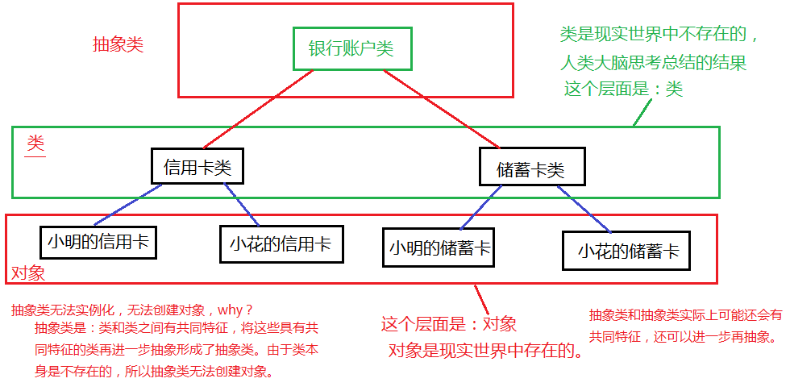

### Java抽象类

类到对象是实例化。对象到类是抽象。



#### 抽象类：

1. 什么是抽象类？
   	类和类之间具有共同特征，将这些共同特征提取出来，形成的就是抽象类。
   	类本身是不存在的，所以抽象类无法创建对象《无法实例化》。

2. 抽象类属于什么类型？
   	抽象类也属于引用数据类型。

3. 抽象类怎么定义？
   	语法：

   ```java
   [修饰符列表] abstract class 类名{
   	类体;
   }
   ```

4. 抽象类是无法实例化的，无法创建对象的，所以抽象类是用来被子类继承的。

5. final和abstract不能联合使用，这两个关键字是对立的。

6. 抽象类的子类可以是抽象类。也可以是非抽象类。

7. 抽象类虽然无法实例化，但是抽象类有构造方法，这个构造方法是供子类使用的。

8. 抽象类关联到一个概念：抽象方法。什么是抽象方法呢？
   ​	抽象方法表示没有实现的方法，没有方法体的方法。例如：	

   ```java
   public abstract void doSome();
   ```

   ​	抽象方法特点是：
   ​		特点1：没有方法体，以分号结尾。
   ​		特点2：前面修饰符列表中有abstract关键字。
   ​		**抽象类中不一定有抽象方法，抽象方法必须出现在抽象类中。**
   
9. **一个非抽象的类，继承抽象类，必须将抽象类中的抽象方法进行覆盖/重写/实现。**这是java语法上强行规定的，必须的，不然编译器就报错了。这里的覆盖或者说重写，也可以叫做实现。（对抽象的实现。）

10. 面试题（判断题）：java语言中凡是没有方法体的方法都是抽象方法。
   	不对，错误的。
   	Object类中就有很多方法都没有方法体，都是以“;”结尾的，但他们都不是抽象方法，例如：

   ```java
   public native int hashCode();
   ```

   ​	这个方法底层调用了C++写的动态链接库程序。前面修饰符列表中没有：abstract。有一个native。表示调用JVM本地程序。

##### 代码实例

```java
public class SuperStudy{
    public static void main(String[] args) {
        // 错误: Account是抽象的; 无法实例化
        // Account act = new Account();
    }
}
// 银行账户类
// 错误: 非法的修饰符组合: abstract和final
/*
final abstract class Account{

}
*/
abstract class Account{
    public Account(){super();}
    public Account(String name){}
    // 非抽象方法
    public void doOther(){}
    // 抽象方法
    public abstract void withdraw();
}
// 子类继承抽象类，子类可以实例化对象
class CreditAccount extends Account{
	public CreditAccount(){
		super();
	}
	// 子类继承抽象类,必须实现其抽象方法
	public void withdraw(){

    }
}
// 抽象类的子类可以是抽象类吗？可以
abstract class TestAccount extends Account{

}
```

#### 面向抽象编程

```java
public class AbstractTest02{
	public static void main(String[] args){
		// 能不能使用多态?
		// 父类型引用指向子类型对象。
		Animal a = new Bird();  // 向上转型。（自动类型转换）

		// 这就是面向抽象编程。
		// 以后你都是调用的a.XXXX
		// a的类型是Animal，Animal是抽象的
		// 面向抽象编程，不要面向具体编程，降低程序的耦合度，提高程序的扩展力。
		/*
			分析以下：
				编译的时候这个move()方法是谁的？是父类Animal的
				运行的时候这个move()方法又是谁的？是子类的
		*/
		a.move();
	}
}

// 动物类（抽象类）
abstract class Animal{

	// 抽象方法
	public abstract void move();
}

// 子类（非抽象的）
// 错误: Bird不是抽象的, 并且未覆盖Animal中的抽象方法move()
/*
class Bird extends Animal{
}
*/

class Bird extends Animal{
	// 需要将从父类中继承过来的抽象方法进行覆盖/重写，或者也可以叫做“实现”。
	// 把抽象的方法实现了。
	public void move(){
		System.out.println("鸟儿在飞翔！");
	}
}

// 如果Bird是抽象类的话，那么这个Animal中继承过来的抽象方法也可以不去重写/覆盖/实现。
/*
abstract class Bird extends Animal{
}
*/	

/*
	分析：
		Animal是父类，并且是 抽象的。
		Animal这个抽象类中有一个抽象方法move。

		Bird是子类，并且是 非抽象的。
		Bird继承Animal之后，会将抽象方法继承过来。

*/
```
