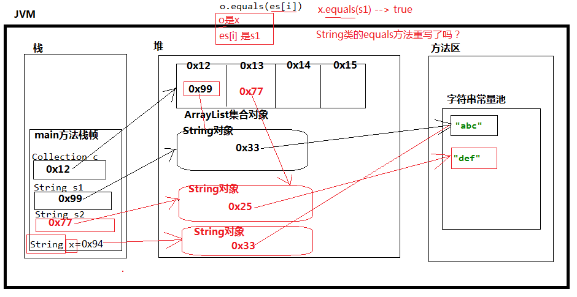

### 集合的Collection接口

#### 关于java.util.Collection接口中常用的方法。

1. Collection中能存放什么元素？
   	没有使用“泛型”，Collection中可以存储Object的所有子类型。使用了“泛型”，Collection中只能存储某个具体的类型。Collection中什么都能存，只要是Object的子类型就行。（集合中不能直接存储基本数据类型，也不能存java对象，只是存储java对象的内存地址。）

2. Collection中的常用方法

   ```java
   boolean add(Object e) // 向集合中添加元素
   int size() // 获取集合中元素的个数
   void clear() // 清空集合
   boolean contains(Object o) // 判断当前集合中是否包含元素o，包含返回true，不包含返回false
   boolean remove(Object o) // 删除集合中的某个元素。
   boolean isEmpty() // 判断该集合中元素的个数是否为0
   Object[] toArray() // 调用这个方法可以把集合转换成数组。
   ```
   
3. **存放在一个集合中的类型，一定要重写equals方法。**

##### 代码示例

```java
import java.util.ArrayList;
import java.util.Collection;

public class Test{
    public static void main(String[] args){
        // 创建一个集合对象
        // Collection collection = new Collection();// 接口是抽象的，无法实例化。
        // 多态
        Collection collection = new ArrayList();
        // 测试Collection接口中的常用方法
        collection.add(1314);// 自动装箱(java5的新特性。),实际上是放进去了一个对象的内存地址。Integer x = new Integer(1314);
        collection.add(new Object());
        collection.add(new Student());
        // 获取集合中元素的个数
        System.out.println("集合中元素个数是：" + collection.size());// 集合中元素个数是：3
        // 清空集合
        collection.clear();
        System.out.println("集合中元素个数是：" + collection.size());// 集合中元素个数是：0
        // 再向集合中添加元素
        collection.add("Hello");// "Hello"对象的内存地址放到了集合当中。
        collection.add("Word");
        collection.add("def");
        // 判断集合中是否包含"def"
        boolean flag =  collection.contains("def");
        System.out.println(flag); // true
        // 删除集合中某个元素
        collection.remove("def");
        System.out.println("集合中元素个数是：" + collection.size()); // 集合中元素个数是：2
        System.out.println(collection.contains("def"));// false
        // 判断集合是否为空（集合中是否存在元素）
        System.out.println(collection.isEmpty());// false
        collection.clear();
        System.out.println(collection.isEmpty());// true（true表示集合中没有元素了！）
        collection.add("Hello");
        collection.add("Word");
        collection.add(new Object());
        // 转换成数组是Object类型的数组（了解，使用不多。）
        Object[] objs = collection.toArray();
        for (int i = 0; i < objs.length; i++) {
            // 遍历数组
            Object obj = objs[i];
            System.out.println(obj);
        }
    }
}
class Student{}
```

#### 深入Collection集合的contains方法：

1. contains方法是用来判断集合中是否包含某个元素的方法，那么它在底层是怎么判断集合中是否包含某个元素的呢？
   	调用了equals方法进行比对。equals方法返回true，就表示包含这个元素。

   ```java
   boolean contains(Object o) // 判断集合中是否包含某个对象o,如果包含返回true， 如果不包含返回false。
   ```

###### 代码示例

```java
import java.util.ArrayList;
import java.util.Collection;

public class Test {
    public static void main(String[] args) {
        // 创建集合对象
        Collection collection = new ArrayList();
        // 向集合中存储元素
        String s1 = new String("abc");// s1 = 0x99
        collection.add(s1);// 放进去了一个"abc"
        String s2 = new String("def");// s2 = 0x77
        collection.add(s2);
        // 集合中元素的个数
        System.out.println("元素的个数是：" + collection.size());// 2
        // 新建的对象String
        String x = new String("abc");// x = 0x94
        // collection集合中是否包含x？结果猜测一下是true还是false？
        System.out.println(collection.contains(x));// 判断集合中是否存在"abc" true
    }
}
```



#### 深入Collection集合的remove方法

remove方法与contains方法一样，都是调用了equals方法进行比对。一样的话全部删除。所以一定要重写equals方法。

```java
import java.util.ArrayList;
import java.util.Collection;

public class Test {
    public static void main(String[] args) {
        // 创建集合对象
        Collection collection = new ArrayList();
        // 创建用户对象
        User user1 = new User("Jack");
        // 加入集合
        collection.add(user1);
        // 判断集合中是否包含user2
        User user2 = new User("Jack");
        // 没有重写equals之前：这个结果是false
        // System.out.println(collection.contains(user2)); // false
        // 重写equals方法之后，比较的时候会比较name。
        System.out.println(collection.contains(user2)); // true

        collection.remove(user2);
        System.out.println(collection.size());// 0

        Integer x = new Integer(10000);
        collection.add(x);
        Integer y = new Integer(10000);
        System.out.println(collection.contains(y)); // true

        // 创建集合对象
        Collection cc = new ArrayList();
        // 创建字符串对象
        String s1 = new String("hello");
        // 加进去。
        cc.add(s1);

        // 创建了一个新的字符串对象
        String s2 = new String("hello");
        // 删除s2
        cc.remove(s2); // s1.equals(s2) java认为s1和s2是一样的。删除s2就是删除s1。
        // 集合中元素个数是？
        System.out.println(cc.size()); // 0
    }
}
class User{
    private String name;
    public User(){}
    public User(String name){
        this.name = name;
    }
    @Override
    public boolean equals(Object obj) {
        if(null == obj || ! (obj instanceof User)){return false;}
        if(obj == this){return true;}
        User user = (User) obj;
        // 如果名字一样表示同一个人。（不再比较对象的内存地址了。比较内容。）
        return user.name.equals(this.name);
    }
}
```

