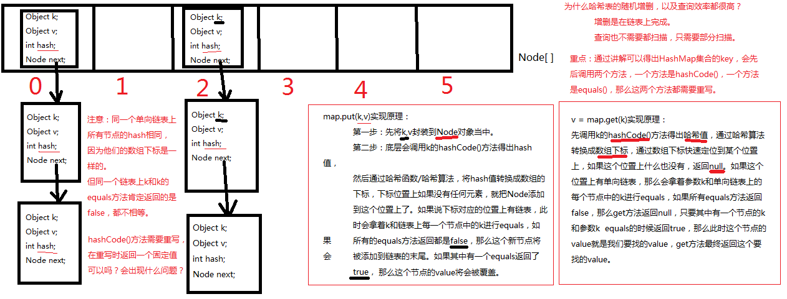

### HashMap集合

1. HashMap集合底层是哈希表/散列表的数据结构。

2. 哈希表是一个怎样的数据结构呢？

   1. 哈希表是一个数组和单向链表的结合体。
   2. 数组：在查询方面效率很高，随机增删方面效率很低。
   3. 单向链表：在随机增删方面效率较高，在查询方面效率很低。
   4. 哈希表将以上的两种数据结构融合在一起，充分发挥它们各自的优点。
   5. 哈希表/散列表：一维数组，这个数组中每一个元素是一个单向链表。（数组和链表的结合体。）

3. HashMap集合底层的源代码：

   ```java
   public class HashMap extends AbstractMap<K,V> implements Map<K,V>, Cloneable, Serializable{
       // HashMap底层实际上就是一个数组。（一维数组）
       transient Node<K,V>[] table;
       // 静态的内部类HashMap.Node
       static class Node<K,V> implements Map.Entry<K,V>{
           final int hash; // 哈希值（哈希值是key的hashCode()方法的执行结果。hash值通过哈希函数/算法，可以转换存储成数组的下标。）
           final K key; // 存储到Map集合中的那个key
           V value; // 存储到Map集合中的那个value
           Node<K,V> next; // // 下一个节点的内存地址。
       }
   }
   ```
   
4. 必须的两个方法的原理：

   ```java
   map.put(k,v)
   v = map.get(k)
   ```

5. HashMap集合的key部分特点：

   1. 无序，不可重复。
      1. 为什么无序？ 因为不一定挂到哪个单向链表上。Hash值是不一样的。即数组下标不一样。
      2. 不可重复是怎么保证的？ equals方法来保证HashMap集合的key不可重复。如果key重复了，value会覆盖。

6. 放在HashMap集合key部分的元素其实就是放到HashSet集合中了。 所以HashSet集合中的元素也需要同时重写hashCode()+equals()方法。

7. 哈希表HashMap使用不当时无法发挥性能！

   1.  假设将所有的hashCode()方法返回值固定为某个值，那么会导致底层哈希表变成了纯单向链表。这种情况我们成为：散列分布不均匀。
   2. 什么是散列分布均匀？
      1. 假设有100个元素，10个单向链表，那么每个单向链表上有10个节点，这是最好的，是散列分布均匀的。
      2. 散列分布均匀需要你重写hashCode()方法时有一定的技巧。
   3. 假设将所有的hashCode()方法返回值都设定为不一样的值，可以吗，有什么问题？
      1. 不行，因为这样的话导致底层哈希表就成为一维数组了，没有链表的概念了。也是散列分布不均匀。

8. **放在HashMap集合key部分的元素，以及放在HashSet集合中的元素，需要同时重写hashCode和equals方法。**

9. HashMap集合的默认初始化容量是16，默认加载因子是0.75，  这个默认加载因子是当HashMap集合底层数组的容量达到75%的时候，数组开始扩容。

10. 重点，记住：HashMap集合初始化容量必须是2的倍数，这也是官方推荐的，这是因为达到散列均匀，为了提高HashMap集合的存取效率，所必须的。The default initial capacity - MUST be a power of two.

11. HashMap集合key部分允许null吗？

    1. 允许，但是要注意：HashMap集合的key null值只能有一个。
    
12. 对于哈希表数据结构来说：

    1. 如果o1和o2的hash值相同，一定是放到同一个单向链表上。

    2. 当然如果o1和o2的hash值不同，但由于哈希算法执行结束之后转换的数组下标可能相同，此时会发生“哈希碰撞”。

       1. 例如：

          7 % 3 = 1，4 % 3 = 1，这样数组下标都是1。

13. **放在HashMap集合key部分的，以及放在HashSet集合中的元素，需要同时重写hashCode方法和equals方法。**

14. 向Map集合中存，以及从Map集合中取，都是先调用key的hashCode方法，然后再调用equals方法！equals方法有可能调用，也有可能不调用。

    1. 拿put(k,v)举例，什么时候equals不会调用？k.hashCode()方法返回哈希值，哈希值经过哈希算法转换成数组下标。数组下标位置上如果是null，equals不需要执行。
    2. 拿get(k)举例，什么时候equals不会调用？k.hashCode()方法返回哈希值，哈希值经过哈希算法转换成数组下标。数组下标位置上如果是null，equals不需要执行。

15. 注意：如果一个类的equals方法重写了，那么hashCode()方法必须重写。并且equals方法返回如果是true，hashCode()方法返回的值必须一样。equals方法返回true表示两个对象相同，在同一个单向链表上比较。那么对于同一个单向链表上的节点来说，他们的哈希值都是相同的。所以hashCode()方法的返回值也应该相同。

        

##### 根据hashCode获取数组下标的方法

###### 源码

```java
static final int hash(Object key) {
	int h;
	return (key == null) ? 0 : (h = key.hashCode()) ^ (h >>> 16);
}
```

###### tableSizeFor方法

```java
// Returns a power of two size for the given target capacity. HashMap集合初始化容量必须是2的倍数
static final int tableSizeFor(int cap) {
    int n = -1 >>> Integer.numberOfLeadingZeros(cap - 1);
	return (n < 0) ? 1 : (n >= MAXIMUM_CAPACITY) ? MAXIMUM_CAPACITY : n + 1;
}
```

HashMap实现了Map接口的put方法，该put方法调用了putVal方法，根据putVal方法中，有一段代码：

```java
(p = tab[i = (n - 1) & hash]
```

根据tableSizeFor方法，对于创建hashMap时，他的size一定是2^n次方个，putVal方法中的&运算类似于对数组元素下标进行取模运算。因为n是2的n次方,他的二进制是1后面+0的形式，如果减1之后就变为全部为1，比如n=16的二进制10000,15的二进制1111，&与操作是见0就是0，因此如果用16&，不管hash值为多少后面4为全部都是0，这样跟hash表较少出现hash碰撞是相违背的，因为采用n-1的方式&，这样在保证索引永远不大于n-1的同时，因为hash的随机也保证了数据均匀的散列在hash表里。进而实现散列分布均匀。

```java
>>表示右移，如果该数为正，则高位补0，若为负数，则高位补1；
>>>表示无符号右移，也叫逻辑右移，即若该数为正，则高位补0，而若该数为负数，则右移后高位同样补0。
```

###### hash源码中的key.hashCode()保证唯一

 因为返回的是对象在堆中的存储地址，所以可以保证唯一性!

###### 代码示例

```java
import java.util.*;

public class Test {
    public static void main(String[] args) {
        // 测试HashMap集合key部分的元素特点
        // Integer是key，它的hashCode和equals都重写了。
        Map<Integer,String> integerStringMap = new HashMap<>();
        integerStringMap.put(1,"张三");
        integerStringMap.put(2,"李四");
        integerStringMap.put(1,"王五"); //key重复的时候value会自动覆盖。
        System.out.println(integerStringMap.size()); // 2
        // 遍历Map集合
        Set<Map.Entry<Integer,String>> entrySet = integerStringMap.entrySet();
        for (Map.Entry<Integer,String> map : entrySet){
            // 验证结果：HashMap集合key部分元素：无序不可重复。
            System.out.println(map.getKey() + "=" + map.getValue());
        }
        Map map = new HashMap();
        // HashMap集合允许key为null
        map.put(null,null);
        System.out.println(map.size());// 1
        // 通过key获取value
        System.out.println(map.get(null)); // null
        // key重复的话value是覆盖！
        map.put(null, 100);
        System.out.println(map.size()); //1
        // 通过key获取value
        System.out.println(map.get(null)); // 100
    }
}
```

##### 重写hashCode方法和equals方法

```java
import java.util.*;
public class Test {
    public static void main(String[] args) {
        Student student1 = new Student("张三");
        Student student2 = new Student("张三");
        // 重写equals方法之前是false
        // System.out.println(student1.equals(student2)); // false
        // 重写equals方法之后是true
        System.out.println(student1.equals(student2)); //true （student1和student2表示相等）
        System.out.println("student1的hashCode=" + student1.hashCode()); // student1的hashCode=2003749087 (重写hashCode之后：student1的hashCode=774920)
        System.out.println("student2的hashCode=" + student2.hashCode()); // student2的hashCode=1480010240 (重写hashCode之后：student1的hashCode=774920)
        // student1.equals(student2)结果已经是true了，表示student1和student2是一样的，相同的，那么往HashSet集合中放的话，按说只能放进去1个。（HashSet集合特点：无序不可重复）
        Set<Student> students = new HashSet<>();
        students.add(student1);
        students.add(student2);
        System.out.println(students.size()); // 这个结果按说应该是1. 但是结果是2.显然不符合HashSet集合存储特点。怎么办？重写hashCode方法，重写之后就是1了。
    }
}
class Student{
    private String name;
    public Student(String name) {
        this.name = name;
    }

    @Override
    public boolean equals(Object obj) {
        if (this == obj) return true;
        if (obj == null || getClass() != obj.getClass()) return false;
        Student student = (Student) obj;
        return Objects.equals(name, student.name);
    }

    @Override
    public int hashCode() {
        return Objects.hash(name);
    }
}
```

