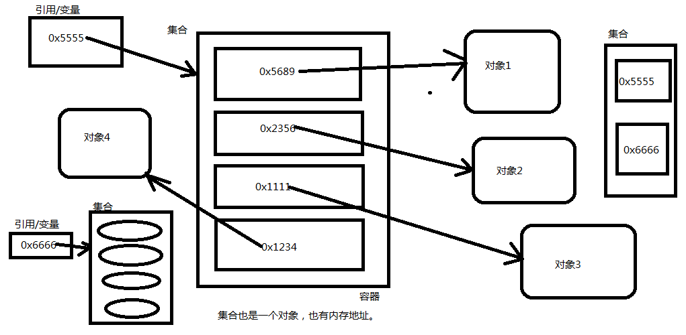
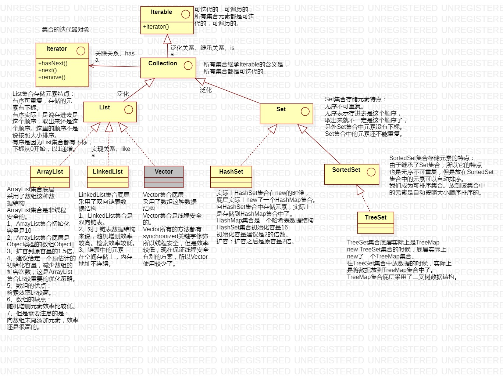
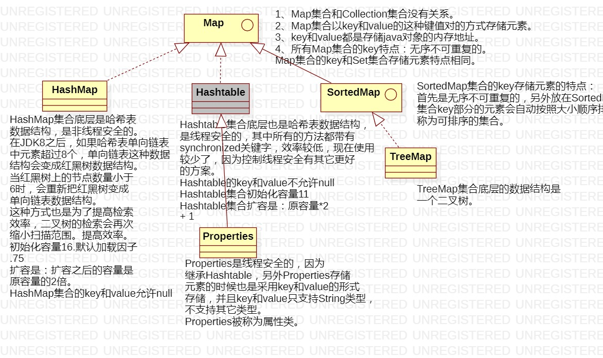

### 集合概述

1. 什么是集合？有什么用？

   1. 数组其实就是一个集合。集合实际上就是一个容器。可以来容纳其它类型的数据。

2. 集合为什么说在开发中使用较多？

   1. ​	集合是一个容器，是一个载体，可以一次容纳多个对象。在实际开发中，假设连接数据库，数据库当中有10条记录，那么假设把这10条记录查询出来，在java程序中会将10条数据封装成10个java对象，然后将10个java对象放到某一个集合当中，将集合传到前端，然后遍历集合，将一个数据一个数据展现出来。

3. 集合不能直接存储基本数据类型，另外集合也不能直接存储java对象，集合当中存储的都是java对象的内存地址。（或者说集合中存储的是引用。）

   

4. 注意：

   1. 集合在java中本身是一个容器，是一个对象。
   2. 集合中任何时候存储的都是“引用”。

5. 在java中每一个不同的集合，底层会对应不同的数据结构。往不同的集合中存储元素，等于将数据放到了不同的数据结构当中。

6. 什么是数据结构？

   1. 数据存储的结构就是数据结构。不同的数据结构，数据存储方式不同。

   2. 例如：

      1. 数组、二叉树、链表、哈希表...以上这些都是常见的数据结构。你往集合c1中放数据，可能是放到数组上了。你往集合c2中放数据，可能是放到二叉树上了。.....

   3. 你使用不同的集合等同于使用了不同的数据结构。

      1. 例如：

         ```java
         new ArrayList(); // 创建一个集合，底层是数组。
         new LinkedList(); // 创建一个集合对象，底层是链表。
         new TreeSet(); // 创建一个集合对象，底层是二叉树。
         .....
         ```

7. 集合在java JDK中哪个包下？

   ```java
   java.util.*;
   // 所有的集合类和集合接口都在java.util包下。
   ```

8. 集合的继承结构图：

   ##### Collection类

   

   ##### Map类

   

9. 集合整个这个体系的结构

   1. 一类是单个方式存储元素：单个方式存储元素，这一类集合中超级父接口：java.util.Collection;
   2. 一类是以键值对儿的方式存储元素，以键值对的方式存储元素，这一类集合中超级父接口：java.util.Map;

10. 总结重点：

    1. 第一个重点：集合继承结构图。
    2. 第二个重点：Collection接口中常用方法。
    3. 第三个重点：迭代器。
    4. 第四个重点：Collection接口中的remove方法和contains方法底层都会调用equals。

#### 总结：

###### 所有的实现类

ArrayList：底层是数组。

LinkedList：底层是双向链表。

Vector：底层是数组，线程安全的，效率较低，使用较少。

HashSet：底层是HashMap，放到HashSet集合中的元素等同于放到HashMap集合key部分了。

TreeSet：底层是TreeMap，放到TreeSet集合中的元素等同于放到TreeMap集合key部分了。

HashMap：底层是Hash表。

Hashtable：底层是Hash表，只不过线程安全的，效率低，使用较少。

Properties：是线程安全的，并且key和value只能存储字符串。

TreeMap：底层是二叉树数据结构。TreeMap集合的Key可以自动按照大小顺序排序。

###### List集合存储元素的特点：

1. ​	有序可重复的
2. ​	有序：存进去的顺序和取出的顺序相同，每一个元素都有下标。
3. ​	可重复：存进去1，可以在存储一个1。

###### Set（Map）集合存储元素的特点：

1. ​	无序不可重复：
2. ​	无序：存进去的顺序和取出的顺序不一定相同，另外Set集合中元素没有下标。
3. ​	不可重复：存进去1，不能再存储1了。

###### SortedSet（SortedMap）集合存储元素的特点：

1. ​	首先是无序不可重复的，但是SortedSet集合中的元素是可排序的。
2. ​	无序：存进去的顺序和取出的顺序不一定相同，另外Set集合中元素没有下标。
3. ​	不可重复：存进去1，不能再存储1了。
4. ​	可排序：可以按照大小顺序排列。

**Map集合的key就是一个Set集合。**

**往Set集合中放数据，实际上放到了Map集合的key部分。**

