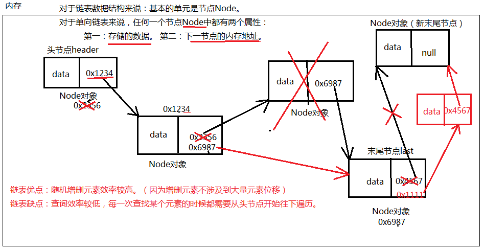

### LinkedList链表（单向链表）

1. 链表的优点：
   1. 由于链表上的元素在空间存储上内存地址不连续。所以随机增删元素的时候不会有大量元素位移，因此随机增删效率较高。在以后的开发中，如果遇到随机增删集合中元素的业务比较多时，建议使用LinkedList。
2. 链表的缺点：
   1. 不能通过数学表达式计算被查找元素的内存地址，每一次查找都是从头节点开始遍历，直到找到为止。所以LinkedList集合检索/查找的效率较低。
3. 单链表中的节点。节点是单向链表中基本的单元。
   1. 每一个节点Node都有两个属性：
      1. 一个属性：是存储的数据。
      2. 另一个属性：是下一个节点的内存地址。
4. ArrayList：把检索发挥到极致。（末尾添加元素效率还是很高的。）
5. LinkedList：把随机增删发挥到极致。
6. 加元素都是往末尾添加，所以ArrayList用的比LinkedList多。
7. LinkedList集合底层也是有下标的。
8. 注意：ArrayList之所以检索效率比较高，不是单纯因为下标的原因。是因为底层数组发挥的作用。
9. LinkedList集合照样有下标，但是检索/查找某个元素的时候效率比较低，因为只能从头节点开始一个一个遍历。
10. LinkedList集合有初始化容量吗？没有。



###### 代码示例

```java
import java.util.*;

public class Test {
    public static void main(String[] args) {
        List list = new ArrayList();
        list.add("abc");
        list.add("def");
        for (int i = 0; i < list.size(); i++) {
            Object obj = list.get(i);
            System.out.println(obj);
        }
    }
}
```

