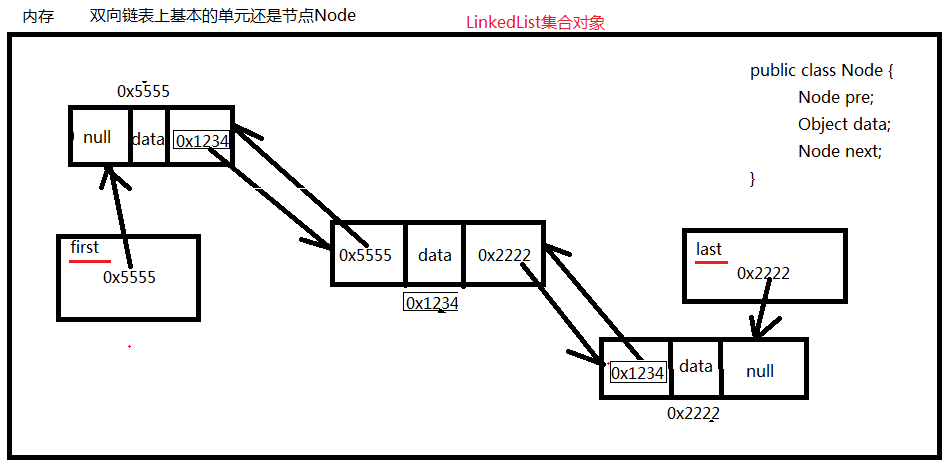

### LinkedList双向链表

1. Java—–Collection 实现的LinkedList(双向链表)
2. 最初这个链表中没有任何元素。first和last引用都是null。



###### 代码示例

```java
import java.util.*;

public class Test {
    public static void main(String[] args) {
        // 不管是LinkedList还是ArrayList，以后写代码时不需要关心具体是哪个集合。
        // 因为我们要面向接口编程，调用的方法都是接口中的方法。
        // List list = new ArrayList(); // 这样写表示底层你用了数组。
        List list = new LinkedList(); // 这样写表示底层你用了双向链表。
        // 以下这些方法你面向的都是接口编程。
        list.add("abc");
        list.add("def");
        for (int i = 0; i < list.size(); i++) {
            Object obj = list.get(i);
            System.out.println(obj);
        }
    }
}
```

