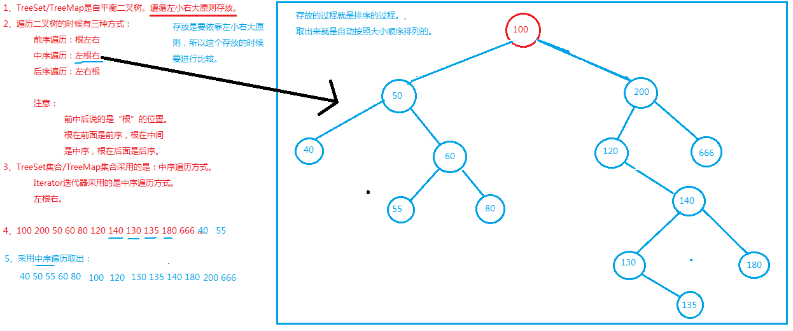

### TreeSet集合

1. TreeSet集合存储元素特点：
   1. 无序不可重复的，但是存储的元素可以自动按照大小顺序排序！称为：可排序集合。
   2. 无序：这里的无序指的是存进去的顺序和取出来的顺序不同。并且没有下标。
   
2. TreeSet集合底层实际上是一个TreeMap，TreeMap集合底层是一个二叉树。放到TreeSet集合中的元素，等同于放到TreeMap集合key部分了。

3. 编写程序从数据库当中取出数据，在页面展示用户信息的时候按照生日升序或者降序。这个时候可以使用TreeSet集合，因为TreeSet集合放进去，拿出来就是有顺序的。

   ```java
   import java.util.*;
   
   public class Test {
       public static void main(String[] args) {
           // 创建一个TreeSet集合
           Set<String> stringSet = new TreeSet<>();
           // 添加元素
           stringSet.add("K");
           stringSet.add("A");
           stringSet.add("C");
           for (String str : stringSet) {
               System.out.println(str);
               /**
                * A,C,K
                * 从小到大自动排序！按照字典顺序，升序！
                */
           }
       }
   }
   ```

4. 对自定义的类型来说，TreeSet可以排序吗？

   1. 没有指定对象之间的比较规则。所以不能排序，要指定对象之间的比较规则就要实现java.lang.Comparable接口，实现compareTo方法。equals可以不写。若不实现其接口，则会抛出java.lang.ClassCastException异常。

   ```java
   import java.util.*;
   public class Test {
       public static void main(String[] args) {
           // 创建TreeSet集合
           TreeSet<User> set = new TreeSet<>();
           // 添加元素
           set.add(new User(100,"sort"));
           set.add(new User(50,"king"));
           set.add(new User(50,"echo"));
           // 遍历
           for (User user : set){
               System.out.println(user);
           }
       }
   }
   // 放在TreeSet集合中的元素需要实现java.lang.Comparable接口。
   // 并且实现compareTo方法。equals可以不写。
   class User implements Comparable<User>{
       private int age;
       private String name;
       public User(int age, String name) {
           this.age = age;
           this.name = name;
       }
       @Override
       public String toString() {
           return "User{" +"age=" + age +", name='" + name + '\'' +'}';
       }
   
       // 需要在这个方法中编写比较的逻辑，或者说比较的规则，按照什么进行比较！
       // k.compareTo(t.key)
       // 拿着参数k和集合中的每一个k进行比较，返回值可能是>0 <0 =0
   
       /*compareTo方法的返回值很重要：
       返回0表示相同，value会覆盖。
       返回>0，会继续在右子树上找。【10 - 9 = 1 ，1 > 0的说明左边这个数字比较大。所以在右子树上找。】
       返回<0，会继续在左子树上找。*/
       @Override
       public int compareTo(User user) { // user1.compareTo(user2);
           // this是user1
           // user是user2
           // user1和user2比较的时候，就是this和user比较。
           if(this.age == user.age){
               // 年龄相同时按照名字排序。
               // 姓名是String类型，可以直接比。调用compareTo来完成比较。
               return this.name.compareTo(user.name);
           }else {
               // 年龄不一样
               return this.age - user.age;// 返回值可能是>0 <0 =0
           }
       }
   }
   ```



##### 使用比较器的方式对TreeSet集合进行排序

1. TreeSet集合中元素可排序的第二种方式：使用比较器的方式。

2. 最终的结论：
   1. 放到TreeSet或者TreeMap集合key部分的元素要想做到排序,包括两种方式：
      1. 第一种：放在集合中的元素实现java.lang.Comparable接口。
      2. 第二种：在构造TreeSet或者TreeMap集合的时候给它传一个比较器对象。单独编写一个比较器Comparator接口。
3. Comparable和Comparator怎么选择呢？
   1. 当比较规则不会发生改变的时候，或者说当比较规则只有1个的时候，建议实现Comparable接口。
   2. 如果比较规则有多个，并且需要多个比较规则之间频繁切换，建议使用Comparator接口。

```java
import java.util.*;
public class Test {
    public static void main(String[] args) {
        // 创建TreeSet集合的时候，需要使用这个比较器。
        // TreeSet<WuGui> wuGuis = new TreeSet<>();//这样不行，没有通过构造方法传递一个比较器进去。

        // 给构造方法传递一个比较器。
        // TreeSet<Animal> treeSet = new TreeSet<>(new AnimalComparator());

        // 可以使用匿名内部类的方式（这个类没有名字。直接new接口。）
        TreeSet<Animal> treeSet = new TreeSet<>(new Comparator<Animal>() {
            @Override
            public int compare(Animal o1, Animal o2) {
                return o1.getAge() - o2.getAge();
            }
        });
        treeSet.add(new Animal(100));
        treeSet.add(new Animal(20));
        for (Animal animal : treeSet){
            System.out.println(animal);
        }
    }
}
class Animal{
    private int age;
    public Animal(int age) {
        this.age = age;
    }
    public int getAge() {
        return age;
    }
    @Override
    public String toString() {
        return "Animal{" +"age=" + age +'}';
    }
}
// 单独在这里编写一个比较器
// 比较器实现java.util.Comparator接口。（Comparable是java.lang包下的。Comparator是java.util包下的。）
class AnimalComparator implements Comparator<Animal>{

    @Override
    public int compare(Animal o1, Animal o2) {
        // 指定比较规则
        // 按照年龄排序
        return o1.getAge() - o2.getAge();
    }
}
```


