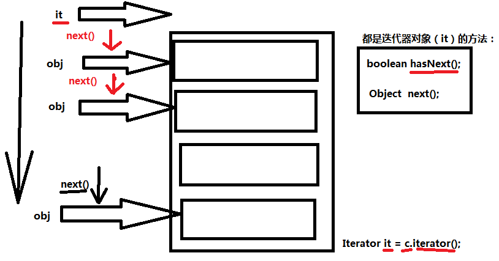
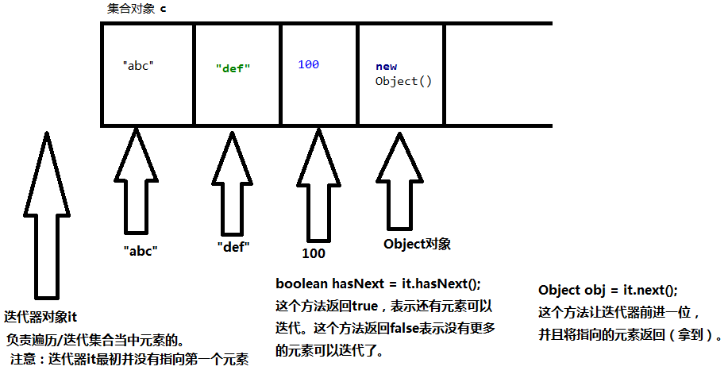

### 集合遍历/迭代

1. 所有的遍历方式/迭代方式，是所有Collection通用的一种方式。在Map集合中不能用。在所有的Collection以及子类中使用。

2. 对集合Collection进行遍历/迭代

   1. 第一步：获取集合对象的迭代器对象Iterator

      ```java
      Iterator iterator = Collection对象名.iterator();
      ```

   2. ​	第二步：通过以上获取的迭代器对象开始迭代/遍历集合。

      1. 使用以下两个方法，这两个方法是迭代器对象Iterator中的方法：

         ```java
         boolean hasNext() // 如果仍有元素可以迭代，则返回 true。
         Object next() // 返回迭代的下一个元素。不管你当初存进去什么，取出来统一都是Object。
         ```

###### 迭代原理



###### 迭代集合的原理



###### 代码示例

```java
import java.util.ArrayList;
import java.util.Collection;
import java.util.Iterator;

public class Test{
    public static void main(String[] args){
        // 创建集合对象
        Collection collection = new ArrayList();// 后面的集合无所谓，主要是看前面的Collection接口，怎么遍历/迭代。
        // 添加元素
        collection.add("Hello");
        collection.add("Word");
        collection.add(new Object());
        // 对集合Collection进行遍历/迭代
        // 第一步：获取集合对象的迭代器对象Iterator
        Iterator iterator = collection.iterator();
        // 第二步：通过以上获取的迭代器对象开始迭代/遍历集合。
        while (iterator.hasNext()){
            // 不管你当初存进去什么，取出来统一都是Object。
            Object obj = iterator.next();
            System.out.println(obj);
        }
        // 一直取，不判断，会出现异常：java.util.NoSuchElementException
        /*while (true){
            Object obj = iterator.next();
            System.out.println(obj);
        }*/
    }
}
```

###### ArrayList集合与HashSet集合

```java
import java.util.ArrayList;
import java.util.Collection;
import java.util.HashSet;
import java.util.Iterator;

public class Test {
    public static void main(String[] args) {
        // 创建集合对象
        Collection collection1 = new ArrayList();// ArrayList集合：有序可重复
        Collection collection2 = new HashSet();// HashSet集合：无序不可重复
        // 无序：存进去和取出的顺序不一定相同。
        // 不可重复：存储100，不能再存储100.
        collection1.add(100);
        collection1.add(100);
        collection2.add(200);
        collection2.add(200);
        // 迭代集合
        Iterator iterator1 = collection1.iterator();
        Iterator iterator2 = collection2.iterator();
        while (iterator1.hasNext()){
            // 存进去是什么类型，取出来还是什么类型。
            Object obj = iterator1.next();
            if(obj instanceof Integer){
                System.out.println("Integer类型");
            }
            // 只不过在输出的时候会转换成字符串。因为这里println会调用toString()方法。
            System.out.println(obj);
        }
        while (iterator2.hasNext()){
            System.out.println(iterator2.next());
        }
    }
}
```

#### 集合元素的remove

**这是Iterator的remove方法**。不是Collection的remove方法。

1. 关于集合元素的remove
   1. 重点：当集合的结构发生改变时，迭代器必须重新获取，如果还是用以前老的迭代器，会出现异常：java.util.ConcurrentModificationException
   2. 重点：在迭代集合元素的过程中，不能调用集合对象的remove方法，删除元素：collection.remove(o); 迭代过程中不能这样。会出现：java.util.ConcurrentModificationException
   3. 重点：在迭代元素的过程当中，一定要使用迭代器Iterator的remove方法，删除元素，不要使用集合自带的remove方法删除元素。

###### 代码示例

```java
import java.util.ArrayList;
import java.util.Collection;
import java.util.Iterator;

public class Test {
    public static void main(String[] args) {
        // 创建集合
        Collection collection1 = new ArrayList();
        // 注意：此时获取的迭代器，指向的是那是集合中没有元素状态下的迭代器。
        // 一定要注意：集合结构只要发生改变，迭代器必须重新获取。
        // 当集合结构发生了改变，迭代器没有重新获取时，调用next()方法时：java.util.ConcurrentModificationException
        Iterator iterator1 = collection1.iterator();
        // 添加元素
        collection1.add(1); // Integer类型
        collection1.add(2);
        collection1.add(3);
        // 获取迭代器
        /*Iterator iterator2 = collection.iterator();
        while (iterator2.hasNext()){
            // 编写代码时next()方法返回值类型必须是Object。
            // Integer i = iterator2.next();
            Object obj = iterator2.next();
            System.out.println(obj);
        }*/
        Collection collection2 = new ArrayList();
        collection2.add("abc");
        collection2.add("def");
        collection2.add("xyz");

        Iterator it2 = collection2.iterator();
        while(it2.hasNext()){
            Object o = it2.next();
            // 删除元素
            // 删除元素之后，集合的结构发生了变化，应该重新去获取迭代器
            // 但是，循环下一次的时候并没有重新获取迭代器，所以会出现异常：java.util.ConcurrentModificationException
            // 出异常根本原因是：集合中元素删除了，但是没有更新迭代器（迭代器不知道集合变化了）
            // c2.remove(o); // 直接通过集合去删除元素，没有通知迭代器。（导致迭代器的快照和原集合状态不同。）
            // 使用迭代器来删除可以吗？
            // 迭代器去删除时，会自动更新迭代器，并且更新集合（删除集合中的元素）。
            it2.remove(); // 删除的一定是迭代器指向的当前元素。
            System.out.println(o);
        }
        System.out.println(collection2.size()); //0
    }
}
```

