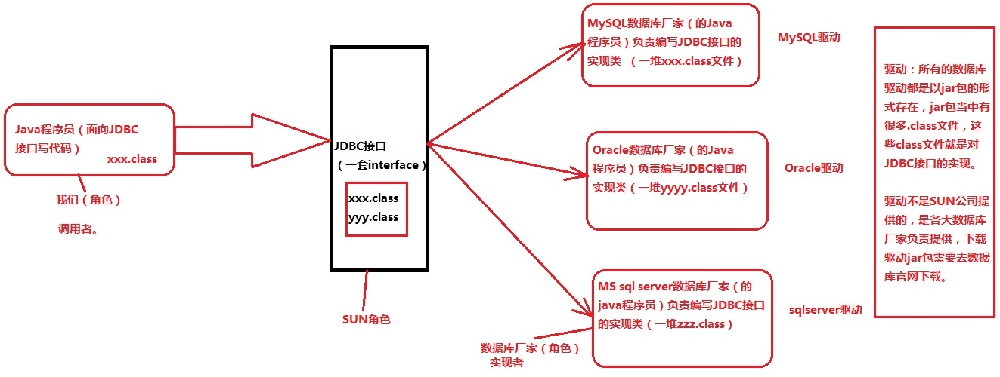
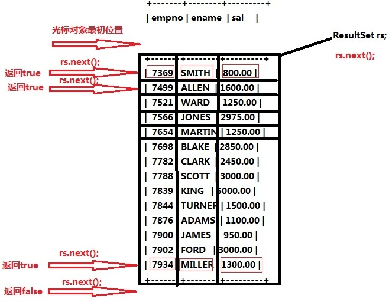

### JDBC概述

1. JDBC是什么？

   Java DataBase Connectivity（Java语言连接数据库）

2. JDBC的本质是什么？

   JDBC是SUN公司制定的一套接口（interface）java.sql.*; (这个软件包下有很多接口。)

3. 接口都有调用者和实现者。面向接口调用、面向接口写实现类，这都属于面向接口编程。

4. 接口的实现类被称为驱动，例如MySQL驱动。

5. 为什么要面向接口编程？

   解耦合：降低程序的耦合度，提高程序的扩展力。

   多态机制就是非常典型的：面向抽象编程。（不要面向具体编程）

   例如：

   ```java
   Animal animal = new Cat(); // 建议这样这样用
   Cat cat = new Cat(); // 不建议这样用
   ```

6. JDBC的本质到底是什么？一套接口。

   

   ###### 模拟JDBC本质：

   ```java
   // 接口的调用者
   public class Test {
       /**
        * Java程序员的角色：
        * 不需要关心夹具体是哪个品牌的数据库，只需要面向JDBC接口写代码。
        * 面向接口编程，面向抽象编程，不要面向具体编程
        * @param args
        */
       public static void main(String[] args) throws Exception{
           JDBC jdbc1 = new MySql();
           // 创建对象可以通过反射机制。
           Class myClass = Class.forName("MySql");
           JDBC jdbc2 = (JDBC) myClass.newInstance();
           // 以下代码都是面向接口调用方法，不需要修改。
           jdbc1.getConnection();
           jdbc2.getConnection();
       }
   }
   // 接口的制定者
   interface JDBC{
       // 连接数据库的方法
       void getConnection();
   }
   // 接口的实现者（实现类被称为驱动（MySQL驱动））
   class MySql implements JDBC{
       @Override
       public void getConnection() {
           System.out.println("连接数据库成功");
       }
   }
   ```

7. JDBC开发前的准备工作，先从官网下载对应的驱动jar包，然后将其配置到环境变量classpath当中。

   ```java
   classpath=.;JDBC包的路径(jar包的路径)
   ```

8. JDBC编程六步（需要背会）

   1. 第一步：注册驱动（作用：告诉Java程序，即将要连接的是哪个品牌的数据库）
   
   2. 第二步：获取连接（表示JVM的进程和数据库进程之间的通道打开了，这属于进程之间的通信，重量级的，使用完之后一定要关闭通道。）
   
   3. 第三步：获取数据库操作对象（专门执行sql语句的对象）
   
   4. 第四步：执行SQL语句（DQL DML....）
   
   5. 第五步：处理查询结果集（只有当第四步执行的是select语句的时候，才有这第五步处理查询结果集。）
   
      
   
   6. 第六步：释放资源（使用完资源之后一定要关闭资源。Java和数据库属于进程间的通信，开启之后一定要关闭。）
   
   7. 常用函数：
   
      ```java
      static void registerDriver(Driver driver) // 向DriverManager注册给定驱动程序。是DriverManager类的方法
      static Connection getConnection(String url, String user, String password) // 试图建立到给定数据库 URL 的连接。
      Statement createStatement() // 创建一个 Statement 对象来将 SQL 语句发送到数据库。
      int executeUpdate(String sql) // 执行给定 SQL 语句，该语句可能为 INSERT、UPDATE 或 DELETE 语句，或者不返回任何内容的 SQL 语句（如 SQL DDL 语句）。
      ResultSet executeQuery(String sql) // 执行给定的 SQL 语句，该语句返回单个 ResultSet 对象。 
      boolean next() // 将光标从当前位置向前移一行。 
      ```
   
   ###### 代码示例
   
   ```java
   import java.sql.*;
   import java.util.*;
   
   // JDBC编程六步
   // 不建议把连接数据库的信息写死在Java程序中，使用properties配置文件来读取
   public class Test {
       public static void main(String[] args) {
           Connection connection = null;
           Statement statement = null;
           ResultSet resultSet = null;
           try {
               // 1.注册驱动
               // 这是注册驱动的第一种写法
               /*Driver driver = new com.mysql.jdbc.Driver(); // 多态，父类型引用指向子类型对象
               DriverManager.registerDriver(driver);*/
               // 这是注册驱动的第二种写法
               // 使用资源绑定器绑定属性配置文件
               ResourceBundle resourceBundle = ResourceBundle.getBundle("jdbc");//从properties配置文件中读取
               // Class.forName("com.mysql.jdbc.Driver");
               Class.forName(resourceBundle.getString("driver"));
               // 2.获取连接
               /**
                * url:统一资源定位符（网络中某一资源的绝对路径）
                * 协议：jdbc:mysql://
                * IP：localhost
                * 端口：3306
                * 资源名：pentest
                */
               connection = DriverManager.getConnection("jdbc:mysql://localhost:3306/pentest","root","123456");
               System.out.println("数据库的连接对象=" + connection);
               // 3.获取数据库操作对象(Statement专门执行SQL语句的)
               statement = connection.createStatement();
               // 4.执行SQL,JDBC的SQL语句不需要写分号。
               // String sql = "insert into news(id,title,content) values(3,'Love','I Love You')";
               // String sql = "delete from news where id = 3";
               // String sql = "update news set title = 'You',content = 'You And You!!!' where id = 3";
               // int count = statement.executeUpdate(sql);//专门执行DML语句，返回值是影响数据库中的记录条数。
               // System.out.println(count == 1 ? "成功" : "失败");
               // int executeUpdate(insert/delete/update);
               // ResultSet executeQuery(select);
               String sql = "select * from news";
               resultSet = statement.executeQuery(sql);
               // 5.处理查询结果
               while (resultSet.next()){
                   // 这是数据库列名的名字
                   int id = resultSet.getInt("id");// 注意:列的名称不是表中的列的名称，是查询结果集的列的名称。
                   String title = resultSet.getString("title");
                   String content = resultSet.getString("content");
                   System.out.println("id=" + id + "," + "title=" + title + "," + "content=" + content);
               }
   
           } catch (SQLException throwables) {
               throwables.printStackTrace();
           } catch (ClassNotFoundException e) {
               e.printStackTrace();
           } finally {
               // 6.释放资源
               // 为了保证资源一定释放，在finally语句块中关闭资源。
               // 并且要遵循从下到大依次关闭
               // 分别对其try...catch
               if(resultSet != null){
                   try {
                       resultSet.close();
                   } catch (SQLException throwables) {
                       throwables.printStackTrace();
                   }
               }
               if(statement != null){
                   try {
                       statement.close();
                   } catch (SQLException throwables) {
                       throwables.printStackTrace();
                   }
               }
               if(connection != null){
                   try {
                       connection.close();
                   } catch (SQLException throwables) {
                       throwables.printStackTrace();
                   }
               }
           }
       }
   }
   ```
   

