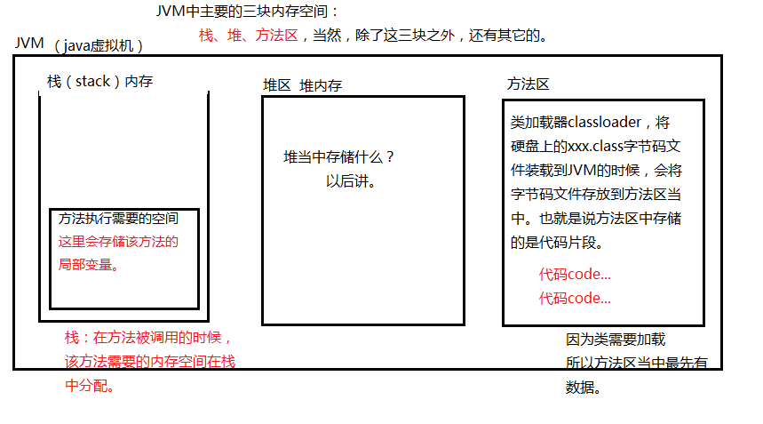
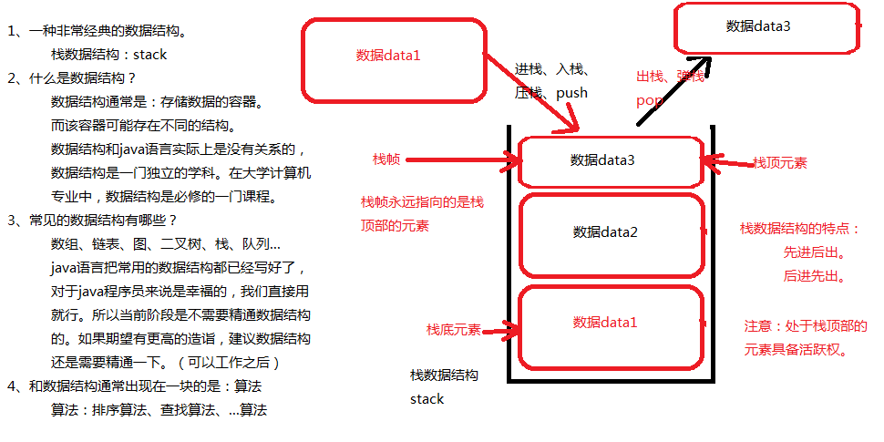

### Java的学习

#### 计算机的编码

1字节=8bit(比特) ------>1byte=8bit

1bit就是一个0或1。byte=2在计算机中这样表示：00000010

1KB=1024byte

1MB=1024KB

1GB=1024MB

1TB=1024GB

char占用2个字节，char采用Unicode编码方式，char类型的字面量使用单引号括起来，char可以储存一个汉字。

计算机永远储存的都是二进制的补码形式。补码=反码+1，对于正数而言，原码=补码=反码

多种数据类型做混合运算时，最终的结果类型是"最大容量"所对应的类型。

eg：char+short+byte会转化为int在做运算。

#### JAVA的编译原理

使用javac命令将xxx.java编译为字节码文件，即：xxx.class文件

使用java xxx时的原理：

第一步：先启动JVM

第二步：JVM启动之后，JVM回去启动类加载器"classloader"

类加载器的作用：加载类的。本质上类加载器负责去硬盘上找“类”对应的“字节码”文件。
假设是“java HelloWorld”，那么类加载器会去硬盘上搜索：HelloWorld.class文件。
假设是“java Test”，那么类加载器会去硬盘上搜索：Test.class文件。

第三步：
			类加载器如果在硬盘上找不到对应的字节码文件，会报错，错误: 找不到或无法加载主类、类加载器如果在硬盘上找到了对应的字节码文件，类加载器会将该字节码
			文件装载到JVM当中，JVM启动“解释器”将字节码解释为“101010000...”这种
			二进制码，操作系统执行二进制码和硬件交互。

##### JVM的简单学习



#### public class与class的区别

一个java源文件可以定义多个class

public的类不是必须的

任何一个class中都可以编写main方法，每一个main方法都是一个入口

只要有一个class的定义，那么就会对应生成一个class文件。

public的类可以没有，但是如果有的话，public修饰的类名必须和源文件名保持一致。

public的类在一个java文件中只能有一个。

```java
public class B{
    
} //这个类是public必须在B.java中声明。切B类只能有一个。
```

#### 关于栈的数据结构



