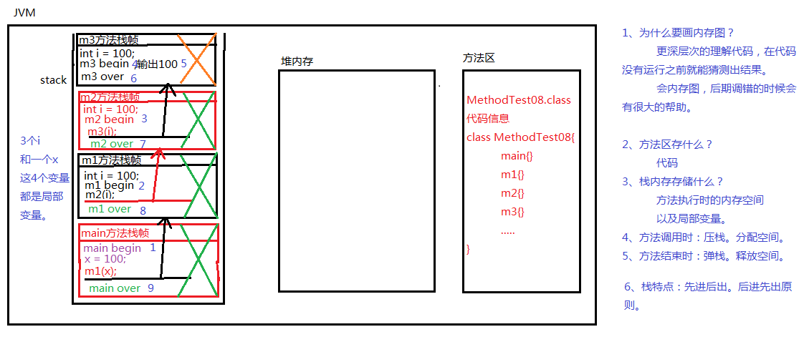

### java方法执行过程中的内存变化

#### 代码

```java
public class JavaTest{
	public static void main(String[] args) {
		System.out.println("main begin");
		int x =100;
		m1(x);
		System.out.println("main end");
	}
	public static void m1(int i) {
		System.out.println("m1 begin");
		m2(i);
		System.out.println("m1 end");
	}
	public static void m2(int i) {
		System.out.println("m2 begin");
		m3(i);
		System.out.println("m2 end");
	}
	public static void m3(int i) {
		System.out.println("m3 begin");
		System.out.println(i);
		System.out.println("m3 end");
	}
}
```

#### 内存图

