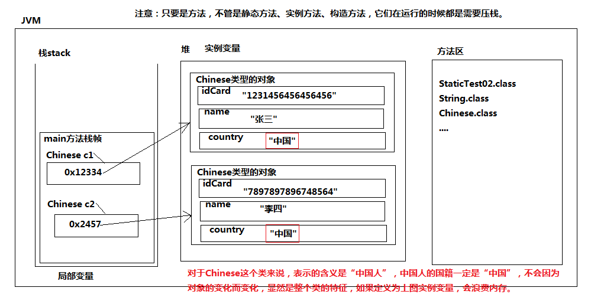
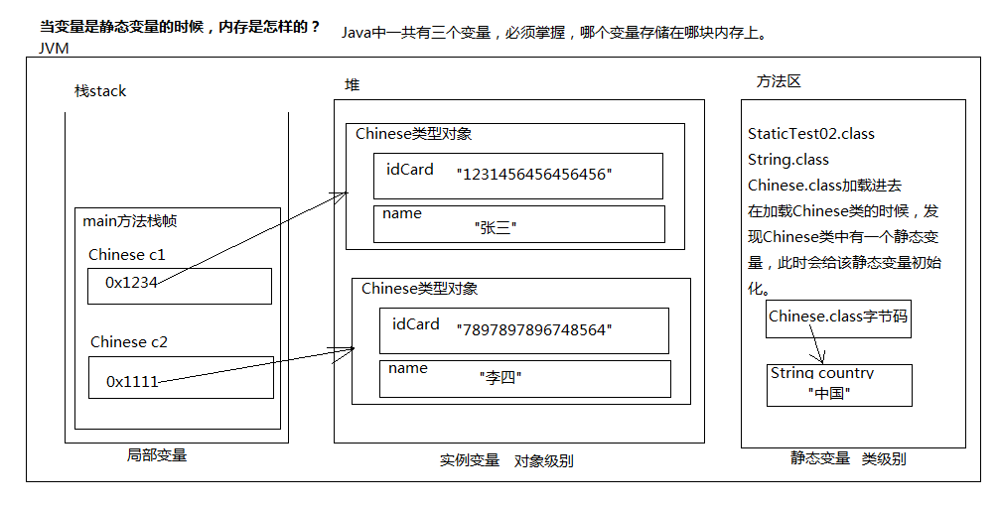

### Static关键字

#### 变量的分类：

1. ​	变量根据声明的位置进行划分：
   ​		在方法体当中声明的变量叫做：局部变量。
   ​		在方法体外声明的变量叫做：成员变量。
2. ​	成员变量又可以分为：
   ​		实例变量：实例的，都是对象相关的，访问时采用“引用.”的方式访问。需要先new对象。必须先有对象，才能访问，可能会出现空指针异常。
   ​		静态变量(类级别的变量)：都是类相关的，访问时采用“类名.”的方式访问。不需要new对象。不需要对象的参与即可访问。没有空指针异常的发生。

#### static关键字

1. static翻译为“静态”

2. 所有static关键字修饰的都是类相关的，类级别的。

3. 所有static修饰的，都是采用“类名.”的方式访问。

4. static修饰的变量：静态变量

5. static修饰的方法：静态方法

6. static修饰的统一都是静态的，都是类相关的，不需要new对象。直接采用“类名.”访问。在本类中可以直接调用方法名来访问。
7. 当一个属性是类级别的属性，所有对象的这个属性的值是一样的，建议定义为静态变量。

##### 什么时候变量声明为实例的，什么时候声明为静态的？

​	如果这个类型的所有对象的某个属性值都是一样的，不建议定义为实例变量，浪费内存空间。建议定义为类级别特征，定义为静态变量，在方法区中只保留一份，节省内存开销。

​	一个对象一份的是实例变量。所有对象一份的是静态变量。

##### 不用static的代码，实例变量

```java
public class StaticTest02{
	public static void main(String[] args){
		Chinese c1 = new Chinese("1231456456456456","张三","中国");
		System.out.println(c1.idCard);
		System.out.println(c1.name);
		System.out.println(c1.country);

		Chinese c2 = new Chinese("7897897896748564","李四","中国");
		System.out.println(c2.idCard);
		System.out.println(c2.name);
		System.out.println(c2.country);
	}
}
// 定义一个类：中国人
class Chinese{
	// 身份证号
	// 每一个人的身份证号不同，所以身份证号应该是实例变量，一个对象一份。
	String idCard; 
	// 姓名
	// 姓名也是一个人一个姓名，姓名也应该是实例变量。
	String name;

	// 国籍
	// 对于“中国人”这个类来说，国籍都是“中国”，不会随着对象的改变而改变。
	// 显然国籍并不是对象级别的特征。
	// 国籍属于整个类的特征。整个族的特征。
	String country;
	public Chinese(){
	
	}
	public Chinese(String s1,String s2, String s3){
		idCard = s1;
		name = s2;
		country = s3;
	}
}
```



##### 用static的代码，静态的变量

```java
public class StaticTest02{
	public static void main(String[] args){
		// 访问中国人的国籍
		// 静态变量应该使用类名.的方式访问
		System.out.println(Chinese.country);

		Chinese c1 = new Chinese("1231456456456456","张三");
		System.out.println(c1.idCard);
		System.out.println(c1.name);

		Chinese c2 = new Chinese("7897897896748564","李四");
		System.out.println(c2.idCard);
		System.out.println(c2.name);
        
		//System.out.println(Chinese.idCard);错误: 无法从静态上下文中引用非静态 变量 idCard
		// idCard是实例变量，必须先new对象，通过“引用.” 访问
	}
}

// 定义一个类：中国人
class Chinese{

	// 身份证号
	// 每一个人的身份证号不同，所以身份证号应该是实例变量，一个对象一份。
	String idCard; 

	// 姓名
	// 姓名也是一个人一个姓名，姓名也应该是实例变量。
	String name;

	// 国籍
	// 重点重点五颗星：加static的变量叫做静态变量
	// 静态变量在类加载时初始化，不需要new对象，静态变量的空间就开出来了。
	// 静态变量存储在方法区。一般会给一个默认值。
	static String country = "中国";

	// 无参数
	public Chinese(){
	
	}
	// 有参数
	public Chinese(String s1,String s2){
		idCard = s1;
		name = s2;
	}
}
```



#### 空引用访问静态不会空指针

1. 实例的：
   	一定需要使用“引用.”来访问。
2. 静态的：
   	建议使用“类名.”来访问，但使用“引用.”也行（不建议使用"引用."）。
   	静态的如果使用“引用.”来访问会让程序员产生困惑：程序员以为是实例的呢。
3. 结论：
   	空指针异常只有在什么情况下才会发生呢?
   		只有在“空引用”访问“实例”相关的，都会出现空指针异常。

```java
public class StaticTest03{
	public static void main(String[] args){
		// 通过"类名."的方式访问静态变量
		System.out.println(Chinese.country);
		// 创建对象
		Chinese c1 = new Chinese("1111111", "张三");
		System.out.println(c1.idCard); // 1111111
		System.out.println(c1.name); // 张三
		System.out.println(c1.country); // 中国

		// c1是空引用
		c1 = null;
		// 分析这里会不会出现空指针异常？
		// 不会出现空指针异常。
		// 因为静态变量不需要对象的存在。
		// 实际上以下的代码在运行的时候，还是：System.out.println(Chinese.country);
		System.out.println(c1.country);

		// 这个会出现空指针异常，因为name是实例变量。
		//System.out.println(c1.name);
	}
}

class Chinese{

	// 实例变量
	String idCard;
	String name;

	// 静态变量
	static String country = "中国";

	//构造方法
	public Chinese(String x, String y){
		idCard = x;
		name = y;
	}
}
```

#### 静态代码块

使用static关键字可以定义：静态代码块
什么是静态代码块，语法是什么？	

```java
static {
	java语句;
	java语句;
}
```

static静态代码块在什么时候执行呢？类加载时执行。并且只执行一次。

###### 静态代码块有这样的特征/特点。

注意：

静态代码块在类加载时执行，并且在main方法执行之前执行。

静态代码块一般是按照自上而下的顺序执行。

静态代码块有啥作用，有什么用？
	第一：静态代码块不是那么常用。（不是每一个类当中都要写的东西。）
	第二：静态代码块这种语法机制是一个特殊的时刻/时机。
	这个时机叫做：类加载时机。

```java
public class JavaTest{
    // 静态代码块（特殊的时机：类加载时机。）
    // 一个类当中可以编写多个静态代码块
    // 编写一个静态代码块
	static{
		System.out.println("Static begin");
	}	
	public static void main(String[] args) {
		System.out.println("main begin");
	}
	static {
		System.out.println("Static end");
	}
}
/*
Static begin
Static end
main begin
*/
```

静态代码块

```java
/*
	栈：方法只要执行，会压栈。（局部变量）
	堆：new出来的对象都在堆中。垃圾回收器主要针对。（实例变量）
	方法区：类的信息，字节码信息，代码片段。（静态变量）
	方法的代码片段放在方法区，但是方法执行过程当中需要的内存在栈中。
*/
public class StaticTest07{
	// 静态变量在什么时候初始化？类加载时初始化。
	// 静态变量存储在哪里？方法区
	static int i = 100;
	// 静态代码块什么时候执行？类加载时执行。
	static {
		// 这里可以访问i吗？可以
		System.out.println("i = " + i);
	}
	// 实例变量
	int k = 111; // k变量是实例变量，在构造方法执行时内存空间才会开辟。
	static {
		//k变量可以访问吗？
		// static静态代码块在类加载时执行，并且只执行一次。
		// 类加载时，k变量空间还没有开辟出来呢。
		//错误: 无法从静态上下文中引用非静态 变量 k
		//System.out.println("k = " + k);

		// 这里可以访问name吗？
		//错误: 非法前向引用
		// 静态代码块和静态变量都在类加载的时候执行，时间相同，只能靠代码的顺序来决定谁先谁后。
		//System.out.println("name = " + name);
	}

	// 静态变量在静态代码块下面。
	static String name = "zhangsan";

	//入口(main方法执行之前实际上执行了很多代码)
	public static void main(String[] args){
		System.out.println("main begin");
		System.out.println("main over");
	}
}
/*
总结：
	到目前为止，你遇到的所有java程序，有顺序要求的是哪些？
		第一：对于一个方法来说，方法体中的代码是有顺序的，遵循自上而下的顺序执行。
		第二：静态代码块1和静态代码块2是有先后顺序的。
		第三：静态代码块和静态变量是有先后顺序的。
*/
```

#### 实例代码块

除了静态代码块之外，还有一种语句块叫做：实例语句块
**实例语句语法？**

```java
{
	java语句;
	java语句;
	java语句;
}
```

实例语句在类加载时并没有执行。

实例语句块在什么时候执行？
	只要是构造方法执行，必然在构造方法执行之前，自动执行“实例语句块”中的代码。
	实际上这也是一个特殊的时机，叫做对象构建时机。

```java
public class InstanceCode{
	//入口
	public static void main(String[] args){
		System.out.println("main begin");
		new InstanceCode();
		new InstanceCode();

		new InstanceCode("abc");
		new InstanceCode("xyz");
	}


	//实例语句块
	{
		System.out.println("实例语句块执行！");	
	}

	// Constructor
	public InstanceCode(){
		System.out.println("无参数构造方法");
	}

	// Constructor
	public InstanceCode(String name){
		System.out.println("有参数的构造方法");
	}

}
```

### 代码的执行顺序

```java
public class JavaTest{
	static {
		System.out.println("A");
	}
	public static void main(String[] args) {
		System.out.println("C");
		new JavaTest();
		new JavaTest("F");
		System.out.println("G");
	}
	{
		System.out.println("D");
	}
	public JavaTest() {
		System.out.println("E");
	}
	public JavaTest(String name) {
		System.out.println("F");
	}
	static {
		System.out.println("B");
	}
}
/*
A
B
C
D
E
D
F
G
*/
```

