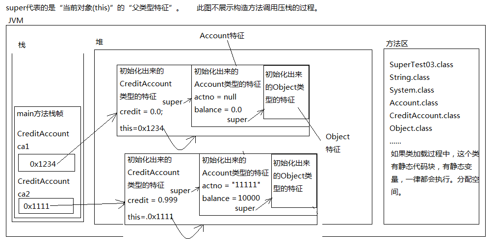
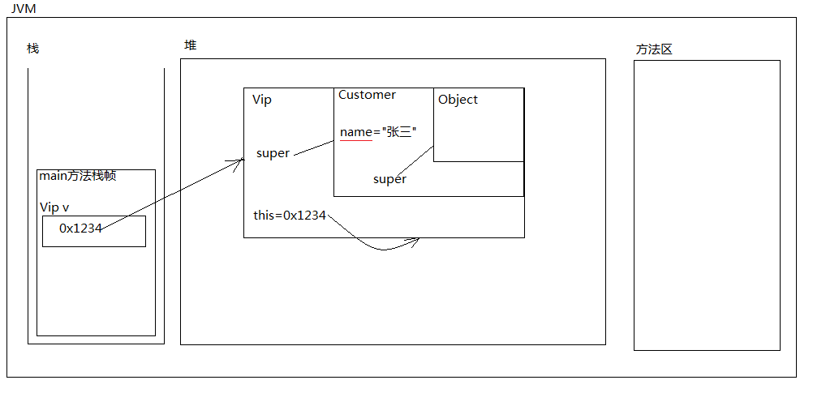
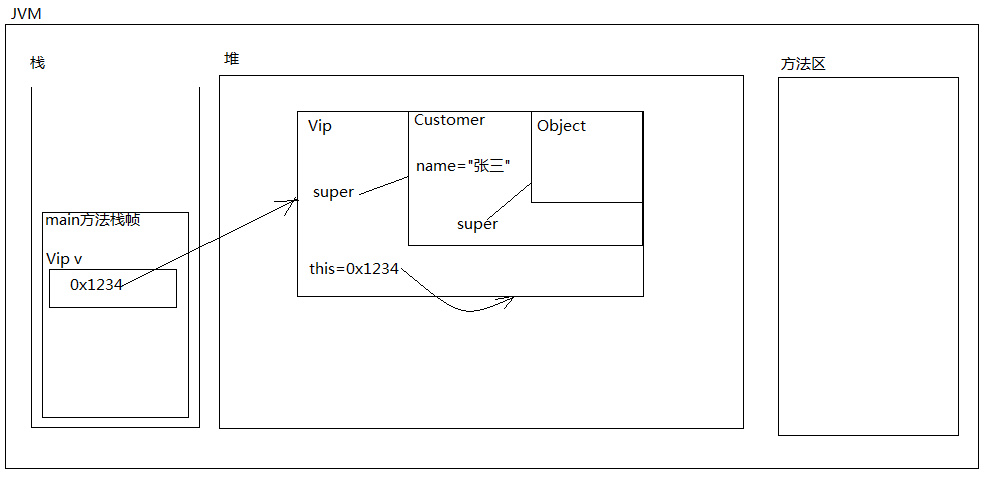
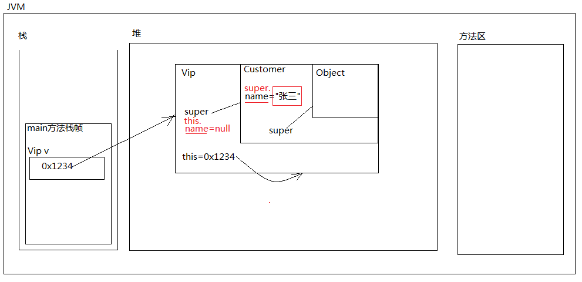

### super关键字

super是一个关键字，全部小写。

#### super和this对比着学习。

##### this:

1. this能出现在实例方法和构造方法中。

2. this的语法是：“this.”、“this()”

3. this不能使用在静态方法中。

4. this. 大部分情况下是可以省略的。

5. this.什么时候不能省略呢？ 在区分局部变量和实例变量的时候不能省略。

   ```java
   public void setName(String name){
   	this.name = name;
   }
   ```

6. this() 只能出现在构造方法第一行，通过当前的构造方法去调用“本类”中其它的构造方法，目的是：代码复用。

##### super:

###### super的使用：

```java
super.属性名 //访问父类的属性
super.方法名(实参) //访问父类的方法
super(实参) //调用父类的构造方法
```

1. super能出现在实例方法和构造方法中。

2. super的语法是：“super.”、“super()”

3. super不能使用在静态方法中。

4. super.大部分情况下是可以省略的。

5. super.什么时候不能省略呢？

   父类和子类中有同名属性，或者说有同样的方法，想在子类中访问父类的，super. 不能省略。

6. super() 只能出现在构造方法第一行，通过当前的构造方法去调用“父类”中的构造方法，目的是：创建子类对象的时候，先初始化父类型特征。

7. super()表示通过子类的构造方法调用父类的构造方法。模拟现实世界中的这种场景：要想有儿子，需要先有父亲。


###### 重要的结论：

当一个构造方法第一行：既没有this()又没有super()的话，默认会有一个super();表示通过当前子类的构造方法调用父类的无参数构造方法。所以必须保证父类的无参数构造方法是存在的。

###### 注意：

1. this()和super() 不能共存，它们都是只能出现在构造方法第一行。
2. 无论是怎样折腾，父类的构造方法是一定会执行的。（百分百的。）
3. 在java语言中不管是是new什么对象，最后老祖宗的Object类的无参数构造方法一定会执行。（Object类的无参数构造方法是处于“栈顶部”）
4. 栈顶的特点：
   ​	最后调用，但是最先执行结束。
   ​	后进先出原则。
5. 注意：
   ​	以后写代码的时候，一个类的无参数构造方法还是建议手动的写出来。
   ​	如果无参数构造方法丢失的话，可能会影响到“子类对象的构建”。

#### 代码示例

```java
public class SuperStudy {
    public static void main(String[] args) {
        // 创建子类对象
		/*
			A类的无参数构造方法！
			B类的无参数构造方法！
		*/
        new B();
    }
}
class A{
    // 建议手动的将一个类的无参数构造方法写出来。
    public A(){
        //super(); // 这里也是默认有这一行代码的。
        System.out.println("A类的无参数构造方法！");
    }
    // 一个类如果没有手动提供任何构造方法，系统会默认提供一个无参数构造方法。
    // 一个类如果手动提供了一个构造方法，那么无参数构造系统将不再提供。
    public A(int i){
        System.out.println("A类的有参数构造方法(int)");
    }
}
class B extends A{
    public B(){
        this("张三");
        System.out.println("B类的无参数构造方法！");
    }
    public B(String name){
        // 调用父类中有参数的构造方法
        super(521);
        System.out.println("B类的有参数构造方法(String)");
    }
}
/*
A类的有参数构造方法(int)
B类的有参数构造方法(String)
B类的无参数构造方法！
*/
```

#### super关键字的的使用时机

1. 举个例子：
   ​	在恰当的时间使用：super(实际参数列表);
2. 注意：
   ​	在构造方法执行过程中一连串调用了父类的构造方法，
   ​	父类的构造方法又继续向下调用它的父类的构造方法，但是实际上对象只创建了一个。

3. 思考：“super(实参)”到底是干啥的？
   ​	super(实参)的作用是：初始化当前对象的父类型特征。
   ​	并不是创建新对象。实际上对象只创建了1个。
4. super关键字代表什么呀？
   ​	super关键字代表的就是“当前对象”的那部分父类型特征。

##### 代码示例

```java
public class SuperStudy {
    public static void main(String[] args) {
        CreditAccount creditAccount1 = new CreditAccount();
 System.out.println(creditAccount1.getActno()+","+creditAccount1.getBalance()+","+creditAccount1.getCredit());
        CreditAccount creditAccount2 = new CreditAccount("张三",100.0,0.99);        System.out.println(creditAccount2.getActno()+","+creditAccount2.getBalance()+","+creditAccount2.getCredit());
    }
}
// 账户
class Account extends Object{
    // 属性
    private String actno;
    private double balance;
    // 构造方法
    public Account(){
        super();
    }
    public Account(String actno,double balance){
        super();
        this.actno=actno;
        this.balance=balance;
    }
    public String getActno(){
        return this.actno;
    }
    public void setActno(String actno){
        this.actno = actno;
    }
    public double getBalance(){
        return this.balance;
    }
    public void setBalance(double balance){
        this.balance = balance;
    }
}
// 信用账户
class CreditAccount extends Account{
    // 属性：信誉度（诚信值）
    // 子类特有的一个特征，父类没有。
    private double credit;
    public CreditAccount(){
        super();
    }
    public CreditAccount(String actno,double balance,double credit){
        super(actno, balance);
        this.credit = credit;
    }
    public double getCredit(){
        return this.credit;
    }
    public void setCredit(double credit){
        this.credit = credit;
    }
}
```



#### super与this的区别

##### 代码实例1

```java
public class SuperTest04{
	public static void main(String[] args){
		Vip v = new Vip("张三");
		v.shopping();
	}
}
class Customer{
	String name;
	public Customer(){}
	public Customer(String name){
		super();
		this.name = name;
	}
}
class Vip extends Customer{
	public Vip(){}
	public Vip(String name){
		super(name);
	}
	// super和this都不能出现在静态方法中。
	public void shopping(){
		// this表示当前对象。
		System.out.println(this.name + "正在购物!");
		// super表示的是当前对象的父类型特征。（super是this指向的那个对象中的一块空间。）
		System.out.println(super.name + "正在购物!");
		System.out.println(name + "正在购物!");
	}
}
```





##### 代码实例2

1. “this.”和“super.”大部分情况下都是可以省略的。

2. this. 什么时候不能省略？

   ```java
   public void setName(String name){
   	this.name = name;
   }
   ```

3. super. 什么时候不能省略？
   父中有，子中又有，如果想在子中访问“父的特征”，super. 不能省略。

```java
public class SuperTest05{
	public static void main(String[] args){
		Vip v = new Vip("张三");
		v.shopping();
	}
}
class Customer {
	String name;
	public Customer(){}
	public Customer(String name){
		super();
		this.name = name;
	}
	public void doSome(){
		System.out.println(this.name + " do some!");
		System.out.println(name + " do some!");
		//错误: 找不到符号
		//System.out.println(super.name + " do some!");
	}
}
class Vip extends Customer{
	// 假设子类也有一个同名属性
	// java中允许在子类中出现和父类一样的同名变量/同名属性。
	String name; // 实例变量
	public Vip(){
	}
	public Vip(String name){
		super(name);
		// this.name = null;
	}
	public void shopping(){
		/*
			java是怎么来区分子类和父类的同名属性的？
			this.name：当前对象的name属性
			super.name：当前对象的父类型特征中的name属性。
		*/
		System.out.println(this.name + "正在购物!"); // null 正在购物
		System.out.println(super.name + "正在购物!"); // 张三正在购物
		System.out.println(name + "正在购物!"); //null 正在购物
	}
}
```



#### super的实际意义

通过这个测试得出的结论：
	super 不是引用。super也不保存内存地址，super也不指向任何对象。
	super 只是代表当前对象内部的那一块父类型的特征。

```Java
public class SuperTest06 {
	// 实例方法
	public void doSome(){
		// SuperTest06@2f92e0f4
		System.out.println(this);
		// 输出“引用”的时候，会自动调用引用的toString()方法。
		//System.out.println(this.toString());
		//编译错误: 需要'.'
		//System.out.println(super);
	}
	// this和super不能使用在static静态方法中。
	/*
	public static void doOther(){
		System.out.println(this);
		System.out.println(super.xxx);
	}
	*/

	// 静态方法，主方法
	public static void main(String[] args){
		SuperTest06 st = new SuperTest06();
		st.doSome();
		// main方法是静态的
		// 错误的。
		/*
		System.out.println(this);
		System.out.println(super.xxxx);
		*/
	}
}
```

#### super的访问

```Java
/*
	在父和子中有同名的属性，或者说有相同的方法，
	如果此时想在子类中访问父中的数据，必须使用“super.”加以区分。
	super.属性名    【访问父类的属性】
	super.方法名(实参) 【访问父类的方法】
	super(实参)  【调用父类的构造方法】
*/
public class SuperTest07{
	public static void main(String[] args){
		/*
			Cat move!
			Cat move!
			Animal move!
		*/
		Cat c = new Cat();
		c.yiDong();
	}
}

class Animal{
	public void move(){
		System.out.println("Animal move!");
	}
}

class Cat extends Animal{
	// 对move进行重写。
	public void move(){
		System.out.println("Cat move!");
	}

	// 单独编写一个子类特有的方法。
	public void yiDong(){
		this.move();
		move();
		// super. 不仅可以访问属性，也可以访问方法。
		super.move();
	}
}
```

