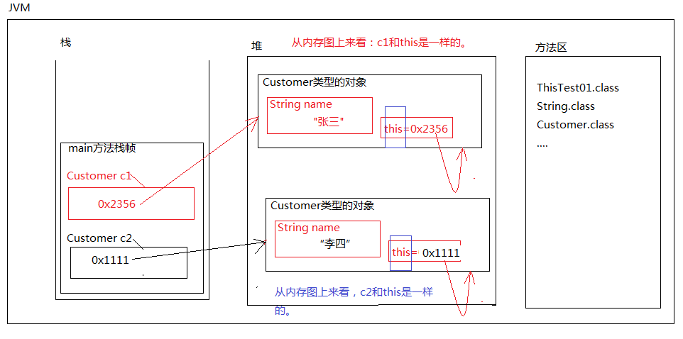

### This关键字

#### This基础

1. this是一个关键字，是一个引用，是一个变量，保存内存地址指向自身。

2. this可以使用在实例方法中，也可以使用在构造方法中。

3. this出现在实例方法中其实代表的是当前对象。

4. this不能使用在静态方法中。因为静态方法是类级别的方法。

5. this. 大部分情况下可以省略，但是用来区分局部变量和实例变量的时候不能省略。

6. this() 这种语法只能出现在构造方法第一行，表示当前构造方法调用本类其他的构造方法，目的是代码复用。


#### This详解

1. 一个对象一个this。this是一个变量，是一个关键字，是一个引用。this保存当前对象的内存地址，指向自身。所以，严格意义上来说，this代表的就是“当前对象”，this存储在堆内存当中对象的内部。

2. this只能使用在实例方法中。谁调用这个实例方法，this就是谁。所以this代表的是：当前对象。

3. “this.”大部分情况下是可以省略的。

4. 为什么this不能使用在静态方法中？？？？？？
   	this代表当前对象，静态方法中不存在当前对象。

##### 代码实例

```java
public class ThisTest01{
	public static void main(String[] args){
		Customer c1 = new Customer("张三");
		c1.shopping();

		Customer c2 = new Customer("李四");
		c2.shopping();

		Customer.doSome();
	}
}

// 顾客类
class Customer{

	// 属性
	// 实例变量（必须采用“引用.”的方式访问）
	String name;   

	//构造方法
	public Customer(){
	
	}
	public Customer(String s){
		name = s;
	}

	// 顾客购物的方法
	// 实例方法
	public void shopping(){
		// 这里的this是谁？this是当前对象。
		// c1调用shopping(),this是c1
		// c2调用shopping(),this是c2
		//System.out.println(this.name + "正在购物!");

		// this. 是可以省略的。
		// this. 省略的话，还是默认访问“当前对象”的name。
		System.out.println(name + "正在购物!");
	}

	// 静态方法
	public static void doSome(){
		// this代表的是当前对象，而静态方法的调用不需要对象。矛盾了。
		// 错误: 无法从静态上下文中引用非静态 变量 this
		//System.out.println(this);
	}
}

class Student{

	// 实例变量，怎么访问？必须先new对象，通过“引用.”来访问。
	String name = "zhangsan";

	// 静态方法
	public static void m1(){
		//System.out.println(name);

		// this代表的是当前对象。
		//System.out.println(this.name);

		// 除非你这样
		Student s = new Student();
		System.out.println(s.name);

	}

	//为什么set和get方法是实例方法？
	public void setName(String s){
		name = s;
	}
	public String getName(){
		return name;
	}

	// 什么时候方法定义为实例方法，什么时候定义为静态方法？
	// 如果方法中直接访问了实例变量，该方法必须是实例方法。
}
```



##### 实例变量的访问与静态变量的访问

```java
public class ThisTest02{

	// 实例变量
	int i = 100; // 这个i变量是不是必须先new对象才能访问。

	// 静态变量
	static int k = 111;

	// 静态方法
	public static void main(String[] args){
		// 错误: 无法从静态上下文中引用非静态 变量 i
		// System.out.println(i);

		// 怎么样访问i
		ThisTest02 tt = new ThisTest02();
		System.out.println(tt.i);

		// 静态变量用“类名.”访问。
		System.out.println(ThisTest02.k);

		// 类名. 能不能省略？
		// 可以
		System.out.println(k);
	}
}
```

##### this的省略问题

1. this可以使用在实例方法中，不能使用在静态方法中。

2. this关键字大部分情况下可以省略，什么时候不能省略呢？
   	在实例方法中，或者构造方法中，为了区分局部变量和实例变量，这种情况下：this. 是不能省略的。

```java
public class ThisTest03{
	public static void main(String[] args){
		Student s = new Student();
		s.setNo(111);
		s.setName("张三");
		System.out.println("学号：" + s.getNo());
		System.out.println("姓名：" + s.getName());

		Student s2 = new Student(2222, "李四");
		System.out.println("学号：" + s2.getNo());
		System.out.println("姓名：" + s2.getName());
	}
}

// 分析一下：以下代码哪里写的不好。
// 学生类
class Student{
	//学号
	private int no;

	//姓名
	private String name;

	//构造方法无参
	public Student(){
	
	}

	//构造方法有参
	/*
	public Student(int i, String s){
		no = i;
		name = s;
	}
	*/

	// 上面的构造方法也增强以下可读性
	public Student(int no, String name){
		this.no = no;
		this.name = name;
	}

	// setter and getter方法
	/*
	public void setNo(int i){
		no = i;
	}
	*/
	/*
	public void setNo(int no){ // 就近原则。
		no = no; //这两个no都是局部变量no，和实例变量no没关系。
	}
	*/
	public void setNo(int no){ 
		//no是局部变量
		//this.no 是指的实例变量。
		this.no = no; // this. 的作用是：区分局部变量和实例变量。
	}
	public int getNo(){
		return no;
		//return this.no;
	}
	/*
	public void setName(String s){
		name = s;
	}
	*/
	/*
	public void setName(String name){ // 就近原则
		name = name; //这两个name都是局部变量name，和实例变量name没关系。
	}
	*/
	public void setName(String name){
		this.name = name;
	}

	/*
	public String getName(){
		return name;
	}
	*/

	public String getName(){ // getName实际上获取的是“当前对象”的名字。
		//return this.name; // 严格来说，这里是有一个 this. 的。只不过这个 this. 是可以省略的。
		return name;
	}
}
```

##### this在构造方法中的调用

1. this除了可以使用在实例方法中，还可以用在构造方法中

2. 新语法：通过当前的构造方法去调用另一个本类的构造方法，可以使用以下语法格式：
   	this(实际参数列表);
   	通过一个构造方法1去调用构造方法2，可以做到代码复用。但需要注意的是：“构造方法1”和“构造方法2” 都是在同一个类当中。
3. this() 这个语法作用是什么？
   	代码复用。
4. 对于this()的调用只能出现在构造方法的第一行。

```java
public class ThisTest04{
	public static void main(String[] args){
		// 调用无参数构造方法
		Date d1 = new Date();
		d1.detail();

		// 调用有参数构造方法
		Date d2 = new Date(2008, 8, 8);
		d2.detail();
	}
}

/*
需求：
	1、定义一个日期类，可以表示年月日信息。
	2、需求中要求：
		如果调用无参数构造方法，默认创建的日期为：1970年1月1日。
		当然，除了调用无参数构造方法之外，也可以调用有参数的构造方法来创建日期对象。
*/
class Date{ // 以后写代码都要封装，属性私有化，对外提供setter and getter
	//年
	private int year;
	//月
	private int month;
	//日
	private int day;

	// 构造方法无参
	// 调用无参数构造方法，初始化的日期是固定值。
	public Date(){
		//错误: 对this的调用必须是构造器中的第一个语句
		//System.out.println(11);
		/*
		this.year = 1970;
		this.month = 1;
		this.day = 1;
		*/
		this(1970, 1, 1);
	}
	// 构造方法有参数
	public Date(int year, int month, int day){
		this.year = year;
		this.month = month;
		this.day = day;
	}

	// 提供一个可以打印日期的方法
	public void detail(){
		//System.out.println(year + "年" + month + "月" + day + "日");
		System.out.println(this.year + "年" + this.month + "月" + this.day + "日");
	}

	//setter and getter
	public void setYear(int year){
		// 设立关卡（有时间可以设立关卡）
		this.year = year;
	}
	public int getYear(){
		return year;
	}
	public void setMonth(int month){
		// 设立关卡（有时间可以设立关卡）
		this.month = month;
	}
	public int getMonth(){
		return month;
	}
	public void setDay(int day){
		// 设立关卡（有时间可以设立关卡）
		this.day = day;
	}
	public int getDay(){
		return day;
	}
}
```

### 代码的实例

JavaStudy

```java
public class JavaStudy {
    public static void main(String[] args) {
        Card card = new Card("1000",2000,1.23);
        User user = new User("Jane Smith",card);
        user.getCard().deposit(100);
        System.out.println(user.getName()+"余额是"+user.getCard().getBalance());
        user.getCard().withdraw(960);
        System.out.println(user.getName()+"余额是"+user.getCard().getBalance());
        user.getCard().withdraw(2000);
    }
}
```

User

```java
public class User {
    private String name;
    private Card card;
    public User(){

    }
    public User(String name,Card card){
        this.name = name;
        this.card = card;
    }
    public void setName(String name){
        this.name = name;
    }
    public String getName(){
        return this.name;
    }
    public void setCard(Card card){
        this.card = card;
    }
    public Card getCard(){
        return this.card;
    }
}
```

Card

```java
public class Card {
    private String id;
    private double balance;
    private double annualInterestRate;
    public Card(){

    }
    public Card(String id,double balance ,double annualInterestRate){
        this.id=id;
        this.balance = balance;
        this.annualInterestRate = annualInterestRate;
    }
    public void setId(String id){
        this.id = id;
    }
    public String getId(){
        return this.id;
    }
    public void setBalance(double balance){
        this.balance=balance;
    }
    public double getBalance(){
        return this.balance;
    }
    public void setAnnualInterestRate(float annualInterestRate){
        this.annualInterestRate = annualInterestRate;
    }
    public double getAnnualInterestRate(){
        return this.annualInterestRate;
    }
    public void withdraw(double money){
        if(this.balance<money){
            System.out.println("余额不足，取钱失败");
        }else {
            this.setBalance(this.getBalance()-money);
            //this.balance -=money;
            System.out.println("成功取出"+money);
        }
    }
    public void deposit(double money){
        this.setBalance(this.getBalance()+money);
        //this.balance+=money;
        System.out.println("成功存入"+money);
    }
}
```

