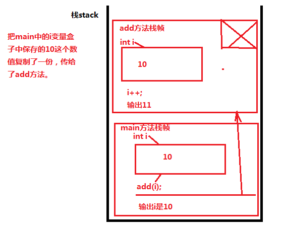
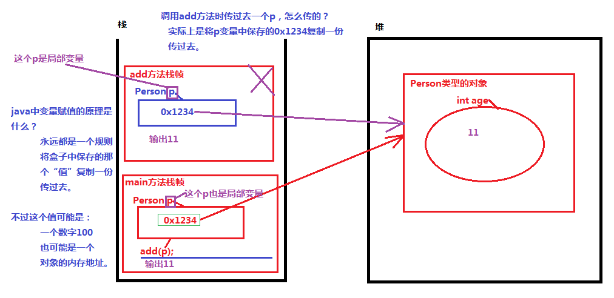

### JAVA的参数传递

- java中规定：参数传递的时候，和类型无关，不管是基本数据类型还是引用数据类型，统一都是将盒子中保存的那个“值”复制一份，传递下去。

- java中只有一个规定：参数传递的时候，一定是将“盒子”中的东西复制一份传递过去。


- 内存地址也是值，也是盒子中保存的一个东西。

#### 按值传递

```java
public class Test1{
	public static void main(String[] args){
        // 局部变量，域是main
		int x = 100;
		int y = x; // x赋值给y，是怎么传递的？将x变量中保存的100这个值复制一份传给y
		int i = 10;
		// 将i变量中保存的10复制一份，传给add方法。
		add(i); 
		System.out.println("main ---> " + i); //10
	}
	public static void add(int k){ // k是局部变量，域是add
		k++;
		System.out.println("add ----> " + k); //11
	}
}
```




#### 按地址传递

```java
/*
	java中关于方法调用时参数传递实际上只有一个规则：
		不管你是基本数据类型，还是引用数据类型，实际上在传递的时候都是
		将变量中保存的那个“值”复制一份，传过去。

		int x = 1;
		int y = x; 把x中保存1复制一份传给y
		x和y都是两个局部变量。

		Person p1 = 0x1234;
		Person p2 = p1; 把p1中保存的0x1234复制一份传给p2
		p1和p2都是两个局部变量。

*/

public class Test2{
	public static void main(String[] args){
		Person p = new Person();
		p.age = 10;
		add(p);
		System.out.println("main--->" + p.age); //11
	}
	// 方法的参数可以是基本数据类型，也可以是引用数据类型，只要是合法的数据类型就行。
	public static void add(Person p){ // p是add方法的局部变量。
		p.age++;
		System.out.println("add--->" + p.age); //11
	}
}

class Person{
	// 成员变量中的实例变量。
	int age;
}
```

