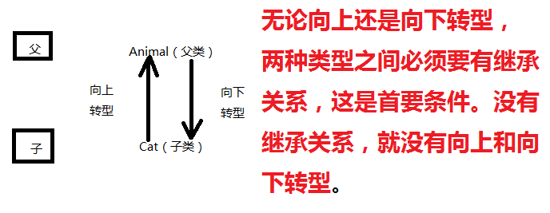

### 多态

#### Java中可以使用.的情况

java中只有“类名”或者“引用”才能去“点”，类名.，引用.，万变不离其宗，只要你想“点”，“点”前面要么是一个类名，要么是一个引用。

#### 什么是多态。

1. 父类型引用指向子类型对象。

2. 多种形态，多种状态，编译和运行有两个不同的状态。

3. 包括编译阶段和运行阶段。
   	编译阶段：绑定父类的方法。叫做静态绑定
   	运行阶段：动态绑定子类型对象的方法。叫做动态绑定

#### 多态的基础语法：

1. 多态的典型代码：父类型的引用指向子类型的对象。

2. 学习多态基础语法之前，我们需要普及两个概念：
   	第一个：向上转型
   		子 ---> 父（自动类型转换）(upcasting)
   	第二个：向下转型
   		父 ---> 子（强制类型转换，需要加强制类型转换符）(downcasting)

3. 注意：
   	java中允许向上转型，也允许向下转型。
   	无论是向上转型，还是向下转型，两种类型之间必须有继承关系，没有继承关系编译器报错。

4. 什么时候必须使用“向下转型”？
   	不要随便做强制类型转换。当你需要访问的是子类对象中“特有”的方法。此时必须进行向下转型。

5. 向下转型有风险吗？
   	容易出现ClassCastException（类型转换异常）
   	怎么避免这个风险？
   		**instanceof**运算符，可以在程序运行阶段动态的判断某个引用指向的对象，是否为某一种类型。养成好习惯，向下转型之前一定要使用instanceof运算符进行判断。

6. 例如：
   ​	Animal a = new Cat();
   ​	编译的时候编译器发现a的类型是Animal，所以编译器会去Animal类中找move()方法，找到了，绑定，编译通过。但是运行的时候和底层堆内存当中的实际对象有关,真正执行的时候会自动调用“堆内存中真实对象”的相关方法。a.move();



### 代码实例

Animal

```java
public class Animal {
    public void move(){
        System.out.println("动物在移动");
    }
}
```

Bird

```java
public class Bird extends Animal{
    // 重写父类的move方法
    public void move(){
        System.out.println("鸟儿在飞翔！！！");
    }

    // 也有自己特有的方法
    public void sing(){
        System.out.println("鸟儿在歌唱！！！");
    }
}
```

Cat

```java
public class Cat extends Animal{
    // 对move方法进行重写
    public void move(){
        System.out.println("cat走猫步！");
    }
    // 这个行为是子类型对象特有的方法。
    public void catchMouse(){
        System.out.println("猫正在抓老鼠！！！！");
    }
}
```

Dog

```java
public class Dog {
}
```

JavaStudy

```java
public class JavaStudy {
    public static void main(String[] args) {
        Animal animal1 = new Animal();
        animal1.move();// 动物在移动
        Cat cat1 = new Cat();
        cat1.move();// cat走猫步！
        Bird bird1 = new Bird();
        bird1.move();// 鸟儿在飞翔！！！

        // 代码可以这样写吗？
		/*
			1、Animal和Cat之间有继承关系吗？有的。
			2、Animal是父类，Cat是子类。
			3、Cat is a Animal，这句话能不能说通？能。
			4、经过测试得知java中支持这样的一个语法：
				父类型的引用允许指向子类型的对象。
				Animal animalcat = new Cat();
				animalcat就是父类型的引用。
				new Cat()是一个子类型的对象。
				允许animalcat这个父类型引用指向子类型的对象。
		*/
        // 没有继承关系的两个类型之间存在转型吗？
        // 错误: 不兼容的类型: Dog无法转换为Animal
        // Animal animaldog = new Dog();
        Animal animalcat1 = new Cat();
        // 调用animalcat的move()方法
		/*
			什么是多态？
				多种形态，多种状态。
			分析：animalcat.move();
				java程序分为编译阶段和运行阶段。
				先来分析编译阶段：
					对于编译器来说，编译器只知道animalcat的类型是Animal，
					所以编译器在检查语法的时候，会去Animal.class
					字节码文件中找move()方法，找到了，绑定上move()
					方法，编译通过，静态绑定成功。（编译阶段属于静态绑定。）
				再来分析运行阶段：
					运行阶段的时候，实际上在堆内存中创建的java对象是
					Cat对象，所以move的时候，真正参与move的对象是一只猫，
					所以运行阶段会动态执行Cat对象的move()方法。这个过程
					属于运行阶段绑定。（运行阶段绑定属于动态绑定。）
			多态表示多种形态：
				编译的时候一种形态。
				运行的时候另一种形态。
		*/
        animalcat1.move();//cat走猫步！
        Animal animalbird1 = new Bird();
        animalbird1.move();// 鸟儿在飞翔！！！

        // ============

        Animal animalcat2 = new Cat();// 底层对象是一只猫。
        // 分析这个程序能否编译和运行呢？
        // 分析程序一定要分析编译阶段的静态绑定和运行阶段的动态绑定。
        // 只有编译通过的代码才能运行。没有编译，根本轮不到运行。
        // 错误: 找不到符号
        // why??? 因为编译器只知道animalcat2的类型是Animal，去Animal.class文件中找catchMouse()方法
        // 结果没有找到，所以静态绑定失败，编译报错。无法运行。（语法不合法。）
        //animalcat2.catchMouse();

        // 假设代码写到了这里，我非要调用catchMouse()方法怎么办？
        // 这个时候就必须使用“向下转型”了。（强制类型转换）
        // 以下这行代码为啥没报错？？？？
        // 因为animalcat2是Animal类型，转成Cat，Animal和Cat之间存在继承关系。所以没报错。
        Cat catanimalcat = (Cat) animalcat2;
        catanimalcat.catchMouse();// 猫正在抓老鼠！！！！
        // 向下转型有风险吗？
        Animal animalbird2 = new Bird();
        /*
			分析以下程序，编译报错还是运行报错？？？
				编译器检测到animalbird2这个引用是Animal类型，
				而Animal和Cat之间存在继承关系，所以可以向下转型。
				编译没毛病。

				运行阶段，堆内存实际创建的对象是：Bird对象。
				在实际运行过程中，拿着Bird对象转换成Cat对象
				就不行了。因为Bird和Cat之间没有继承关系。

			运行是出现异常，这个异常和空指针异常一样非常重要，也非常经典：
				java.lang.ClassCastException：类型转换异常。

			java.lang.NullPointerException：空指针异常。这个也非常重要。
		*/
        //Cat y = (Cat)animalbird2;
        //y.catchMouse();

        // 怎么避免ClassCastException异常的发生？？？
		/*
			新的内容，运算符：
				instanceof （运行阶段动态判断）
			第一：instanceof可以在运行阶段动态判断引用指向的对象的类型。
			第二：instanceof的语法：
				(引用 instanceof 类型)
			第三：instanceof运算符的运算结果只能是：true/false
			第四：c是一个引用，c变量保存了内存地址指向了堆中的对象。
				假设(c instanceof Cat)为true表示:
					c引用指向的堆内存中的java对象是一个Cat。
				假设(c instanceof Cat)为false表示:
					c引用指向的堆内存中的java对象不是一个Cat。

			要养成一个好习惯：
				任何时候，任何地点，对类型进行向下转型时，一定要使用
				instanceof 运算符进行判断。（java规范中要求的。）
				这样可以很好的避免：ClassCastException
		*/
        System.out.println(animalbird2 instanceof Cat);// false
        if(animalbird2 instanceof Cat){// 如果animalbird2是一只Cat
            Cat catanimalbird = (Cat) animalbird2; // 再进行强制类型转换
            catanimalbird.catchMouse();
        }
    }
}
```

### 多态在开发中的作用

1. 多态在开发中的作用是：
   	降低程序的耦合度，提高程序的扩展力。

   ```java
   public class Master{
   	public void feed(Dog d){}
   	public void feed(Cat c){}
   }
   ```

   以上的代码中表示：Master和Dog以及Cat的关系很紧密（耦合度高）。导致扩展力很差。

   ```java
   public class Master{
   	public void feed(Pet pet){
   		pet.eat();
   	}
   }
   ```

   以上的代表中表示：Master和Dog以及Cat的关系就脱离了，Master关注的是Pet类。这样Master和Dog以及Cat的耦合度就降低了，提高了软件的扩展性。

2. 面向对象的三大特征：
   	封装、继承、多态
   	真的是一环扣一环。
   	有了封装，有了这种整体的概念之后。对象和对象之间产生了继承。有了继承之后，才有了方法的覆盖和多态。

#### 代码

JavaStudy

```java
public class JavaStudy {
    public static void main(String[] args) {
        // 创建主人对象
        Master master = new Master();
        // 创建宠物对象
        Pet petCat = new Cat();
        // 主人喂
        master.feed(petCat);
    }
}
```

Master

```java
// 主人类
public class Master {
    /*
	// 假设主人起初的时候只是喜欢养宠物狗狗
	// 喂养宠物狗狗
	public void feed(Dog d){
		d.eat();
	}

	// 由于新的需求产生，导致我们“不得不”去修改Master这个类的代码
	public void feed(Cat c){
		c.eat();
	}
	*/
	
	// 能不能让Master主人这个类以后不再修改了。
	// 即使主人又喜欢养其它宠物了，Master也不需要修改。
	// 这个时候就需要使用：多态机制。
	// 最好不要写具体的宠物类型，这样会影响程序的扩展性。
    public void feed(Pet pet){
        // 编译的时候，编译器发现pet是Pet类，会去Pet类中找eat()方法，结果找到了，编译通过
		// 运行的时候，底层实际的对象是什么，就自动调用到该实际对象对应的eat()方法上。
		// 这就是多态的使用。
        pet.eat();
    }
}
```

Pet

```java
// 所有宠物的父类
public class Pet {
    // 吃的行为（这个方法可以不给具体的实现。）
    public void eat(){}
}
```

Cat

```java
public class Cat extends Pet{
    //重写eat方法
    public void eat(){
        System.out.println("Cat Eat");
    }
}
```

### 方法覆盖

1. 私有方法无法覆盖。
   方法覆盖只是针对于“实例方法”，“静态方法覆盖”没有意义。（这是因为方法覆盖通常和多态联合起来）
   总结两句话：
   	私有不能覆盖。
   	静态不谈覆盖。
2. 什么条件满足之后，会构成方法的覆盖呢？
   	1、发生具有继承关系的两个类之间。
   	2、父类中的方法和子类重写之后的方法：
   		具有相同的方法名、相同的形式参数列表、相同的返回值类型。

3. 在方法覆盖中，关于方法的返回值类型。
   学习了多态机制之后：“相同的返回值类型”可以修改一下吗？
   	对于返回值类型是基本数据类型来说，必须一致。
   	对于返回值类型是引用数据类型来说，重写之后返回值类型可以变的更小（但意义不大，实际开发中没人这样写。）。

#### 静态方法不存在方法覆盖

1. 方法覆盖需要和多态机制联合起来使用才有意义。	

   ```java
   Animal animal = new Cat();
   animal.move();
   ```

   要的是什么效果？
   	编译的时候move()方法是Animal的。
   	运行的时候自动调用到子类重写move()方法上。

2. 静态方法存在方法覆盖吗？
   	多态自然就和对象有关系了。而静态方法的执行不需要对象。所以，一般情况下，我们会说静态方法“不存在”方法覆盖。不探讨静态方法的覆盖。

##### 代码

```java
public class OverrideTest05{
	public static void main(String[] args){
		// 静态方法可以使用“引用.”来调用吗？可以
		// 虽然使用“引用.”来调用，但是和对象无关。
		Animal a = new Cat(); //多态
		// 静态方法和对象无关。
		// 虽然使用“引用.”来调用。但是实际运行的时候还是：Animal.doSome()
		a.doSome();
		Animal.doSome();
		Cat.doSome();
	}
}

class Animal{
	// 父类的静态方法
	public static void doSome(){
		System.out.println("Animal的doSome方法执行！");
	}
}

class Cat extends Animal{
	// 尝试在子类当中对父类的静态方法进行重写
	public static void doSome(){
		System.out.println("Cat的doSome方法执行！");
	}
}
```

#### 私有方法不能覆盖

私有方法不能覆盖。

##### 代码

```java
public class OverrideTest06{

	// 私有方法
	private void doSome(){
		System.out.println("OverrideTest06's private method doSome execute!");
	}
	// 入口
	public static void main(String[] args){
		// 多态
		OverrideTest06 ot = new T();
		ot.doSome(); //OverrideTest06's private method doSome execute!
	}
}

class T extends OverrideTest06{
	// 尝试重写父类中的doSome()方法
	// 访问权限不能更低，可以更高。
	public void doSome(){
		System.out.println("T's public doSome method execute!");
	}
}
```

#### 方法覆盖时返回值类型

对于基本数据类型来说，返回值必须一样，一般在写方法覆盖时，直接从父类复制需要重写的方法，这样不会出现问题。

##### 代码

```java
public class OverrideTest07{
	public static void main(String[] args){
		// 一般重写的时候都是复制粘贴。不要动。不要改。	
	}
}

class Animal{
	/*
	public double sum(int a, int b){
		return a + b;
	}
	*/
	
	/*
	public long sum(int a, int b){
		return a + b;
	}
	*/

	/*
	public int sum(int a, int b){
		return a + b;
	}
	*/
}

class Cat extends Animal{
	// 重写
	// 错误: Cat中的sum(int,int)无法覆盖Animal中的sum(int,int)
	/*
	public int sum(int a, int b){
		return a + b;
	}
	*/
	
	/*
	public double sum(int a, int b){
		return a + b;
	}
	*/

	//错误: Cat中的sum(int,int)无法覆盖Animal中的sum(int,int)
	/*
	public long sum(int a, int b){
		return a + b;
	}
	*/
}

// 父类
class MyClass1{
	
	public Animal getAnimal(){
		return null;
	}
}

// 子类
class MyClass2 extends MyClass1{

	// 重写父类的方法
	/*
	public Animal getAnimal(){
		return null;
	}
	*/

	// 重写的时候返回值类型由Animal变成了Cat，变小了。（可以，java中允许）
	/*
	public Cat getAnimal(){
		return null;
	}
	*/

	// 重写的时候返回值类型由Animal变成了Object。变大了。（不行，java中不允许）
	/*
	public Object getAnimal(){
		return null;
	}
	*/
}
```
