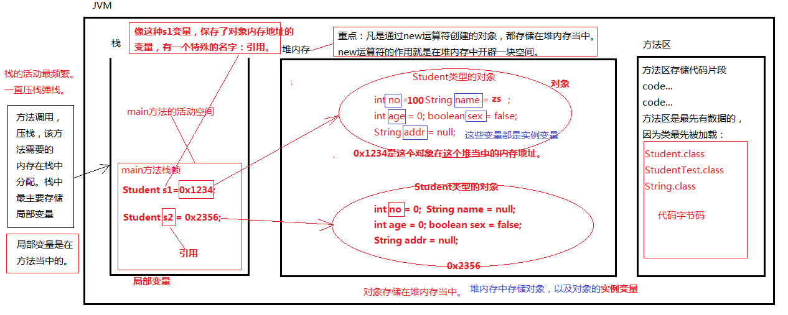
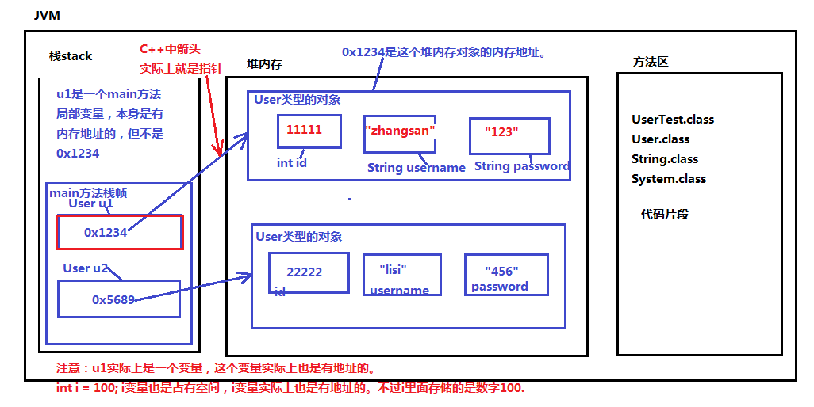
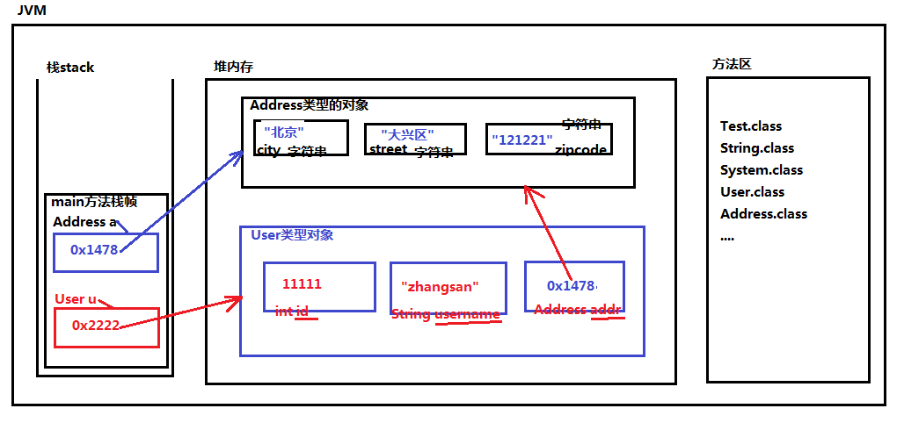

### JAVA的对象和引

类=属性+方法

#### java的数据类型包括两种：

```java
基本数据类型：byte short int long float double boolean char
引用数据类型：String、XueSheng.....
```

java中所有的“类”都属于引用数据类型。

#### 引用和对象怎么区分？

​	“引用”是啥？是存储对象内存地址的一个变量。
​	“对象”是啥？堆里new出来的。

​	通俗一点：
​	只要这个变量中保存的是一个对象的内存地址，那么这个变量就叫做“引用”。

​	思考：
​		引用一定是局部变量吗？不一定。

#### 什么是实例变量？

​	对象又被称为实例。
​	实例变量实际上就是：对象级别的变量。

###### XueSheng类的声明

```java
/*		
变量有一个特点：
	必须先声明，再赋值，才能访问。
	成员变量可以不手动赋值,系统可以为其自动分配值，都是0或者NULL
*/
//XueSheng既是一个类名，同时又是一个“类型名”，属于引用数据类型。
public class XueSheng{ // 这个程序编译之后，会生成XueSheng.class字节码文件。
	// 属性,成员变量
	int xueHao;
	String xingMing;
	int nianLing;
	boolean xingBie;
	String zhuZhi;
}
```

###### 对象的创建

类是模板，通过一个类，是可以创建N多个对象的。new是一个运算符。专门负责对象的创建。

```java
/*
对于
int i = 100;来说
	i是变量名
	int是变量的数据类型
	100是具体的数据。
对于
XueSheng s1 = new XueSheng();来说
	s1是变量名（s1不能叫做对象。s1只是一个变量名字。）
	XueSheng是变量s1的数据类型（引用数据类型）
	new XueSheng() 这是一个对象。（学生类创建出来的学生对象。）
*/
public class XueShengTest{
	public static void main(String[] args){
		XueSheng s1 = new XueSheng(); // 和 int i = 10;一个道理。
		// 再通过该类创建一个全新的对象
		XueSheng s2 = new XueSheng();
		// 再创建另一个对象
		XueSheng xsh = new XueSheng();
		// 以上的3行代码就相当于通过XueSheng类实例化了3个XueSheng对象。
		// 创建对象的个数没有限制，可以随意。只要有模板类就行。
		// 3个对象都属于学生类型。
	}
}
```



#### 对象的创建进阶

基础User类

```java
public class User{
	// 访问id不能这样：User.id （这是错误的，实例变量不能用类名访问。）
	// id的访问必须先造对象，然后对象有了，才能访问对象的id
	int id; //成员变量，实例变量（对象变量，一个对象一份。）
	String username; // 成员变量可以不手动赋值，系统赋默认值。
	String password;
}
// byte short int long float double boolean char :这些默认值是0，false也是0
// 引用类型：null
```

UserTest类

```java
// 第一步：类加载
// 第二步：调用UserTest类的main方法（方法调用要压栈。）
public class UserTest{
	// 方法体外声明的变量叫做成员变量。
	//User u1; //成员变量。（实例变量）
	public static void main(String[] args){
		// 方法体当中声明的变量叫做局部变量
		User u1 = new User();
		// 实例变量怎么访问（属性怎么访问）？语法是：“引用.属性名”
		System.out.println(u1.id); //0
		System.out.println(u1.username); //null
		System.out.println(u1.password); //null

		u1.id = 11111;
		u1.username = "zhangsan";
		u1.password = "123";

		System.out.println(u1.id);
		System.out.println(u1.username);
		System.out.println(u1.password);
		
		User u2 = new User();
		u2.id = 22222;
		u2.username = "lisi";
		u2.password = "456";

		System.out.println(u2.id);
		System.out.println(u2.username);
		System.out.println(u2.password);
	}
}
```



#### 对象嵌套的进阶(自定义类型)

Address类

```java
public class Address{
	String city; // 实例变量
	String street;
	String zipcode;
}
```

User类

```java
public class User{
	// 类=属性+方法
	// 以下3个都是属性，都是实例变量。（对象变量。）
	int id; // 实例变量
	String username; // 实例变量,String是一种引用数据类型
	// Address是一种引用数据类型
	// addr是成员变量并且还是一个实例变量
	// addr是否是一个引用呢？是。addr是一个引用。
	Address addr; 
}
// 实例变量都存储在哪里？实例变量都在堆内存的对象内部。
// 方法体外，类体内定义的变量叫做：成员变量。
```

Test类

```java
public class Test{
	public static void main(String[] args){
		/*
			User u = new User();
			u是引用。
		*/
		//System.out.println(User.id);
        //报错了。id是实例变量，必须先创建对象，通过“引用.”的方式访问。
		/*
		int i = 100;
		int j = i; // 原理：会将i中保存的100复制一份，传给j变量。
		*/
		// 家庭住址对象
		Address a = new Address();
		a.city = "北京";
		a.street = "大兴区";
		a.zipcode = "121221";
		
		// 用户对象
		User u = new User();
		System.out.println(u.id); // 0
		System.out.println(u.username); // null
		System.out.println(u.addr); // null

		u.id = 11111;
		u.username = "zhangsan";
		u.addr = a;

		// 思考一个问题：
		// 我想直到zhangsan他是哪个城市的，代码应该怎么写？
		System.out.println(u.username + "是"+u.addr.city+"城市的！");

		// u.addr.city 这行代码可否拆分呢？u.addr.city 节省变量。
		// 拆分成以下代码和以上效果完全相同，原理完全相同，不同的是以下代码多了两个变量。
		Address ad = u.addr;
		String zhuZhi = ad.city;
		System.out.println(zhuZhi);

		//-----------------------是否理解以下代码---------------------------
		int x = 100;
		// = 代表赋值运算，“赋值”中有一个“值”
		// x变量中的值是100. 将100复制一份给y
		// 表示：将x变量中保存的值100复制一份给y
		int y = x;

		//-----------------------是否理解以下代码---------------------------
		Address k = new Address(); // Address k = 0x1111;
		Address m = k; // 这里表示将k变量中保存的0x1111复制了一份传给了m变量。
	}
}
```



