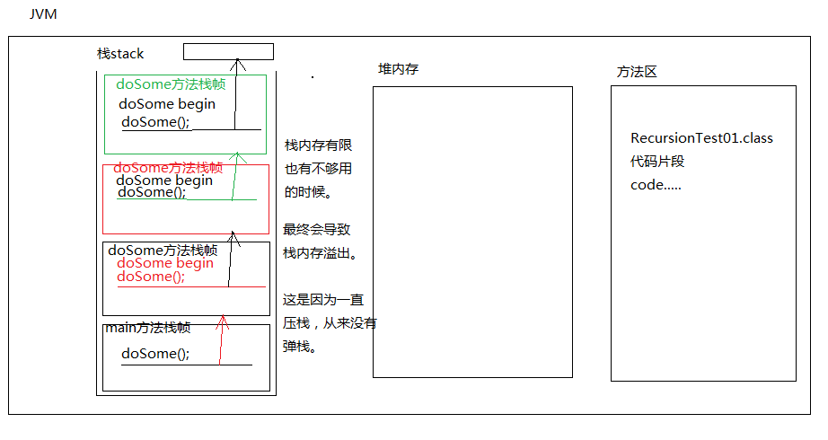
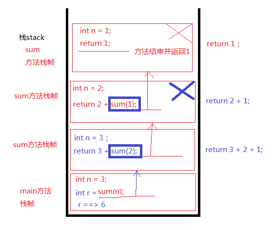

### Java的递归

- 方法自己调用自己，这就是方法递归。所以：递归必须要有结束条件。

当递归时程序没有结束条件，一定会发生：

```
栈内存溢出错误：StackOverflowError
所以：递归必须要有结束条件。
```

- JVM发生错误之后只有一个结果，就是退出JVM。

- 递归假设是有结束条件的，就一定不会发生栈内存溢出错误吗？		

  ```
  假设这个结束条件是对的，是合法的，递归有的时候也会出现栈内存溢出错误。
  因为有可能递归的太深，栈内存不够了。因为一直在压栈。
  ```

在实际的开发中，不建议轻易的选择递归，能用for循环while循环代替的，尽量使用循环来做。因为循环的效率高，耗费的内存少。递归耗费的内存比较大，另外递归的使用不当，会导致JVM死掉。(但在极少数的情况下，不用递归，这个程序没法实现。)

- 在实际的开发中，假设有一天你真正的遇到了：StackOverflowError
  解决问题的思路：
  			首先第一步：
  				先检查递归的结束条件对不对。如果递归结束条件不对，必须对条件进一步修改，直到正确为止。

  ​			第二步：假设递归条件没问题，怎么办？
  ​				这个时候需要手动的调整JVM的栈内存初始化大小。可以将栈内存的空间调大点。（可以调整大一些。）
  ​			第三步：调整了大小，如果运行时还是出现这个错误，
  ​				没办法，只能继续扩大栈的内存大小。(java -X)这个可以查看调整堆栈大小的参数

#### 递归的代码

##### 栈溢出错误

```java
public class JavaTest{
	public static void main(String[] args) {
		dosome();
	}
	public static void dosome() {
		System.out.println("dosome begin");
		dosome();
		System.out.println("dosome end");
	}
}
```

递归没有结束条件的时候会发生栈内存溢出错误



##### 不使用递归计算1-n的和

```java
import java.util.Scanner;

public class JavaTest{
	public static void main(String[] args) {
		Scanner sc =new Scanner(System.in);
		System.out.println("请输入一个数字");
		int input = sc.nextInt();
		System.out.println("1-"+input+"的和是："+sum(input));
	}
	public static int sum(int num) {
		int result=0;
		for(int i=0;i<=num;i++) {
			result+=i;
		}
		return result;
	}
}
```

##### 使用递归计算1-n的和

```java
import java.util.Scanner;

public class JavaTest{
	public static void main(String[] args) {
		Scanner sc =new Scanner(System.in);
		System.out.println("请输入一个数字");
		int input = sc.nextInt();
		System.out.println("1-"+input+"的和是："+sum(input));
	}
	public static int sum(int num) {
		if(num==1) {
			return 1;
		}
		return num+sum(num-1);
	}
}
```

递归原理

