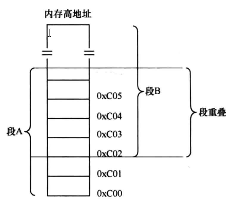

## 软件是如何访问硬件的

硬件在输入输出上大体分为串行和并行，相应的接口也就是串行接口和并行接口。串行硬件通过串行接口与CPU通信，反过来也是，CPU通过串行接口与串行设备数据传输。并行设备的访问类似，只不过是通过并行接口进行的。

访问外部硬件有两个方式：

1. 将某个外设的内存映射到一定范围的地址空间中，CPU通过地址总线访问该内存区域时会落到外设的内存中，这种映射让CPU访问外设的内存就如同访问主板上的物理内存样。有的设备是这样做的，比如显卡，显卡是显示器的适配器，CPU不直接和显示器交互，它只和显卡通信。显卡上有片内存叫显存，它被映射到主机物理内存上的低端 1MB 的 0xB8000～0xBFFFF CPU访问这片内存就是访问显存，住这片内存上写字节便是往屏幕上打印内容。

2. 外设是通过IO接口与CPU通信的，CPU访问外设，就是访问IO接口，由IO接口将信息传递给另一端的外设，也就是说，CPU从来不知道有这些设备的存在，它只知道自己操作的IO接口。

如何访问到 IO 接口呢，答案就是 IO 接口上面有一些寄存器，访问IO接口本质上就是访问这些寄存器。

## 应用程序是什么？和操作系统是如何配合到一起的

应用程序是软件，操作系统也是软件。

CPU只知道去CS:IP寄存器中指向的内存取指令井执行，它不知道什么是操作系统，也无需知道。

编译器提供了一套库函数，库函数中又有封装的系统调用，这样的代码集合称之为运行库。C语言的运行库称为C运行库，就是所谓的 CRT (C Runtime Library）。

应用程序加上操作系统提供功能才算是完整的程序。

需要调用操作系统提供好的函数才能完整地做成一件事，而这个函数便是系统调用。

用户态与内核态是对 CPU 来讲的，是指 CPU 运行在用户态（特权3级）还是内核态（特权0级）。

用户进程陷入内核态是指：由于内部或外部中断发生，当前进程被暂时终止执行，其上下文被内核的中断程序保存起来后，开始执行一段内核的代码。

当应用程序陆入内核后，它自己已经下 CPU 了，以后发生的事，应用程序完全不知道，它的上下文环境己经被保存到自己的0特权级栈中了，那时在 CPU 上运行的程序己经是内核程序了。

系统调用子功能号，该子功能号用寄存器eax寄存器存储。

应用程序处于特权级3，操作系统内核处于特权级0。当用户程序欲访问系统资源时（无论是硬件，还是内核数据结构）它需要进行系统调用。这样 CPU 便进入了内核态，也称管态。

## 内存访问为什么要分段

内存是随机读写设备，即访问其内部任何一处，不需要从头开始找，只要直接给出其地址便可，只要将此地址写入地址总线便可。

16位寄存器意味着其可存储的数字范围是2的16次方，即65536字节，64KB。

1存储单元=1个字节=8Bit

1KB = 1024Byte（字节）

1MB = 1024KB

程序中指令的地址也必须得是绝对物理地址。

CPU 采用`段基址＋段内偏移地址`的方式来访问任意内存，需要专门提供段基址寄存器，这些是cs，ds

es。

CPU 中的地址单元会将这两个地址相加后的结果用于内存访问，送上地址总线。

总之要想访问某个物理地址，只要凑出合适的段基地址和段内偏移地址，其和为该物理地址就行了。

加载用户程序时，只要将整个段的内容复制到新的位置，再将段基址寄存器中的地址改成该地址，程序便可准确无误地运行，因为程序中用的是段内偏移地址，相对于新的段基址，该偏移地址处的内存内容还是一样的。

程序分段的作用：

1. 重定位

2. 为了将大内存分成可以访问的小段

虽然 1MB 内存中可容纳 1MB/64KB＝16 个最大段

## 代码中为什么分为代码段、数据段？这和内存访问机制中的段是一回事吗

在硬件的内存访问机制中，处理器要用硬件一一段寄存器，指向软件一一程序代码中用section或segment以软件形式所定义的内存段。

在平坦模型下，硬件段寄存器中指向的内存段为最大的4GB，在多段模式下编程，硬件段寄存器中指向的内存段大小不一。

由于处理器支持了具有分页机制的虚拟内存，操作系统也采用了分页模型，因此编译器会将程序按内容划分成代码段和数据段，如编译器gcc会把C语言写出的程序划分成代码段、数据段、栈段、.bss 段、堆等部分。这会由操作系统将编译器编译出来的用户程序中的各个段分配到不同的物理内存上。

程序计数器es:eip能够自动获得下一条指令的原理：

下一条指令的地址是按照前面指令的尺寸大小排下来的，即将当前eip中的地址加上当前指令机器码的大小便是内存中下一条指令的起始地址。

为了让程序内指令接连不断地执行，要把指令全部排在一起，形成一片连续的指令区域，这就是代码段。指令是由操作码和操作数组成的，这对于数据也一样，程序运行不仅要有操作码，也得有操作数，操作数就是指程序中的数据。把数据连续地并排在一起存储形成的段落，就称为数据段。

指令大小是由实际指令的操作码决定的，也就是说 CPU 在译码阶段拿到了操作码后，就知道实际指令所占的大小。

当前指令地址＋当前指令长度＝下一条指令地址。

CPU只会执行cs:ip中的指令，这两个寄存器记录的是下一条待执行指令的地址。

将数据和代码分开的好处有三点：

1. 可以为它们赋予不同的属性
   例如数据本身是需要修改的，所以**数据**就需要有**可写的属性**，不让数据段可写，那程序根本就无法执
   行啦。程序中的代码是不能被更改的，这样就要求**代码段**具备**只读的属性**。真要是在运行过程中程序的下一条指令被修改了，谁知道会产生什么样的灾难。

2. 为了提高CPU内部缓存的命中率
   大伙儿知道，缓存起作用的原因是程序的局部性原理。在CPU内部也有缓存机制，将程序中的指令
   和数据分离，这有利于增强程序的局部性。CPU内部有针对数据和针对指令的两种缓存机制，因此，将数据和代码分开存储将使程序运行得更快。

3. 节省内存
   程序中存在一些只读的部分，比如代码，当一个程序的多个副本同时运行时（比如同时执行多个
   ls命令时），没必要在内存中同时存在多个相同的代码段，这将浪费有限的物理内存资源，只要把这一个代码段共享就可以了。

程序中那些只读的代码编译出来后，放在一片连续的区域，这个区域叫代码段。将那些已经初始化的数据也放在一片连续的区域，这个区域叫数据段，那些具有全局属性的但又未初始化的数据放在bss段。

在保护模式下，有这样一个数据结构，它叫全局描述符表（Global Descriptor Table，GDT），这个表中的每一项称为段描述符，在段描述符中有段的属性位，一个是 S 字段，占1bit 大小，另外一个是占4bit 大小的 TYPE 字段，这两个字段配合在一起使用就能组合出各种属性，如只读、向下扩展、只执行等。

操作系统为我们做了什么：

1. 操作系统在让 CPU 进入保护模式之前，首先要准备好 GDT，也就是要设置好 GDT 的相关项，填写好
   段描述符。段描述符中的 S 字段和 TYPE 字段负责该段的属性，也就是该属性与安全相关。
2. 编译器负责挑选出数据具备的属性，从而根据属性将程序片段分类，比如，划分出了只读属性的
   代码段和可写属性的数据段。编译器并没有让段具备某种属性，对于代码段，编译器所做的只是将代码归类到一起而己，也就是将程序中的有关代码的多个 section 合并成一个大的 segment （这就是
   我们所说的代码段〉，它并没有为代码段添加额外的信息。
3. 操作系统通过设置GDT全局描述符表来构建段描述符，在段描述符中指定段的位置、大小及属性（包括 S 字段和 TYPE 字段）。也就是说，操作系统认为代码应该是只读的，所以给用来指向代码段的那个段描述符设置了只读的属性，这才是真正给段添加属性的地方。
4. CPU中的段寄存器提前被操作系统赋予相应的选择子，从而确定了指向的段。在执行指令时，会根据该段的属性来判断指令的行为，若有返回则发出异常。
   总之，编译器、操作系统、CPU 三个配合在一起才能对程序保护，检测出指令中的违规行为。如果
   GDT 中的代码段描述符具备可写的属性，那编译器再怎么划分代码段都没有用，有判断权利的只有 CPU。

编译出来的代码段是指一片连续的内存区域。这个段有自己的起始地址，也有自己的大小范围。用户进程中的段，只是为了便于管理。

现代操作系统都是在平坦模型（整个4GB空间为1个段）下工作，编译器也是按照平坦模型为程序布局，程序中的代码和数据都在同一个段中整齐排列。程序中的段只是逻辑上的划分，用于不同数据的归类，但是可以用 CPU 中的段寄存器直接指向它们，然后用内存分段机制去访问程序中的段。

## 物理地址、逻辑地址、有效地址、线性地址、虚拟地址的区别

不管在什么模式下，不管什么虚拟地址、线性地址，CPU最终都要以物理地址去访问内存，只有物理地址才是内存访问的终点站。

由于分页功能是需要在保护模式下开启的，32位系统保护模式下的寻址空间是4GB，所以虚拟地址或线性地址就是0～4GB的范围。

## 什么是段重叠

## 什么是平坦模型

实模式下，访问超过64KB的内存，需要重新指定不同的段基址，通过这种迂回变通的方式才能达到目的。

在保护模式下，由于其是32位的，寻址范围便能够达到4GB，段内偏移地址也是地址，所以也是32位。可见，在32位环境下用一个段就能够访问到硬件所支持的所有内存。

也就是说，段的大小可以是地址总线能够到达的范围。

## cs、ds这类sreg段寄存器，位宽是多少

CPU中存在段寄存器是因为其内存是分段访问的

CPU内部的段寄存器如下：

1. CS：代码段寄存器（Code Segment Register），其值为代码段的段基值。
2. DS：数据段寄存器（Data Segment Register），其值为数据段的段基值。
3. ES：附加段寄存器（Extra Segment Register），其值为附加数据段的段基值，称为"附加"是因为此段寄存器用途不像其他sreg那样固定，可以额外做他用。
4. FS：附加段寄存器（Extra Segment Register），其值为附加数据段的段基值，同上，用途不固定，使用上灵活机动。
5. GS：附加段寄存器（Extra Segment Register），其值为附加数据段的段基值。
6. SS：堆枝段寄存器（Stack Segment Register），其值为堆栈段的段值。

32位CPU有两种不同的工作模式：

1. 实模式
2. 保护模式。

每种模式下，段寄存器中值的意义是不同的，但不管其为何值，在段寄存器中所表达的都是指向的段
在哪里。

在实模式下，CS、DS、ES、SS中的值为段基址，是具体的物理地址，内存单元的逻辑地址仍为"段基值：段内偏移量"的形式。在保护模式下，装入段寄存器的不再是段地址，而是"段选择子"（Selector)，当然，选择子也是数值，其依然为16位宽度。
可见，在32位CPU中，sreg无论是工作在16位的实模式，还是32位的保护模式，用的段寄存器都是同一组，并且在32位下的段选择子是16位宽度，排除了段寄存器在32位环境下是32位宽的可能，综上所述，sreg都是16位宽。

## 什么是大端字节序、小端字节序

内存是以字节为单位读写的，其最小的读写单位就是字节。

1 字节要能够表示的范围只有 0～255 （先只考虑无符号数），超过这个范围的数，只好用多个字节连在一起来表示 。 

0x7c00 是 BIOS 把 mbr 加载到内存后会跳转过去的地址。

小端字节序是数值的低字节放在内存的低地址处，数值的高字节放在内存的高地址。
大端字节序是数值的低字节放在内存的高地址处，数值的高字节放在内存的低地址。

两种字节序的优势：

1. 小端：因为低位在低字节，强制转换数据型时不需要再调整字节了。
2. 大端：有符号数，其字节最高位不仅表示数值本身，还起到了符号的作用。符号位固定为第一字
   节，也就是最高位占据最低地址，符号直接可以取出来，容易判断正负。

常见 CPU 的字节序如下：

1. 大端字节序：IBM 、Sun 、PowerPC。
2. 小端字节序：x86 、DEC 。
3. ARM 体系的 CPU 则大小端字节序通吃，具体用哪类字节序由硬件选择。

bmp 格式的图片就属于小端字节序，而 jpeg 格式的图片则为大端字节序，

网络字节序就是大端字节序，所以在 x86 架构上的程序在发送网络数据时，要转换字节顺序。

## BIOS 中断、DOS 中断、Linux 中断的区别

异常与中断：

1. 事件来自于 CPU 内部就称为异常，即 Exception 

2. 如果事件来自于外部，也就是该事件由外部设备发出并通知了 CPU，这个事件就称为中断。

BIOS 和 DOS 都是存在于实模式下的程序，由它们建立的中断调用都是建立在中断向量表（ Interrupt
Vector Table, IVT ）中的。它们都是通过软中断指令 int 中断号来调用的。

中断向量表中的每个中断向量大小是 4 字节 。 这 4 字节描述了一个中断处理例程（程序）的段基址和
段内偏移地址。因为中断向量表的长度为 1024 字节，故该表最多容纳 256 个中断向量处理程序。计算机启动之初，中断向量表中的中断例程是由 BIOS 建立的，它从物理内存地址 0x0000 处初始化并在中断向量表中添加各种处理例程。

BIOS 中断调用的主要功能是提供了硬件访问的方法。操作硬件无非是通过 in/out 指令来读写外设的端口，BIOS 中断程序处理是用来操作硬件的，故该处理程序中 一定到处都是 in/out 指令。

BIOS 为什么添加中断处理例程呢？

1. 给自己用，因为 BIOS 也是一段程序，是程序就很可能要重复性地执行某段代码，它直接将其写
   成中断函数，直接调用多省心。
2. 给后来的程序用，如加载器或 boot loader。它们在调用硬件资源时就不需要自己重写代码了。

BIOS 是如何设置中断处理程序的呢？

1. BIOS 也要调用别人的函数例程。

   那这些硬件自己的接口代码在哪里呢？

   每个外设，包括显卡、键盘、各种控制器等，都有自己的内存（主板也有自己的内存，BIOS 就存放
   在里面），不过这种内存都是只读存储器 ROM。硬件自己的功能调用例程及初始化代码就存放在这 ROM中 。 根据规范，第1 个内存单元的内容是 0x55 ，第 2 个存储单元是 0xAA，第 3 个存储单位是该 rom 中以 512 字节为单位的代码长度。从第 4 个存储单元起就是实际代码了，直到第 3 个存储单元所示的长度为止。

CPU 如何访问到外设的 ROM 呢？访问外设有两种方式。

1. 内存映射：通过地址总线将外设自己的内存映射到某个内存区域（并不是映射到主板上插的内存条中）。
2. 端口操作 ：外设都有自己的控制器，控制器上有寄存器，这些寄存器就是所谓的端口，通过 in/out
   指令读写端口来访问硬件的内存。

控制显卡用的便是内存映射＋端口操作的方式

从内存的物理地址 0xA0000 开始到 0xFFFFF 这部分内存中，一部分是专门用来做映射的，如果硬件存在，硬件自己的 ROM 会被映射到这片内存中的某处

DOS 是运行在实模式下的，故其建立的中断调用也建立在中断向量表中，只不过其中断向量号和 BIOS
的不能冲突 。

如果在实模式下执行 int 指令，会自动去访问中断向量表。 如果在保护模式下执行 int 指令，则会自动访问中断描述符表。

## Section 和 Segment 的区别

保护模式下对任何内存的访问都要经过段描述符才行。

section 称为节，是指在汇编源码中经由关键字 section 或 segment 修饰、逻辑划分的指令或数据区域，汇编器会将这两个关键字修饰的区域在目标文件中编译成节，也就是说"节"最初诞生于目标文件中 。
segment 称为段，是链接器根据目标文件中属性相同的多个 section 合并后的 section 集合，这个集合
称为 segment，也就是段，链接器把目标文件链接成可执行文件，因此段最终诞生于可执行文件中 。 

可执行程序内存空间中的代码段和数据段就是指的 segment 。

某个节（ section ）属于某个段（ segment)，段是由节组成的。

最终给加载器用的也是 program header 中显示的段，这才是进程的资源。

## 什么是魔数

什么是魔数？一些有特定意义的数字，例如生日。

主引导记录最后的两个字节的内容是 0x55，0xaa，这表明这个扇区里面有可加载的程序，BIOS 就用
它来校验该扇区是否可引导 。

## 操作系统是如何识别文件系统的

文件系统也有自己的魔数。

各分区都有超级块， 一般位于本分区的第 2 个扇区，比如若各分区的扇区以 0 开始索引，其第 1 个扇区便是超级块的起始扇区 。 超级块里面记录了此分区的信息，其中就有文件系统的魔数， 一种文件系统对应一个魔数。

## 如何控制CPU的下一条指令

用于存放下一条指令地址的寄存器称为程序计数器 PC (Program Counter ）。它只是 CPU 中有关下一条指令存放地址的统称。PC 是用来表示下一条指令的存放地址，具体的实现形式不限

程序计数器 PC 并不是单一的某种寄存器，它是一种寄存器组合，指的段寄存器 cs 和指令指令寄存器 E 。

CS 和 lP 是 CPU 待执行的下一条指令的段基址和段内偏移地址，不能直接用 mov 指令去改变它们。

有专门改变执行流的指令，如 jmp 、call 、int 、ret，这些指令可以同时修改 cs 和 ip，它们在硬件级别上实现了原子操作。

ARM有个专门的寄存器，名字就叫 PC ，想要改变程序流程，直接对该寄存器赋值便可。

与 x86 不同的是在 ARM 中可以用 mov 指令来修改程序流，在 ARM 体系 CPU 的汇编器中，寄存器的名称在汇编语言 中是以"r 数字"的形式命名的，例如汇编代码：mov pc r0 ， 表示将寄存器而中的内容赋值给程序寄存器 PC ，这样就直接改变了程序的执行流 。

程序计数器 PC 负责处理器的执行方向，它只是获取下 一条指令的方法形式

## 指令集、体系结构、微架构、编程语言

CPU 中的指令，无论是哪种指令集，都由操作码和操作数两部分组成（有些指令即使指令格式中没有列出操作数，也会有隐含的操作数）。

操作数一般是立即数、寄存器、内存等

Intel 的语法格式："指令目的操作数，源操作数"，目的操作数在左，源操作数在右，此赋值顺序比较直观。Intel 想表达的是 a=b，这种语序，如 a=b，便是 mov a, b。

指令集是具体的一套指令编码，微架构是指令集的物理实现方式。

交叉编译就是用在 A 平台上运行的编译器，编译出符合 B 平台 CPU 指令集的程序，编译出的程序直接能在 B 平台上运行啦。这里的平台指的就是 CPU 指令体系结构。

## 库函数是用户进程与内核的桥梁

**后续更新**

## 转义字符与ASCII码

ASCII 码表中宇符按可见分成两大类：

1. 不可见字符，共 33 个，它们的 ASCII 码值是 O～ 31 和127 ，属于控制字符或通信专用字符。
2. 其余的字符是可见字符，它们的 ASCII 码值是 32～ 126 ，属于数字、字母、各种符号。

我们在键盘上键入的每个按键，都会由输入系统根据 ASCII 码表转换成对应的二进制 ACSII 码形式。

"转义字符＋可见字符"，这种形式的不可见字符转换成了该不可见字符的 ASCII 码。

## MBR、EBR、DBR、OBR各是什么

计算机在接电之后运行的是基本输入输出系统 BIOS。

接下来是MBR，为了方便BIOS 找到MBR，MBR 必须在固定的位置等待，因此MBR位于整个硬盘最开始的扇区。

MBR 是主引导记录，它存在于整个硬盘最开始的那个扇区，即 0 盘0道1扇区，这个扇区便称为 MBR 引导扇区。这里用 CHS 方式表示 MBR 引导扇区的地址，因此扇区地址以1开始，LBA 方式是以 0 为起始为扇区编址的。

**一般情况下**扇区大小是 512 字节。

在 MBR 引导扇区中的内容是：

1. 446 字节的引导程序及参数：
2. 64 字节的分区表：
3. 2 字节结束标记 0x55 和 0xaa。

在 MBR 引导扇区中存储引导程序，为的是从 BIOS 手中接过系统的控制权，也就是处理器的使用权。BIOS 知道 MBR 在 0 盘 0 道 1 扇区。

它会将 0 盘。道 1 扇区中的 MBR 引导程序加载到物理地址 0x7c00 ，然后跳过去执行，这样 BIOS 就把处理器使用权移交给 MBR 了。

**后续更新**
