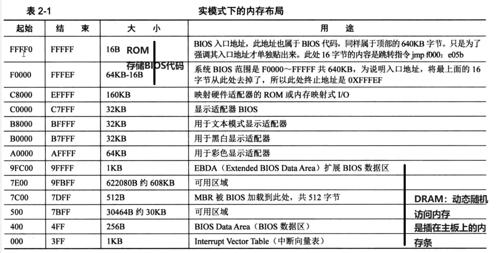
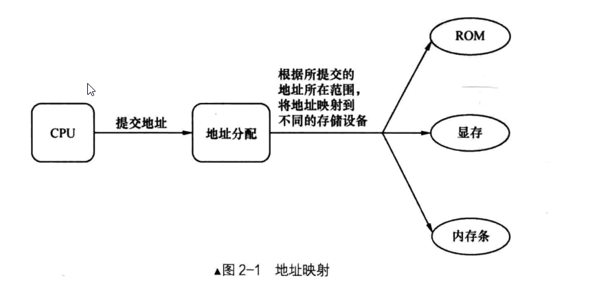

## 计算机启动过程

程序载入内存分两部分：

1. 程序被加载器（软件或硬件）加载到内存某个区域。
2. CPU 的 CS: IP 寄存器被指向这个程序的起始地址。

从按下主机上的 power 键后，第一个运行的软件是 BIOS。于是产生了三个问题 ：

1. 它是由谁加载的。
2. 它被加载到哪里。
3. 它的 CS: IP 是谁来更改的。

## 软件接力第一棒，BIOS

BIOS 全称叫 Base Input & Output System，即基本输入输出系统。

### 实模式下的 1MB 内存布局

Intel 8086 有 20 条地址线，故其可以访问山西的内存空间，即 2 的 20 次方＝ 1048576 = 1MB ，地址范围若按十六进制来表示，是 0x0000 到 0xFFFFF。



BIOS 的主要工作是检测、初始化硬件，怎么初始化的？硬件自己提供了一些初始化的功能调用，BIOS 直接调用就好了。BIOS 还做了一件伟大的事情，建立了中断向量表，这样就可以通过 `int 中断号` 来实现相关的硬件调用，当然 BIOS 建立的这些功能就是对硬件的 IO 操作，也就是输入输出。

16 位机的地址总线为 20 位，其地址范围是 1MB。32 位地址总线宽度是 32 位，其地址范围是 4GB 。



即使内存条大小没有超过地址总线的范围，也不会全都能被访问到，毕竟要预留一些地址用来访问其他外设。

### BIOS 是如何苏醒的

BIOS 在 ROM 中。ROM 也是块内存，内存就需要被访问。 此 ROM 被映射在低端 1MB 内存的顶部，即地址 0xF0000～0xFFFFF 处。

BIOS 本身是个程序，程序要执行，就要有个入口地址才行，此入口地址便是 0xFFFF0。

在开机的一瞬间，也就是接电的一瞬间，CPU 的 CS: IP 寄存器被强制初始化为 0xF000: 0xFFF0。由于开机的时候处于实模式，在实模式下的段基址要乘以 16，也就是左移 4 位，于是 0xF000: 0xFFF0 的等效地址将是 0xFFFF0。

实模式下的寄存器宽度是 16 位，0xFFFF0+16 已经超过了其最大值 0xFFFFF，溢出的部分就会回卷到 0，又会重新开始，即 0xFFFF0+16 等于 0, 0xFFFF0+ 17 等于 1 。

此时 CS: IP 中的是一条跳转指令，即在物理地址 0xFFFF0 处，此时 BIOS 还没有运行。

接下来 BIOS 便马不停蹄地检测内存、显卡等外设信息，当检测通过，并初始化好硬件后，开始在内存中 0x000～0x3FF 处建立数据结构，中断向量表 IVT 并填写中断例程 。

### 为什么是 0x7c00

BIOS 最后一项工作校验启动盘中位于 0 盘 0 道 1 扇区的内容。

在计算机中是习惯以 0 作为起始索引的，这个相当于位置的 **偏移量**。

很多指令中的操作数都是用偏移量表示的。

0 盘 0 道 1 扇区本质上就相当于 0 盘 0 道 0 扇区。为什么称为 1 呢，因为硬盘扇区的表示法有两种，

1. CHS 方法：0 盘 0 道 1 扇区用的便是其中的一种。

   CHS 方式中扇区的编号是从 1 开始的，不是 0，0 盘 0 道 1 扇区其实就相当于 0 盘 0 道 0 扇区

2. LBA 方式：扇区编号是从 0 开始的

0 盘 0 道 1 扇区末尾的两个字节分别是魔数 0x55 和 0xaa，BIOS 便认为此扇区中确实存在可执行的程序（此程序是主引导记录 MBR），便加载到物理地址 0x7c00，随后跳转到此地址，继续执行。

BIOS 跳转到 0x7c00 是用 jmp 0: 0x7c00 实现的，这是 jmp 指令的直接绝对远转移用法，段寄存器 cs 会被替换，这里的段基址是 0，即 cs 由之前的 0xf000 变成了 0。

如果此扇区的最后 2 个不是 0x55 和 0xaa，即使里面有可执行代码也无济于事了，BIOS 不认。

MBR 的任务是加载某个程序（这个程序一般是内核加载器，很少有直接加载内核的）到指定位置，并将控制权交给它。所谓的交控制权就是 jmp 过去而己 。

这就又抛出两个问题 。

1. 为什么是 0 盘 0 道 1 扇区的内容？

   规定将 0 盘 0 道 1 扇区作为 mbr 的栖身之地。

2. 为什么是物理地址 0x7c00，而不是个好记或好看的其他地址？是 MBR 的运行地址

   8086CPU 要求物理地址 0x0～0x3FF 存放中断向量表。

   MBR 本身也是程序，是程序就要用到栈的，栈也是在内存中的，MBR 虽然本身只有 512 字节，但还要为其所用的栈分配点空间，所以其实际所用的内存空间要大于 512 字节，估计 1KB 内存够用了 。

   加载 MBR 的位置取决于操作系统本身所占内存大小和内存布局。

## 让 MBR 先飞一会

MBR 的大小必须是 512 字节，这是为了保证 0x55 和 0xaa 这两个魔数恰好出现在该扇区的最后两个字节处，即第 510 字节处和第 511 字节处，按起始偏移为 0 算起的 。由于我们的 bochs 模拟的是 x86 平台，所以是小端字节序，故其最后两个字节内容是 0xaa55 ，拆开就是 0x55 和 0xaa。

### 神奇好用的 `$` 和 `$$`，令人迷惑的 section

`$和$$` 是编译器 NASM 预留的关键字，用来表示当前行和本 section 的地址，起到了标号的作用。

默认情况下，`$和$$` 的值是相对于本文件开头的偏移量。如果该 section 用了 vstart = xxxx 修饰，`$$` 的值则是此 section 的虚拟起始地址 xxxx 。`$` 的值是以 xxxx 为起始地址的顺延。如果用了 vstart 此关键字，想获得本 section 在文件中的真实偏移量（真实地址）该怎么做？nasm 编译器提供了这个方法。

```assembly
section.节名.start
```

如果没有定义 section，nasm 默认全部代码同为一个 section，起始地址为 0。

