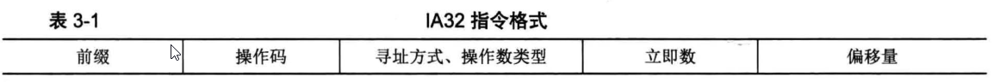
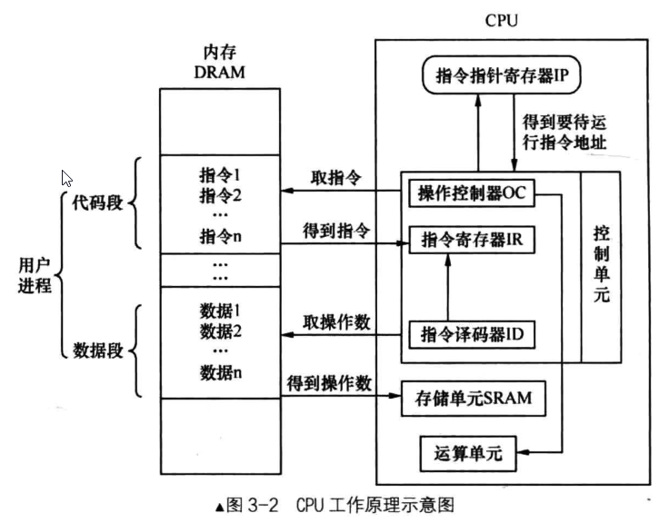
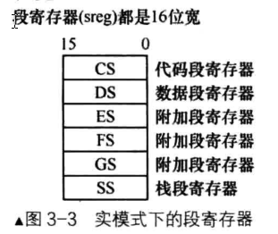
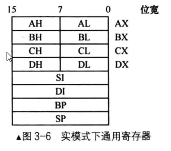
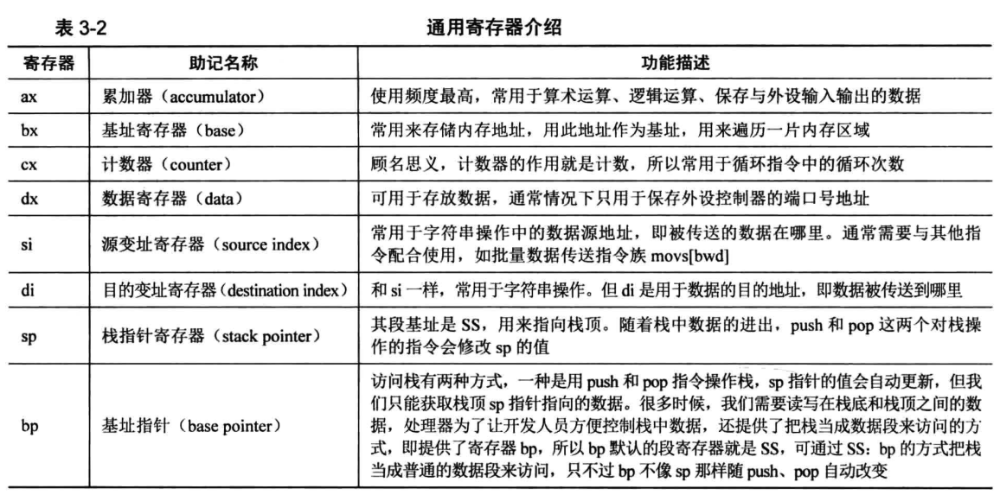
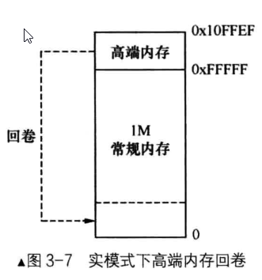

## 地址、section、vstart 浅唱辄止

### 什么是地址

程序中各种数据结构的访问，就是通过 "该数据结构的起始地址＋该数据结构所占内存的大小" 来实现的。

数据的地址，其实就是该数据相对整个程序开头的距离，即偏移量。

由于程序第 1 个数据的地址（偏移量）是 0，所以数组中第 1 个元素的下标也是 0。

地址 = 上一个地址＋上一个地址处的内容的长度。

编译器给程序中各符号（变量名或函数名等）分配的地址 ，就是各符号相对于文件开头的偏移量。

### 什么是 section

### 什么是 vstart

vstart 是虚拟起始地址。

vstart 的作用是为 section 内的数据指定一个虚拟的起始地址，也就是根据此地址，在文件中是找不到相关数据的，是虚拟的，假的，文件中的所有符号都不在这个地址上。

`vstart=xxxx` 和 `org xxxx` 这两个关键字是同一功能。

vstart 和 org，它们的功能是告诉编译器：" 嘿，老兄，你帮我把后面所有数据（指令和变量）的地址
以 xxxx 为起始开始编吧 "。

编译器只负责编址。

mbr 要被加载器（ BIOS ）加载到物理地址 0x7c00，mbr 中后续的物理地址都是 0x7c00+。另外，因为 BIOS 进入 mbr 是通过 jmp 0: 7c00 来实现的，故此时 cs 己经变成 0，相当于 "平坦模型" 了，只不过此 "平坦模型" 大小只是 65536 字节，而不是 4GB 。

## CPU 实模式

CPU 大体上可以划分为 3 个部分，它们是控制单元、运算单元、存储单元。

控制单元是 CPU 的控制中心，CPU 需要经过它的帮忙才知道自己下一步要做什么。

控制单元大致由指令寄存器 IR（ Instruction Register ）、指令译码器 ID (Instruction Decoder ）、操作控制器 OC (Operation Controller)组成。

程序被加载到内存后，也就是指令这时都在内存中了，**指令指针寄存器 IP** 指向内存中下一条待执行指令的地址，控制单元根据 IP 寄存器的指向，将位于内存中的指令逐个装载到 **指令寄存器** 中，然后 **指令译码器** 将位于指令寄存器中的指令按照指令格式来解码，分析出操作码是什么，操作数在哪里之类的。



一些指令还可以搭配一些辅助的东东，所以就需要在前缀部分记录这些，如 rep （用于重复执行，汇编中经常用）、段超越前缀。

操作码就是大家平时用的 mov 、 jmp 等。

寻址方式又有好多，如基址寻址、变址寻址等，操作数类型中记录的是用哪些寄存器之类的。

如果在指令中用到了立即数，就要将其记录到指令格式中立即数的部分。

如果寻址方式中用到了偏移量，就要将此偏移量记录到指令格式中的偏移量部分。

指令是存放在指令寄存器中的。

存储单元是指 CPU 内部的 L1 、L2 缓存及寄存器，待处理的数据就存放在这些存储单元中，这里的
数据是说指令中的操作数。

缓存基本上都是采用的 SRAM (Static RAM ）存储器。

主板上的物理内存就是 DRAM。

#### 寄存器可分为两大类

可见寄存器：

如通用寄存器、段寄存器。

不可见寄存器：

如：ALU 算术逻辑单元在求和时，会将结果先送到数据暂存寄存器 。但是程序员不可以使用。系统运行期间可能要用到的寄存器。

运算单元负责算术运算（加减乘除）和逻辑运算（比较、移位），它从控制单元那里接收命令 （信号 ）
井执行。



#### CPU 的工作原理

控制单元要取下一条待运行的指令，该指令的地址在程序计数器 PC 中，在 x86CPU 上，程序计数器就是 CS: IP 。 于是读取 IP 寄存器后，将此地址送上地址总线，CPU 根据此地址便得到了指令，并将其存入到指令寄存器器中 。 这时候轮到指令译码器上场了，它根据指令格式检查指令寄存器中的指令，先确定操作码是什么，再检查操作数类型，若是在内存中，就将相应操作数从内存中取回放入自己的存储单元，若操作数是在寄存器中就直接用了，免了取操作数这一过程。 操作码有了，操作数也齐了，操作控制器给运算单元下令，开工，于是运算单元便真正开始执行指令了 。IP 寄存器的值被加上当前指令的大小，于是 IP 又指向了下一条指令的地址。依次循环。

### 实模式下的寄存器

缓存中恰好有需要的内容，这就称为命中 hit，否则称为缺失 mis 。

CPU 中的一级缓存 L1 、 二级缓存 L2 ，它们都是 SRAM，即静态随机访问存储器，它是最快的存储器啦。 

SRAM 是用寄存器来存储数据的。

CPU 中的寄存器大致上分为两大类 :

1. 内部使用的，对程序员不可见：

   无法使用它们，比如全局描述符表寄存器 GDTR、中断描述符表寄存器 IDTR、局部描述符表寄存器 LDTR 、任务寄存器 TR、控制寄存器 CRO～3 、指令指针寄存器四、标志寄存器 flags、调试寄存器 DRO～7 。

2. 可见的寄存器 ：

   能够直接操作的就是这些寄存器，如段寄存器、通用寄存器 。

不可见寄存器，我们没办法直接使用，但它们中的一部分还得由咱们给初始化呢 ：

比如全局描述符表寄存器 GDTR，以后咱们还要通过 lgdt 指令为其指定全局描述符表的地址及偏移量。

对于中断描述符表寄存器 IDTR，咱们也是要通过 lidt 指令为其指定中断描述符表的地址 。 

而局部描述符表寄存器 LDTR，可以用 lgdt 指令为其指定局部描述符表 ldt （但我们效仿了现代操作系统，未用局部描述符表 ldt）。

对于任务寄存器 TR，我们也要用 ltr 指令为其指定一个任务状态段 tss。

对于 flags 寄存器，我们也有办法设置它，系统提供了 pushf 和 popf 指令，分别用于将 flags 寄存器的内容压入拢，将战中内容弹到 flags 寄存器。额外说一句，ldt 和 tss 都位于 gdt 中 。 

在实模式下，默认用到的寄存器都是 16 位宽的。

初次访问内存时，该地址要么用立即数，要么存储在某个存储器中能让 CPU 取出来再访问内存，肯定不能用内存本身来存。 

CPU 用寄存器来存储内存地址。



在执行当前指令的同时，在不跨段的情况下，CPU 以 " 当前 IP 寄存器中的值＋当前执行指令的机器码长度 " 的和作为新的代码段内偏移地址，将其存入 IP 寄存器，再到该新地址处读取指令井执行 。 如果下一条指令需要跨段访问，还要加载新的段基址到 CS 寄存器。 



无论是实模式，还是保护模式，通用寄存器有 8 个，分别 是 AX 、BX 、EX 、DX 、SI 、DI 、BP 、SP。

段寄存器 SS 只能用来放栈段基址，通用寄存器可以用来保存任何数据，包括地址（当然，地址也是一串数字，还是数据） 。

一般情况下，ex 寄存器用作循环的次数控制，bx 寄存器用于存储起始地址。esi 寄存器作为很多有关数据复制指令的源地址，edi 作为目的地址。



### 实模式下内存分段由来

程序中用到的地址都是真实的物理地址，＂段基址：段内偏移 " 产生的逻辑地址就是物理地址。



### 实模式下 CPU 内存寻址方式

寻址方式，从大方向来看可以分为三大类：

1. 寄存器寻址：

   最直接的寻址方式就是寄存器寻址，它是指 "数" 在寄存器中，直接从寄存器中拿数据就行了 。 

   ```assembly
   mov ax, Ox10 ;将0x10存入ax寄存器
   mov dx, Ox9 ;将0x9存入dx寄存器
   mul dx ;求ax和dx的乘积,乘积的高16位在dx寄存器，低16位在a寄存器。
   ```

2. 立即数寻址：

   什么是立即数？立即数就是常数。是 CPU 直接得到的。

   ```assembly
   mov ax, 0x18 ;指令中的源操作数0x18是立即数，目的操作数ax是寄存器，所以它既是立即数寻址，也是寄存器寻址。
   mov ds, ax ;源操作数和目的操作数都是寄存器，所以纯粹是寄存器寻址。
   mov ax, 标号（宏） ;在编译阶段会转换为数字，最终可执行文件中的依然是立即数。
   ```

3. 内存寻址：

   访问内存是用 "段基址：偏内偏移地址" 的形式，此形式只用在内存访问中。默认情况下数据段寄存器是 DS ，即段基址已经有了，只要再给出段内偏移地址就可以访问内存了，最终起决定作用的、有效的是段内偏移地址，所以段内偏移地址称为有效地址。

   1. 直接寻址：

      将直接在操作数中给出的数字作为内存地址，通过中括号的形式告诉 CPU ，取此地址中的值作为操作数。

      ```assembly
      mov ax [0x1234]
      ;0x1234是段内偏移地址，默认的段地址是DS。这条指令是将内存地址DS:0x1234处的值写入ax寄存器
      mov ax, [fs:0x5678]
      ;由于使用了段跨越前缀fs,0x5678的段基址则变成了gs寄存器。最终的内存地址是gs寄存器的值＊16+0x5678, CPU到此内存地址取值再存入ax寄存器
      ```

   2. 基址寻址：

      基址寻址，就是在操作数中用 bx 寄存器或 bp 寄存器作为地址的起始，只能用 bx 或 bp 作为基址寄存器。

      bx 寄存器的默认段寄存器是 DS ，而 bp 寄存器的默认段寄存器是 SS ，即 bp 和 sp 都是栈的有效地址。

      sp 寄存器作为栈顶指针，相当于栈中数据的游标，这是专门给 push 指令和 pop 指令做导航用的寄存器，push 指令往哪个内存压入数据，pop 将哪个地址的数据弹出栈，都要看 sp 的值是多少。在实模式下，CPU 字长是 16 ，所以实模式下的 push 指令默认情况下是压入 2 字节的数据。

      访问栈有两种方式：
   
      1. 把栈当成 "栈" 来使用：

         也就是用 push 和 pop 指令操作栈，但这样我们只能访问到栈顶，即 sp 指向的地址，没有办法直接访问到栈底和栈顶之间的数据。很多时候，我们需要读写栈中的数据，即需要把栈当成普通数据段那样访问。

      2. 把栈当成数据段来访问的方式：

         可以用寄存器 bp 来给出栈中偏移量，所以 bp 默认的段寄存器就是 SS，这样就可通过 SS:
         bp 的方式把校当成普通的数据段来访问了。
   
      堆栈框架的工作是为函数分配局部变量空间，因此应该在刚刚进入函数时就进行为局部变量分配空间的工作，离开函数时再回收局部变量的空间，所以堆栈框架的创建和回收工作分别是在进入函数和离开函数时进行的。
   
      为了在名称上突显堆栈框架这两个阶段，有一条指令叫 enter，它是在进入函数时执行的，其功能
      就是备份 ebp 并使 ebp 更新为 esp，即先 "push ebp" 再 "mov ebp，esp"
   
      另一条指令是 leave，它是在离开函数时执行的，其功能是回收局部变量的空间并恢复 ebp
      的值，即先 "mov esp， ebp" 再 "pop ebp"。

      C 语言规范：参数入栈顺序从右到左。

   3. 变址寻址：
   
      变址寻址其实和基址寻址类似，只是寄存器由 bx 、 bp 换成了 si 和 di。si 是指源索引寄存器 （ source index)，di 是指目的索引寄存器（ destination index ） 。两个寄存器的默认段寄存器也是 ds 。
   
      ```assembly
      mov [di], ax ;将寄存器ax的值存入ds:di指向的内存
      mov [si+0x1234], ax ;变址中也可以加个偏移量
      ```
   
   4. 基址变址寻址：
   
      基址寻址和变址寻址的结合，即基址寄存器 bx 或 bp 加一个变址寄存器 si 或 di。
   
      ```assembly
      mov [bx+di], ax ;将ax中的值送入以ds为段基址，bx+di为偏移地址的内存。
      add [bx+si], ax ;将ax与ds:bx+si处的值相加后存入内存[ds:bx+si]
      ```
   

### 栈到底是什么玩意儿

CPU 中有栈段 SS 寄存器和栈指针 SP 寄存器，用来指定当前使用的栈的物理地址。

栈溢出，指的就是这个内存区域无法容纳数据了。

给栈指定一片内存区域，区域的起始地址作为栈基址，存入栈基址寄存器 SS 中，另一端是动态变化的，用栈指针寄存器 SP 来指定。栈在使用过程中是向下扩展的，所以栈顶地址肯定小于栈底地址。

硬件对栈的存取：push 和 pop 指令。

push 指令负责把数据压入栈， pop 指令功能相反，将其从栈中取出，栈的出口和入口都是栈顶。

栈顶（SP 指针）是栈的出口和入口。

栈从高地址向低地址发展，所以栈顶、栈指针指向的地址会越来越低。

push 压入数据的过程是：先将 SP 减去字长，目的是避免将栈顶的数据破坏，所得的差再存入 SP，栈顶在此被更新，这样栈顶就指向了栈中下一个存储单元的位置。再将数据压入 SP（新的栈顶）指向的新的内存地址 。

pop 指令相反：既然是在栈中弹出数据 ，栈指针寄存器 SP 的值应该是增大一个数据单位。由于要弹
出的数据就在当前栈顶，所以在弹出数据后，才将 SP 加上字长，所得的和再存入 SP ，从而更新了栈顶。

虽然栈是向下发展的，但栈也是内存，访问内存依然是从低地址往高地址。

bp 默认的段寄存器就是 SS ，用 bp 的时候直接操作的便是栈。

push 和 pop 操作是要成对出现的，这样才能维护栈平衡。

### 实模式下的 ret

call 指令用来执行一段新的代码，用 call 需要返回，返回的地址使用栈存储。

CPU 在栈中保留程序计数器 PC 的值。在 x86 中的程序计数器是 CS: IP，具体保留 IP 部分还是 CS 和 IP 都保留，是要看目标函数的段基址是否和当前段基址一致，也就是说，是否跨段访问了。
