# 目录遍历访与XSS

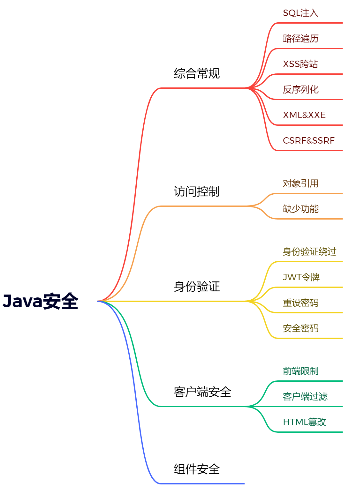

## 实践

### 文件上传（覆盖）

#### Less-1

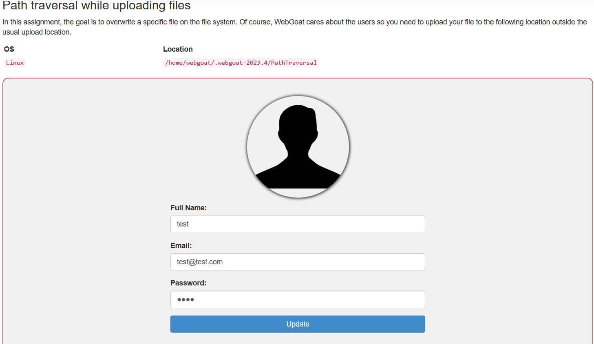

抓包发现上传的路径。

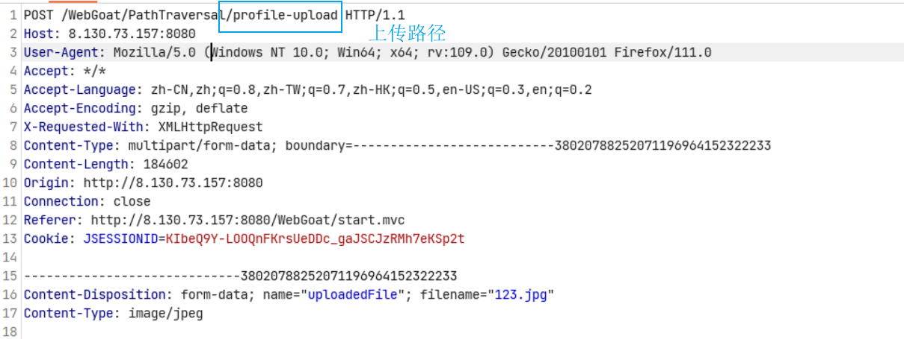

分析代码，发现没有对上传的文件路径进行过滤。

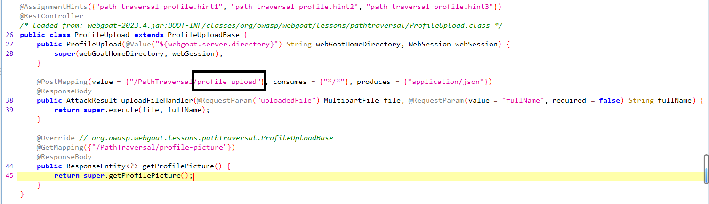

所以进行这样的上传。

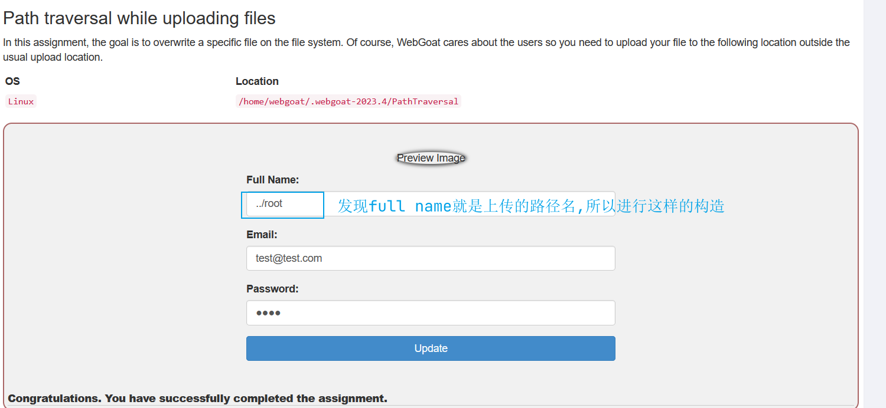

#### Less-2

这一个题目对`./`进行了过滤。

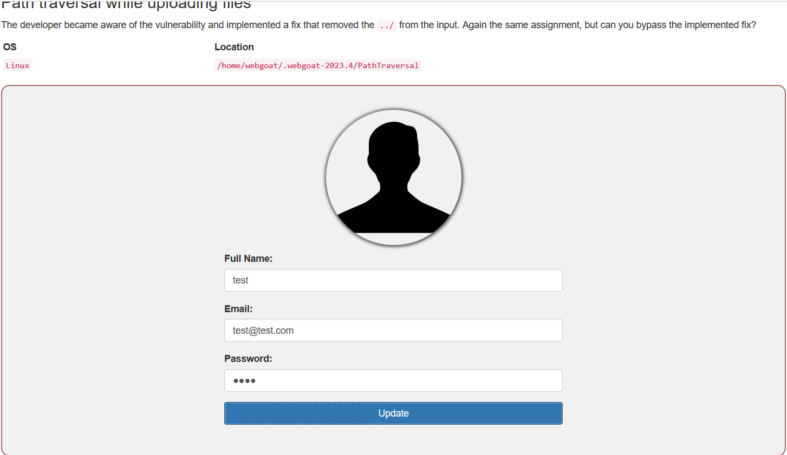

抓包分析源码。

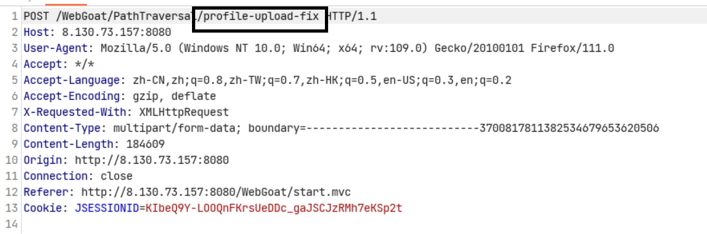

对`../`进行了替换。

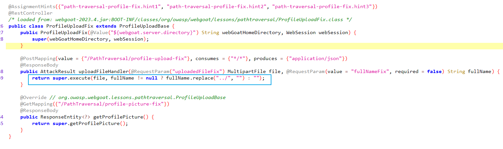

成功。

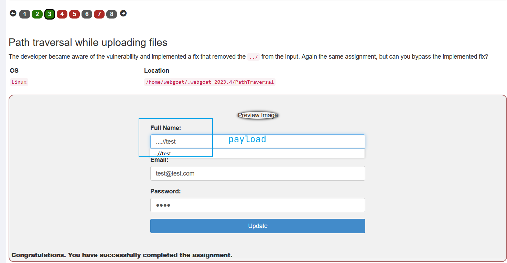

### 前端验证

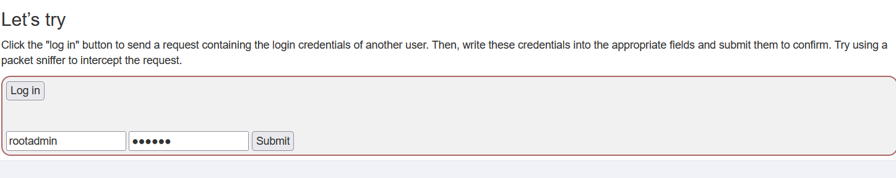

抓包分析

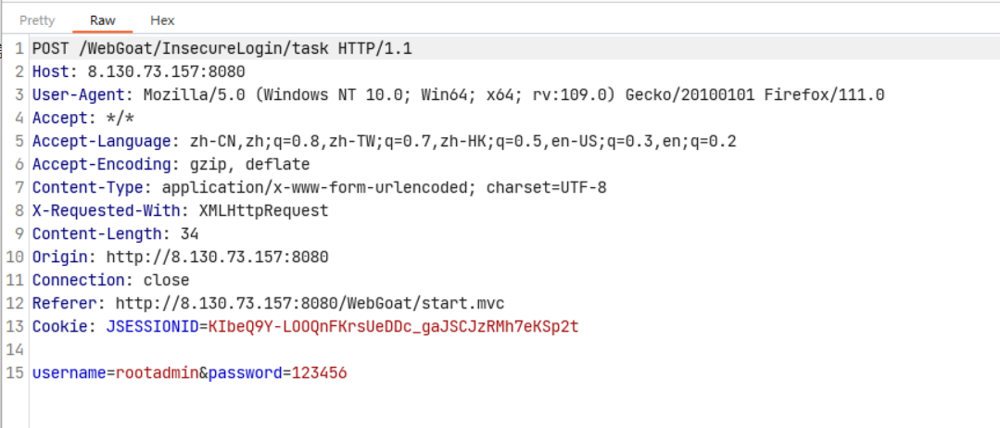

源码分析，发现后端只是单纯的接受数据，不进行验证，那么验证就只会出现在前端。

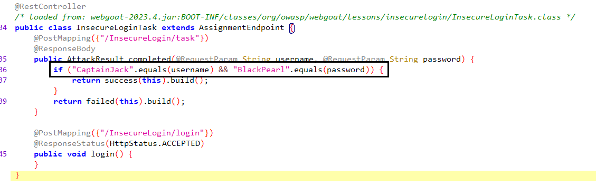

拿到前端的JavaScript代码，进行验证，既账号密码就是CaptainJack与BlackPearl。

```javascript
function submit_secret_credentials() {
	var xhttp = new XMLHttpRequest();
	xhttp['open']('POST', '#attack/307/100', true);
	//sending the request is obfuscated, to descourage js reading
	var _0xb7f9 = [
        // CaptainJack的十六进制是4361707461696e4a61636b
        "/x43/x61/x70/x74/x61/x69/x6E/x4A/x61/x63/x6B", 
        // BlackPearl的十六进制是426c61636b506561726c
        "/x42/x6C/x61/x63/x6B/x50/x65/x61/x72/x6C", 			           				"/x73/x74/x72/x69/x6E/x67/x69/x66/x79", 
        "/x73/x65/x6E/x64"];
	xhttp[_0xb7f9[3]](JSON[_0xb7f9[2]]({
		username: _0xb7f9[0],
		password: _0xb7f9[1]
	}))
}
```

绕过成功。

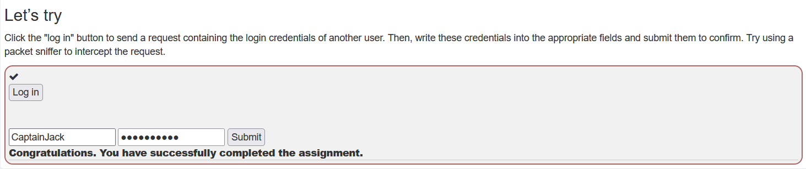

### 不安全的直接对象引用

题目中已经给出了，账号是tom，密码是cat，登录之后让你继续。

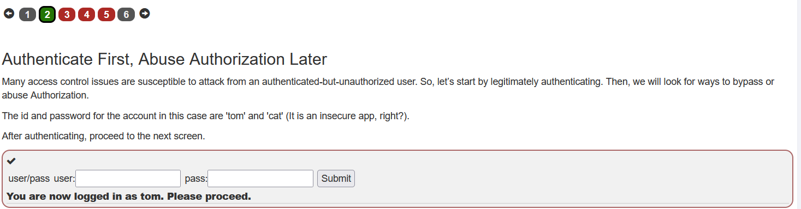

继续之后发现，这个题目是让你将没有显示在页面上的数据提取出来。

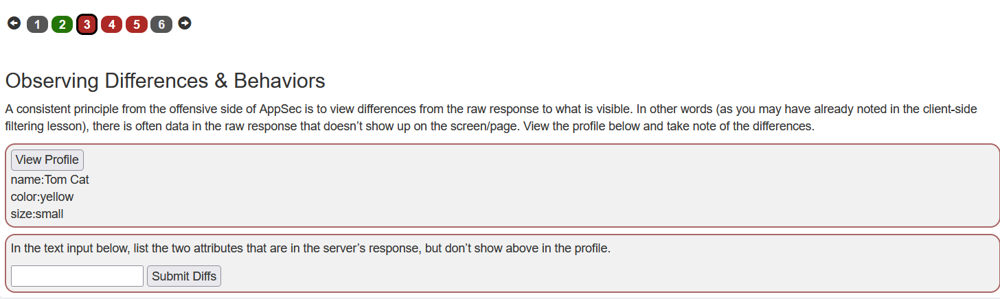

抓包重放，发现的确是有些数据没有在页面中显示，那么没有显示的值就是`userId`与`role`

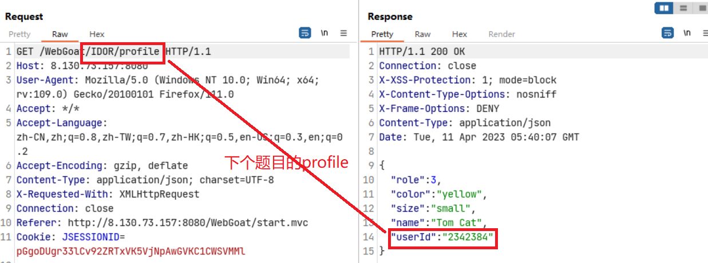

将role与userId输入，得到正确的结果。

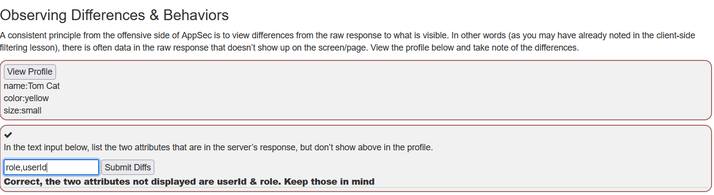

### 查看他人资料

类似于`http://localhost/index.php?id=520`通过修改id的值，来查看不同用户的登录信息。

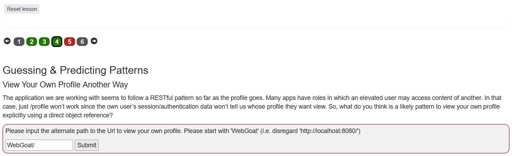

如何来获取用户的id，通过上一个题目获取到profile的内容。


成功。

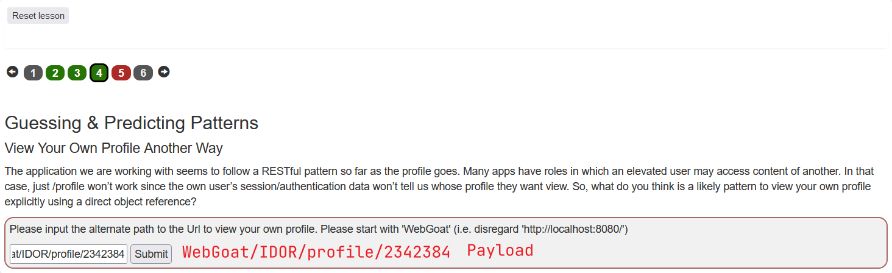

### XSS

最好在服务器端进行验证数据。

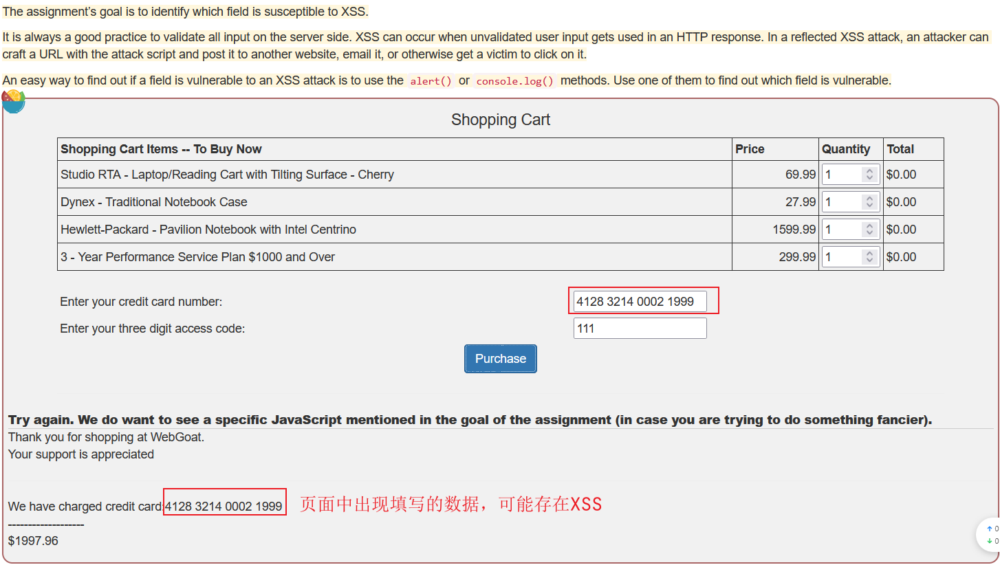

编写Payload。

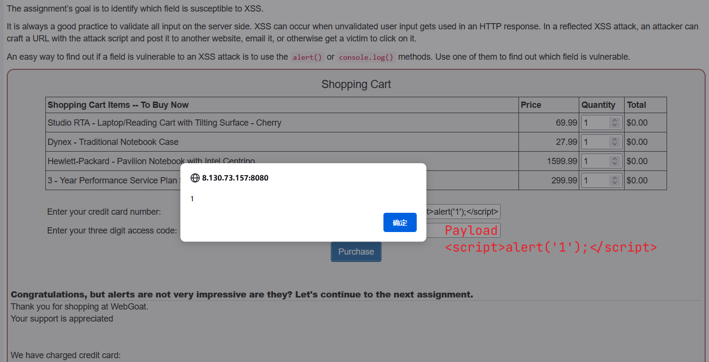
