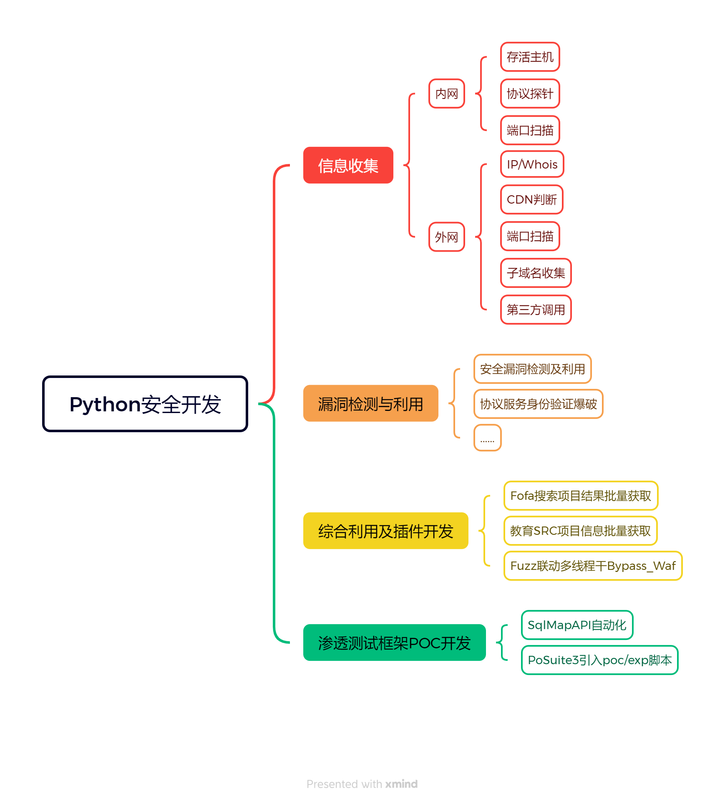
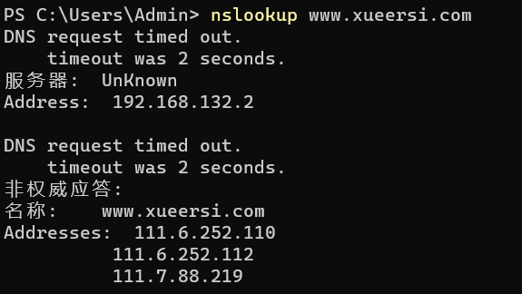
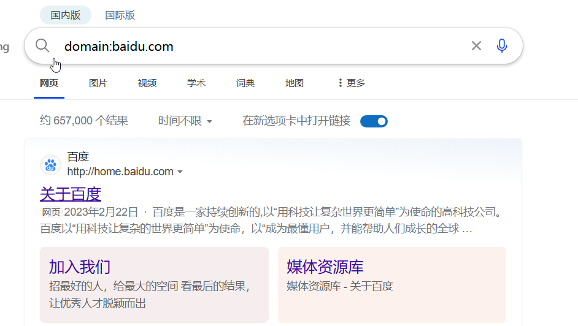
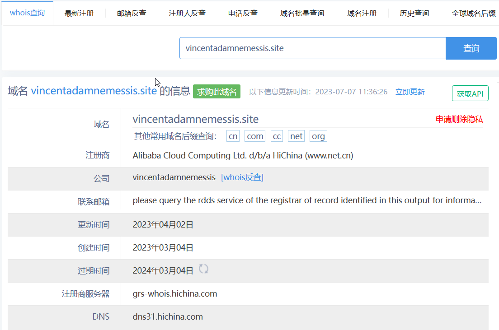
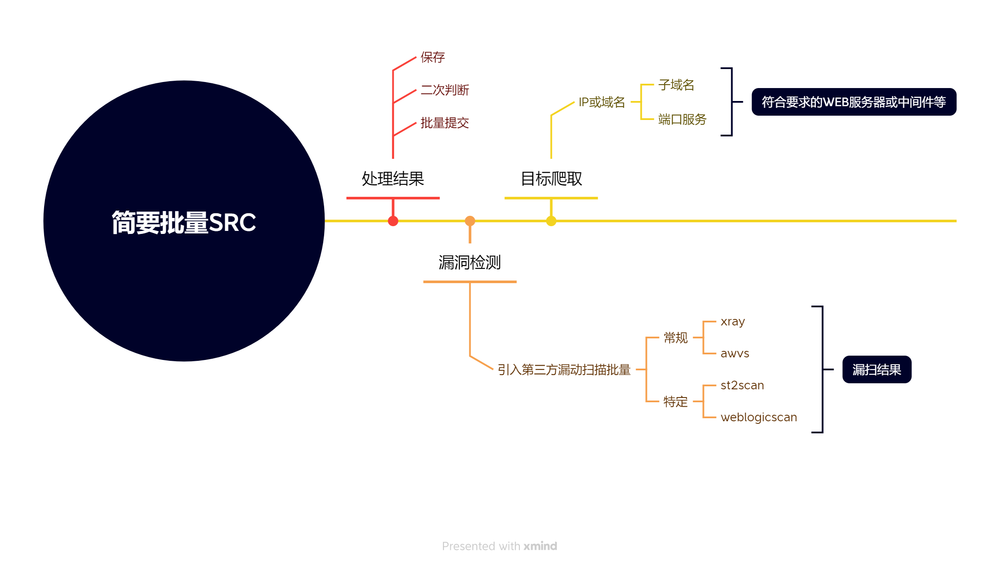

# Python信息收集



## 外网信息收集

### IP查询

通过域名获取IP地址。

`getaddrinfo`获取类的信息，`gethostbyname`直接获取IP地址。

```python
import socket

# 域名反查IP
# gethostbyname直接写域名即可，更加方便
ip_1 = socket.gethostbyname("vincentadamnemessis.site")
print(ip_1)
# 这种种不需要协议，直接写端口，其中80端口也可以写成http
ip_2 = socket.getaddrinfo("vincentadamnemessis.site","80")
print(ip_2)
```

### CDN判断

对于CDN的判断，一般有几种方法：

1. 不加子域名（或者变换子域名|用手机|第三方搜索引擎）访问
2. 邮件服务查询（前端源码）
3. 网页页脚信息
4. 更改本地HOST为真实IP后浏览器访问
5. 国外偏僻IP访问
6. 遗留文件扫描（PHPinfo）
7. fuckCDN工具
8. 查询DNS历史记录（开始未用CDN）
9. DDos攻击（耗完流量后真实IP显现）

Python调用系统命令的函数：

```py
os.system() # 不返回执行的结果 ，成功返回0，失败返回1
os.popen() # 返回命令执行的结果，直接打印返回的是对象，需要用read方法查看
```

判断目标是否存在CDN：

采用`nslookup`对返回IP数目进行判定，利用python去调用系统命令去实现。

nslookup命令是连接DNS服务器，查询域名信息的命令，安装TCP/IP协议的电脑都可以使用（对应多个IP）



判断IP的条数，两种思路：

1. 利用正则表达式

2. 判断IP地址`.`的数量

   服务器（2个点）+服务器地址（3个点）+名称（2个点）+名称地址（3个点）

   总共10个点

注意：根据域名的不同，名称会有变化，所以定位cdn的IP的数量不会准确。

但是根据`.`的数量来判断（以10为阈值）是否存在CDN还是可以的。

```python
cdn_point_data = os.popen("nslookup www.baidu.com").read()
if cdn_point_data.count(".") > 10:
    print("CDN存在")
else:
    print("CDN不存在")
```

### 端口扫描

获取到真实IP后，进行端口扫描

三种思路：

1. 自己写socket协议的TCP/UDP扫描（灵活但复杂）
2. 调用第三方模块的masscan/nmap的扫描（推荐）
3. 调用系统工具脚本执行（需要系统工具和python脚本在同一路径下）

网络编程只需要关注`AF_INET`，这种是应用最广泛的，如果是用于`ipv6`平台需要用`AF_INET6`

如果不存在会非常的慢。

端口扫描策略：

1. 扫描1-65525（不现实）
2. 扫描关键端口（根据目标）

建立端口列表，遍历端口（速度慢，多线程改进） 

```python
ports={'21','22','135','443','445','80','1433','3306',"3389",'1521','8000','7002','7001','8080',"9090",'8089','4848'}
server = socket.socket(socket.AF_INET,socket.SOCK_STREAM)
for post in ports:
    result = server.connect_ex(("vincentadamnemessis.site",int(post)))
    if result == 0:
        print(post + "open")
    else:
        print(post + "close")
```

### 子域名查询

思路：

1. 利用字典进行爆破(根据ping判断是否存在)

   这里通过爆破字典，看域名能否解析成IP来判断子域名是否存在。

   注意要设置延迟，不然容易出错，并且要抛出异常。

   ```python
   scan_url = "baidu.com"
   for url_dict_once in open("new_dic.txt"):
       url_data = url_dict_once.replace("/n","")
       url = url_data+"."+scan_url
       try:
           ip = socket.gethostbyname(url)
           print(url + "|" + ip)
           time.sleep(2)
       except Exception as e:
           pass
   ```

2. 利用bing或者第三方接口进行查询（利用其它搜索引擎：特定搜索+关键字）

   

3. 爬虫

### whois查询

获取域名注册人的信息和网站的信息。

第三方库进行whois查询，第三方库是`python-whois`，也可以利用网上接口查询。



```python
print(whois('www.baidu.site'))
```

### 总结

将上面的每一个模块进行封装，得到一个外网信息收集脚本。

```python
import socket,os,time
import sys

from whois import whois

def check_ip(url):
    # 域名反查IP
    # gethostbyname直接写域名即可，更加方便
    print(socket.gethostbyname(url))


def check_whois(url):
    print(whois(url))

def check_cdn(url):
    scan_command = "nslookup " + url
    cdn_point_data = os.popen(scan_command).read()
    if cdn_point_data.count(".") > 10:
        print("CDN exist")
    else:
        print("CDN isn't exist")

def check_sub_domain(url):
    url = url.replace("www","")
    for url_dict_once in open("new_dic.txt"):
        url_data = url_dict_once.replace("/n", "")
        complete_url = url_data + "." + url
        try:
            ip = socket.gethostbyname(complete_url)
            print(complete_url + "|" + ip)
            time.sleep(2)
        except Exception as e:
            pass

def check_post(url):
    ports = {'21', '22', '135', '443', '445', '80', '1433', '3306', "3389", '1521', '8000', '7002', '7001', '8080',
             "9090", '8089', '4848'}
    server = socket.socket(socket.AF_INET, socket.SOCK_STREAM)
    for post in ports:
        result = server.connect_ex((url, int(post)))
        if result == 0:
            print(post + "open")
        else:
            print(post + "close")

def check_system(url):
    data = os.popen("nmap -O " + url, "r").read()
    print(data)

if __name__ == '__main__':
    url = sys.argv[1]
    check = sys.argv[2]
    if check == "all":
        check_ip(url)
        check_whois(url)
        check_cdn(url)
        check_sub_domain(url)
        check_post(url)
        check_system(url)
```

## 内网信息收集

### 系统判断

靶机操作系统判断

1. 基于ttl值判断
2. 基于数据包判断
3. 基于网站URL的大小写判断
4. 基于第三方扫描工具判断

```python
print(os.popen("nmap -O " + "vincentadamnemessis.site").read())
# 因为是在内网中，需要上传这个脚本，而且还要将nmap打包到python的脚本的路径下（比较麻烦） 
```

为了方便操作可以，调用nmap的第三方的模块（python-nmap）进行操作，更加简单。

nmap参数：-sV探测开启端口的服务和版本信息（以字典返回）

```python
import nmap # pip install python-nmap

np = nmap.PortScanner()
data = np.scan("vincentadamnemessis.site","88,8888","-sV")
print(data)
```

### 存活主机

```python
import nmap

def nmap_scan():
    np = nmap.PortScanner()
    try:
        data = np.scan("vincentadamnemessis.site", "88,8888", "-sV")
        print(np.all_hosts()) # 获取存活主机
        print(np.csv()) # 以csv格式显示
        print(data)
    except Exception as e:
        pass
if __name__ == '__main__':
    nmap_scan()
```

### 端口扫描



## Python打包

```python
# 安装pyinstaller
pip install pyinstaller -i https://pypi.tuna.tsinghua.edu.cn/simple
pyinstaller -F  xxx.py
```

